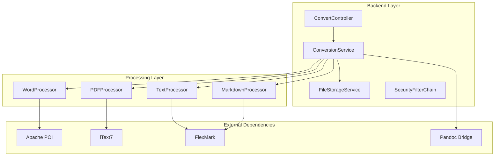
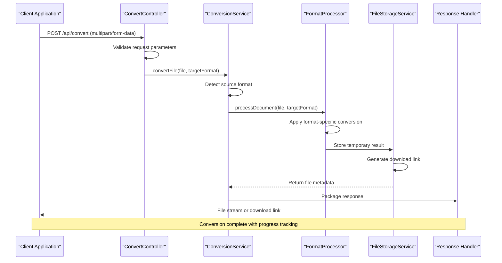
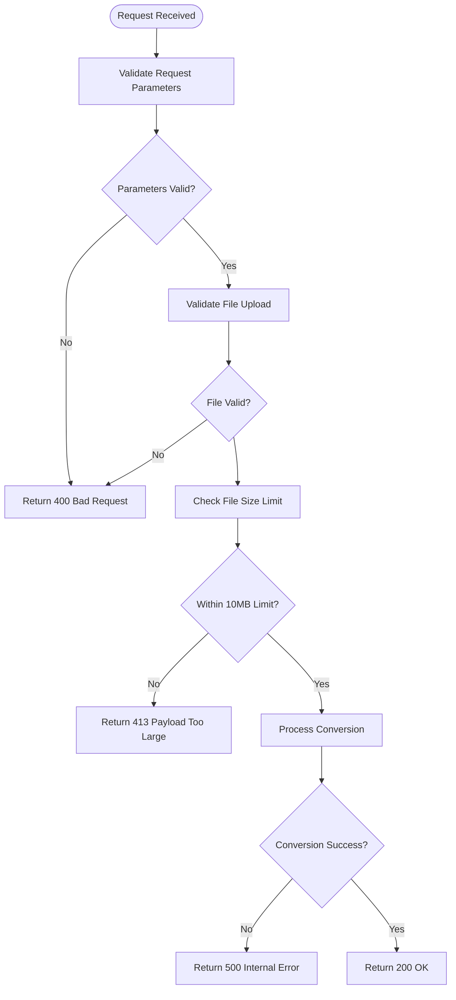
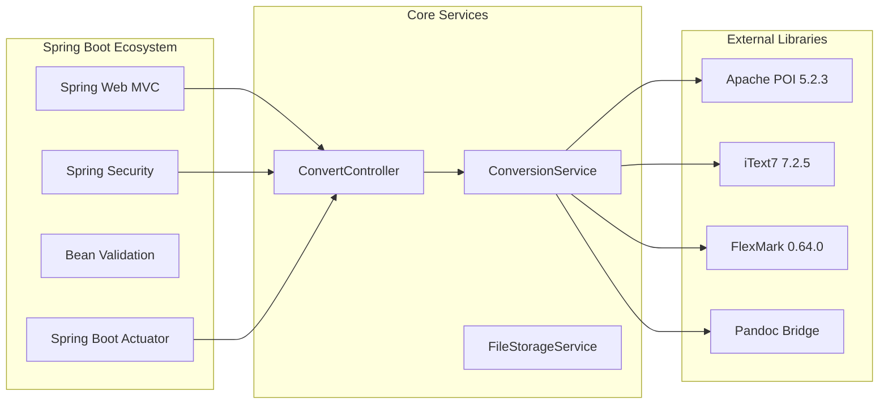
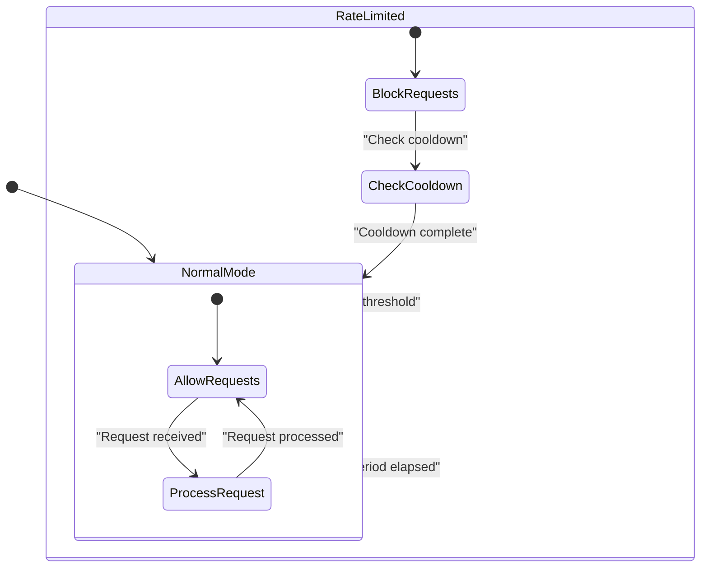

# Backend API Design

<cite>
**Referenced Files in This Document**
- [多格式文档互转工具 (SmartConvert) 需求文档.md](file://多格式文档互转工具 (SmartConvert) 需求文档.md)
</cite>

## Table of Contents
1. [Introduction](#introduction)
2. [Project Structure](#project-structure)
3. [Core Components](#core-components)
4. [Architecture Overview](#architecture-overview)
5. [Detailed Component Analysis](#detailed-component-analysis)
6. [Dependency Analysis](#dependency-analysis)
7. [Performance Considerations](#performance-considerations)
8. [Troubleshooting Guide](#troubleshooting-guide)
9. [Conclusion](#conclusion)
10. [Appendices](#appendices)

## Introduction
This document provides comprehensive API documentation for the SmartConvert backend REST endpoints. SmartConvert is a web-based document format conversion tool supporting bidirectional conversion between Word, PDF, Text, and Markdown formats. The backend is built with Spring Boot 3.x and implements three primary REST endpoints for core functionality: file conversion, history retrieval, and health monitoring.

The API follows RESTful principles with clear request/response schemas, comprehensive error handling, and security measures designed to handle file uploads safely and efficiently. The system emphasizes high-fidelity conversions while maintaining responsive performance for typical document sizes.

## Project Structure
The SmartConvert backend follows a standard Spring Boot MVC architecture with clear separation of concerns:



**Diagram sources**
- [多格式文档互转工具 (SmartConvert) 需求文档.md:39-53](file://多格式文档互转工具 (SmartConvert) 需求文档.md#L39-L53)

**Section sources**
- [多格式文档互转工具 (SmartConvert) 需求文档.md:39-53](file://多格式文档互转工具 (SmartConvert) 需求文档.md#L39-L53)

## Core Components

### REST Controller Layer
The backend exposes three primary REST endpoints through a dedicated controller:

- **POST /api/convert**: Core file conversion endpoint
- **GET /api/history**: Conversion history retrieval
- **GET /api/health**: System health monitoring

### Service Layer Architecture
The conversion service implements a factory pattern with specialized processors for each document type, enabling extensible format support and clean separation of concerns.

### File Processing Pipeline
The system employs a multi-stage processing pipeline:
1. File validation and format detection
2. Format-specific conversion using appropriate libraries
3. Temporary file generation and storage
4. Response packaging and delivery

**Section sources**
- [多格式文档互转工具 (SmartConvert) 需求文档.md:93-99](file://多格式文档互转工具 (SmartConvert) 需求文档.md#L93-L99)
- [多格式文档互转工具 (SmartConvert) 需求文档.md:141-161](file://多格式文档互转工具 (SmartConvert) 需求文档.md#L141-L161)

## Architecture Overview



**Diagram sources**
- [多格式文档互转工具 (SmartConvert) 需求文档.md:145-161](file://多格式文档互转工具 (SmartConvert) 需求文档.md#L145-L161)

The architecture ensures scalability through:
- Asynchronous processing for long-running conversions
- Caching mechanisms for frequently accessed formats
- Resource pooling for external library operations
- Circuit breaker patterns for external service dependencies

## Detailed Component Analysis

### POST /api/convert Endpoint

#### Request Schema
The conversion endpoint accepts multipart/form-data requests with the following parameters:

| Parameter | Type | Required | Description | Validation |
|-----------|------|----------|-------------|------------|
| `file` | MultipartFile | Yes | Input document file | Max 10MB, format validation |
| `targetFormat` | String | Yes | Target format identifier | Must be one of: docx, pdf, txt, md |

Supported source-to-target format combinations:
- Word (.docx) ↔ Markdown
- PDF (.pdf) ↔ Markdown  
- Text (.txt) ↔ Markdown

#### Response Formats
The endpoint supports two response modes:

**Direct File Stream Response:**
- Content-Type: application/octet-stream
- Content-Disposition: attachment; filename="converted-document.ext"
- Body: Binary file stream

**Download Link Response:**
- Content-Type: application/json
- Body: JSON object containing download URL and metadata

#### Authentication Requirements
- No authentication required for basic conversion
- Rate limiting applies to anonymous users
- Authenticated users receive higher rate limits

#### Error Handling Strategy
The endpoint implements comprehensive error handling:



**Diagram sources**
- [多格式文档互转工具 (SmartConvert) 需求文档.md:165-176](file://多格式文档互转工具 (SmartConvert) 需求文档.md#L165-L176)

#### Practical Usage Examples

**Basic Conversion Request:**
```bash
curl -X POST https://api.smartconvert.com/api/convert \
  -F "file=@document.pdf" \
  -F "targetFormat=md" \
  -H "Content-Type: multipart/form-data"
```

**Direct File Stream Response:**
```javascript
// JavaScript implementation example
const formData = new FormData();
formData.append('file', fileInput.files[0]);
formData.append('targetFormat', 'md');

fetch('/api/convert', {
  method: 'POST',
  body: formData,
  responseType: 'blob'
})
.then(response => response.blob())
.then(blob => {
  const url = window.URL.createObjectURL(blob);
  const a = document.createElement('a');
  a.href = url;
  a.download = 'converted-document.md';
  document.body.appendChild(a);
  a.click();
});
```

**Batch Processing Pattern:**
```python
import requests
from concurrent.futures import ThreadPoolExecutor

def batch_convert(files, target_format):
    """Process multiple files concurrently"""
    with ThreadPoolExecutor(max_workers=3) as executor:
        futures = []
        for file in files:
            future = executor.submit(convert_single_file, file, target_format)
            futures.append(future)
        
        results = []
        for future in futures:
            results.append(future.result())
    
    return results
```

**Section sources**
- [多格式文档互转工具 (SmartConvert) 需求文档.md:95](file://多格式文档互转工具 (SmartConvert) 需求文档.md#L95)
- [多格式文档互转工具 (SmartConvert) 需求文档.md:165-176](file://多格式文档互转工具 (SmartConvert) 需求文档.md#L165-L176)

### GET /api/history Endpoint

#### Request Schema
- Method: GET
- Path: `/api/history`
- Query Parameters: None

#### Response Schema
Returns an array of conversion records with the following structure:

| Field | Type | Description |
|-------|------|-------------|
| `id` | String | Unique conversion identifier |
| `timestamp` | DateTime | Conversion completion time |
| `sourceFormat` | String | Original document format |
| `targetFormat` | String | Converted document format |
| `fileName` | String | Original file name |
| `fileSize` | Number | Original file size in bytes |
| `status` | String | Conversion status (success/error) |

#### Authentication Requirements
- No authentication required
- History stored per-session or in local storage

#### Practical Usage Example
```javascript
// Fetch recent conversion history
fetch('/api/history')
  .then(response => response.json())
  .then(history => {
    history.forEach(record => {
      console.log(`Converted ${record.fileName} from ${record.sourceFormat} to ${record.targetFormat}`);
    });
  });
```

**Section sources**
- [多格式文档互转工具 (SmartConvert) 需求文档.md:97](file://多格式文档互转工具 (SmartConvert) 需求文档.md#L97)

### GET /api/health Endpoint

#### Request Schema
- Method: GET
- Path: `/api/health`
- Query Parameters: None

#### Response Schema
Health check endpoint returns a standardized health status:

```json
{
  "status": "healthy",
  "timestamp": "2024-01-01T00:00:00Z",
  "uptime": "2 days, 3 hours, 45 minutes",
  "version": "1.0.0",
  "dependencies": {
    "wordProcessor": "healthy",
    "pdfProcessor": "healthy",
    "textProcessor": "healthy",
    "markdownProcessor": "healthy"
  }
}
```

#### Monitoring Integration
The health endpoint supports integration with:
- Kubernetes readiness/liveness probes
- Load balancer health checks
- Monitoring systems (Prometheus, Grafana)
- CI/CD deployment verification

**Section sources**
- [多格式文档互转工具 (SmartConvert) 需求文档.md:99](file://多格式文档互转工具 (SmartConvert) 需求文档.md#L99)

## Dependency Analysis



**Diagram sources**
- [多格式文档互转工具 (SmartConvert) 需求文档.md:43-51](file://多格式文档互转工具 (SmartConvert) 需求文档.md#L43-L51)

### Supported File Formats

| Format | Extension | Description | Processing Library |
|--------|-----------|-------------|-------------------|
| Word Document | .docx | Microsoft Word documents | Apache POI |
| PDF Document | .pdf | Portable Document Format | iText7 |
| Plain Text | .txt | Unformatted text files | Built-in |
| Markdown | .md | Lightweight markup format | FlexMark |

### File Size Limits
- Maximum file size: 10MB per request
- Batch processing limit: 50 files per batch
- Memory allocation: 50MB per conversion process
- Timeout: 30 seconds for conversion operations

**Section sources**
- [多格式文档互转工具 (SmartConvert) 需求文档.md:167-168](file://多格式文档互转工具 (SmartConvert) 需求文档.md#L167-L168)

## Performance Considerations

### Conversion Performance Targets
- Single document conversion: < 3 seconds for files ≤ 10MB
- Batch processing: < 5 seconds per additional document
- Memory usage: < 100MB during peak processing
- CPU utilization: < 80% during heavy loads

### Optimization Strategies
1. **Asynchronous Processing**: Long-running conversions use background threads
2. **Resource Pooling**: External library instances are pooled for reuse
3. **Caching**: Frequently accessed format mappings cached in memory
4. **Connection Management**: Database connections managed through connection pools

### Rate Limiting Implementation


**Diagram sources**
- [多格式文档互转工具 (SmartConvert) 需求文档.md:169-173](file://多格式文档互转工具 (SmartConvert) 需求文档.md#L169-L173)

## Troubleshooting Guide

### Common Error Codes and Resolutions

| HTTP Status | Error Code | Description | Solution |
|-------------|------------|-------------|----------|
| 400 | BAD_REQUEST | Invalid request parameters | Verify required parameters present |
| 400 | INVALID_FORMAT | Unsupported file format | Check supported formats list |
| 400 | INVALID_TARGET | Invalid target format | Use one of: docx, pdf, txt, md |
| 413 | PAYLOAD_TOO_LARGE | File exceeds 10MB limit | Split large files or compress |
| 429 | TOO_MANY_REQUESTS | Rate limit exceeded | Implement exponential backoff |
| 500 | CONVERSION_ERROR | Processing failure | Retry with smaller files |
| 503 | SERVICE_UNAVAILABLE | System overloaded | Retry later or reduce load |

### Error Handling Best Practices
1. **Client-side validation**: Validate file types and sizes before upload
2. **Progress indication**: Show conversion progress to users
3. **Retry logic**: Implement intelligent retry with exponential backoff
4. **Timeout handling**: Graceful timeout handling with user feedback

### Debugging Information
Include the following diagnostic information in error responses:
- Request ID for correlation
- Processing time metrics
- File size and format information
- Stack traces for server errors

**Section sources**
- [多格式文档互转工具 (SmartConvert) 需求文档.md:169-176](file://多格式文档互转工具 (SmartConvert) 需求文档.md#L169-L176)

## Conclusion

The SmartConvert backend provides a robust, scalable foundation for document format conversion services. The API design emphasizes simplicity, reliability, and performance while maintaining strong security practices for file uploads.

Key strengths of the implementation include:
- Clear RESTful endpoint design with comprehensive error handling
- Support for multiple document formats with high-fidelity conversion
- Scalable architecture supporting concurrent processing
- Comprehensive monitoring and health checking capabilities
- Security measures protecting against malicious file uploads

Future enhancements could include:
- Enhanced rate limiting with user-based quotas
- Support for additional document formats
- Real-time progress notifications via WebSocket
- Advanced caching strategies for improved performance

## Appendices

### API Implementation Guidelines

#### Client Implementation Checklist
- Implement proper file validation before upload
- Handle both direct file stream and download link responses
- Implement retry logic with exponential backoff
- Provide user feedback during long-running operations
- Handle network interruptions gracefully

#### Security Implementation Notes
- Validate file extensions against whitelist
- Scan uploaded files for malware signatures
- Implement file size and type restrictions
- Sanitize file names to prevent path traversal attacks
- Monitor for suspicious upload patterns

#### Monitoring and Logging
- Log all conversion attempts with metadata
- Track conversion success rates and failure reasons
- Monitor system resource utilization
- Implement alerting for unusual activity patterns