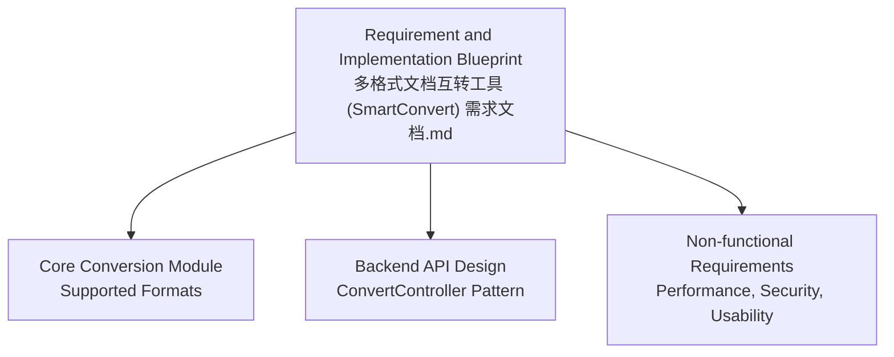
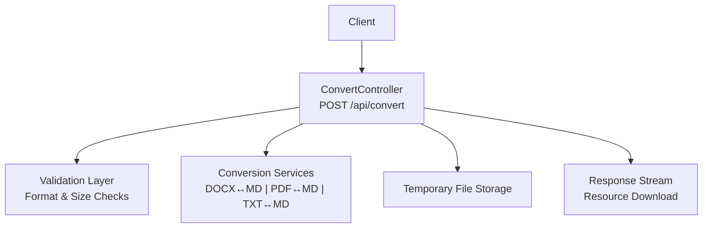
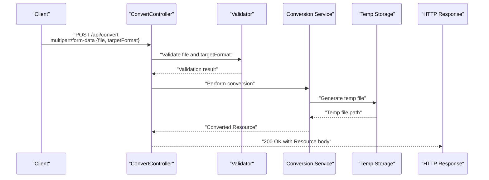
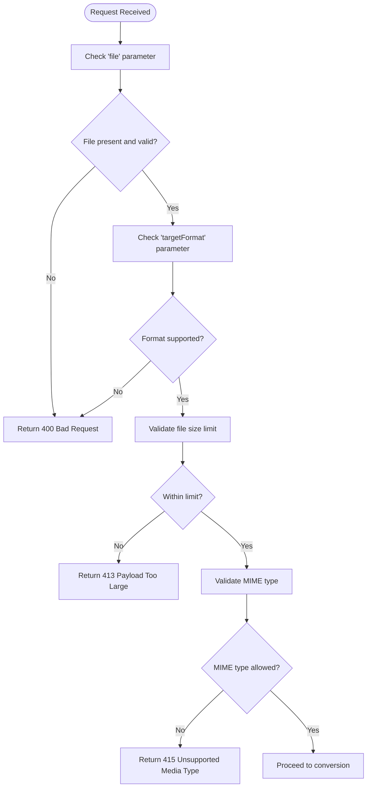
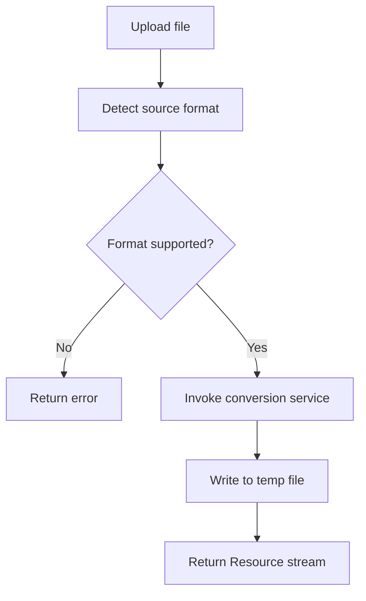
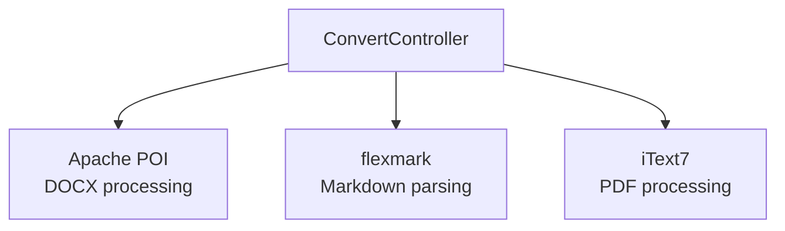

# Convert Endpoint

<cite>
**Referenced Files in This Document**
- [多格式文档互转工具 (SmartConvert) 需求文档.md](file://多格式文档互转工具 (SmartConvert) 需求文档.md)
</cite>

## Table of Contents
1. [Introduction](#introduction)
2. [Project Structure](#project-structure)
3. [Core Components](#core-components)
4. [Architecture Overview](#architecture-overview)
5. [Detailed Component Analysis](#detailed-component-analysis)
6. [Dependency Analysis](#dependency-analysis)
7. [Performance Considerations](#performance-considerations)
8. [Troubleshooting Guide](#troubleshooting-guide)
9. [Conclusion](#conclusion)
10. [Appendices](#appendices)

## Introduction
This document provides comprehensive API documentation for the POST /api/convert endpoint, focusing on the core document conversion functionality. It covers the multipart/form-data request structure, supported format combinations, response formats, validation rules, file size limits, supported MIME types, conversion workflow, practical usage examples, error handling strategies, performance considerations, rate limiting recommendations, and security measures for file uploads.

## Project Structure
The repository contains a single requirement and implementation blueprint document that outlines the SmartConvert application’s backend API design and capabilities. The document specifies the core conversion module, supported format combinations, and the ConvertController implementation pattern.

**Section sources**
- [多格式文档互转工具 (SmartConvert) 需求文档.md:65-101](file://多格式文档互转工具 (SmartConvert) 需求文档.md#L65-L101)
- [多格式文档互转工具 (SmartConvert) 需求文档.md:113-161](file://多格式文档互转工具 (SmartConvert) 需求文档.md#L113-L161)

## Core Components
- ConvertController: Exposes the POST /api/convert endpoint and handles multipart/form-data requests.
- Supported conversions: DOCX↔MD, PDF↔MD, TXT↔MD.
- Health and history endpoints: GET /api/health and GET /api/history are documented for system monitoring and record retrieval.

Key implementation pattern highlights:
- Request parameters: file (multipart/form-data), targetFormat (String).
- Response: Returns a downloadable file stream via ResponseEntity<Resource>.

**Section sources**
- [多格式文档互转工具 (SmartConvert) 需求文档.md:93-101](file://多格式文档互转工具 (SmartConvert) 需求文档.md#L93-L101)
- [多格式文档互转工具 (SmartConvert) 需求文档.md:145-161](file://多格式文档互转工具 (SmartConvert) 需求文档.md#L145-L161)

## Architecture Overview
The API follows a layered architecture:
- Presentation: ConvertController exposes the /api/convert endpoint.
- Application: Conversion workflow orchestrates file validation, format detection, service invocation, temporary file generation, and response emission.
- Persistence/Storage: Temporary files are generated during conversion and cleaned periodically.

**Section sources**
- [多格式文档互转工具 (SmartConvert) 需求文档.md:67-79](file://多格式文档互转工具 (SmartConvert) 需求文档.md#L67-L79)
- [多格式文档互转工具 (SmartConvert) 需求文档.md:145-161](file://多格式文档互转工具 (SmartConvert) 需求文档.md#L145-L161)

## Detailed Component Analysis

### Endpoint Definition
- Method: POST
- Path: /api/convert
- Consumes: multipart/form-data
- Produces: application/octet-stream (downloadable file stream)

Request parameters:
- file: Required. MultipartFile representing the uploaded document.
- targetFormat: Required. String indicating the desired output format (e.g., md, pdf).

Supported format combinations:
- DOCX ↔ Markdown
- PDF ↔ Markdown
- TXT ↔ Markdown

Response formats:
- Successful conversion: Returns a downloadable file stream (Resource).
- Error scenarios: Returns appropriate HTTP status codes and error messages.

**Section sources**
- [多格式文档互转工具 (SmartConvert) 需求文档.md:93-101](file://多格式文档互转工具 (SmartConvert) 需求文档.md#L93-L101)
- [多格式文档互转工具 (SmartConvert) 需求文档.md:145-161](file://多格式文档互转工具 (SmartConvert) 需求文档.md#L145-L161)

### Request Validation Rules
- Required parameters:
  - file: Must be present and valid.
  - targetFormat: Must be present and one of the supported output formats.
- Format validation:
  - Source format inferred from file extension.
  - targetFormat must match supported output formats.
- File size limits:
  - Maximum file size constraint is defined to ensure performance targets.
- MIME type support:
  - DOCX: application/vnd.openxmlformats-officedocument.wordprocessingml.document
  - PDF: application/pdf
  - TXT: text/plain
  - Additional formats may be supported depending on implementation.

**Section sources**
- [多格式文档互转工具 (SmartConvert) 需求文档.md:67-79](file://多格式文档互转工具 (SmartConvert) 需求文档.md#L67-L79)
- [多格式文档互转工具 (SmartConvert) 需求文档.md:165-176](file://多格式文档互转工具 (SmartConvert) 需求文档.md#L165-L176)

### Conversion Workflow
- Detect source format from file extension.
- Route to the appropriate conversion service (DOCX↔MD, PDF↔MD, TXT↔MD).
- Generate a temporary file containing the converted content.
- Return the converted file as a downloadable stream.

**Section sources**
- [多格式文档互转工具 (SmartConvert) 需求文档.md:67-79](file://多格式文档互转工具 (SmartConvert) 需求文档.md#L67-L79)
- [多格式文档互转工具 (SmartConvert) 需求文档.md:145-161](file://多格式文档互转工具 (SmartConvert) 需求文档.md#L145-L161)

### Response Formats
- Successful conversion:
  - Status: 200 OK
  - Body: Binary stream of the converted file
  - Headers: Content-Disposition for filename and Content-Type based on targetFormat
- Error responses:
  - 400 Bad Request: Missing or invalid parameters
  - 413 Payload Too Large: File exceeds size limit
  - 415 Unsupported Media Type: MIME type not allowed
  - 500 Internal Server Error: Conversion failure

Note: The blueprint indicates returning a downloadable file stream via ResponseEntity<Resource>, aligning with typical Spring MVC patterns for binary downloads.

**Section sources**
- [多格式文档互转工具 (SmartConvert) 需求文档.md:145-161](file://多格式文档互转工具 (SmartConvert) 需求文档.md#L145-L161)

### Practical Usage Examples

curl examples:
- Upload a DOCX file and request Markdown output:
  - curl -X POST "https://your-domain/api/convert" -F "file=@/path/to/document.docx" -F "targetFormat=md" -o converted.md
- Upload a PDF file and request Markdown output:
  - curl -X POST "https://your-domain/api/convert" -F "file=@/path/to/document.pdf" -F "targetFormat=md" -o converted.md
- Upload a TXT file and request Markdown output:
  - curl -X POST "https://your-domain/api/convert" -F "file=@/path/to/document.txt" -F "targetFormat=md" -o converted.md

Client implementation patterns:
- Frontend frameworks (e.g., Vue/React):
  - Build multipart/form-data payload with file and targetFormat.
  - Submit via fetch/XHR and handle the returned blob/stream.
  - Trigger browser download using a Blob URL or Content-Disposition header parsing.
- Backend clients:
  - Use HTTP client libraries to send multipart requests.
  - Stream the response to disk or memory as needed.

[No sources needed since this section provides general usage guidance]

### Error Handling Strategies
Common error scenarios and recommended handling:
- Invalid format:
  - Validate targetFormat against supported outputs.
  - Return 400 with a structured error message indicating supported formats.
- Processing failures:
  - Catch exceptions during conversion and return 500 with an error identifier and retry suggestion.
- Timeout scenarios:
  - Apply request timeouts and return 408 or 504 with retry-after guidance.
- Malformed requests:
  - Validate presence and type of parameters; return 400 for missing or incorrect fields.
- File size violations:
  - Enforce configured limits; return 413 with a message indicating maximum allowed size.
- Unsupported media types:
  - Reject disallowed MIME types; return 415 with allowed types list.

[No sources needed since this section provides general error handling guidance]

## Dependency Analysis
The backend leverages external libraries for format-specific processing:
- Apache POI for DOCX handling
- flexmark for Markdown parsing/rendering
- iText7 for PDF processing

These dependencies inform the supported conversion paths and influence performance characteristics.

**Section sources**
- [多格式文档互转工具 (SmartConvert) 需求文档.md:115-139](file://多格式文档互转工具 (SmartConvert) 需求文档.md#L115-L139)

## Performance Considerations
- Target performance: Single conversion under 3 seconds for files up to 10 MB.
- Recommendations:
  - Optimize I/O and avoid synchronous heavy operations in the request thread.
  - Use streaming for large files to reduce memory pressure.
  - Employ connection pooling and resource reuse for PDF/DOCX processing.
  - Monitor CPU and memory usage during conversion to prevent timeouts.

**Section sources**
- [多格式文档互转工具 (SmartConvert) 需求文档.md:165-167](file://多格式文档互转工具 (SmartConvert) 需求文档.md#L165-L167)

## Troubleshooting Guide
- Symptom: 400 Bad Request
  - Cause: Missing or invalid file/targetFormat.
  - Action: Verify multipart keys and supported targetFormat values.
- Symptom: 413 Payload Too Large
  - Cause: File exceeds configured size limit.
  - Action: Reduce file size or split into smaller documents.
- Symptom: 415 Unsupported Media Type
  - Cause: Disallowed MIME type.
  - Action: Confirm file extension and MIME type alignment with supported formats.
- Symptom: 500 Internal Server Error
  - Cause: Conversion failure or unhandled exception.
  - Action: Inspect server logs, retry after resource availability improves.
- Symptom: Timeout (408/504)
  - Cause: Long-running conversion or network issues.
  - Action: Increase client timeout, retry with smaller files, or offload to background jobs.

**Section sources**
- [多格式文档互转工具 (SmartConvert) 需求文档.md:165-176](file://多格式文档互转工具 (SmartConvert) 需求文档.md#L165-L176)

## Conclusion
The POST /api/convert endpoint provides a streamlined interface for converting documents among DOCX, PDF, TXT, and Markdown formats. By enforcing strict validation, managing file sizes and MIME types, and leveraging optimized conversion services, the system ensures reliable and efficient conversions. The blueprint outlines a clear path for implementation, supported formats, and non-functional requirements that guide robust deployment and operation.

[No sources needed since this section summarizes without analyzing specific files]

## Appendices

### API Reference Summary
- Endpoint: POST /api/convert
- Consumes: multipart/form-data
  - file: MultipartFile (required)
  - targetFormat: String (required; md or pdf)
- Produces: application/octet-stream (downloadable file)
- Responses:
  - 200 OK: Converted file stream
  - 400 Bad Request: Invalid parameters
  - 413 Payload Too Large: File exceeds limit
  - 415 Unsupported Media Type: Disallowed MIME type
  - 500 Internal Server Error: Conversion failure

**Section sources**
- [多格式文档互转工具 (SmartConvert) 需求文档.md:93-101](file://多格式文档互转工具 (SmartConvert) 需求文档.md#L93-L101)
- [多格式文档互转工具 (SmartConvert) 需求文档.md:145-161](file://多格式文档互转工具 (SmartConvert) 需求文档.md#L145-L161)