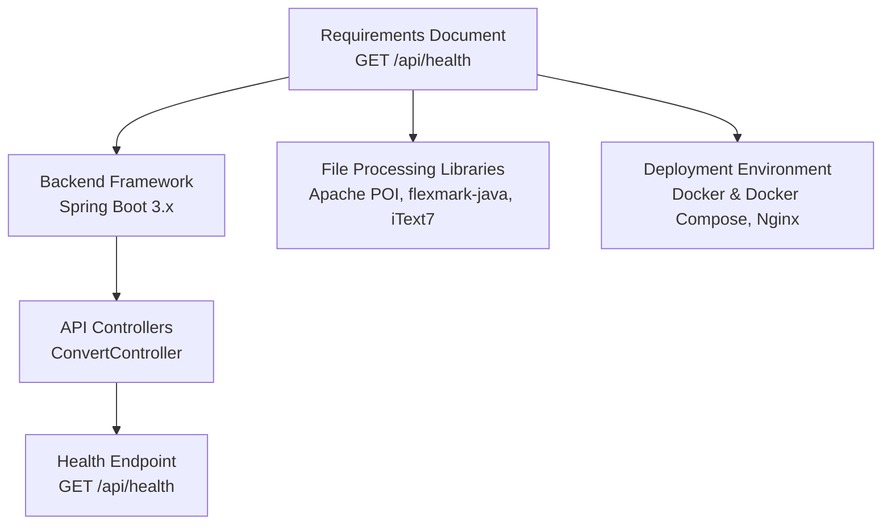
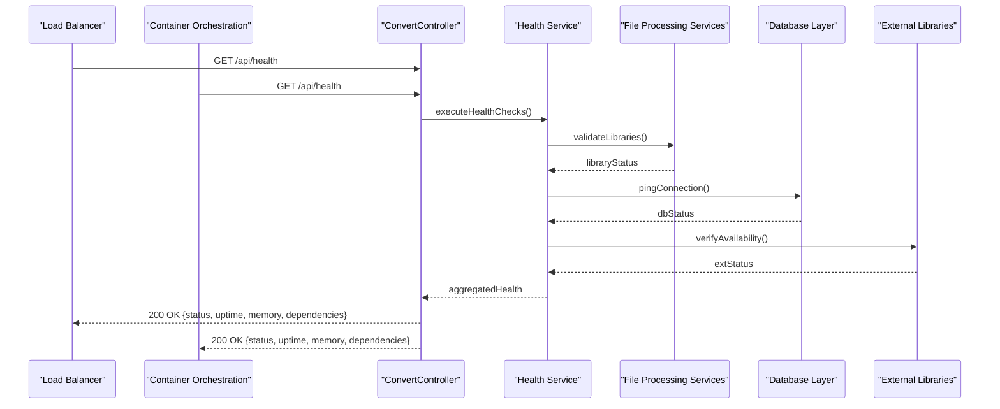
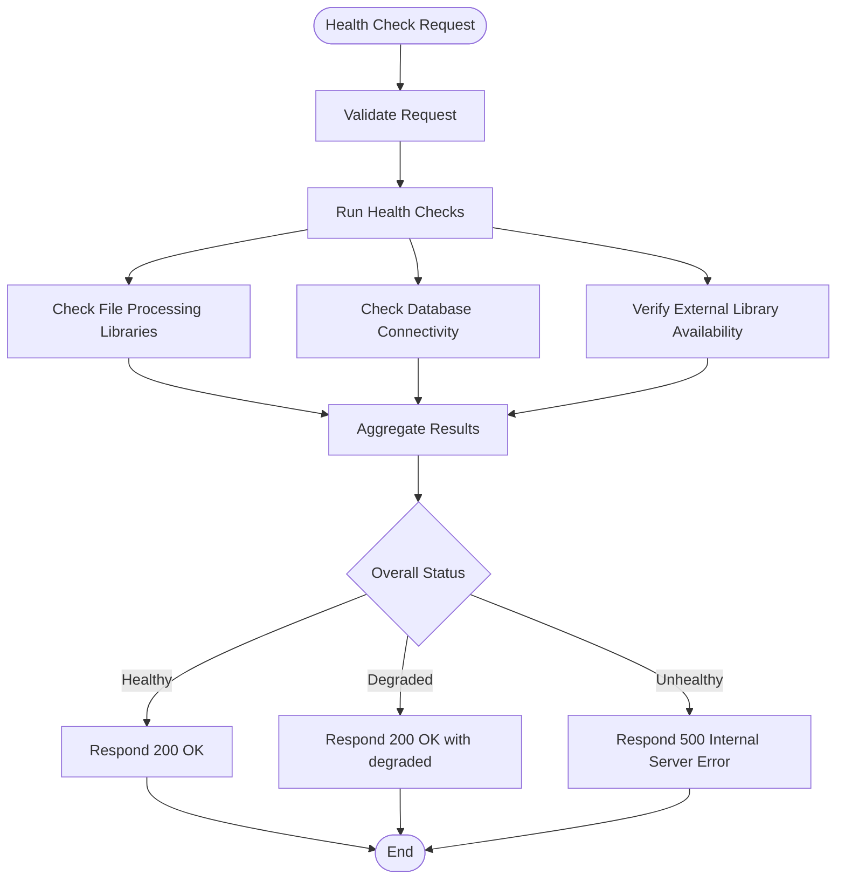
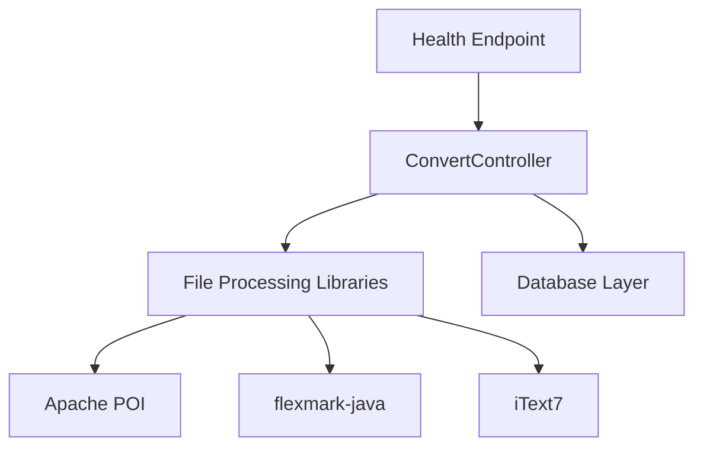

# Health Endpoint

<cite>
**Referenced Files in This Document**
- [多格式文档互转工具 (SmartConvert) 需求文档.md](file://多格式文档互转工具 (SmartConvert) 需求文档.md)
</cite>

## Table of Contents
1. [Introduction](#introduction)
2. [Project Structure](#project-structure)
3. [Core Components](#core-components)
4. [Architecture Overview](#architecture-overview)
5. [Detailed Component Analysis](#detailed-component-analysis)
6. [Dependency Analysis](#dependency-analysis)
7. [Performance Considerations](#performance-considerations)
8. [Troubleshooting Guide](#troubleshooting-guide)
9. [Conclusion](#conclusion)

## Introduction
This document provides API documentation for the GET /api/health endpoint, focusing on system monitoring and health checks. It describes the expected response structure, health check criteria for file processing services, database connectivity, and external library availability. It also covers integration patterns with load balancers, container orchestration systems, and monitoring tools, along with performance metrics collection and alerting thresholds. Finally, it offers troubleshooting guidance for common health check failures and system degradation scenarios.

## Project Structure
The repository contains a single requirements document that outlines the SmartConvert application’s backend API surface, including the GET /api/health endpoint. The document specifies the backend framework, libraries, and deployment environment, which inform how the health endpoint should be implemented and monitored.

**Diagram sources**
- [多格式文档互转工具 (SmartConvert) 需求文档.md: 57-62](file://多格式文档互转工具 (SmartConvert) 需求文档.md#L57-L62)
- [多格式文档互转工具 (SmartConvert) 需求文档.md: 93-99](file://多格式文档互转工具 (SmartConvert) 需求文档.md#L93-L99)

**Section sources**
- [多格式文档互转工具 (SmartConvert) 需求文档.md: 57-62](file://多格式文档互转工具 (SmartConvert) 需求文档.md#L57-L62)
- [多格式文档互转工具 (SmartConvert) 需求文档.md: 93-99](file://多格式文档互转工具 (SmartConvert) 需求文档.md#L93-L99)

## Core Components
- GET /api/health: System health check endpoint returning system status, uptime, memory usage, and dependency health indicators.
- File processing services: Word, PDF, and Markdown conversion capabilities validated during health checks.
- Database connectivity: Health checks for persistence layer readiness.
- External library availability: Validation of Apache POI, flexmark-java, and iText7 presence and basic functionality.

**Section sources**
- [多格式文档互转工具 (SmartConvert) 需求文档.md: 93-99](file://多格式文档互转工具 (SmartConvert) 需求文档.md#L93-L99)
- [多格式文档互转工具 (SmartConvert) 需求文档.md: 115-139](file://多格式文档互转工具 (SmartConvert) 需求文档.md#L115-L139)

## Architecture Overview
The health endpoint integrates with the backend controller and validates runtime dependencies and system resources. It is intended to be consumed by load balancers, container orchestrators, and monitoring systems for automated health assessments.

**Diagram sources**
- [多格式文档互转工具 (SmartConvert) 需求文档.md: 93-99](file://多格式文档互转工具 (SmartConvert) 需求文档.md#L93-L99)
- [多格式文档互转工具 (SmartConvert) 需求文档.md: 115-139](file://多格式文档互转工具 (SmartConvert) 需求文档.md#L115-L139)

## Detailed Component Analysis

### GET /api/health Endpoint
- Method: GET
- Path: /api/health
- Purpose: Provide system health status for monitoring and operational automation.

Response structure (recommended schema):
- status: System overall status (e.g., healthy, degraded, unhealthy)
- timestamp: ISO timestamp of the health check
- uptime: Application uptime in seconds
- memory: Memory usage snapshot (used, total, max heap)
- dependencies: Array of dependency health entries with:
  - name: Dependency identifier (e.g., word-processing, pdf-processing, markdown-parser, database)
  - status: Health status (healthy, degraded, unhealthy)
  - message: Optional diagnostic message
- metadata: Optional metadata (e.g., version, environment, region)

Successful response example:
- status: healthy
- timestamp: 2025-04-05T12:34:56Z
- uptime: 3600
- memory: { used: 128, total: 512, max: 1024 }
- dependencies: [
  { name: "word-processing", status: "healthy", message: "Apache POI available" },
  { name: "pdf-processing", status: "healthy", message: "iText7 available" },
  { name: "markdown-parser", status: "healthy", message: "flexmark-java available" },
  { name: "database", status: "healthy", message: "Connection OK" }
]

Failed response example:
- status: unhealthy
- timestamp: 2025-04-05T12:34:56Z
- uptime: 3600
- memory: { used: 128, total: 512, max: 1024 }
- dependencies: [
  { name: "word-processing", status: "healthy" },
  { name: "pdf-processing", status: "degraded", message: "Partial rendering support" },
  { name: "markdown-parser", status: "unhealthy", message: "Missing parser module" },
  { name: "database", status: "unhealthy", message: "Connection timeout" }
]

Health check criteria:
- File processing services:
  - Word processing: Validate Apache POI availability and basic conversion capability.
  - PDF processing: Validate iText7 availability and basic rendering capability.
  - Markdown parsing: Validate flexmark-java availability and basic parsing capability.
- Database connectivity:
  - Verify connection pool readiness and basic query execution.
- External library availability:
  - Confirm required libraries are present and initialized.

Integration patterns:
- Load balancers: Use HTTP 200 for healthy nodes, 5xx for unhealthy nodes.
- Container orchestration: Configure liveness/readiness probes against GET /api/health.
- Monitoring tools: Parse JSON health payload and set alerting thresholds.

Performance metrics collection and alerting thresholds:
- Uptime threshold: Alert if uptime drops below a configured baseline.
- Memory thresholds: Alert if used memory exceeds configured percentiles (e.g., >80%).
- Dependency thresholds: Alert if any dependency status is unhealthy or degraded persists.

**Section sources**
- [多格式文档互转工具 (SmartConvert) 需求文档.md: 93-99](file://多格式文档互转工具 (SmartConvert) 需求文档.md#L93-L99)
- [多格式文档互转工具 (SmartConvert) 需求文档.md: 115-139](file://多格式文档互转工具 (SmartConvert) 需求文档.md#L115-L139)

### Health Check Flow

[No sources needed since this diagram shows conceptual workflow, not actual code structure]

## Dependency Analysis
The health endpoint depends on:
- Backend controller routing and request handling.
- File processing libraries (Apache POI, flexmark-java, iText7) for validating external library availability.
- Database connectivity for verifying persistence readiness.

**Diagram sources**
- [多格式文档互转工具 (SmartConvert) 需求文档.md: 93-99](file://多格式文档互转工具 (SmartConvert) 需求文档.md#L93-L99)
- [多格式文档互转工具 (SmartConvert) 需求文档.md: 115-139](file://多格式文档互转工具 (SmartConvert) 需求文档.md#L115-L139)

**Section sources**
- [多格式文档互转工具 (SmartConvert) 需求文档.md: 93-99](file://多格式文档互转工具 (SmartConvert) 需求文档.md#L93-L99)
- [多格式文档互转工具 (SmartConvert) 需求文档.md: 115-139](file://多格式文档互转工具 (SmartConvert) 需求文档.md#L115-L139)

## Performance Considerations
- Keep health checks lightweight to avoid impacting application performance.
- Cache dependency readiness checks where feasible.
- Use short timeouts for health checks to prevent blocking.
- Monitor memory usage trends and set thresholds for early warning.

[No sources needed since this section provides general guidance]

## Troubleshooting Guide
Common health check failures and remediation steps:
- Unhealthy status due to missing external libraries:
  - Verify library dependencies are included in the build and deployed.
  - Confirm initialization order and classpath configuration.
- Degraded status for PDF processing:
  - Investigate partial rendering support or resource constraints.
  - Review logs for rendering exceptions.
- Unhealthy status for database:
  - Check connection pool configuration and credentials.
  - Validate network connectivity and firewall rules.
- Memory spikes causing degraded status:
  - Review memory-intensive operations and optimize resource usage.
  - Scale JVM heap settings appropriately.

[No sources needed since this section doesn't analyze specific source files]

## Conclusion
The GET /api/health endpoint is a critical component for system observability and operational reliability. By validating file processing services, database connectivity, and external library availability, it enables automated monitoring and remediation. Integrating with load balancers, container orchestrators, and monitoring tools ensures timely detection and resolution of issues, while performance metrics and alerting thresholds support proactive system maintenance.