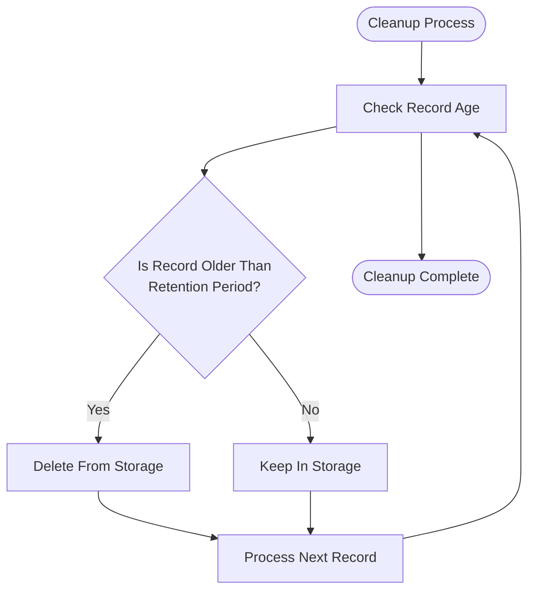
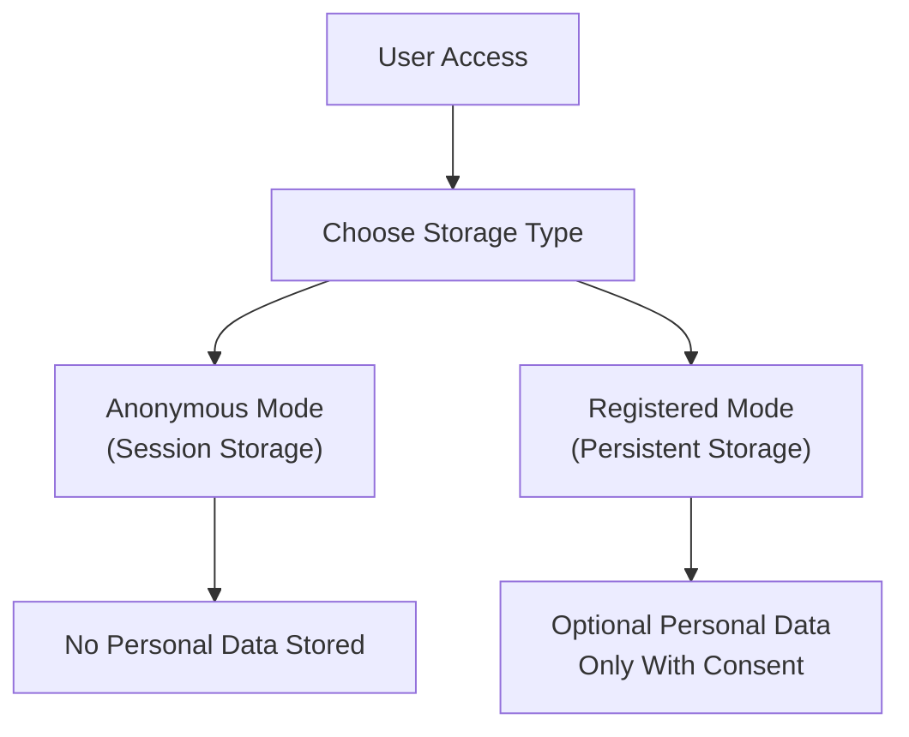

# History Endpoint

<cite>
**Referenced Files in This Document**
- [多格式文档互转工具 (SmartConvert) 需求文档.md](file://多格式文档互转工具 (SmartConvert) 需求文档.md)
</cite>

## Table of Contents
1. [Introduction](#introduction)
2. [Endpoint Definition](#endpoint-definition)
3. [Response Schema](#response-schema)
4. [Query Parameters](#query-parameters)
5. [Pagination Support](#pagination-support)
6. [Sorting Options](#sorting-options)
7. [Data Retention Policies](#data-retention-policies)
8. [Storage Considerations](#storage-considerations)
9. [Privacy Implications](#privacy-impressions)
10. [Error Responses](#error-responses)
11. [Client Integration Patterns](#client-integration-patterns)
12. [Examples](#examples)
13. [Conclusion](#conclusion)

## Introduction

The GET /api/history endpoint provides access to conversion records generated by the SmartConvert document conversion platform. This endpoint enables clients to retrieve recent conversion activities, supporting both session-based and persistent storage mechanisms for conversion history tracking.

## Endpoint Definition

**Endpoint**: `GET /api/history`

**Description**: Retrieves recent conversion records from either session storage or local storage, depending on the configured storage mechanism.

**Authentication**: No authentication required for basic conversion functionality.

**Response Type**: JSON array containing conversion history records.

**Section sources**
- [多格式文档互转工具 (SmartConvert) 需求文档.md:97](file://多格式文档互转工具 (SmartConvert) 需求文档.md#L97)

## Response Schema

Each conversion record follows a standardized structure containing essential metadata about the conversion operation.

### Record Structure

| Field | Type | Description |
|-------|------|-------------|
| id | string | Unique identifier for the conversion record |
| fileName | string | Original filename of the uploaded document |
| originalFormat | string | Source format of the document (e.g., "docx", "pdf", "txt") |
| targetFormat | string | Target format for conversion (e.g., "md", "pdf", "txt") |
| status | string | Current processing status of the conversion |
| createdAt | string | Timestamp when the conversion was initiated (ISO 8601 format) |
| updatedAt | string | Timestamp when the record was last modified (ISO 8601 format) |
| fileSize | number | Size of the original file in bytes |

### Status Values

The status field indicates the current state of each conversion record:

- `processing`: Conversion is currently in progress
- `completed`: Conversion completed successfully
- `failed`: Conversion encountered an error
- `queued`: Conversion is waiting in queue for processing

**Section sources**
- [多格式文档互转工具 (SmartConvert) 需求文档.md:97](file://多格式文档互转工具 (SmartConvert) 需求文档.md#L97)

## Query Parameters

The endpoint supports several query parameters for filtering and controlling the returned data.

### Date Range Filtering

| Parameter | Type | Description | Example |
|-----------|------|-------------|---------|
| startDate | string (date) | Filter records created on or after this date | `2024-01-01` |
| endDate | string (date) | Filter records created on or before this date | `2024-12-31` |

### Format Type Filtering

| Parameter | Type | Description | Example Values |
|-----------|------|-------------|----------------|
| sourceFormat | string | Filter by original document format | `docx`, `pdf`, `txt` |
| targetFormat | string | Filter by target conversion format | `md`, `pdf`, `txt` |

### Status Filtering

| Parameter | Type | Description | Example Values |
|-----------|------|-------------|----------------|
| status | string | Filter by conversion status | `processing`, `completed`, `failed` |

### Storage Mechanism

| Parameter | Type | Description | Example Values |
|-----------|------|-------------|----------------|
| storageType | string | Specify storage mechanism | `session`, `persistent` |

**Section sources**
- [多格式文档互转工具 (SmartConvert) 需求文档.md:97](file://多格式文档互转工具 (SmartConvert) 需求文档.md#L97)

## Pagination Support

The endpoint supports pagination to handle large result sets efficiently.

### Pagination Parameters

| Parameter | Type | Description | Default | Example |
|-----------|------|-------------|---------|---------|
| page | number | Page number (1-indexed) | 1 | `page=2` |
| limit | number | Number of records per page | 20 | `limit=50` |

### Pagination Response Structure

When pagination is applied, the response includes pagination metadata:

```json
{
  "data": [...],
  "pagination": {
    "page": 1,
    "limit": 20,
    "total": 150,
    "pages": 8,
    "hasNext": true,
    "hasPrev": false
  }
}
```

**Section sources**
- [多格式文档互转工具 (SmartConvert) 需求文档.md:97](file://多格式文档互转工具 (SmartConvert) 需求文档.md#L97)

## Sorting Options

Results can be sorted by various criteria to organize the conversion history.

### Sort Parameters

| Parameter | Type | Description | Default | Example |
|-----------|------|-------------|---------|---------|
| sortBy | string | Field to sort by | `createdAt` | `fileName`, `status` |
| sortOrder | string | Sort direction | `desc` | `asc`, `desc` |

### Available Sort Fields

- `createdAt`: Creation timestamp
- `updatedAt`: Last modification timestamp
- `fileName`: Original filename
- `fileSize`: File size in bytes
- `status`: Processing status

**Section sources**
- [多格式文档互转工具 (SmartConvert) 需求文档.md:97](file://多格式文档互转工具 (SmartConvert) 需求文档.md#L97)

## Data Retention Policies

The system implements configurable data retention policies to manage storage usage and performance.

### Retention Settings

| Policy | Description | Default Duration |
|--------|-------------|------------------|
| Session Storage | Temporary storage bound to browser session | Session duration |
| Persistent Storage | Long-term storage with cleanup | 30 days |
| Cleanup Interval | Automatic cleanup frequency | Daily |

### Storage Cleanup Process

The system automatically removes old conversion records based on retention policies:



**Section sources**
- [多格式文档互转工具 (SmartConvert) 需求文档.md:173](file://多格式文档互转工具 (SmartConvert) 需求文档.md#L173)

## Storage Considerations

The system supports two primary storage mechanisms for conversion history.

### Session-Based Storage

**Characteristics**:
- Temporary storage bound to browser session
- Automatically cleared when session ends
- No server-side persistence
- Suitable for anonymous users

**Use Cases**:
- Quick browsing of recent conversions
- Temporary reference during session
- Privacy-conscious scenarios

### Persistent Storage

**Characteristics**:
- Long-term server-side storage
- Retains records beyond session duration
- Requires user identification
- Supports advanced querying capabilities

**Use Cases**:
- User account management
- Audit trails
- Advanced analytics

**Section sources**
- [多格式文档互转工具 (SmartConvert) 需求文档.md:97](file://多格式文档互转工具 (SmartConvert) 需求文档.md#L97)

## Privacy Implications

The history endpoint raises important privacy considerations that developers and users should understand.

### Data Collection

**Information Stored**:
- File metadata (names, sizes)
- Conversion parameters (source/target formats)
- Timestamps for processing
- Processing status indicators

**Information Not Stored**:
- Content of converted documents
- User identifiers (for anonymous sessions)
- Network information beyond necessary

### Privacy Controls

Users can control their privacy preferences:



**Section sources**
- [多格式文档互转工具 (SmartConvert) 需求文档.md:97](file://多格式文档互转工具 (SmartConvert) 需求文档.md#L97)

## Error Responses

The endpoint returns appropriate HTTP status codes and error messages for various failure scenarios.

### Common Error Scenarios

| Error Code | Scenario | Response Body |
|------------|----------|---------------|
| 400 | Invalid date format | `{ "error": "Invalid date format" }` |
| 400 | Invalid format type | `{ "error": "Invalid format type" }` |
| 400 | Invalid status value | `{ "error": "Invalid status value" }` |
| 400 | Invalid pagination parameters | `{ "error": "Invalid pagination parameters" }` |
| 404 | No conversion history found | `{ "message": "No conversion history found" }` |
| 500 | Internal server error | `{ "error": "Internal server error" }` |

### Error Response Structure

```json
{
  "error": "Error message describing the issue",
  "code": "ERROR_CODE",
  "timestamp": "2024-01-01T00:00:00Z"
}
```

**Section sources**
- [多格式文档互转工具 (SmartConvert) 需求文档.md:97](file://多格式文档互转工具 (SmartConvert) 需求文档.md#L97)

## Client Integration Patterns

### Basic Implementation

```javascript
// Fetch conversion history
async function fetchConversionHistory(params = {}) {
  const url = new URL('/api/history', window.location.origin);
  
  // Add query parameters
  Object.keys(params).forEach(key => {
    if (params[key]) {
      url.searchParams.append(key, params[key]);
    }
  });
  
  try {
    const response = await fetch(url.toString());
    
    if (!response.ok) {
      throw new Error(`HTTP error! status: ${response.status}`);
    }
    
    return await response.json();
  } catch (error) {
    console.error('Failed to fetch history:', error);
    throw error;
  }
}

// Usage examples
fetchConversionHistory({ page: 1, limit: 20 })
  .then(data => console.log('History:', data))
  .catch(error => console.error('Error:', error));
```

### Advanced Integration

```javascript
class HistoryService {
  constructor(baseUrl = '/api') {
    this.baseUrl = baseUrl;
  }
  
  async getHistory(filters = {}) {
    const url = new URL(`${this.baseUrl}/history`);
    
    // Apply filters
    Object.entries(filters).forEach(([key, value]) => {
      if (value !== null && value !== undefined) {
        url.searchParams.append(key, value);
      }
    });
    
    const response = await this.fetchWithRetry(url.toString(), {
      method: 'GET',
      headers: {
        'Content-Type': 'application/json'
      }
    });
    
    return response.json();
  }
  
  async fetchWithRetry(url, options, maxRetries = 3) {
    for (let i = 0; i < maxRetries; i++) {
      try {
        return await fetch(url, options);
      } catch (error) {
        if (i === maxRetries - 1) throw error;
        await this.sleep(1000 * Math.pow(2, i)); // Exponential backoff
      }
    }
  }
  
  sleep(ms) {
    return new Promise(resolve => setTimeout(resolve, ms));
  }
}
```

### Real-time Updates

```javascript
// Polling for real-time updates
const historyPoller = {
  intervalId: null,
  callback: null,
  
  startPolling(callback, interval = 5000) {
    this.callback = callback;
    this.intervalId = setInterval(() => {
      this.fetchLatestHistory();
    }, interval);
  },
  
  stopPolling() {
    if (this.intervalId) {
      clearInterval(this.intervalId);
      this.intervalId = null;
    }
  },
  
  async fetchLatestHistory() {
    try {
      const response = await fetch('/api/history?sortBy=createdAt&sortOrder=desc&limit=10');
      const data = await response.json();
      this.callback(data);
    } catch (error) {
      console.error('Polling error:', error);
    }
  }
};
```

**Section sources**
- [多格式文档互转工具 (SmartConvert) 需求文档.md:97](file://多格式文档互转工具 (SmartConvert) 需求文档.md#L97)

## Examples

### Typical API Response

```json
{
  "data": [
    {
      "id": "conv_001",
      "fileName": "annual_report.docx",
      "originalFormat": "docx",
      "targetFormat": "md",
      "status": "completed",
      "createdAt": "2024-01-15T14:30:00Z",
      "updatedAt": "2024-01-15T14:32:15Z",
      "fileSize": 2048000
    },
    {
      "id": "conv_002",
      "fileName": "research_paper.pdf",
      "originalFormat": "pdf",
      "targetFormat": "md",
      "status": "processing",
      "createdAt": "2024-01-15T15:45:00Z",
      "updatedAt": "2024-01-15T15:45:00Z",
      "fileSize": 1572864
    }
  ],
  "pagination": {
    "page": 1,
    "limit": 20,
    "total": 42,
    "pages": 3,
    "hasNext": true,
    "hasPrev": false
  }
}
```

### Client-Side Integration Example

```javascript
// React component for displaying conversion history
import React, { useState, useEffect } from 'react';

function ConversionHistory() {
  const [history, setHistory] = useState([]);
  const [loading, setLoading] = useState(true);
  const [error, setError] = useState(null);

  useEffect(() => {
    fetchHistory();
  }, []);

  const fetchHistory = async () => {
    try {
      const response = await fetch('/api/history?page=1&limit=10');
      
      if (!response.ok) {
        throw new Error(`HTTP error! status: ${response.status}`);
      }
      
      const data = await response.json();
      setHistory(data.data);
      setLoading(false);
    } catch (err) {
      setError(err.message);
      setLoading(false);
    }
  };

  if (loading) return <div>Loading...</div>;
  if (error) return <div>Error: {error}</div>;

  return (
    <div>
      <h3>Recent Conversions</h3>
      {history.map(record => (
        <div key={record.id} className="history-item">
          <span>{record.fileName}</span>
          <span>{record.originalFormat} → {record.targetFormat}</span>
          <span className={`status ${record.status}`}>
            {record.status}
          </span>
        </div>
      ))}
    </div>
  );
}
```

**Section sources**
- [多格式文档互转工具 (SmartConvert) 需求文档.md:97](file://多格式文档互转工具 (SmartConvert) 需求文档.md#L97)

## Conclusion

The GET /api/history endpoint provides a comprehensive interface for accessing conversion records with flexible filtering, pagination, and sorting capabilities. The endpoint supports both session-based and persistent storage mechanisms, offering developers flexibility in implementation while maintaining user privacy controls.

Key benefits of this implementation include:
- Flexible filtering by date range, format types, and status
- Efficient pagination for large result sets
- Configurable sorting options
- Privacy-conscious storage choices
- Comprehensive error handling
- Easy client integration patterns

The endpoint serves as a foundation for building robust conversion history interfaces while maintaining performance and user privacy standards.