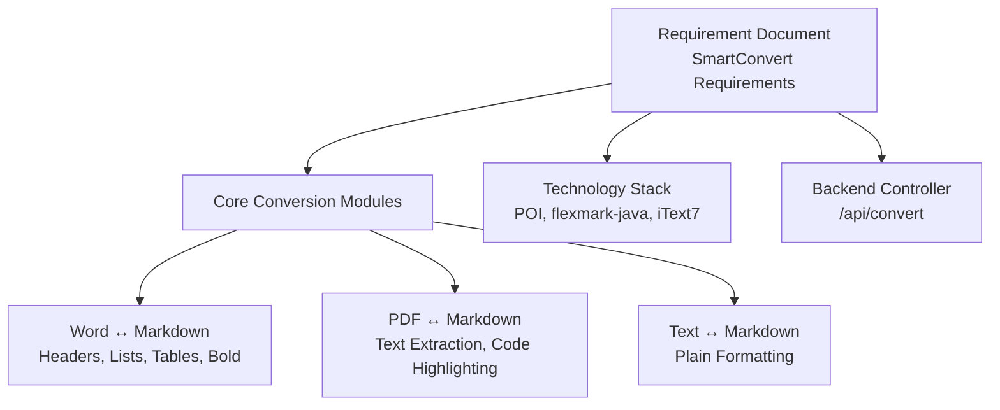
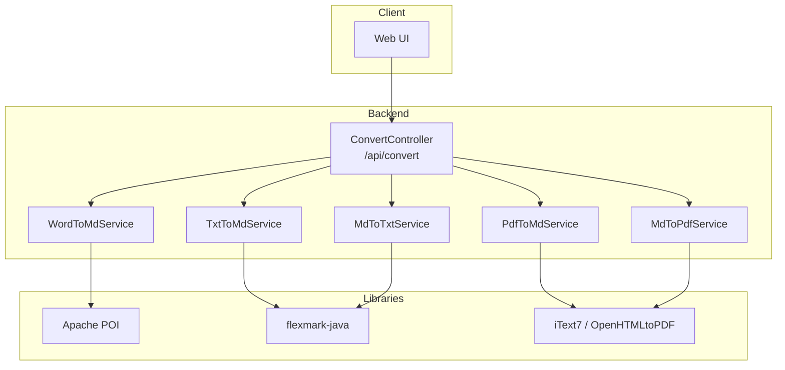
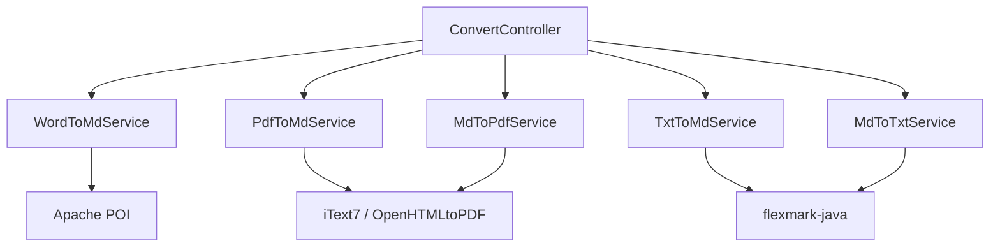

# Core Conversion Features

<cite>
**Referenced Files in This Document**
- [多格式文档互转工具 (SmartConvert) 需求文档.md](file://多格式文档互转工具 (SmartConvert) 需求文档.md)
</cite>

## Table of Contents
1. [Introduction](#introduction)
2. [Project Structure](#project-structure)
3. [Core Components](#core-components)
4. [Architecture Overview](#architecture-overview)
5. [Detailed Component Analysis](#detailed-component-analysis)
6. [Dependency Analysis](#dependency-analysis)
7. [Performance Considerations](#performance-considerations)
8. [Troubleshooting Guide](#troubleshooting-guide)
9. [Conclusion](#conclusion)

## Introduction
This document focuses on the core conversion features of SmartConvert, a bidirectional document transformation platform supporting Word (.docx), PDF (.pdf), and Text (.txt) ↔ Markdown conversions. It explains the conversion algorithms, format preservation strategies, technical challenges, examples, limitations, quality considerations, fallback mechanisms, error handling, and optimization techniques for achieving high-fidelity transformations.

## Project Structure
The repository contains a single requirement and implementation blueprint document that outlines the conversion modules, technology stack, and backend controller logic. The document serves as the primary specification for the core conversion features.

**Diagram sources**
- [多格式文档互转工具 (SmartConvert) 需求文档.md: 67-79](file://多格式文档互转工具 (SmartConvert) 需求文档.md#L67-L79)
- [多格式文档互转工具 (SmartConvert) 需求文档.md: 39-51](file://多格式文档互转工具 (SmartConvert) 需求文档.md#L39-L51)
- [多格式文档互转工具 (SmartConvert) 需求文档.md: 95](file://多格式文档互转工具 (SmartConvert) 需求文档.md#L95)

**Section sources**
- [多格式文档互转工具 (SmartConvert) 需求文档.md: 67-79](file://多格式文档互转工具 (SmartConvert) 需求文档.md#L67-L79)
- [多格式文档互转工具 (SmartConvert) 需求文档.md: 39-51](file://多格式文档互转工具 (SmartConvert) 需求文档.md#L39-L51)
- [多格式文档互转工具 (SmartConvert) 需求文档.md: 95](file://多格式文档互转工具 (SmartConvert) 需求文档.md#L95)

## Core Components
This section documents the three core conversion modules and their intended behaviors, format preservation goals, and quality expectations.

- Word (.docx) ↔ Markdown
  - Preserve headers, ordered/unordered lists, tables, and bold formatting.
  - Maintain structural hierarchy and basic inline styles.
  - Limitations: Complex nested tables, merged cells, and advanced styles may require manual cleanup post-conversion.
  - Quality considerations: Use robust parsing libraries to handle mixed content and preserve whitespace and indentation.

- PDF (.pdf) ↔ Markdown
  - PDF to Markdown: Extract text content while attempting to preserve logical structure (headers, paragraphs, lists). Complex layouts may introduce inaccuracies.
  - Markdown to PDF: Render with code highlighting and typography enhancements for improved readability.
  - Limitations: Non-Latin scripts, embedded images, and complex page layouts can reduce fidelity.
  - Quality considerations: Apply OCR preprocessing for scanned PDFs and layout-aware text extraction to improve accuracy.

- Text (.txt) ↔ Markdown
  - Plain text to Markdown: Wrap content in Markdown containers and apply minimal formatting (e.g., headers for top-level sections).
  - Markdown to plain text: Strip Markdown syntax to produce clean text.
  - Limitations: Loss of formatting beyond basic headers and paragraphs.
  - Quality considerations: Normalize line endings and trim extraneous whitespace.

**Section sources**
- [多格式文档互转工具 (SmartConvert) 需求文档.md: 67-79](file://多格式文档互转工具 (SmartConvert) 需求文档.md#L67-L79)

## Architecture Overview
The conversion engine is designed around a central controller that routes requests to specialized services based on the source/target formats. The backend leverages dedicated libraries for each format family to maximize fidelity.

**Diagram sources**
- [多格式文档互转工具 (SmartConvert) 需求文档.md: 95](file://多格式文档互转工具 (SmartConvert) 需求文档.md#L95)
- [多格式文档互转工具 (SmartConvert) 需求文档.md: 43-51](file://多格式文档互转工具 (SmartConvert) 需求文档.md#L43-L51)

**Section sources**
- [多格式文档互转工具 (SmartConvert) 需求文档.md: 95](file://多格式文档互转工具 (SmartConvert) 需求文档.md#L95)
- [多格式文档互转工具 (SmartConvert) 需求文档.md: 43-51](file://多格式文档互转工具 (SmartConvert) 需求文档.md#L43-L51)

## Detailed Component Analysis

### Word (.docx) ↔ Markdown Conversion
- Algorithm overview
  - Parse document structure: iterate through paragraphs, tables, and runs.
  - Detect headers by style names or font characteristics.
  - Identify lists by numbering/bullets and extract nested items.
  - Extract tables row-by-row, preserving cell alignment and borders where possible.
  - Map inline formatting (bold, italic, underline) to Markdown emphasis constructs.
  - Maintain spacing and indentation to reflect original structure.

- Format preservation strategies
  - Headers: Map styles to Markdown ATX or Setext headers.
  - Lists: Preserve ordered vs unordered distinction and nesting levels.
  - Tables: Use pipe tables with alignment markers; handle merged cells by duplicating spans.
  - Bold/italic: Apply Markdown strong/emphasis tokens consistently.

- Technical challenges
  - Mixed content blocks and embedded objects.
  - Complex nested styles and inconsistent formatting.
  - Handling of footnotes/endnotes and comments.

- Example scenarios
  - Input: A .docx with numbered headings, nested bullet lists, and a two-column table with bold headers.
  - Output: A Markdown document with ATX headers, nested lists, and a pipe table with bold column headers.
  - Limitation: Merged cells may require manual adjustment post-conversion.

- Fallback mechanisms and error handling
  - Fallback: Treat unrecognized styles as plain paragraphs.
  - Error handling: Log parsing errors and continue processing remaining content; mark problematic sections for manual review.

- Optimization techniques
  - Preprocess stylesheets to normalize formatting.
  - Batch process runs to minimize overhead.
  - Cache frequently used style mappings.

**Section sources**
- [多格式文档互转工具 (SmartConvert) 需求文档.md: 67-79](file://多格式文档互转工具 (SmartConvert) 需求文档.md#L67-L79)
- [多格式文档互转工具 (SmartConvert) 需求文档.md: 47](file://多格式文档互转工具 (SmartConvert) 需求文档.md#L47)

### PDF (.pdf) ↔ Markdown Conversion
- Algorithm overview
  - PDF to Markdown: Extract text with spatial awareness to infer structure (headers, lists, paragraphs).
  - Use font size, weight, and position to detect headings and lists.
  - Apply layout analysis to reconstruct tables from text blocks.
  - For Markdown to PDF: Convert Markdown to HTML, then render to PDF with code highlighting and typography.

- Format preservation strategies
  - Text extraction: Maintain logical order and paragraph boundaries.
  - Code highlighting: Apply syntax highlighting during HTML-to-PDF rendering.
  - Typography: Use readable fonts and appropriate margins for print-like quality.

- Technical challenges
  - Non-Latin scripts and complex encodings.
  - Scanned PDFs requiring OCR preprocessing.
  - Embedded images and vector graphics.
  - Irregular page layouts and mixed fonts.

- Example scenarios
  - Input: A PDF with a title page, numbered sections, bulleted lists, and a table of contents.
  - Output: A Markdown document with ATX headers, nested lists, and a reconstructed table of contents.
  - Limitation: Complex page layouts may misalign extracted text.

- Fallback mechanisms and error handling
  - Fallback: Treat ambiguous blocks as plain paragraphs; skip unsupported images.
  - Error handling: Log extraction failures and provide a warning to the user.

- Optimization techniques
  - Preprocess scanned PDFs with OCR to improve text extraction.
  - Use layout-aware extraction to group adjacent text into coherent blocks.
  - Cache rendered PDF previews for repeated conversions.

**Section sources**
- [多格式文档互转工具 (SmartConvert) 需求文档.md: 73-77](file://多格式文档互转工具 (SmartConvert) 需求文档.md#L73-L77)
- [多格式文档互转工具 (SmartConvert) 需求文档.md: 49](file://多格式文档互转工具 (SmartConvert) 需求文档.md#L49)

### Text (.txt) ↔ Markdown Conversion
- Algorithm overview
  - Plain text to Markdown: Identify top-level sections by line patterns and wrap them as headers; treat remaining content as paragraphs.
  - Markdown to plain text: Strip Markdown syntax and retain readable text.

- Format preservation strategies
  - Headers: Detect potential section titles and convert to Markdown headers.
  - Paragraphs: Maintain blank lines between paragraphs.
  - Minimal formatting: Avoid introducing unsupported constructs.

- Technical challenges
  - Ambiguous section boundaries in plain text.
  - Loss of formatting beyond headers and paragraphs.

- Example scenarios
  - Input: A .txt file with a title line, bullet points, and a table-like structure.
  - Output: A Markdown document with a top-level header and bullet list; table-like content preserved as text.
  - Limitation: Tables are not converted to Markdown tables.

- Fallback mechanisms and error handling
  - Fallback: Treat all content as a single paragraph if no clear structure is detected.
  - Error handling: Normalize line endings and trim extra whitespace.

- Optimization techniques
  - Normalize line endings and remove trailing spaces.
  - Use heuristics to detect lists and tables for better fidelity.

**Section sources**
- [多格式文档互转工具 (SmartConvert) 需求文档.md: 79](file://多格式文档互转工具 (SmartConvert) 需求文档.md#L79)

## Dependency Analysis
The conversion modules rely on specific libraries tailored to each format family. The backend controller coordinates routing and temporary file handling.

**Diagram sources**
- [多格式文档互转工具 (SmartConvert) 需求文档.md: 43-51](file://多格式文档互转工具 (SmartConvert) 需求文档.md#L43-L51)

**Section sources**
- [多格式文档互转工具 (SmartConvert) 需求文档.md: 43-51](file://多格式文档互转工具 (SmartConvert) 需求文档.md#L43-L51)

## Performance Considerations
- Target performance: Convert documents up to 10 MB within 3 seconds.
- Optimization techniques:
  - Stream processing for large files to reduce memory usage.
  - Parallelize independent tasks (e.g., batch conversions).
  - Cache style mappings and rendered previews.
  - Use efficient libraries and avoid unnecessary conversions.

[No sources needed since this section provides general guidance]

## Troubleshooting Guide
- Common issues and resolutions
  - Poor PDF fidelity: Enable OCR preprocessing for scanned documents; adjust layout extraction parameters.
  - Word formatting loss: Normalize stylesheets before conversion; manually adjust merged cells and complex tables.
  - Text conversion limitations: Provide clearer section markers in plain text; consider pre-processing to standardize formatting.
- Error handling
  - Log parsing and extraction errors; continue processing remaining content.
  - Provide user feedback for warnings and suggest manual corrections.

**Section sources**
- [多格式文档互转工具 (SmartConvert) 需求文档.md: 73-79](file://多格式文档互转工具 (SmartConvert) 需求文档.md#L73-L79)

## Conclusion
SmartConvert’s core conversion features aim to deliver high-fidelity bidirectional transformations across Word, PDF, and Text formats. By leveraging specialized libraries, applying robust parsing strategies, and implementing fallback mechanisms, the system can achieve reliable results for typical documents. Users should expect minor adjustments for complex layouts and are encouraged to review and refine outputs as needed.