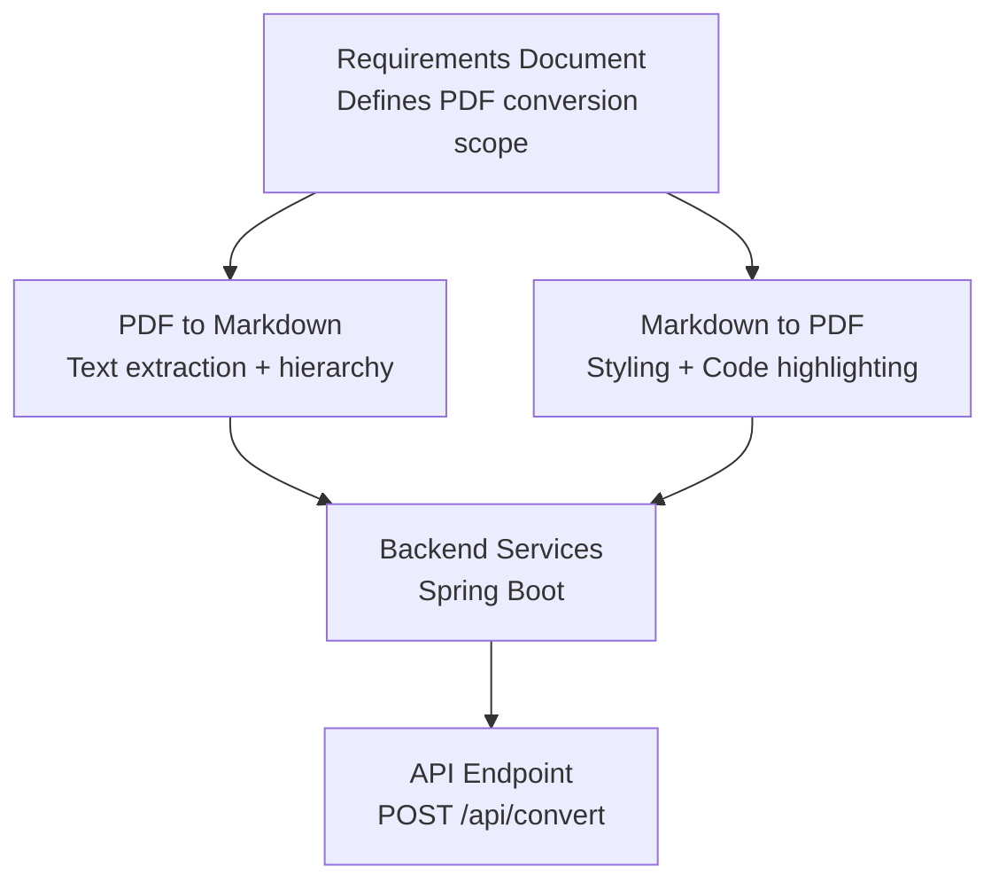
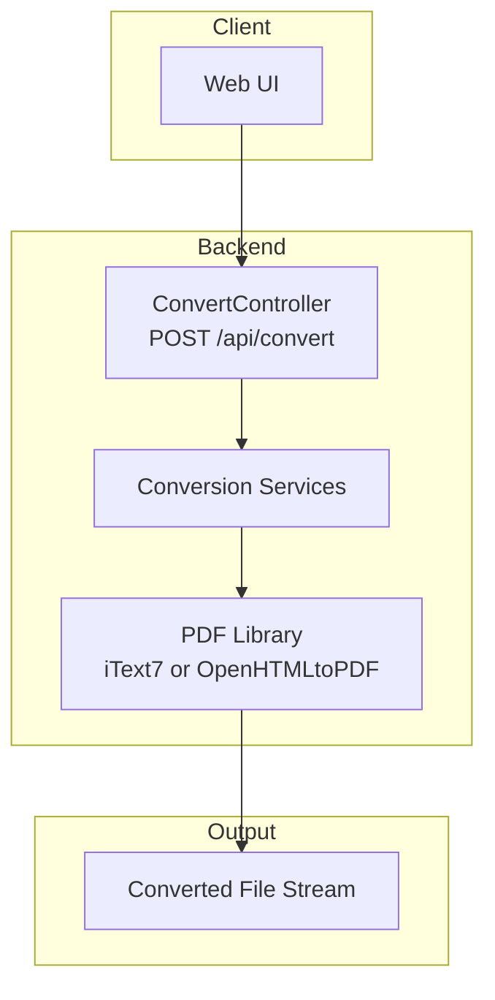
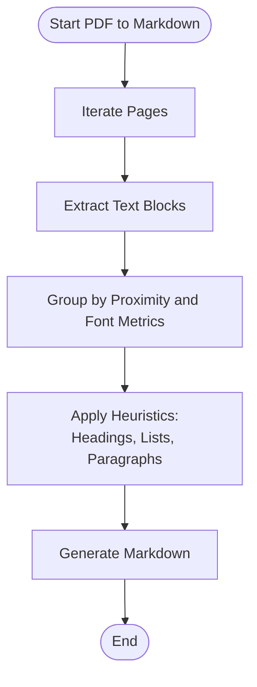
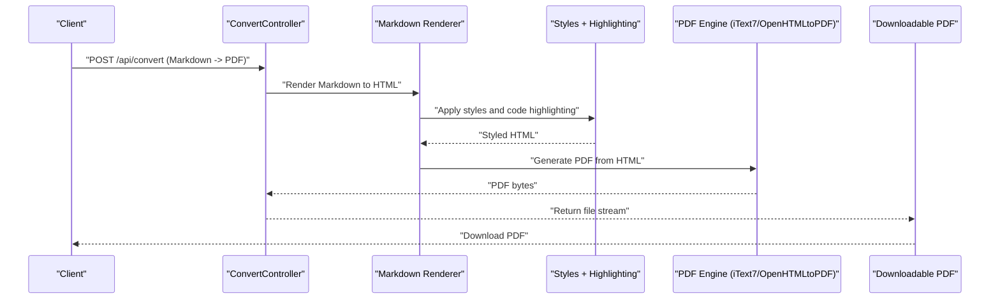
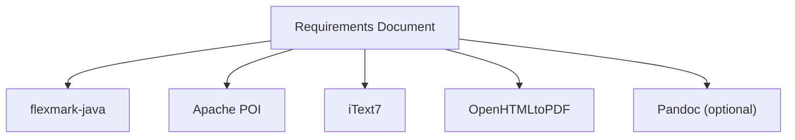

# PDF Processing

<cite>
**Referenced Files in This Document**
- [多格式文档互转工具 (SmartConvert) 需求文档.md](file://多格式文档互转工具 (SmartConvert) 需求文档.md)
</cite>

## Table of Contents
1. [Introduction](#introduction)
2. [Project Structure](#project-structure)
3. [Core Components](#core-components)
4. [Architecture Overview](#architecture-overview)
5. [Detailed Component Analysis](#detailed-component-analysis)
6. [Dependency Analysis](#dependency-analysis)
7. [Performance Considerations](#performance-considerations)
8. [Troubleshooting Guide](#troubleshooting-guide)
9. [Conclusion](#conclusion)
10. [Appendices](#appendices)

## Introduction
This document describes the PDF processing conversion module for SmartConvert, focusing on bidirectional conversion between PDF and Markdown. It outlines the intended text extraction and layout handling for PDF-to-Markdown conversion, as well as Markdown-to-PDF generation with code highlighting and styling. It also covers known limitations for complex layouts and vector graphics, guidance for encrypted and scanned PDFs, and quality considerations for maintaining document fidelity during conversion.

## Project Structure
The repository currently contains a requirements document that defines the PDF processing capabilities and technology stack. The PDF conversion features are scoped to:
- PDF to Markdown: extract text content and preserve hierarchical structure where possible.
- Markdown to PDF: produce a styled PDF with code highlighting support.

**Section sources**
- [多格式文档互转工具 (SmartConvert) 需求文档.md:67-78](file://多格式文档互转工具 (SmartConvert) 需求文档.md#L67-L78)

## Core Components
- PDF to Markdown conversion pipeline:
  - Text extraction from PDF pages.
  - Hierarchical structure detection and preservation.
  - Layout-aware grouping of text blocks.
- Markdown to PDF generation pipeline:
  - Rendering Markdown to HTML/CSS.
  - Applying styles and code highlighting.
  - Generating a PDF using iText7 or OpenHTMLtoPDF.

These capabilities are defined in the requirements document and supported by the selected libraries.

**Section sources**
- [多格式文档互转工具 (SmartConvert) 需求文档.md:49](file://多格式文档互转工具 (SmartConvert) 需求文档.md#L49)
- [多格式文档互转工具 (SmartConvert) 需求文档.md:73-77](file://多格式文档互转工具 (SmartConvert) 需求文档.md#L73-L77)

## Architecture Overview
The PDF processing module integrates with the broader SmartConvert backend. The conversion endpoint orchestrates the chosen library pipeline and returns the transformed file.

**Section sources**
- [多格式文档互转工具 (SmartConvert) 需求文档.md:95](file://多格式文档互转工具 (SmartConvert) 需求文档.md#L95)
- [多格式文档互转工具 (SmartConvert) 需求文档.md:49](file://多格式文档互转工具 (SmartConvert) 需求文档.md#L49)

## Detailed Component Analysis

### PDF to Markdown: Text Extraction and Hierarchy Preservation
- Purpose: Extract readable text from PDFs while preserving logical hierarchy (headings, lists, paragraphs).
- Approach:
  - Iterate pages and extract text content.
  - Group text blocks by proximity and font metrics to infer structure.
  - Apply heuristics to detect headings, lists, and paragraphs.
  - Preserve indentation and spacing where feasible.
- Limitations:
  - Complex layouts may introduce structural bias.
  - Non-latin scripts and mixed fonts may require additional preprocessing.

**Section sources**
- [多格式文档互转工具 (SmartConvert) 需求文档.md:75](file://多格式文档互转工具 (SmartConvert) 需求文档.md#L75)

### Markdown to PDF: Styling and Code Highlighting
- Purpose: Produce a visually appealing PDF from Markdown with syntax highlighting and consistent styling.
- Approach:
  - Render Markdown to HTML/CSS using a compatible engine.
  - Apply custom styles for typography, spacing, and code blocks.
  - Inject syntax highlighting for fenced code blocks.
  - Generate PDF via iText7 or OpenHTMLtoPDF.
- Quality considerations:
  - Ensure consistent rendering across browsers and engines.
  - Optimize CSS for print media and page breaks.

**Section sources**
- [多格式文档互转工具 (SmartConvert) 需求文档.md:77](file://多格式文档互转工具 (SmartConvert) 需求文档.md#L77)
- [多格式文档互转工具 (SmartConvert) 需求文档.md:49](file://多格式文档互转工具 (SmartConvert) 需求文档.md#L49)

### Complex Layouts, Form Fields, and Embedded Objects
- Complex layouts:
  - Multi-column text, overlapping text, and irregular shapes may degrade hierarchy detection.
- Form fields:
  - Interactive fields are not typically extracted as editable content; static text may be recoverable depending on encoding.
- Embedded objects:
  - Images and vector graphics are generally not included in text extraction; separate handling would be required for images.

[No sources needed since this section provides general guidance]

### Encrypted and Scanned PDFs
- Encrypted PDFs:
  - Require a valid password to unlock before processing. If password-protected, prompt the user and pass the password to the PDF library.
- Scanned PDFs:
  - Contain rasterized images without selectable text. OCR preprocessing is recommended prior to text extraction.

[No sources needed since this section provides general guidance]

### Quality and Optimization Techniques
- Maintain document fidelity:
  - Use consistent fonts and sizes in Markdown-to-PDF styling.
  - Minimize layout assumptions; prefer explicit structure markers.
- Performance:
  - Batch page processing and reuse resources where possible.
  - Limit memory usage for large documents by streaming.

[No sources needed since this section provides general guidance]

## Dependency Analysis
The PDF processing module relies on the following libraries and components:
- PDF processing: iText7 or OpenHTMLtoPDF.
- Markdown parsing/rendering: flexmark-java.
- Word processing: Apache POI (for cross-format compatibility).
- Optional bridge: Pandoc for advanced conversions.

**Section sources**
- [多格式文档互转工具 (SmartConvert) 需求文档.md:45-51](file://多格式文档互转工具 (SmartConvert) 需求文档.md#L45-L51)

## Performance Considerations
- Conversion latency:
  - Target sub-second conversion for small to medium documents.
- Scalability:
  - Use asynchronous processing for large files.
  - Implement caching for repeated conversions of identical content.

[No sources needed since this section provides general guidance]

## Troubleshooting Guide
- PDF to Markdown produces unexpected structure:
  - Adjust heuristics for headings and lists.
  - Preprocess PDFs to normalize fonts and layout.
- Markdown to PDF missing styles or code highlighting:
  - Verify CSS injection and highlighter configuration.
  - Confirm HTML rendering pipeline completes successfully.
- Encrypted or password-protected PDFs:
  - Prompt for password and pass it to the PDF library before extraction.
- Scanned PDFs:
  - Apply OCR preprocessing before attempting text extraction.

[No sources needed since this section provides general guidance]

## Conclusion
The PDF processing module in SmartConvert aims to deliver practical, high-fidelity conversions between PDF and Markdown. By leveraging iText7 or OpenHTMLtoPDF alongside flexmark-java, the system can extract text and structure from PDFs and render styled PDFs from Markdown with code highlighting. Real-world limitations exist for complex layouts, vector graphics, encrypted documents, and scanned content, requiring careful preprocessing and user guidance.

## Appendices
- API endpoint for conversion:
  - POST /api/convert: Accepts file, source format, target format, and returns the converted file stream or download link.

**Section sources**
- [多格式文档互转工具 (SmartConvert) 需求文档.md:95](file://多格式文档互转工具 (SmartConvert) 需求文档.md#L95)