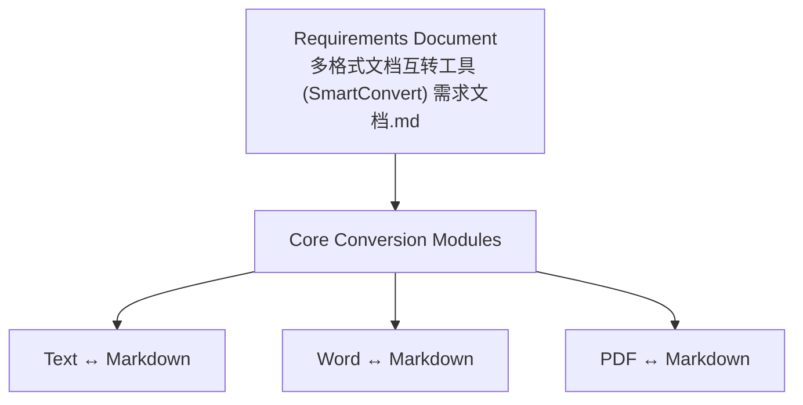
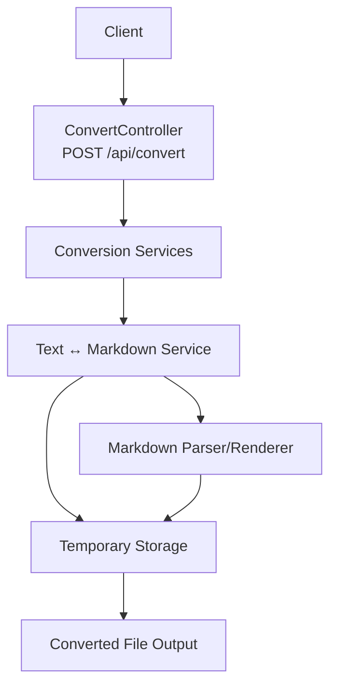
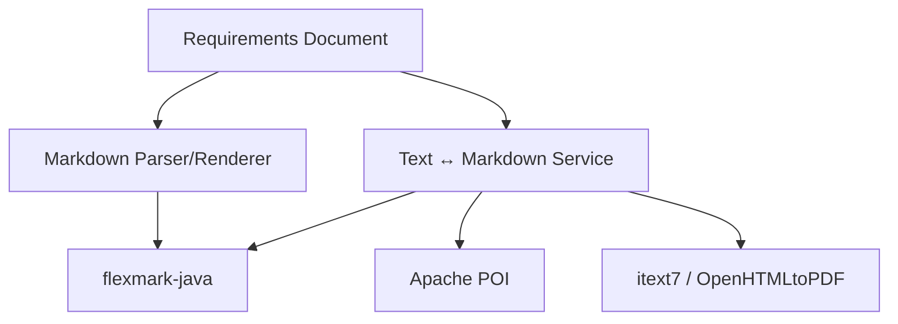

# Text (.txt) Processing

<cite>
**Referenced Files in This Document**
- [多格式文档互转工具 (SmartConvert) 需求文档.md](file://多格式文档互转工具 (SmartConvert) 需求文档.md)
</cite>

## Table of Contents
1. [Introduction](#introduction)
2. [Project Structure](#project-structure)
3. [Core Components](#core-components)
4. [Architecture Overview](#architecture-overview)
5. [Detailed Component Analysis](#detailed-component-analysis)
6. [Dependency Analysis](#dependency-analysis)
7. [Performance Considerations](#performance-considerations)
8. [Troubleshooting Guide](#troubleshooting-guide)
9. [Conclusion](#conclusion)
10. [Appendices](#appendices)

## Introduction
This document describes the Text (.txt) processing conversion module for SmartConvert, focusing on bidirectional conversion between plain text files and Markdown format. It explains the heuristics used for intelligent text analysis and formatting detection, including automatic heading detection, list creation, and emphasis formatting. It also covers the extraction process for removing Markdown formatting from converted text files, along with examples of conversion behaviors, edge cases (mixed content types, special characters, encoding considerations), and guidance for handling large files and optimizing bulk conversion performance.

## Project Structure
The repository currently contains only a requirements document that outlines the SmartConvert project and its planned features. The document specifies the core conversion modules, including Text ↔ Markdown, and references the backend technologies that will support these conversions.

**Diagram sources**
- [多格式文档互转工具 (SmartConvert) 需求文档.md:67-79](file://多格式文档互转工具 (SmartConvert) 需求文档.md#L67-L79)

**Section sources**
- [多格式文档互转工具 (SmartConvert) 需求文档.md:67-79](file://多格式文档互转工具 (SmartConvert) 需求文档.md#L67-L79)

## Core Components
The Text (.txt) ↔ Markdown conversion module is part of the broader SmartConvert platform. Based on the requirements document, the module is designed to:
- Convert plain text to Markdown by inferring structure and applying Markdown formatting.
- Convert Markdown back to plain text by extracting content while removing Markdown syntax.

Key responsibilities:
- Detect headings and apply Markdown heading syntax.
- Recognize lists and convert them to Markdown bullet/numbered lists.
- Apply emphasis formatting (bold, italic) based on detected patterns.
- Remove Markdown formatting during reverse conversion to produce clean text.

These responsibilities are derived from the requirement that Text ↔ Markdown conversion should encapsulate plain text as Markdown and deformat Markdown into plain text.

**Section sources**
- [多格式文档互转工具 (SmartConvert) 需求文档.md:67-79](file://多格式文档互转工具 (SmartConvert) 需求文档.md#L67-L79)

## Architecture Overview
The conversion pipeline integrates with the broader SmartConvert architecture. The following conceptual architecture illustrates how the Text processing module fits into the system.

[No sources needed since this diagram shows conceptual workflow, not actual code structure]

## Detailed Component Analysis
This section documents the algorithms and heuristics used for intelligent text analysis and formatting detection during Text ↔ Markdown conversion.

### Plain Text to Markdown Conversion
The goal is to transform plain text into Markdown by detecting structural patterns and applying appropriate Markdown syntax.

- Automatic Heading Detection
  - Heuristic: Detect lines that appear to be headings based on length, capitalization, and punctuation patterns. Apply Markdown heading levels accordingly.
  - Example behaviors:
    - Very short lines with uppercase letters often indicate top-level headings.
    - Lines with repeated punctuation at the end may represent emphasized headings.
    - Lines with consistent spacing and centered-like appearance may be treated as level-2 headings.

- List Creation
  - Heuristic: Identify indented or prefixed lines that form ordered or unordered lists. Patterns include leading dashes, asterisks, numbers with periods, or tabs/spaces.
  - Example behaviors:
    - Unordered lists: lines starting with "-", "*", or "+", possibly with whitespace padding.
    - Ordered lists: lines starting with digits followed by "." or ")", with numeric progression.
    - Nested lists: indentation increases for child items.

- Emphasis Formatting
  - Heuristic: Apply bold or italic emphasis based on surrounding context and formatting cues.
  - Example behaviors:
    - Double underscores or asterisks around words/phrases indicate emphasis.
    - Single underscores or asterisks around words/phrases indicate emphasis.
    - Avoid emphasis inside URLs or code spans.

- Paragraph Separation
  - Heuristic: Treat blank lines as paragraph separators. Preserve original line breaks within paragraphs unless they conflict with Markdown syntax.

- Code Blocks and Inline Code
  - Heuristic: Detect fenced code blocks using triple backticks and inline code using single backticks. Preserve indentation and language hints if present.

- Horizontal Rules
  - Heuristic: Detect horizontal rules using sequences of "-", "_", or "*". Normalize to a single Markdown horizontal rule.

- Links and Images
  - Heuristic: Identify URLs and image references using common patterns. Convert URLs to Markdown links and images to Markdown image syntax.

- Escaping Special Characters
  - Heuristic: Escape Markdown metacharacters when they appear in contexts where they would not introduce syntax.

- Handling Mixed Content Types
  - Heuristic: When encountering mixed content (e.g., headings and lists), prioritize structural elements first, then apply emphasis and links. Maintain readability by avoiding ambiguous constructs.

- Special Characters and Encoding
  - Heuristic: Normalize whitespace and handle encoding issues by validating character sets. Replace non-printable characters with safe equivalents or remove them.

- Large File Handling
  - Heuristic: Stream processing for large files to reduce memory usage. Process in chunks and write intermediate results to temporary storage.

- Bulk Operations
  - Heuristic: Parallelize independent conversions when possible. Use thread pools sized appropriately for CPU-bound tasks and I/O-bound tasks.

### Markdown to Plain Text Extraction
The reverse process removes Markdown formatting to produce clean text.

- Remove Headers
  - Heuristic: Strip Markdown header prefixes and retain only the header text.

- Convert Lists
  - Heuristic: Transform list markers into readable bullet points or numbered prefixes. Preserve nesting via indentation.

- Remove Emphasis
  - Heuristic: Strip bold and italic markers while preserving the underlying text.

- Extract Links and Images
  - Heuristic: Replace Markdown links with either the link text or the URL depending on preference. Replace images with alt text or remove them.

- Remove Code Blocks and Inline Code
  - Heuristic: Extract code content from fenced code blocks and inline code spans.

- Remove Horizontal Rules
  - Heuristic: Remove horizontal rule lines.

- Normalize Whitespace
  - Heuristic: Collapse multiple spaces and newlines into single spaces or paragraphs as appropriate.

- Special Characters and Encoding
  - Heuristic: Ensure output encoding is compatible with the target platform. Validate character ranges and replace invalid characters if necessary.

- Large File Handling
  - Heuristic: Use streaming parsers to minimize memory footprint. Write extracted text to temporary files and stream to the client.

- Bulk Operations
  - Heuristic: Batch process multiple files concurrently with bounded concurrency to optimize throughput.

### Conversion Examples
Below are example scenarios and their expected conversion behaviors. These examples illustrate how heuristics guide the conversion process.

- Example: Plain Text with Headings
  - Input: A short, capitalized line followed by a blank line and body text.
  - Behavior: Convert the capitalized line to a Markdown heading and preserve the body as a paragraph.

- Example: Bulleted List
  - Input: Lines starting with "-", "*", or "+".
  - Behavior: Convert each line to a Markdown bullet list item.

- Example: Numbered List
  - Input: Lines starting with "1.", "2.", etc.
  - Behavior: Convert to a Markdown numbered list.

- Example: Emphasis
  - Input: Words surrounded by underscores or asterisks.
  - Behavior: Apply bold or italic formatting based on the surrounding context.

- Example: Code Block
  - Input: Lines enclosed by triple backticks.
  - Behavior: Preserve code content and metadata (language hint) if present.

- Example: Link
  - Input: A URL or Markdown link syntax.
  - Behavior: Convert URLs to Markdown links and preserve existing links.

- Example: Mixed Content
  - Input: A mix of headings, lists, and paragraphs.
  - Behavior: Apply structural formatting first, then emphasis and links, maintaining readability.

- Example: Special Characters
  - Input: Non-printable characters or unusual punctuation.
  - Behavior: Normalize whitespace and escape Markdown metacharacters appropriately.

- Example: Large File
  - Input: A multi-megabyte text file.
  - Behavior: Stream processing to manage memory usage and improve performance.

- Example: Bulk Conversion
  - Input: Multiple files to convert.
  - Behavior: Process files concurrently with bounded concurrency to maximize throughput.

**Section sources**
- [多格式文档互转工具 (SmartConvert) 需求文档.md:67-79](file://多格式文档互转工具 (SmartConvert) 需求文档.md#L67-L79)

## Dependency Analysis
The Text (.txt) ↔ Markdown conversion module relies on the broader SmartConvert architecture and backend libraries. The requirements document indicates the use of flexmark-java for Markdown parsing and rendering, Apache POI for Word processing, and itext7/OpenHTMLtoPDF for PDF processing. While the current repository snapshot does not include implementation code, the module’s design aligns with these technologies.

**Diagram sources**
- [多格式文档互转工具 (SmartConvert) 需求文档.md:43-51](file://多格式文档互转工具 (SmartConvert) 需求文档.md#L43-L51)

**Section sources**
- [多格式文档互转工具 (SmartConvert) 需求文档.md:43-51](file://多格式文档互转工具 (SmartConvert) 需求文档.md#L43-L51)

## Performance Considerations
To ensure efficient conversion for both individual and bulk operations, consider the following performance strategies:

- Streaming and Chunking
  - Process large files in chunks to limit memory usage. Use buffered streams for reading and writing to reduce I/O overhead.

- Concurrency Control
  - Limit concurrent conversions to prevent resource exhaustion. Use bounded thread pools sized according to CPU cores and I/O capacity.

- Caching and Reuse
  - Cache frequently used patterns and compiled regexes. Reuse parser instances where possible to reduce initialization costs.

- Memory Management
  - Avoid retaining large intermediate buffers. Dispose of temporary resources promptly and monitor garbage collection pressure.

- I/O Optimization
  - Use asynchronous I/O where applicable. Minimize disk writes by batching operations and leveraging in-memory buffers for small files.

- Compression and Packaging
  - For bulk downloads, compress outputs to reduce bandwidth and storage usage.

[No sources needed since this section provides general guidance]

## Troubleshooting Guide
Common issues and their resolutions during Text ↔ Markdown conversion:

- Ambiguous Headings
  - Symptom: Incorrectly detected headings or missing headings.
  - Resolution: Adjust heuristics to consider line length, capitalization, and punctuation. Add thresholds for confidence scores.

- Misidentified Lists
  - Symptom: Regular paragraphs mistaken as lists.
  - Resolution: Strengthen list detection by requiring consistent prefixes and indentation. Validate spacing and nesting.

- Over-applied Emphasis
  - Symptom: Excessive bold or italic formatting.
  - Resolution: Improve context checks to avoid emphasis inside URLs, code spans, and table cells.

- Loss of Formatting in Reverse Conversion
  - Symptom: Important formatting lost when converting Markdown back to plain text.
  - Resolution: Implement configurable extraction modes (preserve links, images, or strip them). Provide options for output formatting.

- Encoding Issues
  - Symptom: Garbled characters or unexpected symbols.
  - Resolution: Detect and normalize encoding. Validate character ranges and replace invalid characters with safe alternatives.

- Performance Degradation on Large Files
  - Symptom: Slow conversion or memory exhaustion.
  - Resolution: Switch to streaming parsers and chunked processing. Monitor resource usage and adjust concurrency limits.

- Bulk Operation Failures
  - Symptom: Some files fail during batch conversion.
  - Resolution: Implement retry logic with exponential backoff. Log errors per file and continue processing remaining files.

**Section sources**
- [多格式文档互转工具 (SmartConvert) 需求文档.md:165-176](file://多格式文档互转工具 (SmartConvert) 需求文档.md#L165-L176)

## Conclusion
The Text (.txt) ↔ Markdown conversion module is a core component of SmartConvert, enabling seamless transformation between plain text and Markdown. By employing intelligent heuristics for heading detection, list creation, emphasis formatting, and reverse extraction, the module preserves readability and structure. Proper handling of edge cases, encoding considerations, and large files ensures robust operation. With careful performance tuning and troubleshooting practices, the module can efficiently support both individual and bulk conversion workflows.

[No sources needed since this section summarizes without analyzing specific files]

## Appendices
- API Endpoint Reference
  - POST /api/convert: Accepts a file and target format, returning the converted file stream or download link.
  - GET /api/history: Retrieves recent conversion records.
  - GET /api/health: Checks system health.

- Backend Technologies
  - flexmark-java: Markdown parsing and rendering.
  - Apache POI: Word processing.
  - itext7 / OpenHTMLtoPDF: PDF processing.

**Section sources**
- [多格式文档互转工具 (SmartConvert) 需求文档.md:93-99](file://多格式文档互转工具 (SmartConvert) 需求文档.md#L93-L99)
- [多格式文档互转工具 (SmartConvert) 需求文档.md:43-51](file://多格式文档互转工具 (SmartConvert) 需求文档.md#L43-L51)