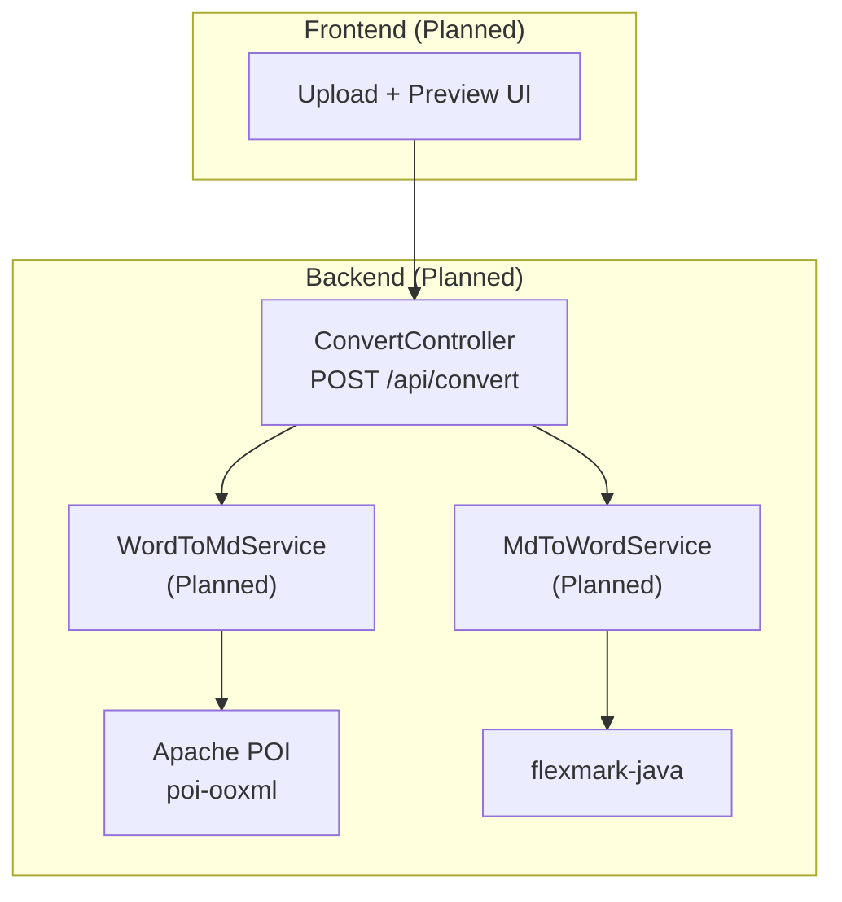
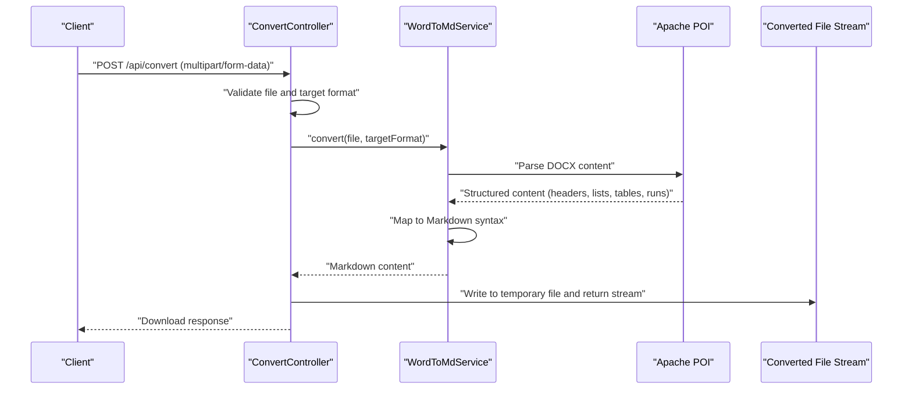
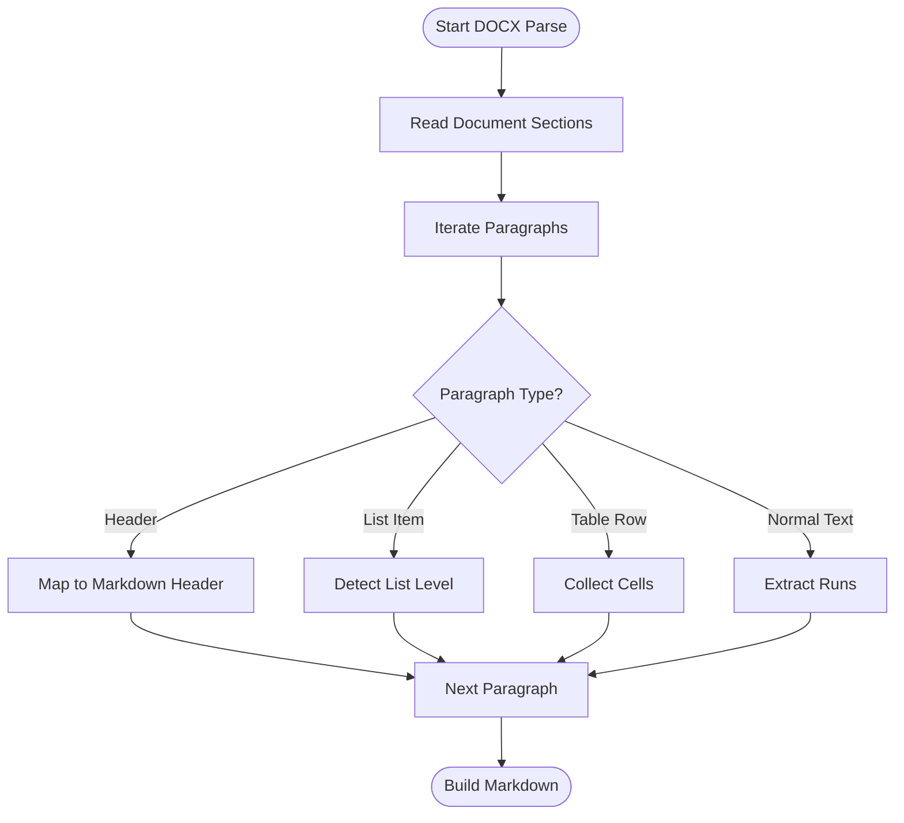
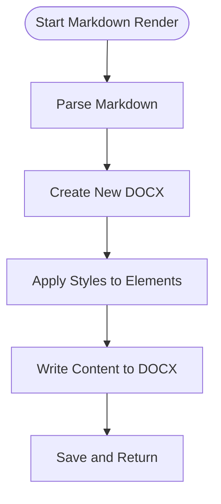
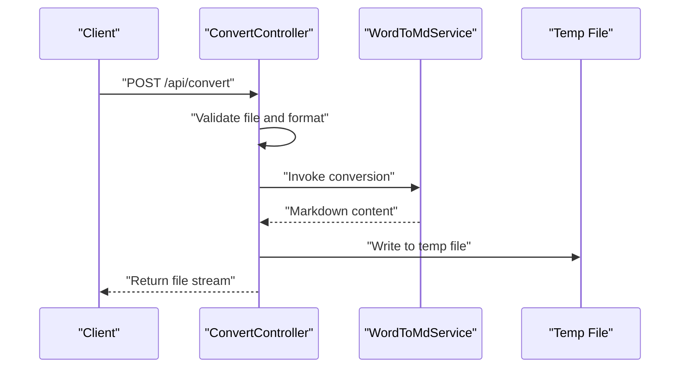
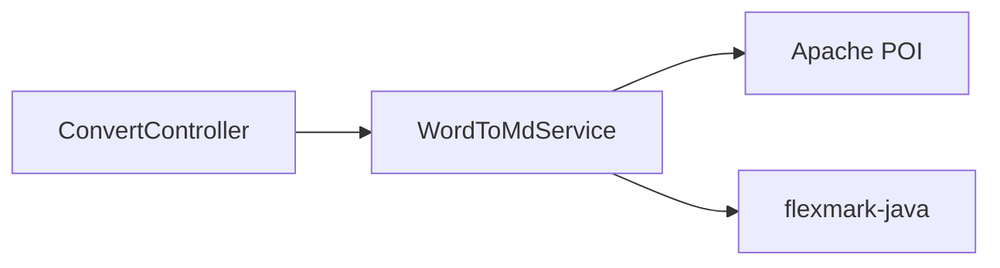

# Word (.docx) Processing

<cite>
**Referenced Files in This Document**
- [多格式文档互转工具 (SmartConvert) 需求文档.md](file://多格式文档互转工具 (SmartConvert) 需求文档.md)
</cite>

## Table of Contents
1. [Introduction](#introduction)
2. [Project Structure](#project-structure)
3. [Core Components](#core-components)
4. [Architecture Overview](#architecture-overview)
5. [Detailed Component Analysis](#detailed-component-analysis)
6. [Dependency Analysis](#dependency-analysis)
7. [Performance Considerations](#performance-considerations)
8. [Troubleshooting Guide](#troubleshooting-guide)
9. [Conclusion](#conclusion)
10. [Appendices](#appendices)

## Introduction
This document describes the Word (.docx) processing conversion module for SmartConvert, focusing on the bidirectional conversion between DOCX and Markdown. It explains how Apache POI is integrated for reading DOCX content and how the system extracts structured content such as headers, lists, tables, and bold text to produce equivalent Markdown syntax. The document also covers fallback mechanisms for unsupported formatting, troubleshooting common conversion issues, and performance considerations for large documents.

## Project Structure
The repository currently contains only the requirements and implementation roadmap. The Word processing module is planned to be implemented as part of the backend Spring Boot service, with Apache POI used for DOCX parsing and flexmark-java for Markdown handling.

**Section sources**
- [多格式文档互转工具 (SmartConvert) 需求文档.md: 67-71](file://多格式文档互转工具 (SmartConvert) 需求文档.md#L67-L71)
- [多格式文档互转工具 (SmartConvert) 需求文档.md: 145-161](file://多格式文档互转工具 (SmartConvert) 需求文档.md#L145-L161)

## Core Components
- ConvertController: Entry point for conversion requests. It receives uploaded files and target format, routes to the appropriate service, and returns the converted file stream.
- WordToMdService: Planned service to parse DOCX using Apache POI and generate Markdown. Focus areas include preserving headers, lists, tables, and bold text.
- MdToWordService: Planned service to render Markdown into DOCX using flexmark-java and Apache POI.
- Apache POI: Used for reading DOCX content and metadata.
- flexmark-java: Used for Markdown parsing and rendering.

Key conversion goals:
- Header preservation: Detect and map Word styles to Markdown headers (# to ######).
- List structure maintenance: Preserve ordered and unordered lists with nesting.
- Table formatting: Convert tables to Markdown table syntax while maintaining alignment and cell content.
- Bold text handling: Recognize and preserve strong emphasis formatting.

**Section sources**
- [多格式文档互转工具 (SmartConvert) 需求文档.md: 67-71](file://多格式文档互转工具 (SmartConvert) 需求文档.md#L67-L71)
- [多格式文档互转工具 (SmartConvert) 需求文档.md: 119-139](file://多格式文档互转工具 (SmartConvert) 需求文档.md#L119-L139)
- [多格式文档互转工具 (SmartConvert) 需求文档.md: 145-161](file://多格式文档互转工具 (SmartConvert) 需求文档.md#L145-L161)

## Architecture Overview
The conversion pipeline integrates Apache POI for DOCX parsing and flexmark-java for Markdown generation. The controller coordinates the process and returns the resulting file.

**Diagram sources**
- [多格式文档互转工具 (SmartConvert) 需求文档.md: 145-161](file://多格式文档互转工具 (SmartConvert) 需求文档.md#L145-L161)

## Detailed Component Analysis

### WordToMdService: DOCX Parsing and Markdown Generation
This service is responsible for:
- Reading DOCX content via Apache POI
- Extracting paragraphs, runs, and styles
- Converting headers, lists, tables, and inline formatting to Markdown

Parsing algorithm highlights:
- Headers: Map Word paragraph styles to Markdown headers based on outline levels.
- Lists: Traverse paragraph numbering to detect and preserve list hierarchy.
- Tables: Convert table rows and cells to Markdown table syntax.
- Inline formatting: Detect bold runs and wrap text accordingly.

**Section sources**
- [多格式文档互转工具 (SmartConvert) 需求文档.md: 67-71](file://多格式文档互转工具 (SmartConvert) 需求文档.md#L67-L71)

### MdToWordService: Markdown Rendering to DOCX
This service renders Markdown content into DOCX using flexmark-java and Apache POI. It ensures:
- Headers mapped to Word paragraph styles
- Lists preserved with numbering/bullets
- Tables rendered with proper structure
- Bold emphasis converted to Word runs

**Section sources**
- [多格式文档互转工具 (SmartConvert) 需求文档.md: 67-71](file://多格式文档互转工具 (SmartConvert) 需求文档.md#L67-L71)

### ConvertController: Request Routing and Response
The controller handles:
- File upload validation
- Target format routing
- Temporary file creation and download response

**Diagram sources**
- [多格式文档互转工具 (SmartConvert) 需求文档.md: 145-161](file://多格式文档互转工具 (SmartConvert) 需求文档.md#L145-L161)

## Dependency Analysis
- Apache POI (poi-ooxml): Provides DOCX parsing and content extraction.
- flexmark-java: Handles Markdown parsing and rendering.
- Spring Boot: Exposes REST endpoints and manages multipart uploads.

**Section sources**
- [多格式文档互转工具 (SmartConvert) 需求文档.md: 119-139](file://多格式文档互转工具 (SmartConvert) 需求文档.md#L119-L139)

## Performance Considerations
- Memory management: For large DOCX files, process content incrementally and avoid loading entire documents into memory. Use streaming-like approaches when feasible.
- Parallelization: Offload independent conversions to separate threads to improve throughput.
- Caching: Cache frequently accessed templates or styles to reduce repeated processing overhead.
- I/O optimization: Minimize disk writes by buffering and writing once per conversion.
- Timeout handling: Enforce conversion timeouts to prevent long-running operations from blocking resources.

[No sources needed since this section provides general guidance]

## Troubleshooting Guide
Common conversion issues and remedies:
- Unsupported formatting elements:
  - Symptom: Some styles or layout features are missing in Markdown.
  - Action: Implement fallbacks by treating unsupported runs as plain text or wrapping with comments in Markdown.
- Incorrect header levels:
  - Symptom: Headers appear at unexpected levels.
  - Action: Verify outline level mapping and ensure paragraph styles are correctly interpreted.
- List indentation anomalies:
  - Symptom: Nested lists render incorrectly.
  - Action: Inspect numbering levels and adjust indentation logic to match Markdown conventions.
- Table misalignment:
  - Symptom: Tables lose alignment or cell borders.
  - Action: Preserve cell alignment and use Markdown table syntax with explicit separators.
- Bold text not preserved:
  - Symptom: Strong emphasis disappears.
  - Action: Detect bold runs and wrap text accordingly in Markdown.

Fallback mechanisms:
- Graceful degradation: Convert unsupported elements to plain text with explanatory comments.
- Style normalization: Map unknown styles to nearest supported equivalents.
- Incremental conversion: Skip problematic sections and continue converting the rest of the document.

**Section sources**
- [多格式文档互转工具 (SmartConvert) 需求文档.md: 67-71](file://多格式文档互转工具 (SmartConvert) 需求文档.md#L67-L71)

## Conclusion
The Word (.docx) processing module is designed to deliver high-fidelity DOCX-to-Markdown and Markdown-to-Docx conversions using Apache POI and flexmark-java. By focusing on header preservation, list structure, table formatting, and bold text handling, and by implementing robust fallbacks and performance strategies, the module will provide a reliable foundation for SmartConvert’s document conversion capabilities.

[No sources needed since this section summarizes without analyzing specific files]

## Appendices

### Example Conversion Outcomes
- Complex Word layouts:
  - Multi-level headers: Converted to corresponding Markdown header levels.
  - Nested lists: Maintained with proper indentation and markers.
  - Mixed tables and text: Converted to Markdown tables with aligned columns.
  - Emphasis and mixed runs: Bold text preserved using Markdown strong emphasis.

[No sources needed since this section provides conceptual examples]