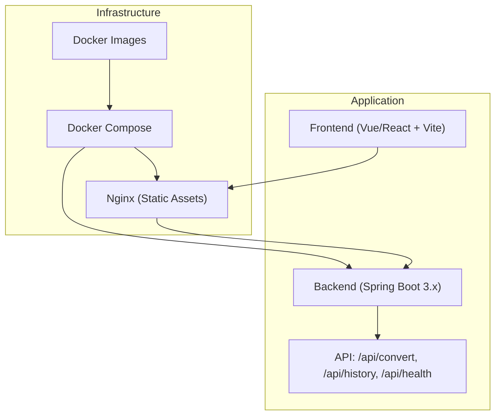
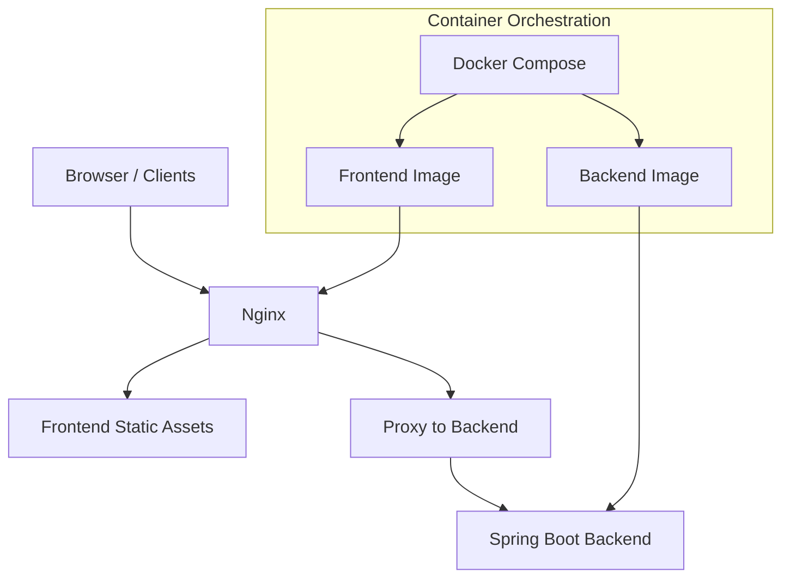
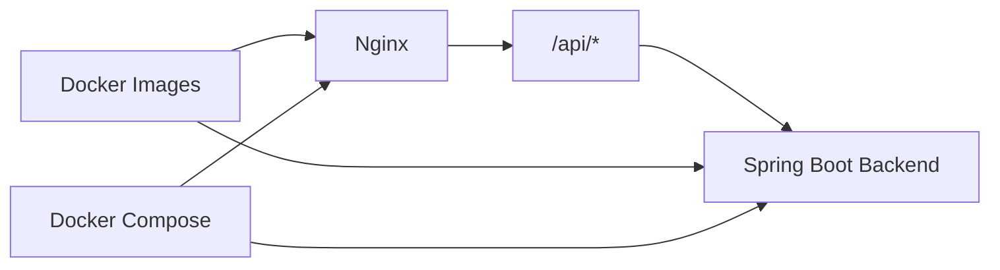

# Deployment and Operations

<cite>
**Referenced Files in This Document**
- [多格式文档互转工具 (SmartConvert) 需求文档.md](file://多格式文档互转工具 (SmartConvert) 需求文档.md)
</cite>

## Table of Contents
1. [Introduction](#introduction)
2. [Project Structure](#project-structure)
3. [Core Components](#core-components)
4. [Architecture Overview](#architecture-overview)
5. [Detailed Component Analysis](#detailed-component-analysis)
6. [Dependency Analysis](#dependency-analysis)
7. [Performance Considerations](#performance-considerations)
8. [Troubleshooting Guide](#troubleshooting-guide)
9. [Conclusion](#conclusion)
10. [Appendices](#appendices)

## Introduction
This document provides a comprehensive deployment and operations guide for the SmartConvert application. It focuses on containerized deployment using Docker and Docker Compose, Nginx configuration for frontend static resource routing, environment variable management, scaling considerations, infrastructure requirements, monitoring and logging, backup and update procedures, disaster recovery planning, and operational best practices. The guidance is derived from the project’s documented technology stack and deployment preferences.

## Project Structure
The repository contains a single requirement and design document that outlines the application’s frontend, backend, and deployment preferences. The document specifies:
- Frontend built with modern frameworks and tools
- Backend built with Spring Boot 3.x
- Containerization with Docker and Docker Compose
- Nginx for serving frontend static assets
- Health checks exposed via a dedicated endpoint

**Section sources**
- [多格式文档互转工具 (SmartConvert) 需求文档.md: 23-63](file://多格式文档互转工具 (SmartConvert) 需求文档.md#L23-L63)

## Core Components
- Frontend: Vue 3 or React with Vite, Tailwind CSS, and modern UI libraries. Static assets are served via Nginx.
- Backend: Spring Boot 3.x REST API exposing conversion endpoints and a health check.
- Containerization: Docker images orchestrated by Docker Compose.
- Nginx: Reverse proxy and static asset delivery for the frontend.

Key endpoints and capabilities:
- POST /api/convert: Converts uploaded files between supported formats.
- GET /api/history: Retrieves recent conversion history.
- GET /api/health: Health check endpoint for readiness/liveness probes.

**Section sources**
- [多格式文档互转工具 (SmartConvert) 需求文档.md: 39-63](file://多格式文档互转工具 (SmartConvert) 需求文档.md#L39-L63)
- [多格式文档互转工具 (SmartConvert) 需求文档.md: 93-100](file://多格式文档互转工具 (SmartConvert) 需求文档.md#L93-L100)

## Architecture Overview
The deployment architecture centers on a reverse-proxy Nginx layer serving frontend static assets and proxying API requests to the Spring Boot backend. Docker and Docker Compose orchestrate containers for both services, enabling scalable and repeatable deployments.

**Diagram sources**
- [多格式文档互转工具 (SmartConvert) 需求文档.md: 57-63](file://多格式文档互转工具 (SmartConvert) 需求文档.md#L57-L63)

## Detailed Component Analysis

### Containerized Deployment Strategy
- Use Docker images for both frontend and backend services.
- Use Docker Compose to define services, networks, volumes, and environment variables.
- Expose ports for Nginx and Spring Boot according to environment configuration.
- Persist logs and temporary conversion artifacts using named volumes or bind mounts.

Operational benefits:
- Reproducible environments across development, staging, and production.
- Isolation of services and simplified scaling.
- Centralized configuration via environment variables.

**Section sources**
- [多格式文档互转工具 (SmartConvert) 需求文档.md: 57-63](file://多格式文档互转工具 (SmartConvert) 需求文档.md#L57-L63)

### Nginx Setup for Frontend Static Resource Routing
- Serve frontend static assets directly from Nginx to reduce backend load.
- Configure proxying for API routes (/api/*) to the Spring Boot backend.
- Enable gzip compression and caching headers for static assets.
- Set up TLS termination and security headers as part of the Nginx configuration.

Health check integration:
- Nginx should forward health checks to the backend endpoint for readiness verification.

**Section sources**
- [多格式文档互转工具 (SmartConvert) 需求文档.md: 57-63](file://多格式文档互转工具 (SmartConvert) 需求文档.md#L57-L63)
- [多格式文档互转工具 (SmartConvert) 需求文档.md: 93-100](file://多格式文档互转工具 (SmartConvert) 需求文档.md#L93-L100)

### Environment Variable Management
- Define environment variables for:
  - Backend service port and host binding
  - File upload limits and temporary directory paths
  - Logging levels and external service endpoints
  - Nginx proxy targets and timeouts
- Use Docker Compose to inject environment variables into containers.
- Store secrets (e.g., API keys, tokens) in secure secret stores or encrypted configuration files.

Best practices:
- Separate environment-specific configurations (dev, staging, prod).
- Avoid committing secrets to version control.
- Use configuration validation during startup.

**Section sources**
- [多格式文档互转工具 (SmartConvert) 需求文档.md: 57-63](file://多格式文档互转工具 (SmartConvert) 需求文档.md#L57-L63)

### Scaling Considerations
- Stateless backend: Scale horizontally by adding more Spring Boot instances behind a load balancer.
- Stateless frontend: Scale Nginx instances behind a load balancer or CDN.
- Shared storage: Use a shared filesystem or object storage for temporary conversion artifacts if needed.
- Horizontal scaling:
  - Use a reverse proxy/load balancer to distribute traffic across multiple backend pods.
  - Ensure sticky sessions are not required for the API endpoints.

**Section sources**
- [多格式文档互转工具 (SmartConvert) 需求文档.md: 57-63](file://多格式文档互转工具 (SmartConvert) 需求文档.md#L57-L63)

### Infrastructure Requirements
- Compute:
  - Minimum CPU and memory for Nginx and Spring Boot based on expected concurrent conversions.
  - Provision headroom for peak loads and background conversion tasks.
- Storage:
  - Temporary file handling for uploads and intermediate conversions.
  - Persistent volumes for logs and optional audit trails.
- Network:
  - Allow inbound traffic on Nginx port(s).
  - Internal communication between Nginx and backend containers.
  - Outbound connectivity for optional external integrations (e.g., Pandoc bridge).
- Security:
  - Enforce HTTPS/TLS termination at Nginx.
  - Restrict inbound ports to necessary ranges.
  - Apply least privilege for container runtime and mounted volumes.

**Section sources**
- [多格式文档互转工具 (SmartConvert) 需求文档.md: 57-63](file://多格式文档互转工具 (SmartConvert) 需求文档.md#L57-L63)
- [多格式文档互转工具 (SmartConvert) 需求文档.md: 165-177](file://多格式文档互转工具 (SmartConvert) 需求文档.md#L165-L177)

### Monitoring and Logging Strategies
- Backend logging:
  - Structured JSON logs for centralized log aggregation (e.g., ELK/Fluentd).
  - Log levels tuned per environment (e.g., INFO in dev, WARN/ERROR in prod).
- Health checks:
  - Use GET /api/health for readiness/liveness probes.
  - Integrate with Kubernetes liveness/readiness probes or Docker healthcheck.
- Metrics:
  - Expose metrics endpoints (e.g., Micrometer) for conversion throughput and latency.
  - Dashboard with Grafana/Prometheus for alerting and capacity planning.
- Frontend monitoring:
  - Track Nginx access/error logs and response times.
  - Monitor API latency and error rates.

**Section sources**
- [多格式文档互转工具 (SmartConvert) 需求文档.md: 93-100](file://多格式文档互转工具 (SmartConvert) 需求文档.md#L93-L100)
- [多格式文档互转工具 (SmartConvert) 需求文档.md: 165-177](file://多格式文档互转工具 (SmartConvert) 需求文档.md#L165-L177)

### Backup Procedures
- Database backups (if applicable):
  - Schedule automated snapshots or logical backups.
  - Test restore procedures regularly.
- Artifact retention:
  - Configure cleanup policies for temporary conversion files.
  - Back up critical logs and audit trails to secure storage.
- Disaster recovery:
  - Maintain immutable backups offsite or in cloud storage.
  - Document RTO/RPO targets and recovery playbooks.

**Section sources**
- [多格式文档互转工具 (SmartConvert) 需求文档.md: 165-177](file://多格式文档互转工具 (SmartConvert) 需求文档.md#L165-L177)

### Update Deployment Processes
- Blue/green or rolling updates:
  - Gradually shift traffic to new backend instances.
  - Validate health checks before switching traffic.
- Zero-downtime deploys:
  - Ensure Nginx reloads configuration without dropping connections.
  - Use rolling restarts for backend services.
- Rollback:
  - Keep previous image tags for quick rollback.
  - Revert Nginx configuration changes if needed.

**Section sources**
- [多格式文档互转工具 (SmartConvert) 需求文档.md: 57-63](file://多格式文档互转工具 (SmartConvert) 需求文档.md#L57-L63)

### Disaster Recovery Planning
- Multi-zone deployments:
  - Distribute services across availability zones.
- Failover:
  - Route traffic to healthy replicas automatically.
- Recovery drills:
  - Practice failover scenarios and measure recovery times.
- Documentation:
  - Maintain runbooks for incident response and recovery steps.

[No sources needed since this section provides general guidance]

### Practical Examples
- Docker Compose services:
  - Define frontend, backend, and Nginx services with environment variables and volume mounts.
- Health check implementation:
  - Use GET /api/health for readiness/liveness probes.
- Load balancing:
  - Place a reverse proxy/load balancer in front of multiple backend instances.
- High availability:
  - Run multiple replicas of Nginx and backend services behind a load balancer.

[No sources needed since this section provides general guidance]

## Dependency Analysis
The application’s deployment depends on:
- Nginx for static asset delivery and API proxying
- Spring Boot backend for conversion APIs and health checks
- Docker and Docker Compose for container orchestration
- Environment variables for configuration and secrets injection

**Diagram sources**
- [多格式文档互转工具 (SmartConvert) 需求文档.md: 57-63](file://多格式文档互转工具 (SmartConvert) 需求文档.md#L57-L63)
- [多格式文档互转工具 (SmartConvert) 需求文档.md: 93-100](file://多格式文档互转工具 (SmartConvert) 需求文档.md#L93-L100)

**Section sources**
- [多格式文档互转工具 (SmartConvert) 需求文档.md: 57-63](file://多格式文档互转工具 (SmartConvert) 需求文档.md#L57-L63)
- [多格式文档互转工具 (SmartConvert) 需求文档.md: 93-100](file://多格式文档互转工具 (SmartConvert) 需求文档.md#L93-L100)

## Performance Considerations
- Optimize Nginx:
  - Enable gzip, cache static assets, and tune worker processes and connections.
- Backend tuning:
  - Adjust JVM heap size and thread pools for Spring Boot.
  - Limit concurrent conversions and set upload limits to prevent resource exhaustion.
- Caching:
  - Use CDN for static assets and consider caching for frequently accessed API responses.
- Load balancing:
  - Distribute traffic across multiple backend instances.
- Observability:
  - Monitor conversion latency and throughput; alert on degradation.

[No sources needed since this section provides general guidance]

## Troubleshooting Guide
Common deployment issues and resolutions:
- Health check failures:
  - Verify GET /api/health responds correctly; check backend logs for errors.
- Nginx proxy errors:
  - Confirm proxy_pass targets and timeouts; review Nginx error logs.
- File upload problems:
  - Check upload size limits and temporary directory permissions.
- Port conflicts:
  - Ensure Nginx and backend ports are not already in use.
- Scaling issues:
  - Validate load balancer configuration and health checks.

**Section sources**
- [多格式文档互转工具 (SmartConvert) 需求文档.md: 93-100](file://多格式文档互转工具 (SmartConvert) 需求文档.md#L93-L100)
- [多格式文档互转工具 (SmartConvert) 需求文档.md: 165-177](file://多格式文档互转工具 (SmartConvert) 需求文档.md#L165-L177)

## Conclusion
This guide consolidates the deployment and operations strategy for SmartConvert based on the documented technology stack and deployment preferences. By leveraging Docker and Docker Compose, Nginx for static assets and API proxying, robust environment variable management, and strong monitoring/logging practices, teams can achieve reliable, scalable, and secure deployments. Operational excellence is achieved through careful planning for scaling, backups, updates, and disaster recovery.

[No sources needed since this section summarizes without analyzing specific files]

## Appendices
- Example health check endpoint: GET /api/health
- Example API endpoints: POST /api/convert, GET /api/history
- Containerization preference: Docker and Docker Compose
- Infrastructure preference: Nginx for frontend static resources

**Section sources**
- [多格式文档互转工具 (SmartConvert) 需求文档.md: 57-63](file://多格式文档互转工具 (SmartConvert) 需求文档.md#L57-L63)
- [多格式文档互转工具 (SmartConvert) 需求文档.md: 93-100](file://多格式文档互转工具 (SmartConvert) 需求文档.md#L93-L100)