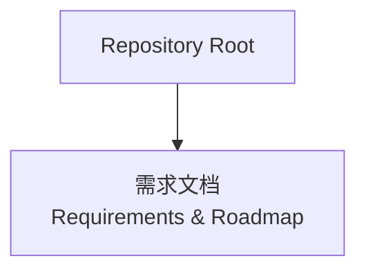
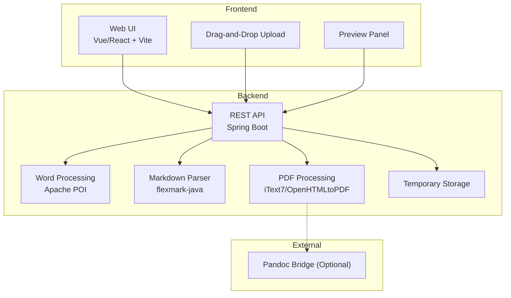
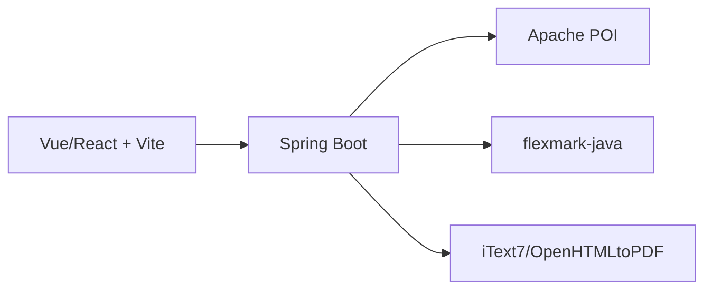

# Development Roadmap

<cite>
**Referenced Files in This Document**
- [多格式文档互转工具 (SmartConvert) 需求文档.md](file://多格式文档互转工具 (SmartConvert) 需求文档.md)
</cite>

## Table of Contents
1. [Introduction](#introduction)
2. [Project Structure](#project-structure)
3. [Core Components](#core-components)
4. [Architecture Overview](#architecture-overview)
5. [Detailed Component Analysis](#detailed-component-analysis)
6. [Dependency Analysis](#dependency-analysis)
7. [Performance Considerations](#performance-considerations)
8. [Troubleshooting Guide](#troubleshooting-guide)
9. [Conclusion](#conclusion)
10. [Appendices](#appendices)

## Introduction
This document presents a comprehensive development roadmap for SmartConvert, a web-based multi-format document conversion tool that transforms between Word, PDF, Text, and Markdown. The roadmap outlines five implementation phases aligned with the project’s task decomposition, including environment setup, core conversion algorithms, frontend prototyping, backend-frontend integration, and UI refinement plus deployment. It also provides milestone tracking, resource allocation guidance, dependency mapping, risk mitigation strategies, and practical QA/testing recommendations to support team coordination and delivery.

## Project Structure
The repository currently contains a single requirement and design document that defines the product vision, technology stack, functional scope, and high-level roadmap. The document serves as the blueprint for building the full-stack application, including frontend frameworks, backend technologies, and conversion capabilities.

**Diagram sources**
- [多格式文档互转工具 (SmartConvert) 需求文档.md:1-194](file://多格式文档互转工具 (SmartConvert) 需求文档.md#L1-L194)

**Section sources**
- [多格式文档互转工具 (SmartConvert) 需求文档.md:1-194](file://多格式文档互转工具 (SmartConvert) 需求文档.md#L1-L194)

## Core Components
The SmartConvert solution comprises:
- Frontend: Vue 3 or React with Vite, Element Plus/Ant Design, Tailwind CSS, Pinia/Redux Toolkit, and animation libraries.
- Backend: Spring Boot 3.x with Apache POI for Word, flexmark-java for Markdown parsing, iText7 or OpenHTMLtoPDF for PDF, and optional Pandoc bridge.
- API: REST endpoints for conversion, history, and health checks.
- Deployment: Docker and Docker Compose with Nginx for static assets.

These components align with the roadmap phases and define the technical foundation for each phase’s deliverables.

**Section sources**
- [多格式文档互转工具 (SmartConvert) 需求文档.md:23-63](file://多格式文档互转工具 (SmartConvert) 需求文档.md#L23-L63)
- [多格式文档互转工具 (SmartConvert) 需求文档.md:93-100](file://多格式文档互转工具 (SmartConvert) 需求文档.md#L93-L100)

## Architecture Overview
The system follows a classic full-stack architecture with a frontend SPA communicating with a Spring Boot backend via REST APIs. Conversion logic is encapsulated in backend services that leverage specialized libraries for each format.

**Diagram sources**
- [多格式文档互转工具 (SmartConvert) 需求文档.md:23-63](file://多格式文档互转工具 (SmartConvert) 需求文档.md#L23-L63)
- [多格式文档互转工具 (SmartConvert) 需求文档.md:93-100](file://多格式文档互转工具 (SmartConvert) 需求文档.md#L93-L100)

## Detailed Component Analysis

### Phase 1: Environment Setup and Spring Boot Skeleton Creation with File Processing Library Integration
Objective:
- Establish development environments for frontend and backend.
- Scaffold the Spring Boot backend with REST controllers and basic configuration.
- Integrate core file-processing libraries (Apache POI, flexmark-java, iText7/OpenHTMLtoPDF).
- Implement initial upload handling and temporary file management.

Deliverables:
- Working local development stacks for Vue/React and Spring Boot.
- Basic ConvertController endpoint accepting multipart uploads.
- Initial service wiring for Word, Markdown, and PDF processing.
- Health check endpoint and basic error handling.

Milestones:
- Week 1: Environment setup and dependency injection.
- Week 2: Controller scaffolding and upload pipeline.

Resource Allocation:
- Backend developer(s): 1–2 engineers for Spring Boot setup and library integration.
- DevOps engineer: 1 engineer for Docker and CI/CD baseline.

Risk Mitigation:
- Use standardized Spring Boot starters and Maven dependency versions to reduce integration friction.
- Implement strict file type validation and size limits early to prevent runtime errors.

Testing and QA:
- Unit tests for controller endpoints and service wiring.
- Manual smoke tests for upload and download flows.

**Section sources**
- [多格式文档互转工具 (SmartConvert) 需求文档.md:179-189](file://多格式文档互转工具 (SmartConvert) 需求文档.md#L179-L189)
- [多格式文档互转工具 (SmartConvert) 需求文档.md:39-63](file://多格式文档互转工具 (SmartConvert) 需求文档.md#L39-L63)
- [多格式文档互转工具 (SmartConvert) 需求文档.md:93-100](file://多格式文档互转工具 (SmartConvert) 需求文档.md#L93-L100)

### Phase 2: Core Word/Text to Markdown Conversion Algorithms
Objective:
- Implement robust conversion logic for Word (.docx) to Markdown and Text to Markdown.
- Preserve structural elements such as headings, lists, tables, bold, and hyperlinks.
- Ensure deterministic output and handle edge cases (empty documents, malformed content).

Deliverables:
- WordToMdService with extraction and transformation logic.
- TextToMdService with normalization and wrapping logic.
- Comprehensive test coverage for typical and edge cases.

Milestones:
- Week 3: Word parsing and basic Markdown emission.
- Week 4: Text normalization and Markdown wrapping.
- Week 5: Refinement and cross-format validation.

Resource Allocation:
- Backend developer(s): 1–2 engineers for conversion algorithms.
- QA engineer: 1 engineer for regression testing.

Risk Mitigation:
- Use Apache POI best practices for reading docx content and guard against malformed files.
- Normalize whitespace and special characters to ensure Markdown validity.

Testing and QA:
- Automated unit tests for each conversion path.
- Manual validation with representative Word and Text samples.

**Section sources**
- [多格式文档互转工具 (SmartConvert) 需求文档.md:67-80](file://多格式文档互转工具 (SmartConvert) 需求文档.md#L67-L80)
- [多格式文档互转工具 (SmartConvert) 需求文档.md:43-51](file://多格式文档互转工具 (SmartConvert) 需求文档.md#L43-L51)

### Phase 3: Frontend Prototype Development (Drag-and-Drop Components and Preview)
Objective:
- Build the frontend prototype with drag-and-drop upload area and real-time preview panels.
- Implement theme switching (light/dark mode) and progress feedback.
- Enable batch upload and download packaging.

Deliverables:
- Drag-and-drop upload component with visual feedback.
- Real-time Markdown preview panel synchronized with input.
- Progress indicators and toast notifications.
- Batch selection and download UX.

Milestones:
- Week 6: Drag-and-drop and upload UX.
- Week 7: Real-time preview and theme toggle.
- Week 8: Batch handling and packaging.

Resource Allocation:
- Frontend developer(s): 1–2 engineers for UI components and state management.
- UI/UX designer: 1 designer for visual polish and accessibility.

Risk Mitigation:
- Validate drag-and-drop behavior across browsers and devices.
- Ensure preview updates efficiently without blocking the UI thread.

Testing and QA:
- Cross-browser testing for drag-and-drop and preview rendering.
- Accessibility audits and keyboard navigation checks.

**Section sources**
- [多格式文档互转工具 (SmartConvert) 需求文档.md:81-92](file://多格式文档互转工具 (SmartConvert) 需求文档.md#L81-L92)
- [多格式文档互转工具 (SmartConvert) 需求文档.md:25-38](file://多格式文档互转工具 (SmartConvert) 需求文档.md#L25-L38)

### Phase 4: Backend-Frontend Integration and PDF Styling Compatibility Challenges
Objective:
- Integrate frontend with backend conversion endpoints.
- Implement PDF conversion (PDF to Markdown and Markdown to PDF) and address styling compatibility.
- Add health check and history endpoints.

Deliverables:
- End-to-end conversion flow from upload to download.
- PDF conversion with emphasis on layout fidelity and code highlighting.
- History endpoint for recent conversions.

Milestones:
- Week 9: PDF ingestion and extraction pipeline.
- Week 10: Markdown emission from PDF and PDF export with styling.
- Week 11: Integration testing and bug fixes.

Resource Allocation:
- Full-stack developer(s): 1–2 engineers for integration and PDF handling.
- DevOps engineer: 1 engineer for environment parity and monitoring.

Risk Mitigation:
- Use iText7/OpenHTMLtoPDF best practices for text extraction and rendering.
- Implement fallbacks for complex layouts and unsupported styles.

Testing and QA:
- End-to-end integration tests for upload, conversion, and download.
- Regression tests for PDF styling edge cases.

**Section sources**
- [多格式文档互转工具 (SmartConvert) 需求文档.md:67-80](file://多格式文档互转工具 (SmartConvert) 需求文档.md#L67-L80)
- [多格式文档互转工具 (SmartConvert) 需求文档.md:39-63](file://多格式文档互转工具 (SmartConvert) 需求文档.md#L39-L63)
- [多格式文档互转工具 (SmartConvert) 需求文档.md:93-100](file://多格式文档互转工具 (SmartConvert) 需求文档.md#L93-L100)

### Phase 5: UI Refinement and Production Deployment
Objective:
- Polish UI/UX with micro-interactions, animations, and responsive design.
- Finalize deployment with Docker, Nginx, and monitoring.
- Conduct load testing and security hardening.

Deliverables:
- Refined UI with Tailwind CSS and animation libraries.
- Production-ready Docker images and compose configurations.
- Health monitoring and scheduled cleanup of temporary files.

Milestones:
- Week 12: UI polish and micro-interactions.
- Week 13: Security review and load testing.
- Week 14: Deployment and go-live.

Resource Allocation:
- Frontend developer(s): 1 engineer for final polish.
- DevOps engineer: 1 engineer for deployment and monitoring.
- QA engineer: 1 engineer for performance and security testing.

Risk Mitigation:
- Harden file upload validation and enforce size limits.
- Schedule periodic cleanup of temporary files.

Testing and QA:
- Load testing under realistic concurrency.
- Security scanning and penetration testing.

**Section sources**
- [多格式文档互转工具 (SmartConvert) 需求文档.md:103-111](file://多格式文档互转工具 (SmartConvert) 需求文档.md#L103-L111)
- [多格式文档互转工具 (SmartConvert) 需求文档.md:57-63](file://多格式文档互转工具 (SmartConvert) 需求文档.md#L57-L63)
- [多格式文档互转工具 (SmartConvert) 需求文档.md:165-177](file://多格式文档互转工具 (SmartConvert) 需求文档.md#L165-L177)

## Dependency Analysis
Key dependencies and their roles:
- Apache POI: Word (.docx) parsing and metadata extraction.
- flexmark-java: Markdown parsing and AST manipulation for transformations.
- iText7/OpenHTMLtoPDF: PDF text extraction and HTML-to-PDF rendering.
- Spring Boot: REST API framework, dependency injection, and scheduling.
- Frontend stack: Vue/React ecosystem with Vite, UI libraries, and state management.

**Diagram sources**
- [多格式文档互转工具 (SmartConvert) 需求文档.md:43-51](file://多格式文档互转工具 (SmartConvert) 需求文档.md#L43-L51)
- [多格式文档互转工具 (SmartConvert) 需求文档.md:25-38](file://多格式文档互转工具 (SmartConvert) 需求文档.md#L25-L38)

**Section sources**
- [多格式文档互转工具 (SmartConvert) 需求文档.md:43-51](file://多格式文档互转工具 (SmartConvert) 需求文档.md#L43-L51)

## Performance Considerations
- Target conversion latency under 3 seconds for documents up to 10 MB.
- Optimize PDF text extraction and Markdown rendering pipelines.
- Use streaming responses for large file downloads to reduce memory pressure.
- Implement caching for frequently accessed templates and styles.

[No sources needed since this section provides general guidance]

## Troubleshooting Guide
Common issues and mitigations:
- Upload failures: Validate file types and sizes at the controller boundary; sanitize filenames; log errors with correlation IDs.
- Conversion errors: Wrap conversion logic with try-catch blocks; return structured error responses; maintain retry policies for transient failures.
- PDF styling mismatches: Use configurable styling options and fallback rendering; log extraction anomalies for triage.
- Temporary file accumulation: Schedule cleanup tasks and enforce quotas; monitor disk usage.

**Section sources**
- [多格式文档互转工具 (SmartConvert) 需求文档.md:169-177](file://多格式文档互转工具 (SmartConvert) 需求文档.md#L169-L177)

## Conclusion
This roadmap aligns the SmartConvert development lifecycle with clear phases, milestones, and deliverables. By integrating the frontend and backend in Phases 3–4, addressing PDF styling compatibility, and refining the UI in Phase 5, the team can achieve a robust, high-quality product. Adhering to the outlined risk mitigation strategies, resource allocations, and QA/testing practices will improve predictability and reduce technical debt.

[No sources needed since this section summarizes without analyzing specific files]

## Appendices
- API Endpoint Reference:
  - POST /api/convert: Accepts file and target format; returns converted file stream or download link.
  - GET /api/history: Retrieves recent conversion records.
  - GET /api/health: Returns system health status.

**Section sources**
- [多格式文档互转工具 (SmartConvert) 需求文档.md:93-100](file://多格式文档互转工具 (SmartConvert) 需求文档.md#L93-L100)