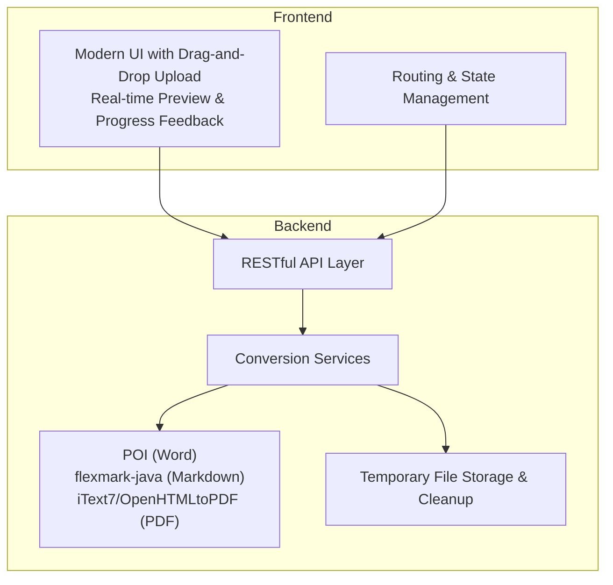
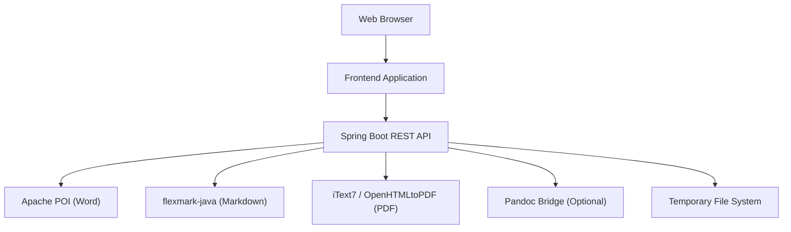
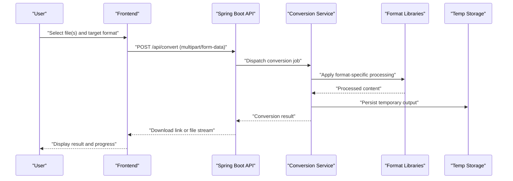
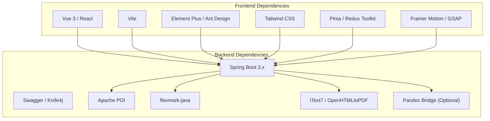

# Project Overview

<cite>
**Referenced Files in This Document**
- [多格式文档互转工具 (SmartConvert) 需求文档.md](file://多格式文档互转工具 (SmartConvert) 需求文档.md)
</cite>

## Table of Contents
1. [Introduction](#introduction)
2. [Project Structure](#project-structure)
3. [Core Components](#core-components)
4. [Architecture Overview](#architecture-overview)
5. [Detailed Component Analysis](#detailed-component-analysis)
6. [Dependency Analysis](#dependency-analysis)
7. [Performance Considerations](#performance-considerations)
8. [Troubleshooting Guide](#troubleshooting-guide)
9. [Conclusion](#conclusion)

## Introduction
SmartConvert is a web-based document format conversion platform designed to enable seamless bidirectional transformations among Word, PDF, Text, and Markdown formats. Its primary goal is to deliver a high-fidelity conversion experience with a modern, responsive user interface and a high-performance backend processing engine. The tool targets developers, writers, and students who need efficient, reliable document format conversions without the complexity of desktop applications.

Key value propositions:
- High-fidelity format conversion preserving essential document elements such as headings, lists, tables, and basic styling.
- Modern, responsive UI with real-time preview, drag-and-drop upload, progress feedback, and batch processing support.
- Robust backend built on Spring Boot for scalable, production-ready processing of diverse document formats.

Practical examples:
- Converting a research paper from Word to Markdown while retaining headings and citations for academic writing.
- Transforming a PDF report into Markdown for editing in a lightweight editor, then exporting back to PDF with code highlighting.
- Quickly converting multiple text files into a structured Markdown archive for documentation projects.

**Section sources**
- [多格式文档互转工具 (SmartConvert) 需求文档.md:11-19](file://多格式文档互转工具 (SmartConvert) 需求文档.md#L11-L19)

## Project Structure
The project follows a full-stack architecture with clear separation between frontend and backend components. The frontend emphasizes a modern, responsive UI with real-time preview and interactive feedback. The backend is centered around Spring Boot, integrating specialized libraries for handling Word, PDF, and Markdown conversions.

High-level structure overview:
- Frontend: Vue 3 or React with Vite build tool, Element Plus/Ant Design UI components, Tailwind CSS for styling, Pinia/Redux Toolkit for state management, and animation libraries for micro-interactions.
- Backend: Spring Boot 3.x with Swagger/Knife4j for API documentation, Apache POI for Word processing, flexmark-java for Markdown parsing, and itext7/OpenHTMLtoPDF for PDF handling. Optional Pandoc bridge can be used for advanced conversions.

**Section sources**
- [多格式文档互转工具 (SmartConvert) 需求文档.md:23-63](file://多格式文档互转工具 (SmartConvert) 需求文档.md#L23-L63)

## Core Components
SmartConvert’s core objectives align with its component design:
- High-fidelity format conversion: Implemented through dedicated libraries for each format (Word, PDF, Markdown) to preserve structural elements during transformations.
- Responsive modern UI: Built with contemporary frameworks and design systems to ensure cross-device usability and aesthetic appeal.
- High-performance backend engine: Powered by Spring Boot to handle concurrent requests, manage temporary files, and provide health checks and API documentation.

Target audience:
- Developers: Need reliable format conversions for documentation, code samples, and technical writing.
- Writers: Require flexible editing workflows between Word, Markdown, and PDF for drafting and publishing.
- Students: Benefit from quick conversions for assignments, notes, and study materials.

Bidirectional conversion capabilities:
- Word ↔ Markdown: Preserve headings, lists, tables, and bold formatting.
- PDF ↔ Markdown: Extract text content with hierarchical structure (PDF to Markdown) and render Markdown with code highlighting into polished PDFs (Markdown to PDF).
- Text ↔ Markdown: Wrap plain text into Markdown or strip Markdown formatting to plain text.

**Section sources**
- [多格式文档互转工具 (SmartConvert) 需求文档.md:65-101](file://多格式文档互转工具 (SmartConvert) 需求文档.md#L65-L101)

## Architecture Overview
The system architecture employs a client-server model with a clear separation of concerns:
- Frontend handles user interactions, file uploads, real-time previews, and progress indicators.
- Backend exposes REST APIs for conversion, manages file processing, and integrates specialized libraries for each format.
- Optional integration with Pandoc enables advanced conversion scenarios when higher fidelity is required.

**Diagram sources**
- [多格式文档互转工具 (SmartConvert) 需求文档.md:39-56](file://多格式文档互转工具 (SmartConvert) 需求文档.md#L39-L56)

## Detailed Component Analysis
### Frontend Experience
- Drag-and-drop upload area with visual feedback and progress indicators.
- Real-time preview window for Markdown transformations (left-side editor, right-side preview).
- Dark/light theme toggle for improved accessibility and user preference support.
- Batch processing capability to upload multiple files and download them as a package.

### Backend Processing Engine
- REST endpoint for conversions with file and target format parameters.
- Health check endpoint for monitoring service availability.
- Scheduled cleanup of temporary files to prevent storage accumulation.
- Optional Pandoc bridge for advanced conversions requiring external tooling.

**Diagram sources**
- [多格式文档互转工具 (SmartConvert) 需求文档.md:93-101](file://多格式文档互转工具 (SmartConvert) 需求文档.md#L93-L101)

**Section sources**
- [多格式文档互转工具 (SmartConvert) 需求文档.md:81-101](file://多格式文档互转工具 (SmartConvert) 需求文档.md#L81-L101)
- [多格式文档互转工具 (SmartConvert) 需求文档.md:141-161](file://多格式文档互转工具 (SmartConvert) 需求文档.md#L141-L161)

## Dependency Analysis
SmartConvert’s technology stack is intentionally modular to balance performance, maintainability, and extensibility:
- Frontend: Vue 3/React with Vite ensures fast builds and modern development ergonomics; Element Plus/Ant Design and Tailwind CSS provide consistent UI components and styling.
- Backend: Spring Boot 3.x offers robust enterprise-grade features; Swagger/Knife4j simplifies API discovery and testing; Apache POI, flexmark-java, and iText7/OpenHTMLtoPDF encapsulate format-specific logic.
- Optional integration: Pandoc bridge can be enabled for scenarios demanding advanced conversion fidelity.

**Diagram sources**
- [多格式文档互转工具 (SmartConvert) 需求文档.md:23-56](file://多格式文档互转工具 (SmartConvert) 需求文档.md#L23-L56)

**Section sources**
- [多格式文档互转工具 (SmartConvert) 需求文档.md:23-56](file://多格式文档互转工具 (SmartConvert) 需求文档.md#L23-L56)

## Performance Considerations
- Target performance: Single document conversions under 10 MB should complete within 3 seconds.
- Backend optimizations: Efficient temporary file handling, scheduled cleanup tasks, and library-specific tuning for each format.
- Frontend responsiveness: Debounced input handling, lazy loading for previews, and minimal re-renders for smooth user experience.

## Troubleshooting Guide
Common operational issues and mitigations:
- Conversion failures: Verify supported file extensions and ensure the selected target format is compatible with the source file type.
- Slow conversions: Reduce file size, close unnecessary browser tabs, and confirm backend resources are adequate.
- Temporary file accumulation: Confirm scheduled cleanup jobs are active and storage permissions are configured correctly.
- CORS or API errors: Validate frontend-to-backend routing and ensure the API base URL is correctly configured.

**Section sources**
- [多格式文档互转工具 (SmartConvert) 需求文档.md:165-177](file://多格式文档互转工具 (SmartConvert) 需求文档.md#L165-L177)

## Conclusion
SmartConvert delivers a modern, efficient solution for multi-format document conversion with a focus on high-fidelity output, intuitive user experience, and scalable backend processing. By combining specialized format libraries with a responsive frontend and robust Spring Boot infrastructure, it serves developers, writers, and students who require reliable, fast, and flexible document transformations.