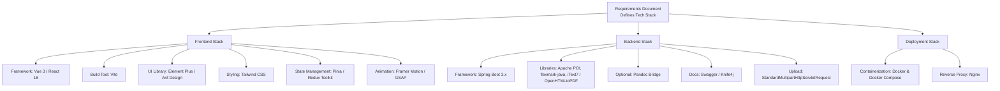
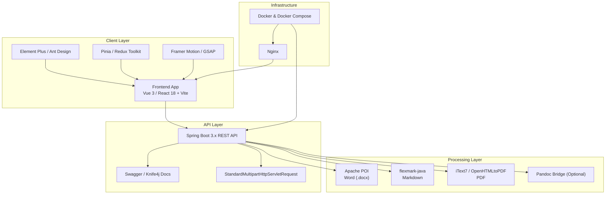
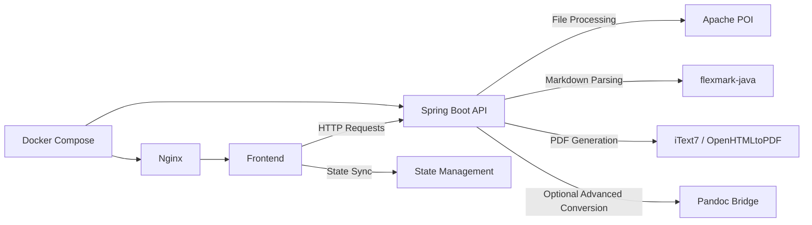

# Technology Stack

<cite>
**Referenced Files in This Document**
- [多格式文档互转工具 (SmartConvert) 需求文档.md](file://多格式文档互转工具 (SmartConvert) 需求文档.md)
</cite>

## Table of Contents
1. [Introduction](#introduction)
2. [Project Structure](#project-structure)
3. [Core Components](#core-components)
4. [Architecture Overview](#architecture-overview)
5. [Detailed Component Analysis](#detailed-component-analysis)
6. [Dependency Analysis](#dependency-analysis)
7. [Performance Considerations](#performance-considerations)
8. [Troubleshooting Guide](#troubleshooting-guide)
9. [Conclusion](#conclusion)

## Introduction
This document presents the technology stack for SmartConvert, a modern full-stack web application designed to convert documents among Word, PDF, Text, and Markdown formats. The stack emphasizes developer productivity, responsive UI/UX, high-fidelity conversions, and robust deployment. It covers frontend frameworks and tooling, backend processing engines, and deployment infrastructure, along with integration patterns and rationale for each choice.

## Project Structure
The repository currently includes a requirements document that defines the technology stack and functional scope. The document outlines the frontend, backend, and deployment technologies, as well as conversion capabilities and UI/UX expectations.

**Diagram sources**
- [多格式文档互转工具 (SmartConvert) 需求文档.md:23-63](file://多格式文档互转工具 (SmartConvert) 需求文档.md#L23-L63)

**Section sources**
- [多格式文档互转工具 (SmartConvert) 需求文档.md:23-63](file://多格式文档互转工具 (SmartConvert) 需求文档.md#L23-L63)

## Core Components
This section details each major component of the stack and how they contribute to SmartConvert’s goals.

- Frontend
  - Framework: Vue 3 Composition API or React 18 for modern component architectures and reactive updates.
  - Build Tool: Vite for fast development server and optimized production builds.
  - UI Library: Element Plus for Vue or Ant Design for React to accelerate UI development with consistent components.
  - Styling: Tailwind CSS for utility-first styling and rapid customization of UI themes.
  - State Management: Pinia for Vue or Redux Toolkit for React to manage global application state efficiently.
  - Animation: Framer Motion or GSAP for smooth transitions and micro-interactions.

- Backend
  - Framework: Spring Boot 3.x for modern Java development, strong ecosystem, and excellent tooling.
  - Libraries:
    - Apache POI for Word (.docx) processing.
    - flexmark-java for Markdown parsing and rendering.
    - iText7 or OpenHTMLtoPDF for PDF generation/manipulation.
    - Optional Pandoc bridge for advanced conversions via system calls.
  - Documentation: Swagger or Knife4j for API documentation.
  - Upload: Spring StandardMultipartHttpServletRequest for multipart file handling.

- Deployment
  - Containerization: Docker and Docker Compose for reproducible environments and service orchestration.
  - Reverse Proxy: Nginx for serving frontend static assets and proxying backend requests.

**Section sources**
- [多格式文档互转工具 (SmartConvert) 需求文档.md:25-61](file://多格式文档互转工具 (SmartConvert) 需求文档.md#L25-L61)

## Architecture Overview
The architecture separates concerns across frontend, backend, and deployment layers. The frontend provides a responsive UI with real-time previews and drag-and-drop uploads. The backend exposes conversion APIs and integrates specialized libraries for each format. The deployment stack ensures scalability and reliability.

**Diagram sources**
- [多格式文档互转工具 (SmartConvert) 需求文档.md:25-61](file://多格式文档互转工具 (SmartConvert) 需求文档.md#L25-L61)

## Detailed Component Analysis

### Frontend Stack
- Framework: Vue 3 Composition API or React 18 enables reactive UIs and component composition. Both offer strong ecosystem support and performance characteristics suitable for interactive document editing and preview.
- Build Tool: Vite delivers fast cold starts and hot module replacement, accelerating development cycles.
- UI Library: Element Plus for Vue and Ant Design for React provide ready-to-use components aligned with modern design systems.
- Styling: Tailwind CSS allows rapid prototyping and consistent theming with utility classes.
- State Management: Pinia for Vue and Redux Toolkit for React streamline global state handling and improve maintainability.
- Animation: Framer Motion or GSAP enhance UX with smooth transitions and micro-interactions.

Integration patterns:
- Drag-and-drop upload area integrated with state management to reflect progress and results.
- Real-time preview panels synchronized with editor state.
- Theme switching coordinated via shared state and Tailwind utilities.

**Section sources**
- [多格式文档互转工具 (SmartConvert) 需求文档.md:25-37](file://多格式文档互转工具 (SmartConvert) 需求文档.md#L25-L37)

### Backend Stack
- Framework: Spring Boot 3.x offers modern Java features, auto-configuration, and extensive integrations for building REST APIs.
- Libraries:
  - Apache POI handles Word (.docx) parsing and generation.
  - flexmark-java parses and renders Markdown reliably.
  - iText7 or OpenHTMLtoPDF generates and manipulates PDFs.
  - Optional Pandoc bridge can be invoked for advanced conversions when needed.
- Documentation: Swagger or Knife4j for interactive API documentation.
- Upload: StandardMultipartHttpServletRequest for robust multipart file handling.

API surface:
- POST /api/convert: Converts uploaded files between supported formats and returns downloadable resources.
- GET /api/history: Retrieves recent conversion history (session/local storage).
- GET /api/health: Health check endpoint.

**Section sources**
- [多格式文档互转工具 (SmartConvert) 需求文档.md:39-56](file://多格式文档互转工具 (SmartConvert) 需求文档.md#L39-L56)
- [多格式文档互转工具 (SmartConvert) 需求文档.md:93-99](file://多格式文档互转工具 (SmartConvert) 需求文档.md#L93-L99)

### Deployment Stack
- Containerization: Docker images encapsulate the backend service and frontend build artifacts; Docker Compose orchestrates services and volumes.
- Reverse Proxy: Nginx serves frontend static assets and proxies API requests to the backend, enabling HTTPS termination and load distribution.

Operational benefits:
- Reproducible environments across development, staging, and production.
- Scalable deployment with container orchestration.
- Centralized routing and asset delivery.

**Section sources**
- [多格式文档互转工具 (SmartConvert) 需求文档.md:57-61](file://多格式文档互转工具 (SmartConvert) 需求文档.md#L57-L61)

## Dependency Analysis
The frontend and backend components integrate through well-defined APIs and shared state. The deployment stack ensures reliable delivery of the frontend and secure routing to the backend.

**Diagram sources**
- [多格式文档互转工具 (SmartConvert) 需求文档.md:25-61](file://多格式文档互转工具 (SmartConvert) 需求文档.md#L25-L61)

**Section sources**
- [多格式文档互转工具 (SmartConvert) 需求文档.md:25-61](file://多格式文档互转工具 (SmartConvert) 需求文档.md#L25-L61)

## Performance Considerations
- Frontend performance: Leverage Vite’s optimized bundling and lazy loading for components and animations. Minimize re-renders with efficient state management.
- Backend throughput: Use streaming responses for large file downloads and cache intermediate results where safe. Optimize library-specific operations (e.g., POI memory usage, PDF generation concurrency).
- Deployment scaling: Employ horizontal pod autoscaling for the backend and CDN/Nginx caching for static assets.

[No sources needed since this section provides general guidance]

## Troubleshooting Guide
Common issues and resolutions:
- Conversion failures: Verify supported file extensions and validate input formats before invoking processors. Log errors from Apache POI, flexmark-java, and PDF libraries.
- Upload problems: Confirm multipart configuration and enforce file size limits. Use StandardMultipartHttpServletRequest for robust handling.
- CORS and routing: Ensure Nginx routes API requests to the backend and sets appropriate headers.
- Docker issues: Confirm container ports, volume mounts, and environment variables. Validate health checks and readiness probes.

**Section sources**
- [多格式文档互转工具 (SmartConvert) 需求文档.md:93-99](file://多格式文档互转工具 (SmartConvert) 需求文档.md#L93-L99)

## Conclusion
SmartConvert’s technology stack balances modern development practices with proven libraries for document processing. The frontend stack enables a responsive, animated UI, while the backend stack provides reliable conversion capabilities through Apache POI, flexmark-java, and PDF libraries. The deployment stack ensures scalable and maintainable operations. Together, these choices support the project’s goals of high-fidelity conversions, excellent UX, and robust performance.