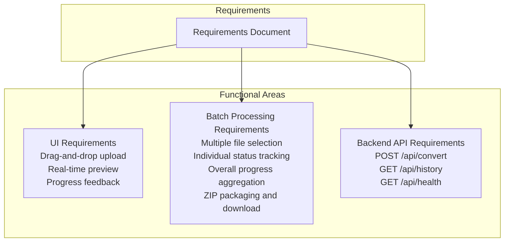
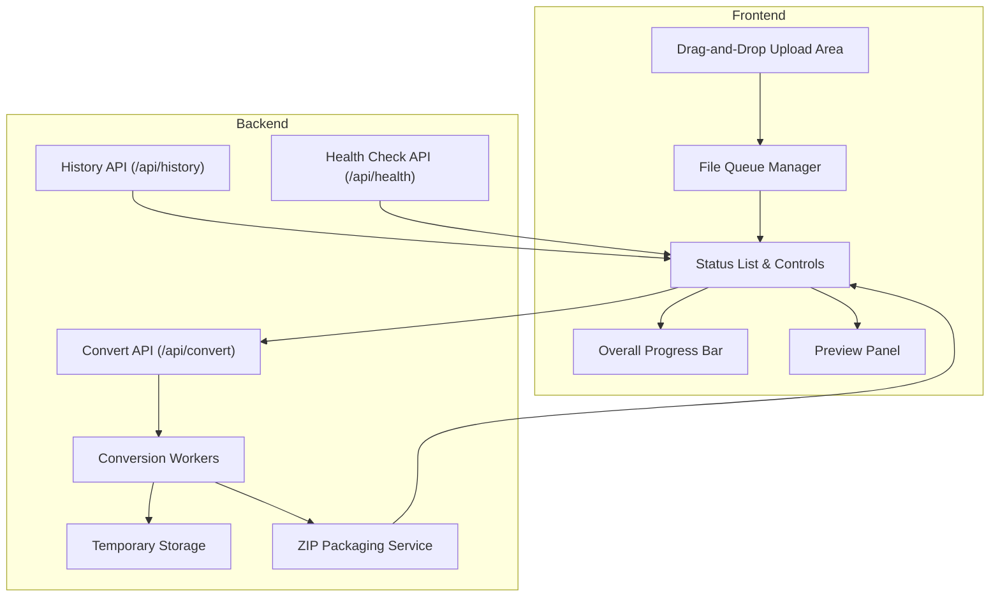
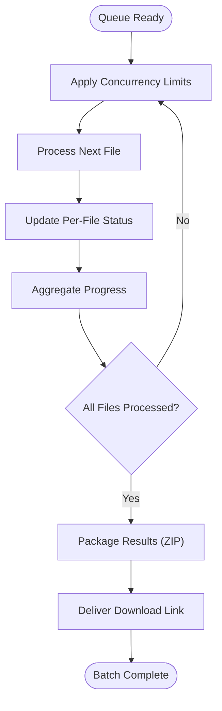
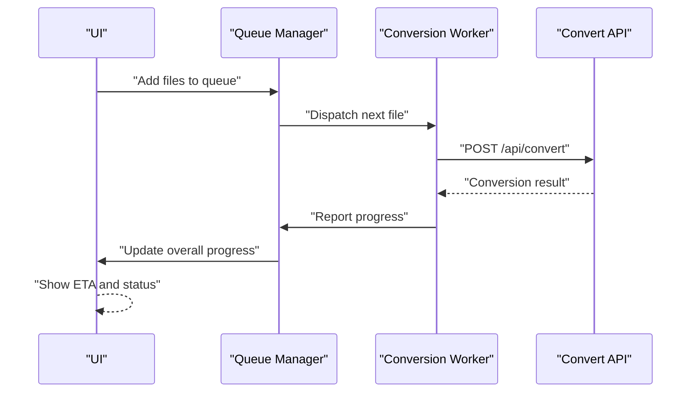
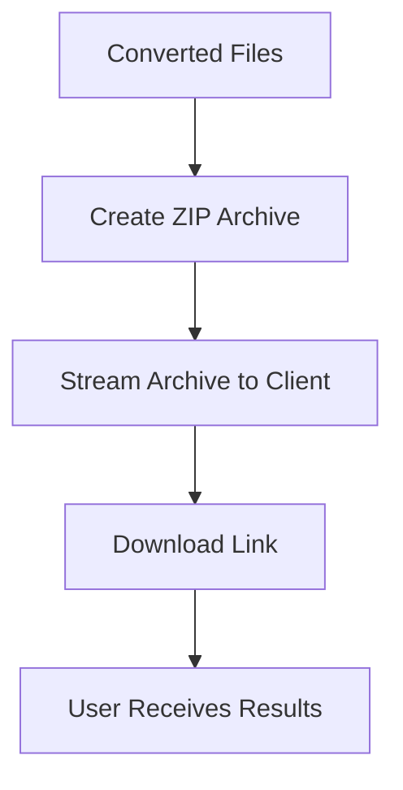
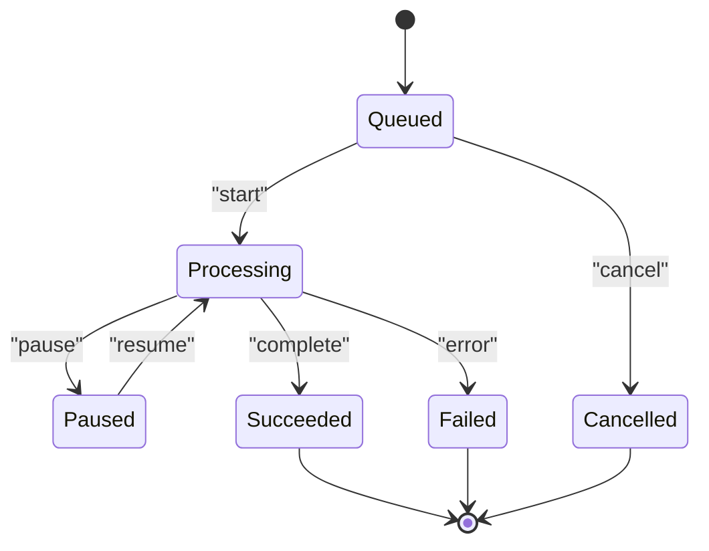
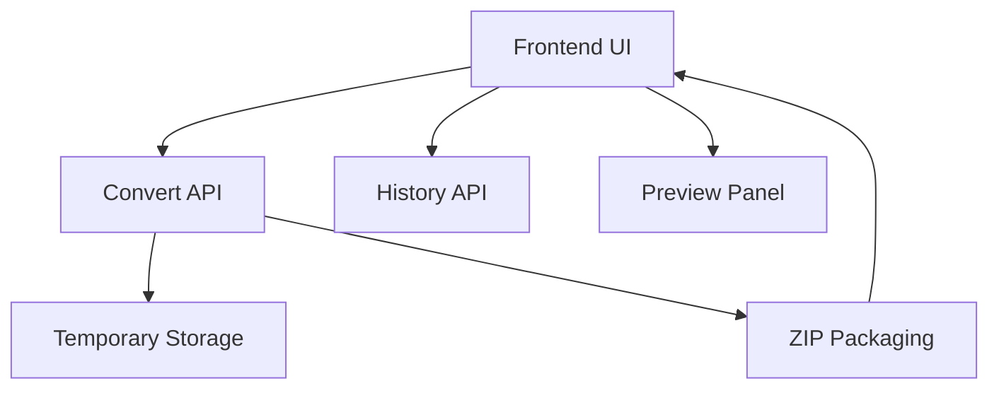

# Batch Processing Capabilities

<cite>
**Referenced Files in This Document**
- [多格式文档互转工具 (SmartConvert) 需求文档.md](file://多格式文档互转工具 (SmartConvert) 需求文档.md)
</cite>

## Table of Contents
1. [Introduction](#introduction)
2. [Project Structure](#project-structure)
3. [Core Components](#core-components)
4. [Architecture Overview](#architecture-overview)
5. [Detailed Component Analysis](#detailed-component-analysis)
6. [Dependency Analysis](#dependency-analysis)
7. [Performance Considerations](#performance-considerations)
8. [Troubleshooting Guide](#troubleshooting-guide)
9. [Conclusion](#conclusion)
10. [Appendices](#appendices)

## Introduction
This document describes the batch processing capabilities for the SmartConvert multi-format document conversion platform. It focuses on the end-to-end workflow for handling multiple file operations, including drag-and-drop multiple file selection, batch conversion with individual file status tracking, progress aggregation for overall batch completion, download packaging with ZIP archive creation, and batch operation controls with pause/resume/cancel functionality. The content synthesizes the functional requirements and implementation guidance from the project’s requirements document and provides practical patterns for building robust, scalable batch processing.

## Project Structure
The repository currently contains a requirements document that outlines the functional and non-functional needs for the batch processing system. The document specifies:
- Drag-and-drop upload area for multiple files
- Real-time progress feedback during conversion
- Batch processing support for multiple files with packaging and download
- Backend API endpoints for conversion and history

**Section sources**
- [多格式文档互转工具 (SmartConvert) 需求文档.md: 81-101](file://多格式文档互转工具 (SmartConvert) 需求文档.md#L81-L101)

## Core Components
The batch processing system comprises the following core components aligned with the requirements:

- File Queue Management
  - Drag-and-drop multiple file selection with visual feedback
  - File array management for queued items
  - Individual file status tracking (queued, processing, succeeded, failed)
  - Batch operation controls (pause, resume, cancel)

- Batch Conversion Workflow
  - Concurrent processing strategies for multiple files
  - Progress calculation across multiple files
  - Error isolation between files to prevent cascading failures
  - Memory optimization techniques for large batches

- Download Packaging and Delivery
  - ZIP archive creation for grouped results
  - Single-file download for individual conversions
  - Packaging triggered upon successful batch completion

- User Interface Patterns
  - Queue list with per-item status indicators
  - Overall progress bar aggregating individual progress
  - Action buttons for controlling batch operations
  - Visual feedback for errors and warnings

**Section sources**
- [多格式文档互转工具 (SmartConvert) 需求文档.md: 81-101](file://多格式文档互转工具 (SmartConvert) 需求文档.md#L81-L101)
- [多格式文档互转工具 (SmartConvert) 需求文档.md: 165-176](file://多格式文档互转工具 (SmartConvert) 需求文档.md#L165-L176)

## Architecture Overview
The batch processing architecture integrates frontend queue management with backend conversion services. The frontend manages the user experience and queues, while the backend performs conversions and returns results.

**Section sources**
- [多格式文档互转工具 (SmartConvert) 需求文档.md: 81-101](file://多格式文档互转工具 (SmartConvert) 需求文档.md#L81-L101)
- [多格式文档互转工具 (SmartConvert) 需求文档.md: 93-99](file://多格式文档互转工具 (SmartConvert) 需求文档.md#L93-L99)

## Detailed Component Analysis

### File Queue Management
- Multiple file selection via drag-and-drop upload area
- File array management with metadata (name, size, status, progress)
- Visual queue list with per-item status indicators
- Batch operation controls (pause, resume, cancel) applied to the queue

Implementation patterns:
- Maintain a queue state with FIFO ordering
- Track per-file status transitions (queued → processing → succeeded | failed)
- Debounce UI updates to reduce rendering overhead

User interface patterns:
- Queue list with icons for file types
- Inline action buttons for remove/pause/resume/cancel
- Clear visual feedback for invalid files or unsupported formats

**Section sources**
- [多格式文档互转工具 (SmartConvert) 需求文档.md: 81-101](file://多格式文档互转工具 (SmartConvert) 需求文档.md#L81-L101)

### Batch Conversion Workflow
- Concurrent processing strategies
  - Limit concurrency to balance throughput and resource usage
  - Use worker pools or async queues to process multiple files
  - Apply backpressure when system resources are constrained
- Progress aggregation
  - Compute overall progress as weighted average of individual file progress
  - Update progress bar in real-time as files complete
- Error isolation
  - Failures in one file do not block others
  - Collect and surface errors per file with retry options if applicable
- Memory optimization
  - Stream file uploads and downloads
  - Clean up temporary files promptly after conversion
  - Avoid loading entire files into memory when possible

Examples:
- Batch size limits: cap queue length to prevent overload
- Error isolation: continue processing remaining files after a failure
- User interface patterns: show per-file status and overall progress

**Section sources**
- [多格式文档互转工具 (SmartConvert) 霈求文档.md: 165-176](file://多格式文档互转工具 (SmartConvert) 需求文档.md#L165-L176)

### Progress Aggregation and Overall Completion
- Calculate overall progress as a function of completed files and total work
- Provide smooth progress updates to avoid flickering
- Display estimated time remaining based on historical performance
- Offer pause/resume to allow users to manage long-running batches

**Section sources**
- [多格式文档互转工具 (SmartConvert) 需求文档.md: 87-91](file://多格式文档互转工具 (SmartConvert) 需求文档.md#L87-L91)

### Download Packaging and ZIP Archive Creation
- Create a ZIP archive containing all successfully converted files
- Provide a single download link for the packaged results
- Handle large archives by streaming or chunked delivery
- Offer individual file downloads alongside batch packaging

**Section sources**
- [多格式文档互转工具 (SmartConvert) 需求文档.md: 91](file://多格式文档互转工具 (SmartConvert) 需求文档.md#L91)

### Batch Operation Controls (Pause/Resume/Cancel)
- Pause: temporarily halt new file processing while preserving queue state
- Resume: continue processing from the last checkpoint
- Cancel: abort remaining operations and clean up resources
- Persist queue state to allow resuming after page refresh or app restart

**Section sources**
- [多格式文档互转工具 (SmartConvert) 需求文档.md: 87-91](file://多格式文档互转工具 (SmartConvert) 需求文档.md#L87-L91)

## Dependency Analysis
The batch processing system depends on:
- Frontend UI libraries for drag-and-drop, progress bars, and status lists
- Backend APIs for conversion, history, and health checks
- Temporary storage for intermediate files during conversion
- ZIP packaging service for delivering batch results

**Section sources**
- [多格式文档互转工具 (SmartConvert) 需求文档.md: 93-99](file://多格式文档互转工具 (SmartConvert) 需求文档.md#L93-L99)

## Performance Considerations
- Concurrency limits: tune worker pool size based on CPU and memory capacity
- Streaming: stream uploads and downloads to minimize memory usage
- Caching: cache frequently accessed conversion templates or metadata
- Backpressure: pause or throttle processing when system load is high
- Cleanup: schedule periodic cleanup of temporary files to free disk space

[No sources needed since this section provides general guidance]

## Troubleshooting Guide
Common issues and resolutions:
- Excessive memory usage during batch processing
  - Reduce batch size and enable streaming
  - Clean up temporary files immediately after conversion
- Long-running batches causing timeouts
  - Implement pause/resume and checkpointing
  - Provide progress updates to keep sessions alive
- Mixed file types causing conversion errors
  - Validate file types before adding to queue
  - Surface per-file errors with actionable messages
- Large ZIP downloads failing
  - Split large archives into chunks
  - Use streaming ZIP creation to avoid memory spikes

**Section sources**
- [多格式文档互转工具 (SmartConvert) 需求文档.md: 165-176](file://多格式文档互转工具 (SmartConvert) 需求文档.md#L165-L176)

## Conclusion
The SmartConvert batch processing system enables efficient, user-friendly handling of multiple file conversions. By combining a robust queue management approach with concurrent processing, progress aggregation, and reliable packaging, the system delivers a seamless experience. The requirements document provides a solid foundation for building the frontend and backend components, while the patterns outlined here guide implementation choices for scalability, reliability, and usability.

[No sources needed since this section summarizes without analyzing specific files]

## Appendices
- Backend API endpoints
  - POST /api/convert: Convert a single file
  - GET /api/history: Retrieve recent conversion records
  - GET /api/health: Verify system health

**Section sources**
- [多格式文档互转工具 (SmartConvert) 需求文档.md: 93-99](file://多格式文档互转工具 (SmartConvert) 需求文档.md#L93-L99)