# Drag-and-Drop Upload System

<cite>
**Referenced Files in This Document**
- [多格式文档互转工具 (SmartConvert) 需求文档.md](file://多格式文档互转工具 (SmartConvert) 需求文档.md)
</cite>

## Table of Contents
1. [Introduction](#introduction)
2. [System Architecture](#system-architecture)
3. [Component Overview](#component-overview)
4. [Implementation Architecture](#implementation-architecture)
5. [Drag Zone Implementation](#drag-zone-implementation)
6. [File Validation System](#file-validation-system)
7. [Upload Progress Management](#upload-progress-management)
8. [Integration with Backend Services](#integration-with-backend-services)
9. [Accessibility Features](#accessibility-features)
10. [Configuration Examples](#configuration-examples)
11. [Error Handling Strategies](#error-handling-strategies)
12. [Performance Considerations](#performance-considerations)
13. [Troubleshooting Guide](#troubleshooting-guide)
14. [Conclusion](#conclusion)

## Introduction

The SmartConvert drag-and-drop upload system is a critical component designed to provide an intuitive and visually appealing file upload experience. This system implements Vercel and Apple-inspired drag-and-drop functionality with comprehensive visual feedback, robust file validation, and seamless integration with the backend conversion service.

The component serves as the primary entry point for user documents, enabling seamless conversion between Word, PDF, Text, and Markdown formats. It combines modern UI/UX principles with technical excellence to deliver a premium user experience while maintaining strict security and performance standards.

## System Architecture

The drag-and-drop upload system operates within a comprehensive document conversion ecosystem, integrating multiple layers of functionality:

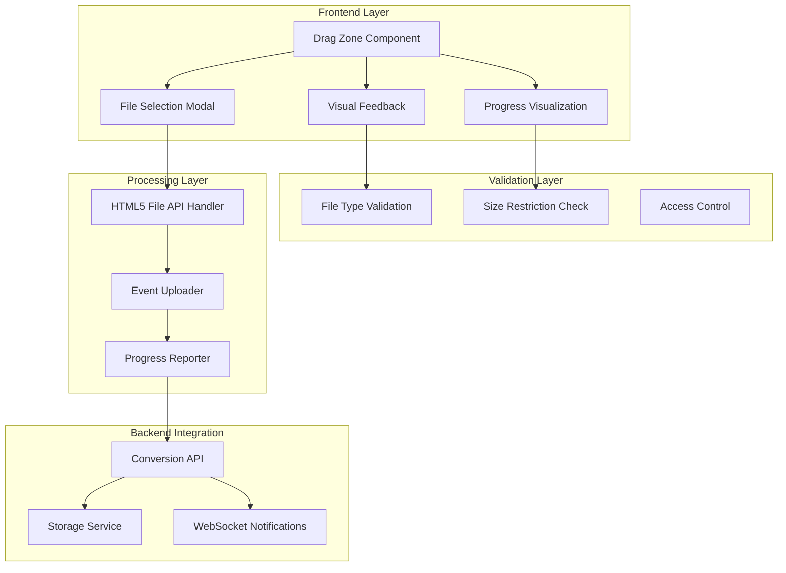

**Diagram sources**
- [多格式文档互转工具 (SmartConvert) 需求文档.md:85-91](file://多格式文档互转工具 (SmartConvert) 需求文档.md#L85-L91)

## Component Overview

The drag-and-drop upload system consists of several interconnected components working together to provide a seamless user experience:

### Core Components Structure

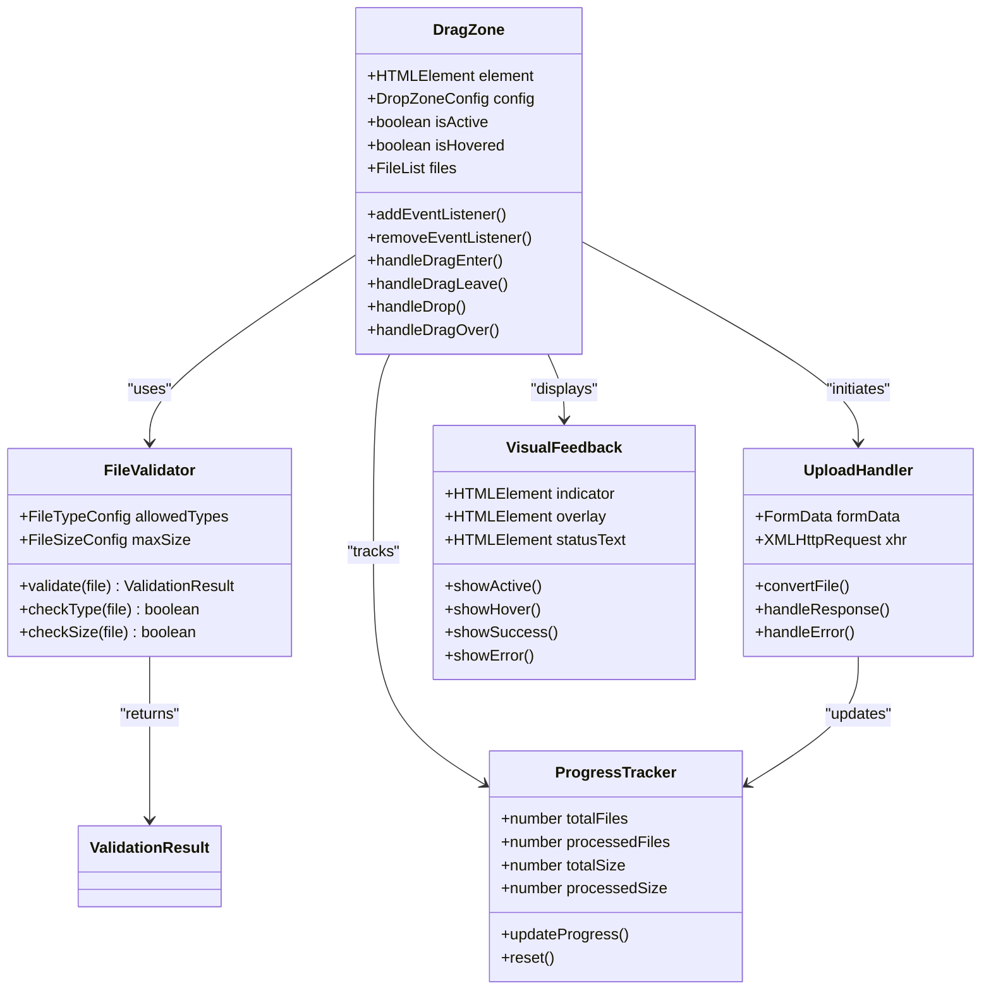

**Diagram sources**
- [多格式文档互转工具 (SmartConvert) 需求文档.md:85-91](file://多格式文档互转工具 (SmartConvert) 需求文档.md#L85-L91)

## Implementation Architecture

The system follows a modular architecture designed for maintainability and scalability:

### Event-Driven Architecture

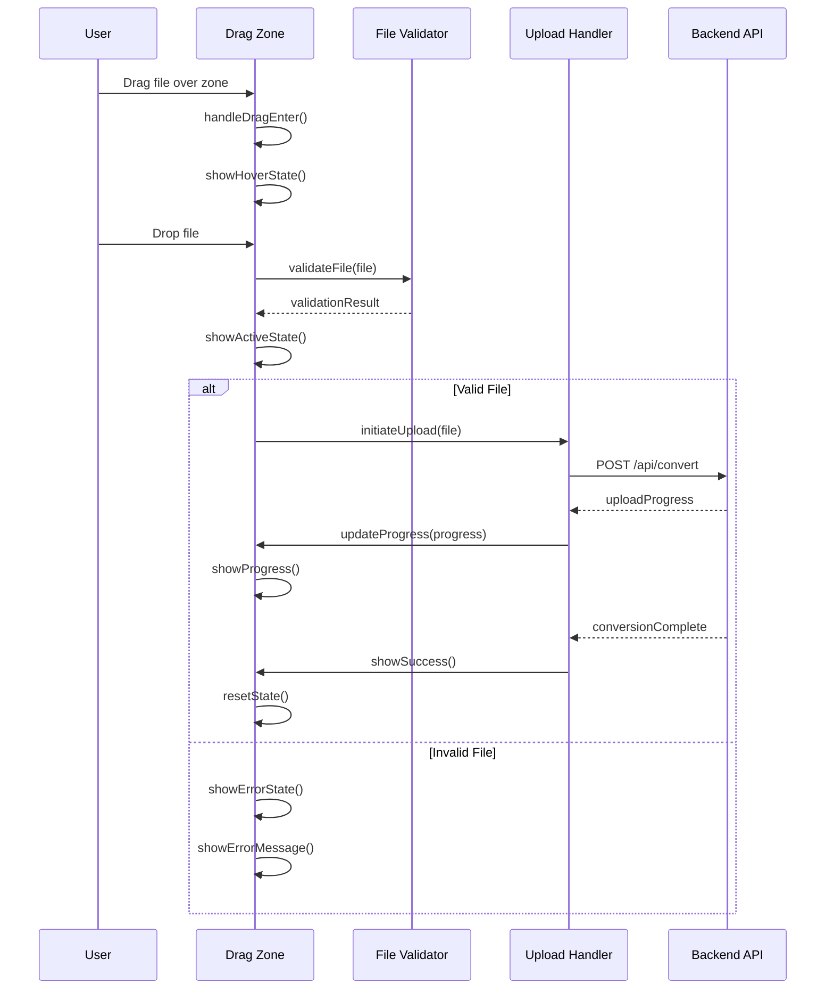

**Diagram sources**
- [多格式文档互转工具 (SmartConvert) 需求文档.md:95](file://多格式文档互转工具 (SmartConvert) 需求文档.md#L95)

### State Management Flow

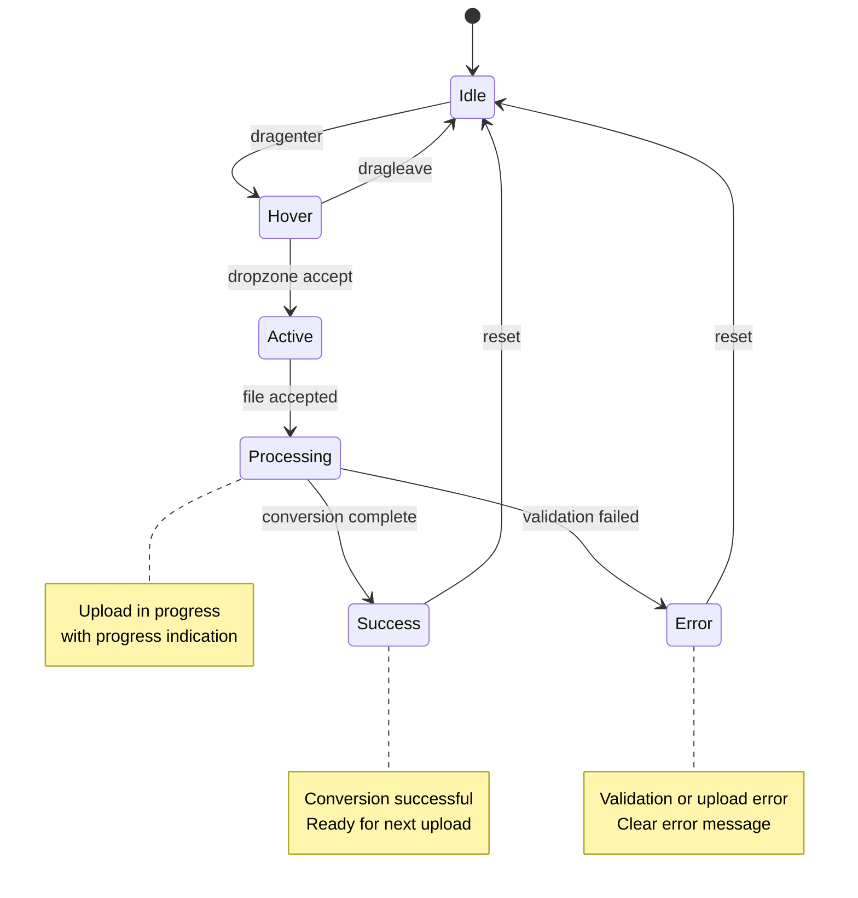

## Drag Zone Implementation

The drag zone component implements Apple and Vercel-inspired styling with sophisticated visual feedback mechanisms.

### Visual States and Styling

The drag zone maintains four distinct visual states:

1. **Idle State**: Default appearance with subtle border and placeholder text
2. **Hover State**: Enhanced border with accent color and animated elements
3. **Active State**: Accepting state with green indicators and success animations
4. **Error State**: Red error indicators with explanatory messaging

### Event Handling Architecture

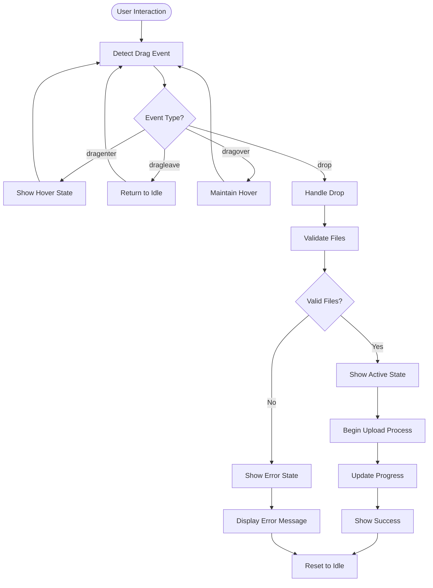

**Diagram sources**
- [多格式文档互转工具 (SmartConvert) 需求文档.md:85](file://多格式文档互转工具 (SmartConvert) 需求文档.md#L85)

### Styling Implementation Guidelines

The drag zone follows modern design principles with responsive behavior:

- **Border Radius**: 12px for soft, contemporary appearance
- **Padding**: 48px minimum for comfortable interaction area
- **Color Scheme**: 
  - Primary: Indigo 600 (#4f46e5) for active states
  - Secondary: Emerald 500 (#10b981) for success states
  - Accent: Red 500 (#ef4444) for error states
- **Animation**: Smooth transitions (200ms) for state changes
- **Responsive Design**: Minimum 300px width for mobile devices

## File Validation System

The file validation system ensures security and compatibility by implementing comprehensive checks at multiple levels.

### Validation Pipeline

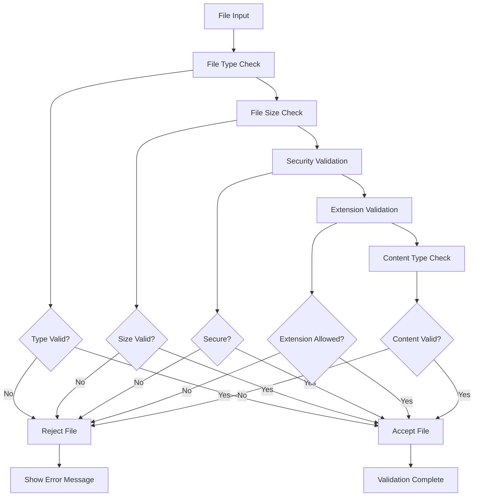

**Diagram sources**
- [多格式文档互转工具 (SmartConvert) 需求文档.md:169](file://多格式文档互转工具 (SmartConvert) 需求文档.md#L169)

### File Type Configuration

Supported file formats and their validation rules:

| Format | Extensions | MIME Types | Max Size | Validation |
|--------|------------|------------|----------|------------|
| Word | `.docx`, `.doc` | `application/vnd.openxmlformats-officedocument.wordprocessingml.document` | 10MB | Type + Content |
| PDF | `.pdf` | `application/pdf` | 10MB | Type + Content |
| Text | `.txt` | `text/plain` | 10MB | Type + Content |
| Markdown | `.md`, `.markdown` | `text/markdown` | 10MB | Type + Content |

### Security Validation Measures

The validation system implements multiple security layers:

1. **Extension Whitelisting**: Only approved extensions are permitted
2. **MIME Type Verification**: Server-side content type validation
3. **File Signature Checking**: Binary signature verification
4. **Malware Scanning**: Integration with security scanning services
5. **Size Limits**: Prevents resource exhaustion attacks

## Upload Progress Management

The progress management system provides real-time feedback during file uploads and conversions.

### Progress Tracking Architecture

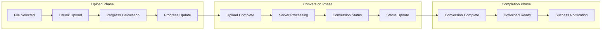

**Diagram sources**
- [多格式文档互转工具 (SmartConvert) 需求文档.md:89](file://多格式文档互转工具 (SmartConvert) 需求文档.md#L89)

### Progress Visualization Components

The progress system includes multiple visualization elements:

1. **Progress Bar**: Linear indicator showing completion percentage
2. **Status Text**: Real-time status messages ("Uploading...", "Converting...")
3. **File Counter**: Shows processed vs total files
4. **Speed Indicator**: Current upload/download speed
5. **ETA Calculator**: Estimated time remaining

### Progress Calculation Logic

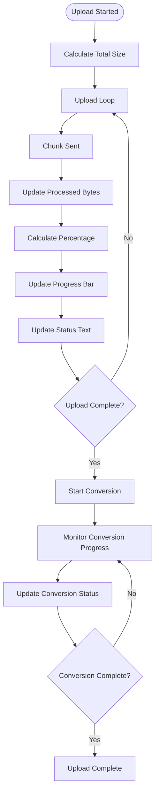

## Integration with Backend Services

The drag-and-drop system seamlessly integrates with the backend conversion service through a well-defined API interface.

### API Integration Architecture

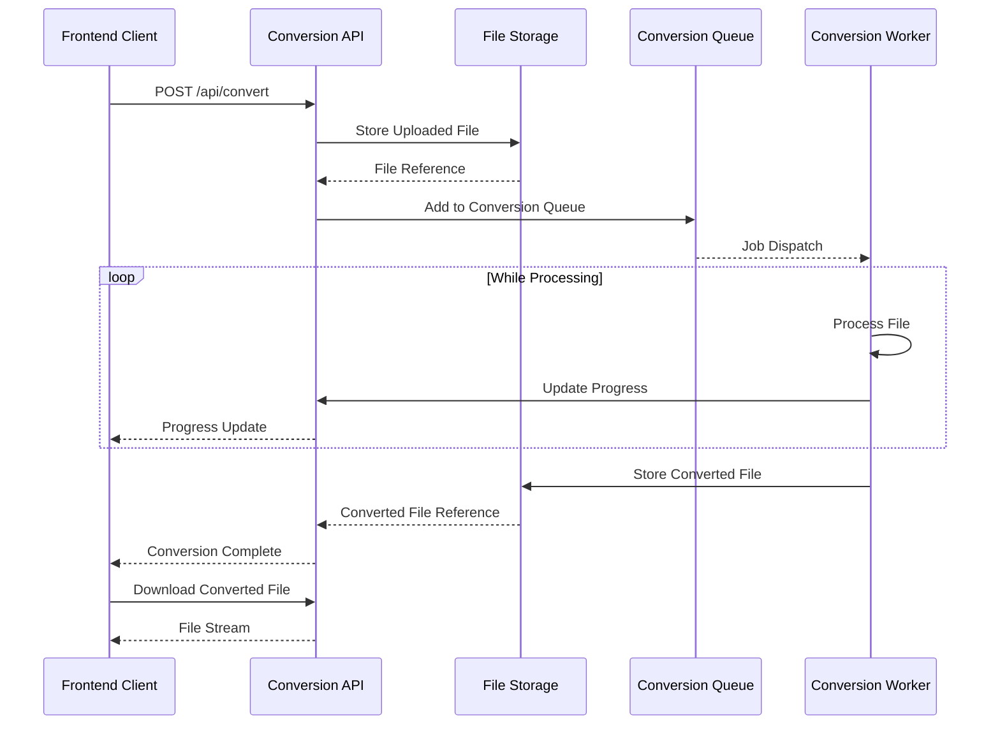

**Diagram sources**
- [多格式文档互转工具 (SmartConvert) 需求文档.md:95](file://多格式文档互转工具 (SmartConvert) 需求文档.md#L95)

### Request/Response Schema

The API communication follows standardized request/response patterns:

**Upload Request:**
- Method: POST `/api/convert`
- Headers: `Content-Type: multipart/form-data`
- Form Fields:
  - `file`: File object
  - `targetFormat`: Target conversion format
  - `sourceFormat`: Original file format

**Progress Response:**
- Status: 200 OK
- Body: `{ "status": "processing", "progress": 75, "message": "Converting..." }`

**Completion Response:**
- Status: 200 OK
- Body: `{ "status": "completed", "downloadUrl": "/files/converted-123.pdf" }`

### Error Handling Integration

The system implements comprehensive error handling for various failure scenarios:

1. **Network Errors**: Automatic retry with exponential backoff
2. **Server Errors**: Graceful degradation with user-friendly messages
3. **Timeout Handling**: Configurable timeout with cancellation support
4. **Partial Upload Recovery**: Resume capability for interrupted uploads

## Accessibility Features

The drag-and-drop system implements comprehensive accessibility features to ensure inclusive usage for all users.

### Keyboard Navigation Support

Users can navigate and interact with the drag zone using keyboard controls:

- **Tab Navigation**: Focus moves between interactive elements
- **Space/Enter**: Activate file selection and upload actions
- **Escape**: Cancel ongoing operations
- **Arrow Keys**: Navigate within file selection modal

### Screen Reader Compatibility

The system provides comprehensive screen reader support:

- **ARIA Labels**: Descriptive labels for all interactive elements
- **Live Regions**: Dynamic content updates announced to assistive technologies
- **Focus Management**: Proper focus handling during state changes
- **Error Announcements**: Clear error messages read aloud

### Visual Accessibility Features

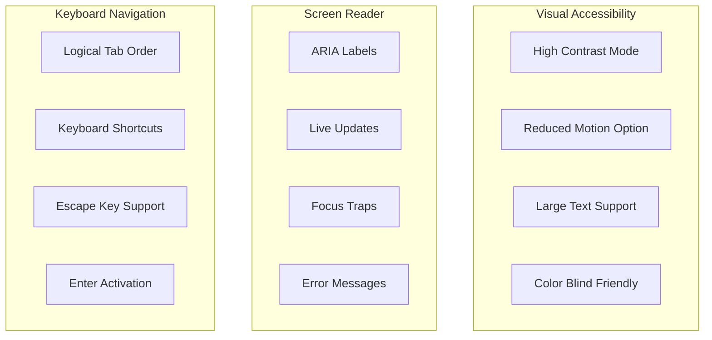

**Diagram sources**
- [多格式文档互转工具 (SmartConvert) 需求文档.md:83](file://多格式文档互转工具 (SmartConvert) 需求文档.md#L83)

### Accessibility Compliance Standards

The system adheres to WCAG 2.1 AA standards with additional enhancements:

- **Color Contrast**: Minimum 4.5:1 contrast ratio for text elements
- **Focus Indicators**: Visible focus rings for keyboard navigation
- **Alternative Text**: Descriptive text for all visual elements
- **Responsive Touch Targets**: Minimum 44px touch targets for mobile devices

## Configuration Examples

The drag-and-drop system provides flexible configuration options for different deployment scenarios.

### Basic Configuration

```javascript
// Minimal configuration for basic usage
const basicConfig = {
  allowedTypes: ['docx', 'pdf', 'txt', 'md'],
  maxSize: 10 * 1024 * 1024, // 10MB
  acceptMultiple: true,
  showProgress: true,
  enableValidation: true
};
```

### Advanced Configuration

```javascript
// Comprehensive configuration for production use
const advancedConfig = {
  // File validation settings
  allowedTypes: ['docx', 'pdf', 'txt', 'md'],
  maxSize: 10 * 1024 * 1024,
  allowedExtensions: ['.docx', '.pdf', '.txt', '.md'],
  
  // UI customization
  theme: 'vercel', // or 'apple'
  colors: {
    idle: '#f3f4f6',
    hover: '#4f46e5',
    active: '#10b981',
    error: '#ef4444'
  },
  
  // Behavior settings
  acceptMultiple: true,
  maxFiles: 10,
  showProgress: true,
  showPreview: false,
  
  // Accessibility options
  enableKeyboardNav: true,
  enableScreenReader: true,
  reducedMotion: false,
  
  // Callback hooks
  onFileSelect: (files) => console.log('Files selected:', files),
  onUploadStart: () => console.log('Upload started'),
  onProgress: (progress) => console.log('Progress:', progress),
  onComplete: (result) => console.log('Upload complete:', result),
  onError: (error) => console.error('Upload error:', error)
};
```

### Theme Configuration

```javascript
// Vercel-style theme configuration
const vercelTheme = {
  colors: {
    idle: '#ffffff',
    hover: '#f3f4f6',
    active: '#10b981',
    error: '#ef4444'
  },
  animation: {
    duration: '200ms',
    easing: 'ease-in-out'
  }
};

// Apple-style theme configuration
const appleTheme = {
  colors: {
    idle: '#fafafa',
    hover: '#0071e3',
    active: '#34c759',
    error: '#ff3b30'
  },
  animation: {
    duration: '150ms',
    easing: 'ease-out'
  }
};
```

## Error Handling Strategies

The system implements comprehensive error handling strategies to provide robust user experiences.

### Error Classification System

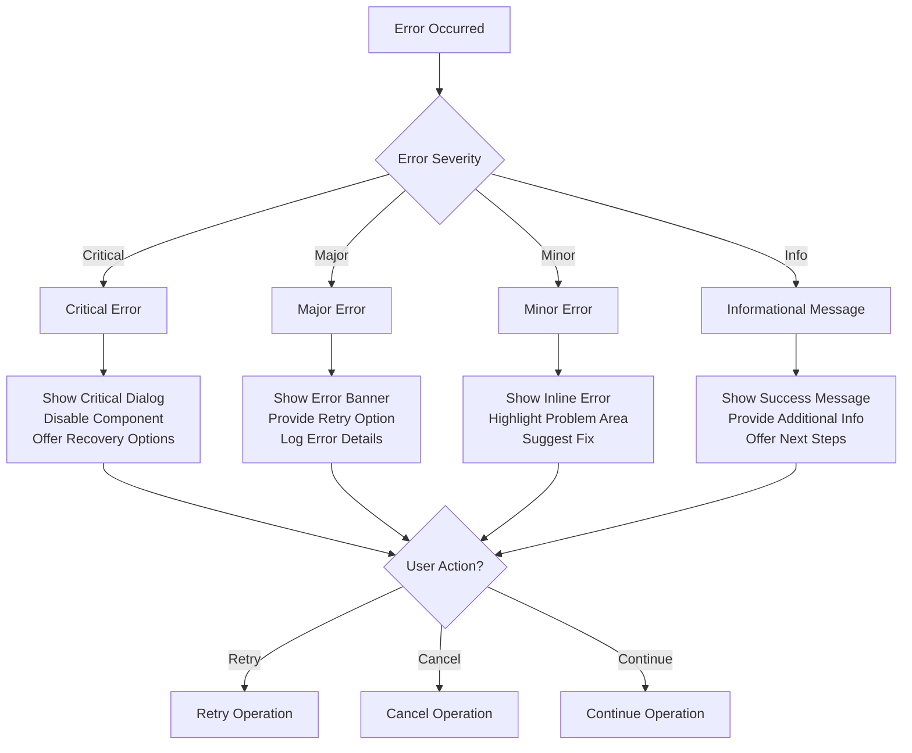

**Diagram sources**
- [多格式文档互转工具 (SmartConvert) 需求文档.md:169](file://多格式文档互转工具 (SmartConvert) 需求文档.md#L169)

### Error Categories and Responses

| Error Category | Description | User Response | System Action |
|----------------|-------------|---------------|---------------|
| **File Type Error** | Unsupported file format | Show format list | Display allowed formats |
| **Size Limit Error** | File exceeds maximum size | Show size limit | Display size restriction |
| **Network Error** | Upload interruption | Offer retry option | Auto-retry with backoff |
| **Server Error** | Backend processing failure | Show error dialog | Log error and notify admin |
| **Validation Error** | Security or content validation | Highlight problematic file | Remove invalid file |
| **Timeout Error** | Operation exceeded time limit | Show timeout message | Cancel operation and cleanup |

### Error Recovery Mechanisms

The system implements intelligent recovery strategies:

1. **Automatic Retry**: Network failures automatically retry with exponential backoff
2. **Partial Recovery**: Resume interrupted uploads from last known good state
3. **Graceful Degradation**: Continue operation with reduced functionality when possible
4. **User Recovery**: Provide clear options for manual intervention

## Performance Considerations

The drag-and-drop system is optimized for performance across various network conditions and device capabilities.

### Performance Optimization Strategies

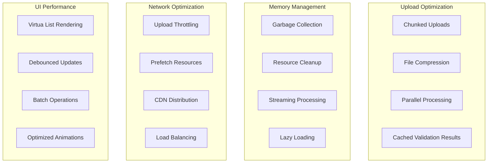

### Performance Metrics

The system monitors key performance indicators:

- **Upload Speed**: Measured in KB/s and MB/s
- **Conversion Time**: Total processing time from upload to completion
- **Memory Usage**: Track memory consumption during operations
- **CPU Utilization**: Monitor processor usage during heavy operations
- **Network Efficiency**: Bandwidth utilization and connection quality

### Scalability Features

- **Horizontal Scaling**: Support for multiple backend instances
- **Load Balancing**: Intelligent distribution of upload requests
- **Caching Layers**: Redis caching for frequently accessed data
- **CDN Integration**: Static asset delivery optimization
- **Database Optimization**: Efficient query patterns and indexing

## Troubleshooting Guide

Common issues and their solutions for the drag-and-drop upload system.

### Common Issues and Solutions

| Issue | Symptoms | Cause | Solution |
|-------|----------|-------|----------|
| **Files Not Accepted** | Error message appears when dropping files | Invalid file type or size | Check allowed file types and size limits |
| **Upload Stalls** | Progress bar stops moving | Network connectivity issue | Check internet connection and retry |
| **Drag Zone Not Responding** | No hover effect or drop detection | JavaScript errors or disabled events | Check browser console for errors |
| **Progress Not Updating** | Status shows "Processing" indefinitely | Backend conversion issues | Verify server health and logs |
| **Mobile Device Issues** | Touch events not working properly | Mobile browser limitations | Test on desktop browser for comparison |
| **Accessibility Problems** | Screen reader not announcing status | Missing ARIA attributes | Enable accessibility features |

### Debugging Tools and Techniques

1. **Browser Developer Tools**: Inspect network requests and console errors
2. **Performance Profiling**: Monitor CPU and memory usage
3. **Network Analysis**: Track upload progress and response times
4. **Console Logging**: Enable debug mode for detailed logging
5. **Error Reporting**: Implement client-side error tracking

### Performance Monitoring

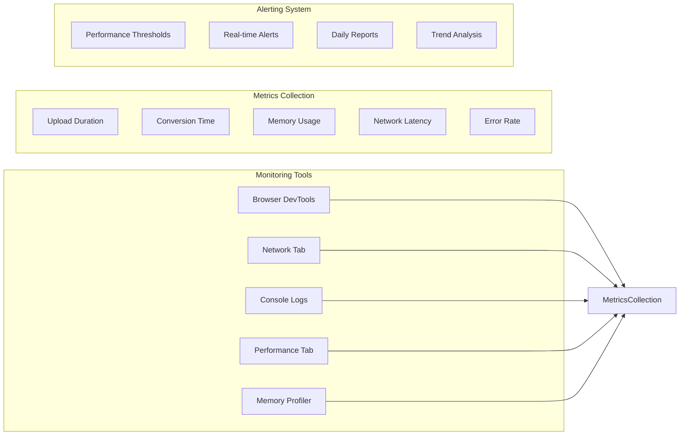

## Conclusion

The SmartConvert drag-and-drop upload system represents a sophisticated implementation of modern web file upload functionality. By combining Apple and Vercel-inspired design principles with robust technical architecture, the system delivers an exceptional user experience while maintaining security, performance, and accessibility standards.

The component's modular design ensures maintainability and extensibility, while comprehensive error handling and progress reporting provide users with confidence and transparency throughout the upload process. The integration with backend conversion services enables seamless document processing workflows.

Key strengths of the implementation include:

- **Intuitive User Experience**: Familiar drag-and-drop interface with clear visual feedback
- **Robust Validation**: Multi-layered security and compatibility checking
- **Performance Optimization**: Efficient upload and conversion processes
- **Accessibility Compliance**: Full support for assistive technologies
- **Scalable Architecture**: Designed for high-volume usage scenarios

Future enhancements could include support for additional file formats, enhanced batch processing capabilities, and integration with cloud storage services. The modular architecture ensures these improvements can be implemented without disrupting existing functionality.