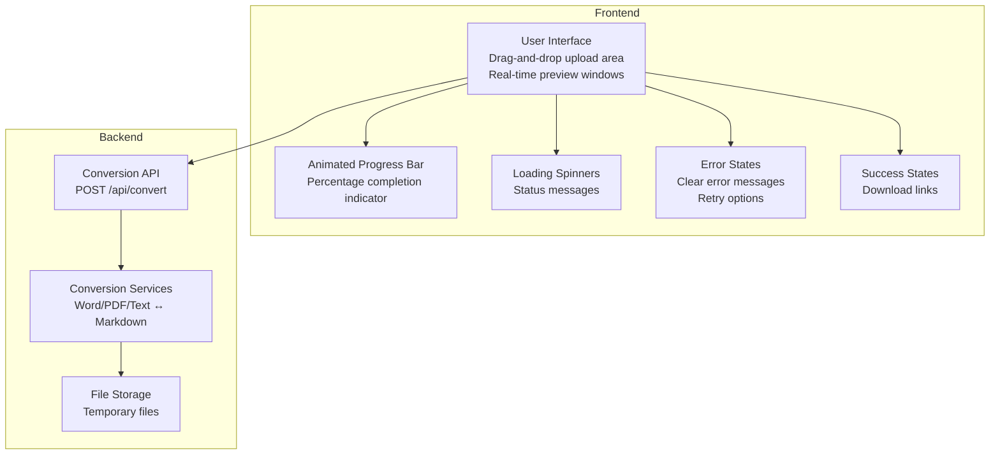
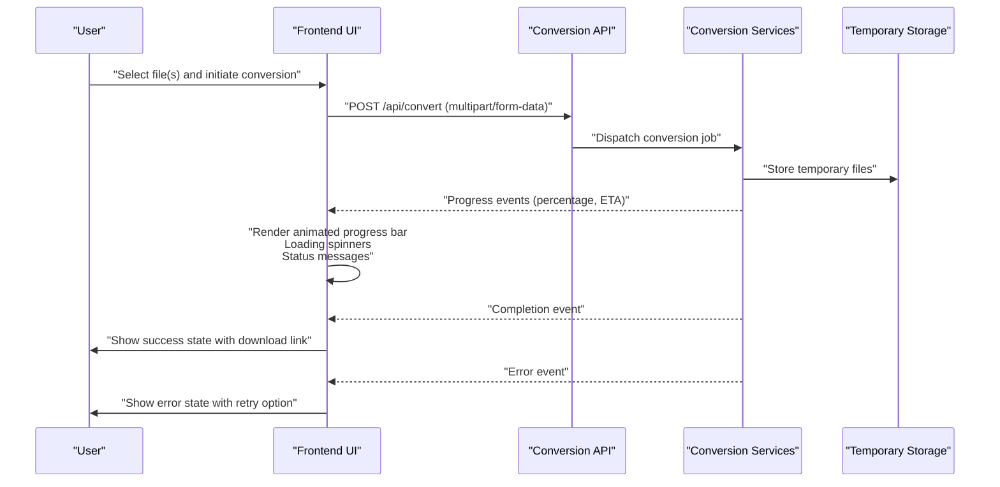
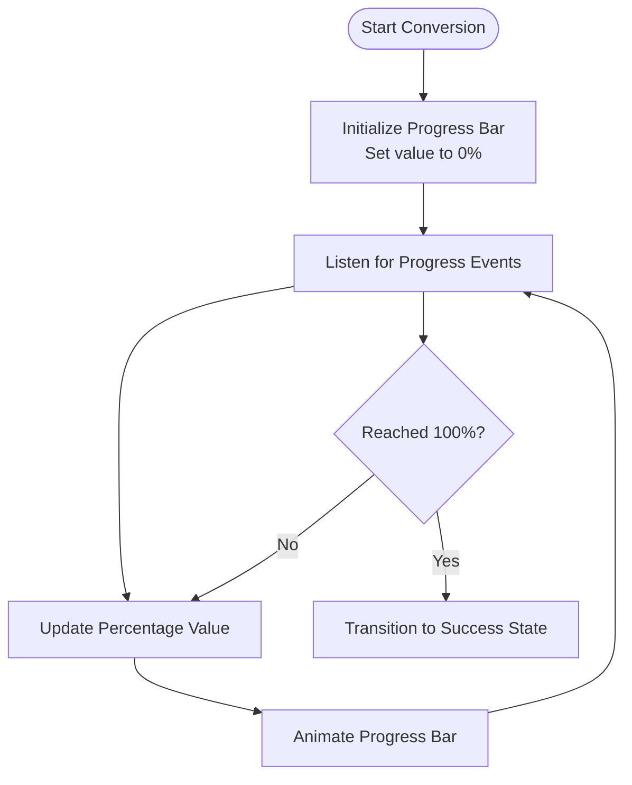
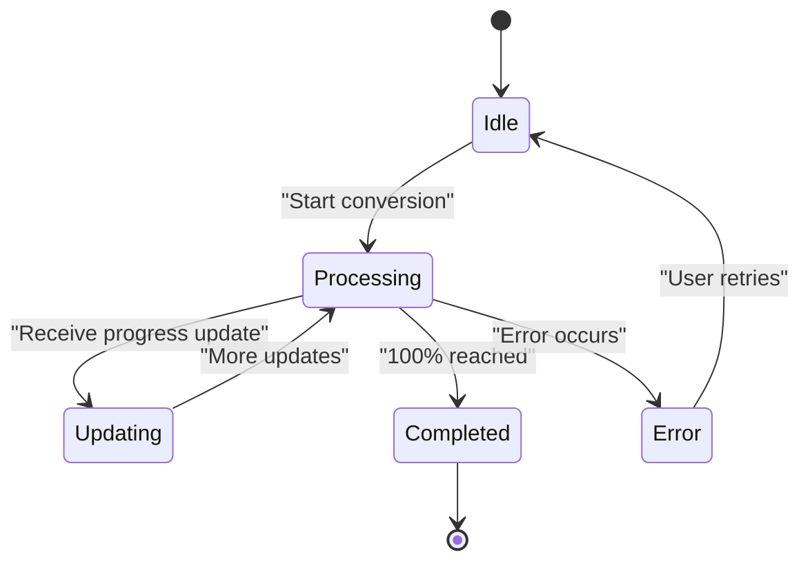
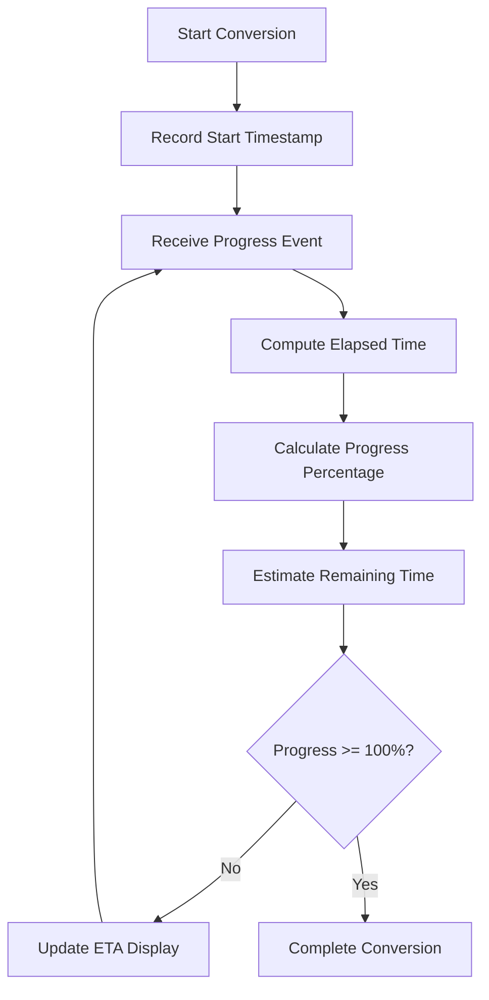
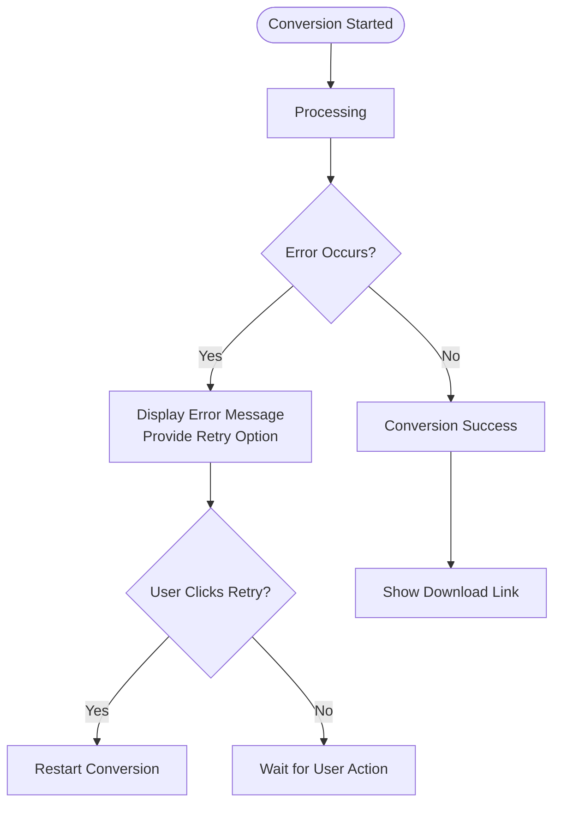
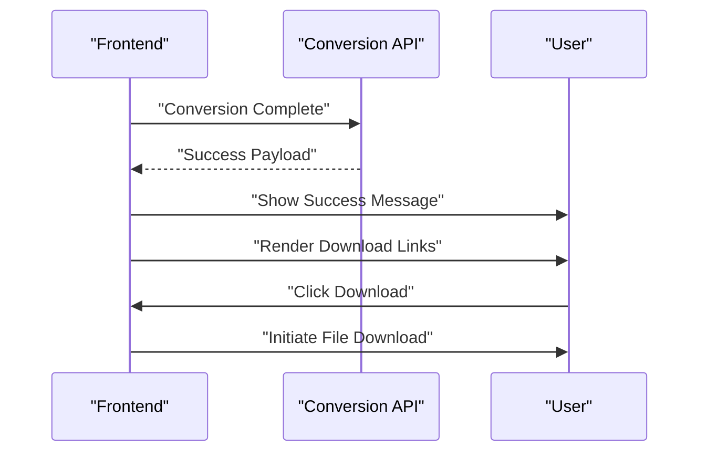
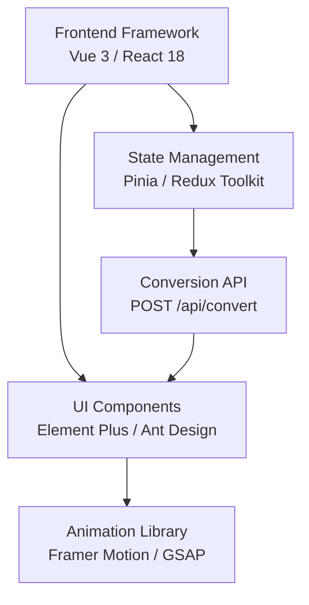

# Progress Feedback System

<cite>
**Referenced Files in This Document**
- [多格式文档互转工具 (SmartConvert) 需求文档.md](file://多格式文档互转工具 (SmartConvert) 需求文档.md)
</cite>

## Table of Contents
1. [Introduction](#introduction)
2. [Project Structure](#project-structure)
3. [Core Components](#core-components)
4. [Architecture Overview](#architecture-overview)
5. [Detailed Component Analysis](#detailed-component-analysis)
6. [Dependency Analysis](#dependency-analysis)
7. [Performance Considerations](#performance-considerations)
8. [Troubleshooting Guide](#troubleshooting-guide)
9. [Conclusion](#conclusion)

## Introduction
This document describes the progress feedback and loading state system for the SmartConvert document conversion platform. It focuses on the animated progress bar with percentage completion indicators, processing state visualization with loading spinners and status messages, conversion progress tracking with estimated time remaining, error state handling with clear error messages and retry options, and success state confirmation with download links. The system integrates with the conversion API endpoints and uses modern frontend technologies to deliver responsive and accessible user experiences.

## Project Structure
The repository currently contains a requirements document that outlines the SmartConvert platform’s goals, technology stack, and functional requirements. The progress feedback system is part of the frontend UI layer and interacts with the backend conversion API.

**Section sources**
- [多格式文档互转工具 (SmartConvert) 需求文档.md: 81-92](file://多格式文档互转工具 (SmartConvert) 需求文档.md#L81-L92)
- [多格式文档互转工具 (SmartConvert) 需求文档.md: 93-100](file://多格式文档互转工具 (SmartConvert) 需求文档.md#L93-L100)

## Core Components
The progress feedback system comprises four primary UI states, each designed to communicate conversion status clearly and guide user actions:

- Animated Progress Bar: Visualizes conversion progress with a smooth, animated bar and percentage completion indicator.
- Loading Spinners and Status Messages: Provides real-time feedback during processing with spinner animations and contextual status messages.
- Estimated Time Remaining: Displays an estimated time remaining to help users anticipate completion.
- Error Handling: Presents clear error messages and offers retry options to recover from failures.
- Success Confirmation: Confirms successful conversions and provides immediate download links.

These components integrate with the conversion API endpoint to reflect real-time progress and outcomes.

**Section sources**
- [多格式文档互转工具 (SmartConvert) 需求文档.md: 89](file://多格式文档互转工具 (SmartConvert) 需求文档.md#L89)
- [多格式文档互转工具 (SmartConvert) 需求文档.md: 95](file://多格式文档互转工具 (SmartConvert) 需求文档.md#L95)

## Architecture Overview
The progress feedback system operates as follows:
- The frontend triggers the conversion process via the conversion API endpoint.
- The backend processes the file and streams progress updates to the frontend.
- The frontend renders the animated progress bar, loading spinners, and status messages.
- On completion, the frontend displays success states with download links.
- On failure, the frontend presents error states with actionable retry options.

**Diagram sources**
- [多格式文档互转工具 (SmartConvert) 需求文档.md: 95](file://多格式文档互转工具 (SmartConvert) 需求文档.md#L95)

## Detailed Component Analysis

### Animated Progress Bar
The animated progress bar provides continuous visual feedback during conversion. It should:
- Animate smoothly from 0% to 100%.
- Display a live percentage completion indicator.
- Reflect real-time progress updates received from the conversion API.

Implementation considerations:
- Use a lightweight animation library for smooth transitions.
- Debounce rapid progress updates to prevent UI thrashing.
- Maintain accessibility by providing ARIA attributes and screen reader-friendly labels.

**Section sources**
- [多格式文档互转工具 (SmartConvert) 需求文档.md: 89](file://多格式文档互转工具 (SmartConvert) 需求文档.md#L89)

### Processing State Visualization
During processing, the system displays:
- A loading spinner to indicate ongoing activity.
- Contextual status messages describing the current stage (e.g., parsing, converting, packaging).
- Optional estimated time remaining to improve user patience.

Best practices:
- Use a consistent spinner style aligned with the UI theme.
- Provide concise, non-technical status messages.
- Avoid overwhelming users with excessive detail; focus on essential information.

**Section sources**
- [多格式文档互转工具 (SmartConvert) 需求文档.md: 89](file://多格式文档互转工具 (SmartConvert) 需求文档.md#L89)

### Conversion Progress Tracking with Estimated Time Remaining
To enhance transparency, the system tracks and displays an estimated time remaining:
- Calculate elapsed time and current progress to estimate remaining time.
- Smoothly interpolate ETA values to avoid jittery updates.
- Present ETA in human-readable formats (e.g., “X minutes left”).

Algorithm outline:
- Track the initial timestamp when conversion starts.
- For each progress event, compute elapsed time and progress percentage.
- Estimate remaining time using the formula: remaining = (elapsed / progress%) * (100 - currentProgress).
- Apply smoothing to reduce fluctuations caused by network latency or server-side variability.

**Section sources**
- [多格式文档互转工具 (SmartConvert) 需求文档.md: 89](file://多格式文档互转工具 (SmartConvert) 需求文档.md#L89)

### Error State Handling
Error handling ensures users can recover quickly:
- Display clear, actionable error messages.
- Provide a retry button to reattempt the conversion.
- Optionally show error codes or logs for advanced users.
- Preserve user-selected files and settings to minimize rework.

User experience optimization:
- Use prominent, color-coded alerts for visibility.
- Offer contextual help links or FAQs.
- Automatically disable actions that could compound errors until resolved.

**Section sources**
- [多格式文档互转工具 (SmartConvert) 需求文档.md: 89](file://多格式文档互转工具 (SmartConvert) 需求文档.md#L89)

### Success State Confirmation
On successful completion:
- Confirm the conversion with a friendly message.
- Provide immediate download links for converted files.
- Offer options to convert more files or view history.

Accessibility and UX:
- Ensure download links are keyboard accessible and announceable.
- Display file sizes and formats for clarity.
- Allow users to open files directly in new tabs if supported by the browser.

**Section sources**
- [多格式文档互转工具 (SmartConvert) 需求文档.md: 95](file://多格式文档互转工具 (SmartConvert) 需求文档.md#L95)

## Dependency Analysis
The progress feedback system depends on:
- Frontend framework and UI component libraries for rendering.
- Animation libraries for smooth progress transitions.
- State management for coordinating UI states and data flow.
- Backend conversion API for progress events and completion signals.

**Section sources**
- [多格式文档互转工具 (SmartConvert) 需求文档.md: 23-38](file://多格式文档互转工具 (SmartConvert) 需求文档.md#L23-L38)
- [多格式文档互转工具 (SmartConvert) 需求文档.md: 95](file://多格式文档互转工具 (SmartConvert) 需求文档.md#L95)

## Performance Considerations
- Minimize UI repaints by debouncing frequent progress updates.
- Use efficient animation libraries to keep frame rates smooth.
- Cache intermediate results where possible to reduce redundant computations.
- Optimize network requests to reduce latency and improve perceived performance.
- Provide skeleton loaders or placeholders to maintain perceived responsiveness during long operations.

## Troubleshooting Guide
Common issues and resolutions:
- Progress bar stalls: Verify that progress events are being emitted consistently by the backend and that the frontend is handling them correctly.
- ETA jumps: Apply smoothing filters to progress updates to stabilize ETA calculations.
- Error messages unclear: Ensure backend returns structured error responses with meaningful messages and codes.
- Download fails: Confirm that the backend generates valid download URLs and that CORS policies permit client access.
- Spinner not visible: Check that the spinner component is rendered conditionally based on the processing state and that CSS styles are applied correctly.

## Conclusion
The progress feedback and loading state system is central to delivering a responsive and trustworthy user experience in SmartConvert. By combining animated progress indicators, contextual status messages, estimated time remaining, robust error handling, and success confirmations, the system communicates conversion status effectively. Integrating seamlessly with the conversion API ensures that users receive timely and accurate feedback throughout the entire process.