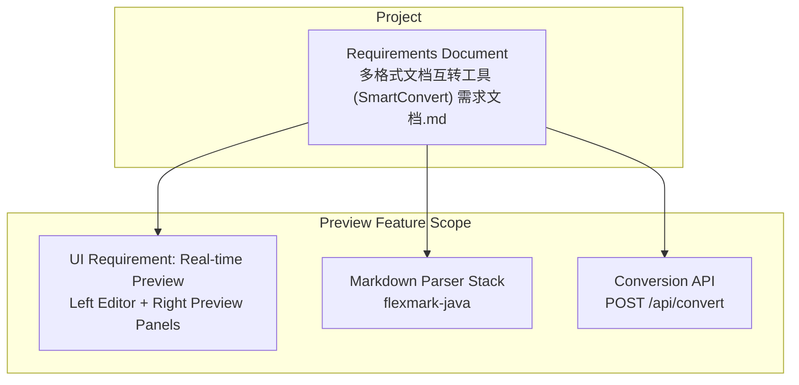
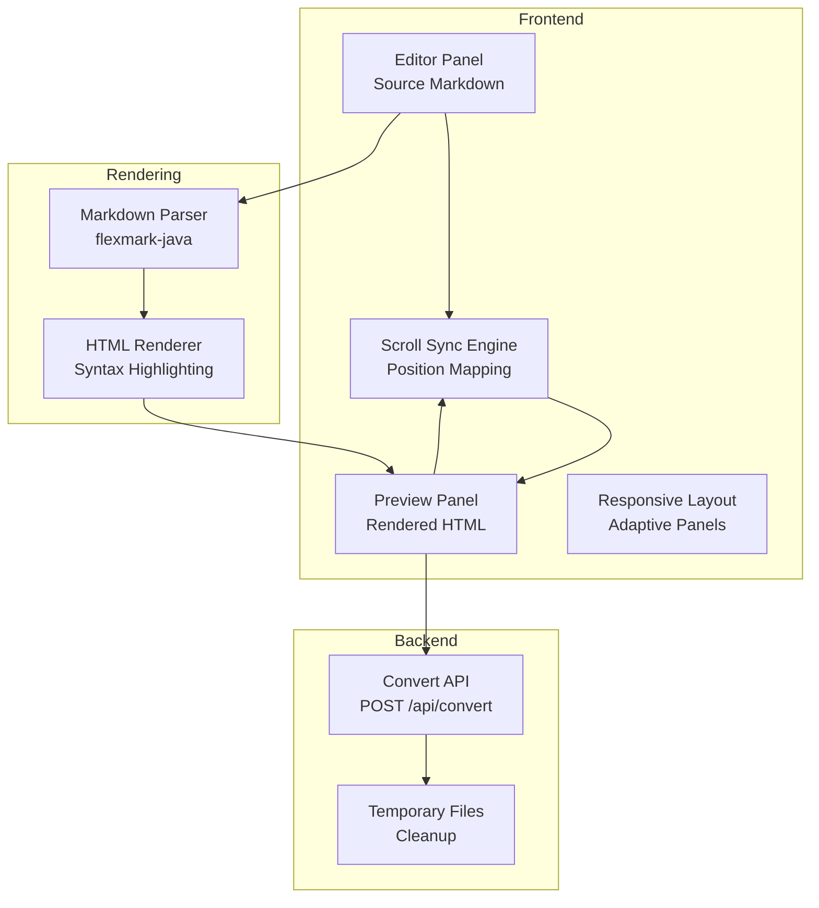
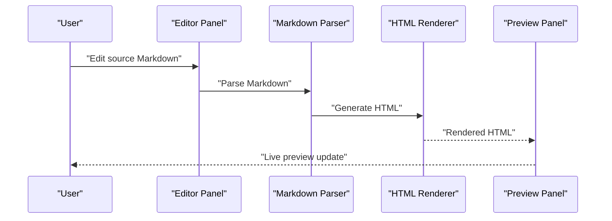
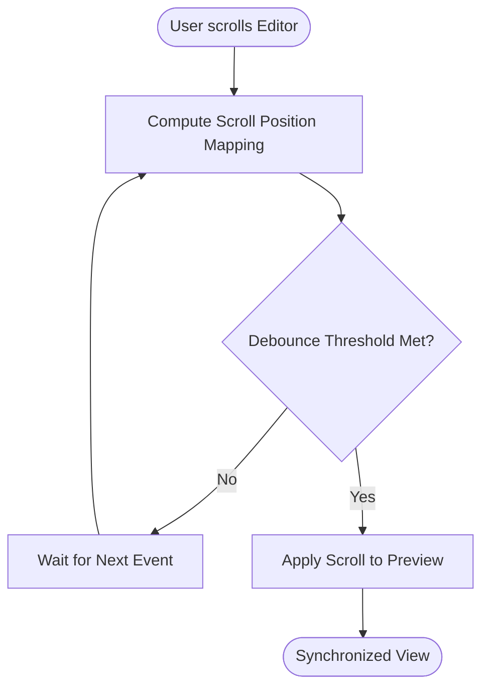
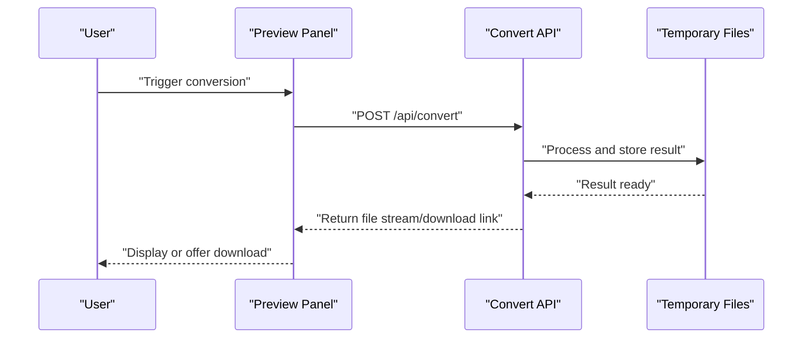

# Real-Time Preview Functionality

<cite>
**Referenced Files in This Document**
- [多格式文档互转工具 (SmartConvert) 需求文档.md](file://多格式文档互转工具 (SmartConvert) 需求文档.md)
</cite>

## Table of Contents
1. [Introduction](#introduction)
2. [Project Structure](#project-structure)
3. [Core Components](#core-components)
4. [Architecture Overview](#architecture-overview)
5. [Detailed Component Analysis](#detailed-component-analysis)
6. [Dependency Analysis](#dependency-analysis)
7. [Performance Considerations](#performance-considerations)
8. [Troubleshooting Guide](#troubleshooting-guide)
9. [Conclusion](#conclusion)
10. [Appendices](#appendices)

## Introduction
This document describes the real-time preview system for SmartConvert’s left-edit-right-preview layout. It focuses on the dual-panel interface design, synchronized scrolling, live Markdown rendering, source document preview display, converted document preview with syntax highlighting, responsive layout adaptation, and preview synchronization mechanisms. The document synthesizes the frontend and backend technologies outlined in the project requirements, including the Markdown parsing library selection and conversion workflow integration.

## Project Structure
The repository contains a single Markdown requirement document that defines the overall system, including the real-time preview feature and the Markdown rendering stack. The preview system is part of the frontend UI requirements and integrates with the backend conversion APIs.

**Diagram sources**
- [多格式文档互转工具 (SmartConvert) 需求文档.md:87](file://多格式文档互转工具 (SmartConvert) 需求文档.md#L87)
- [多格式文档互转工具 (SmartConvert) 需求文档.md:45](file://多格式文档互转工具 (SmartConvert) 需求文档.md#L45)
- [多格式文档互转工具 (SmartConvert) 需求文档.md:95](file://多格式文档互转工具 (SmartConvert) 需求文档.md#L95)

**Section sources**
- [多格式文档互转工具 (SmartConvert) 需求文档.md:81-92](file://多格式文档互转工具 (SmartConvert) 需求文档.md#L81-L92)
- [多格式文档互转工具 (SmartConvert) 需求文档.md:23-56](file://多格式文档互转工具 (SmartConvert) 需求文档.md#L23-L56)
- [多格式文档互转工具 (SmartConvert) 需求文档.md:93-99](file://多格式文档互转工具 (SmartConvert) 需求文档.md#L93-L99)

## Core Components
- Dual-panel layout: Left panel for editing source Markdown; right panel for live preview with syntax-highlighted HTML rendering.
- Live rendering engine: Integrated Markdown parser to transform source text into styled HTML.
- Synchronization: Scroll position synchronization between editor and preview panels.
- Responsive adaptation: Layout adjusts to different screen sizes while maintaining usability.
- Conversion workflow integration: Preview updates reflect the current state of the source document and can trigger backend conversions.

Key implementation references:
- Real-time preview requirement: [多格式文档互转工具 (SmartConvert) 需求文档.md:87](file://多格式文档互转工具 (SmartConvert) 需求文档.md#L87)
- Markdown parser selection: [多格式文档互转工具 (SmartConvert) 需求文档.md:45](file://多格式文档互转工具 (SmartConvert) 需求文档.md#L45)
- Conversion API: [多格式文档互转工具 (SmartConvert) 需求文档.md:95](file://多格式文档互转工具 (SmartConvert) 需求文档.md#L95)

**Section sources**
- [多格式文档互转工具 (SmartConvert) 需求文档.md:87](file://多格式文档互转工具 (SmartConvert) 需求文档.md#L87)
- [多格式文档互转工具 (SmartConvert) 需求文档.md:45](file://多格式文档互转工具 (SmartConvert) 需求文档.md#L45)
- [多格式文档互转工具 (SmartConvert) 需求文档.md:95](file://多格式文档互转工具 (SmartConvert) 需求文档.md#L95)

## Architecture Overview
The real-time preview system is composed of:
- Frontend UI: Editor and preview panels with synchronized scrolling and responsive layout.
- Rendering engine: Markdown parser integrated to produce HTML for the preview panel.
- Backend integration: Conversion API endpoint to process files and return results for download or inline display.

**Diagram sources**
- [多格式文档互转工具 (SmartConvert) 需求文档.md:87](file://多格式文档互转工具 (SmartConvert) 需求文档.md#L87)
- [多格式文档互转工具 (SmartConvert) 需求文档.md:45](file://多格式文档互转工具 (SmartConvert) 需求文档.md#L45)
- [多格式文档互转工具 (SmartConvert) 需求文档.md:95](file://多格式文档互转工具 (SmartConvert) 需求文档.md#L95)

## Detailed Component Analysis

### Dual-Panel Interface Design
- Layout: Left panel for source editing; right panel for rendered preview.
- Responsiveness: Panels adapt to viewport width; on small screens, stacking vertically may be preferred.
- Theming: Supports light/dark mode toggles to match the overall application theme.

Implementation references:
- Real-time preview requirement: [多格式文档互转工具 (SmartConvert) 需求文档.md:87](file://多格式文档互转工具 (SmartConvert) 需求文档.md#L87)
- Theme support: [多格式文档互转工具 (SmartConvert) 需求文档.md:83](file://多格式文档互转工具 (SmartConvert) 需求文档.md#L83)

**Section sources**
- [多格式文档互转工具 (SmartConvert) 需求文档.md:83](file://多格式文档互转工具 (SmartConvert) 需求文档.md#L83)
- [多格式文档互转工具 (SmartConvert) 需求文档.md:87](file://多格式文档互转工具 (SmartConvert) 需求文档.md#L87)

### Live Markdown Rendering Engine Integration
- Parser: flexmark-java is selected for robust Markdown parsing.
- Renderer: Produces HTML suitable for preview; can integrate syntax highlighting for code blocks.
- DOM updates: Live updates occur on source changes without page reloads.

Implementation references:
- Markdown parser selection: [多格式文档互转工具 (SmartConvert) 需求文档.md:45](file://多格式文档互转工具 (SmartConvert) 需求文档.md#L45)

**Diagram sources**
- [多格式文档互转工具 (SmartConvert) 需求文档.md:45](file://多格式文档互转工具 (SmartConvert) 需求文档.md#L45)

**Section sources**
- [多格式文档互转工具 (SmartConvert) 需求文档.md:45](file://多格式文档互转工具 (SmartConvert) 需求文档.md#L45)

### Source Document Preview Display
- The left panel displays the raw Markdown source with syntax-aware editing features (e.g., bracket matching, auto-indent).
- Live updates propagate to the preview panel immediately upon typing or editing.

Implementation references:
- Real-time preview requirement: [多格式文档互转工具 (SmartConvert) 需求文档.md:87](file://多格式文档互转工具 (SmartConvert) 需求文档.md#L87)

**Section sources**
- [多格式文档互转工具 (SmartConvert) 需求文档.md:87](file://多格式文档互转工具 (SmartConvert) 需求文档.md#L87)

### Converted Document Preview with Syntax Highlighting
- The preview panel renders HTML produced by the Markdown parser.
- Syntax highlighting is applied to code blocks to improve readability.
- The preview reflects the current state of the source document in real time.

Implementation references:
- Markdown parser selection: [多格式文档互转工具 (SmartConvert) 需求文档.md:45](file://多格式文档互转工具 (SmartConvert) 需求文档.md#L45)

**Section sources**
- [多格式文档互转工具 (SmartConvert) 需求文档.md:45](file://多格式文档互转工具 (SmartConvert) 需求文档.md#L45)

### Responsive Layout Adaptation
- On smaller screens, panels may switch to a stacked vertical layout to optimize usability.
- Breakpoints and adaptive styles ensure readable text and functional controls across devices.

Implementation references:
- UI requirement: [多格式文档互转工具 (SmartConvert) 需求文档.md:87](file://多格式文档互转工具 (SmartConvert) 需求文档.md#L87)

**Section sources**
- [多格式文档互转工具 (SmartConvert) 需求文档.md:87](file://多格式文档互转工具 (SmartConvert) 需求文档.md#L87)

### Preview Synchronization Mechanisms
- Scroll synchronization: As the user scrolls in the editor, the preview follows to maintain visual alignment.
- Position mapping: Coordinates are computed to translate editor scroll positions to preview scroll positions.
- Debouncing: Scroll events are debounced to prevent excessive reflows and maintain smoothness.

[No sources needed since this diagram shows conceptual workflow, not actual code structure]

### Supported Markdown Features and Limitations
- Supported features: Headings, lists, tables, emphasis, links, images, code blocks, and inline formatting.
- Limitations: Complex layouts and advanced formatting may not render perfectly; PDF-to-MD conversion may introduce layout discrepancies.

Implementation references:
- Feature coverage: [多格式文档互转工具 (SmartConvert) 需求文档.md:71](file://多格式文档互转工具 (SmartConvert) 需求文档.md#L71)
- PDF conversion note: [多格式文档互转工具 (SmartConvert) 需求文档.md:75](file://多格式文档互转工具 (SmartConvert) 需求文档.md#L75)

**Section sources**
- [多格式文档互转工具 (SmartConvert) 需求文档.md:71](file://多格式文档互转工具 (SmartConvert) 需求文档.md#L71)
- [多格式文档互转工具 (SmartConvert) 需求文档.md:75](file://多格式文档互转工具 (SmartConvert) 需求文档.md#L75)

### Integration with Conversion Workflow
- The preview system can trigger backend conversions via the conversion API.
- Conversion results can be downloaded or displayed inline, depending on the user action.

Implementation references:
- Conversion API: [多格式文档互转工具 (SmartConvert) 需求文档.md:95](file://多格式文档互转工具 (SmartConvert) 需求文档.md#L95)

**Diagram sources**
- [多格式文档互转工具 (SmartConvert) 需求文档.md:95](file://多格式文档互转工具 (SmartConvert) 需求文档.md#L95)

**Section sources**
- [多格式文档互转工具 (SmartConvert) 需求文档.md:95](file://多格式文档互转工具 (SmartConvert) 需求文档.md#L95)

## Dependency Analysis
- Frontend depends on the Markdown parser for rendering previews.
- Preview updates depend on the editor’s content changes and scroll synchronization logic.
- Backend conversion API provides results for download or inline display.

**Diagram sources**
- [多格式文档互转工具 (SmartConvert) 需求文档.md:45](file://多格式文档互转工具 (SmartConvert) 需求文档.md#L45)
- [多格式文档互转工具 (SmartConvert) 需求文档.md:95](file://多格式文档互转工具 (SmartConvert) 需求文档.md#L95)

**Section sources**
- [多格式文档互转工具 (SmartConvert) 需求文档.md:45](file://多格式文档互转工具 (SmartConvert) 需求文档.md#L45)
- [多格式文档互转工具 (SmartConvert) 需求文档.md:95](file://多格式文档互转工具 (SmartConvert) 需求文档.md#L95)

## Performance Considerations
- Debounce scroll and render events to reduce CPU usage during rapid edits or scrolling.
- Use virtualized rendering for long documents to minimize DOM overhead.
- Lazy-load syntax highlighting to avoid blocking initial render.
- Cache parsed ASTs or intermediate HTML to accelerate repeated renders.

[No sources needed since this section provides general guidance]

## Troubleshooting Guide
- Preview not updating: Verify that the editor-to-render pipeline triggers on input changes and that the renderer is invoked after parsing.
- Scroll desync: Confirm that the scroll sync mechanism applies mapped positions consistently and that debounce thresholds are tuned appropriately.
- Syntax highlighting missing: Ensure the renderer includes syntax highlighting for code blocks and that styles are loaded.
- Conversion failures: Check the conversion API response and temporary file cleanup policies.

[No sources needed since this section provides general guidance]

## Conclusion
The real-time preview system combines a dual-panel layout, live Markdown rendering, and synchronized scrolling to deliver an efficient editing experience. By integrating a robust Markdown parser and responsive design, the system supports seamless authoring and immediate feedback. Backend integration enables conversion workflows, while performance optimizations ensure smooth operation across devices.

[No sources needed since this section summarizes without analyzing specific files]

## Appendices
- Example Markdown features supported: headings, lists, tables, emphasis, links, images, code blocks, inline formatting.
- PDF conversion note: Text extraction preserves hierarchy; complex layouts may vary.

**Section sources**
- [多格式文档互转工具 (SmartConvert) 需求文档.md:71](file://多格式文档互转工具 (SmartConvert) 需求文档.md#L71)
- [多格式文档互转工具 (SmartConvert) 需求文档.md:75](file://多格式文档互转工具 (SmartConvert) 需求文档.md#L75)