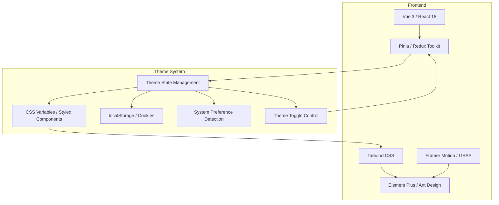
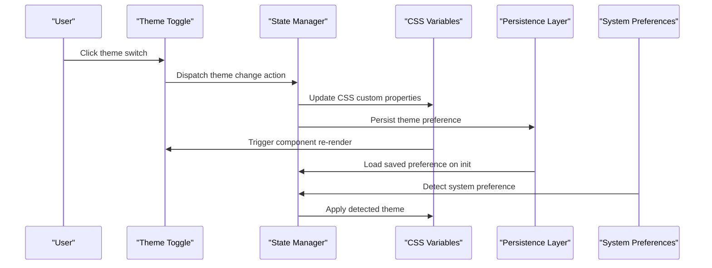
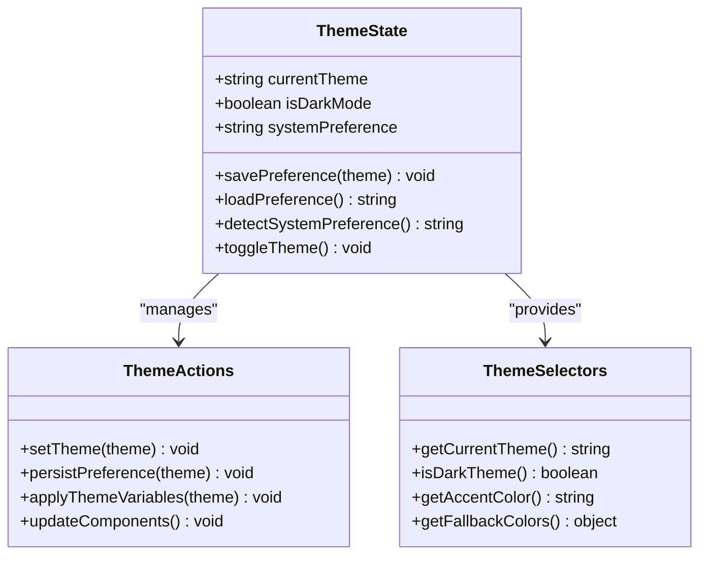
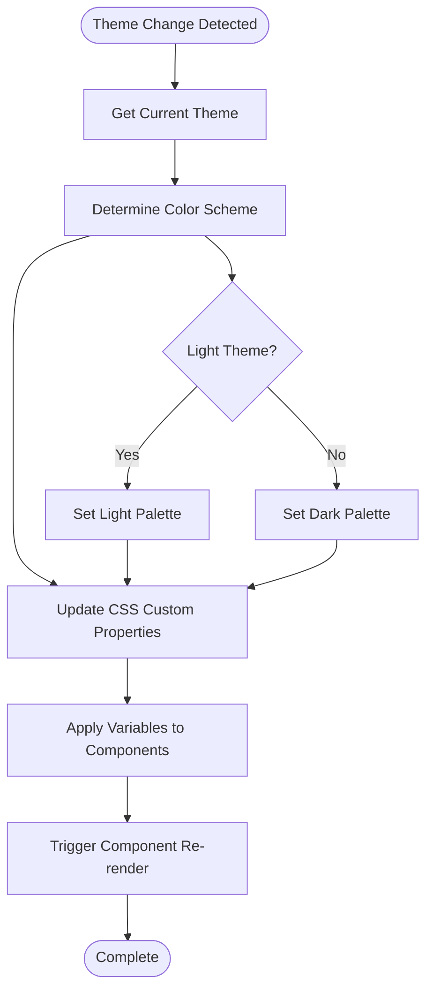
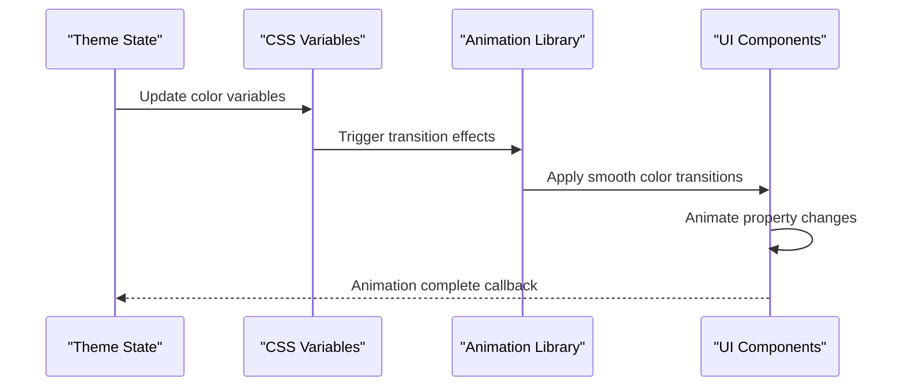
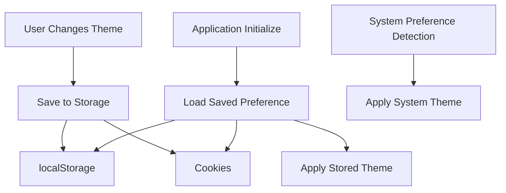
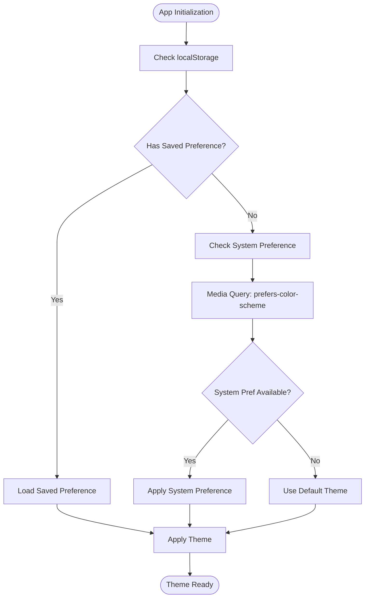
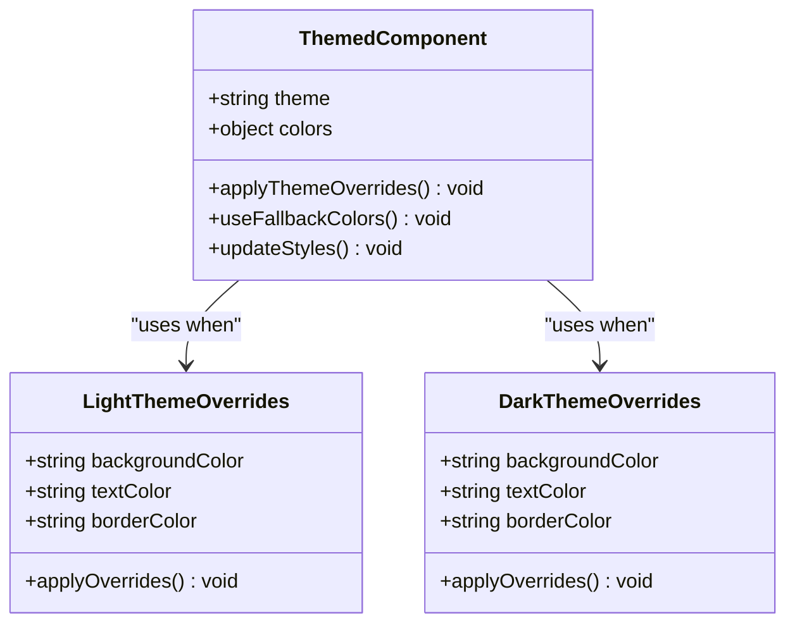
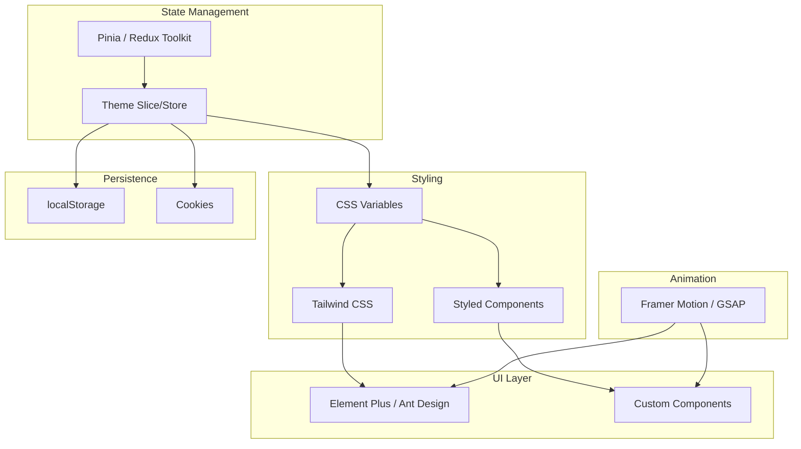

# Theme Switching Mechanism

<cite>
**Referenced Files in This Document**
- [多格式文档互转工具 (SmartConvert) 需求文档.md](file://多格式文档互转工具 (SmartConvert) 需求文档.md)
</cite>

## Table of Contents
1. [Introduction](#introduction)
2. [Project Structure](#project-structure)
3. [Core Components](#core-components)
4. [Architecture Overview](#architecture-overview)
5. [Detailed Component Analysis](#detailed-component-analysis)
6. [Dependency Analysis](#dependency-analysis)
7. [Performance Considerations](#performance-considerations)
8. [Troubleshooting Guide](#troubleshooting-guide)
9. [Conclusion](#conclusion)

## Introduction
This document describes the theme switching mechanism for the SmartConvert application. Based on the project requirements, the application supports a dark/light theme toggle and follows modern UI/UX guidelines with a focus on minimal white/graphite black color palettes and accent colors such as Indigo or Emerald. The implementation leverages the chosen frontend stack (Vue 3 or React 18 with Vite) and Tailwind CSS for styling, with Pinia or Redux Toolkit for state management.

## Project Structure
The repository currently contains only a requirements document. The theme system is planned to integrate with the frontend framework and styling pipeline as follows:
- Frontend framework: Vue 3 (Composition API) or React 18
- Build tool: Vite
- UI components: Element Plus (Vue) or Ant Design (React)
- Styling: Tailwind CSS
- State management: Pinia (Vue) or Redux Toolkit (React)
- Animation library: Framer Motion or GSAP

**Section sources**
- [多格式文档互转工具 (SmartConvert) 需求文档.md:23-38](file://多格式文档互转工具 (SmartConvert) 需求文档.md#L23-L38)
- [多格式文档互转工具 (SmartConvert) 需求文档.md:81-111](file://多格式文档互转工具 (SmartConvert) 需求文档.md#L81-L111)

## Core Components
The theme switching system comprises several interconnected components:

- Theme State Management: Centralized state for theme preferences, persisted across sessions
- Theme Toggle Control: User interface element for switching between themes
- CSS Variable Layer: Dynamic color updates via CSS custom properties or styled-components
- Persistence Layer: localStorage or cookies for storing user preferences
- System Preference Detection: Automatic theme selection based on OS/browser settings
- Animation Pipeline: Smooth transitions using motion libraries

Key implementation patterns:
- CSS custom properties for dynamic color updates
- Component re-rendering triggers through reactive state updates
- Cross-browser compatibility through standardized APIs
- Accessibility compliance with WCAG guidelines

**Section sources**
- [多格式文档互转工具 (SmartConvert) 需求文档.md:83](file://多格式文档互转工具 (SmartConvert) 需求文档.md#L83)
- [多格式文档互转工具 (SmartConvert) 需求文档.md:105](file://多格式文档互转工具 (SmartConvert) 需求文档.md#L105)

## Architecture Overview
The theme system architecture integrates with the application's frontend framework and styling pipeline:

**Diagram sources**
- [多格式文档互转工具 (SmartConvert) 需求文档.md:83](file://多格式文档互转工具 (SmartConvert) 需求文档.md#L83)
- [多格式文档互转工具 (SmartConvert) 需求文档.md:105](file://多格式文档互转工具 (SmartConvert) 需求文档.md#L105)

## Detailed Component Analysis

### Theme State Management
The state management component handles theme preferences using the chosen framework's reactive system:

Implementation considerations:
- Reactive state updates trigger component re-renders automatically
- Theme preference persistence ensures continuity across browser sessions
- System preference detection provides seamless user experience

**Section sources**
- [多格式文档互转工具 (SmartConvert) 需求文档.md:35](file://多格式文档互转工具 (SmartConvert) 需求文档.md#L35)
- [多格式文档互转工具 (SmartConvert) 需求文档.md:83](file://多格式文档互转工具 (SmartConvert) 需求文档.md#L83)

### CSS Variable Updates
The styling layer implements dynamic color updates through CSS custom properties:

Color scheme implementation:
- Light theme: White backgrounds, graphite/black text, indigo/emerald accents
- Dark theme: Graphite/black backgrounds, white/text, indigo/emerald accents
- Fallback colors ensure readability when variables are unavailable

**Section sources**
- [多格式文档互转工具 (SmartConvert) 需求文档.md:105](file://多格式文档互转工具 (SmartConvert) 需求文档.md#L105)

### Smooth Transition Animations
Animation implementation uses motion libraries for seamless theme transitions:

Animation characteristics:
- CSS transitions for color property changes
- Motion library enhancements for complex animations
- Consistent timing functions across components
- Performance optimization through hardware acceleration

**Section sources**
- [多格式文档互转工具 (SmartConvert) 需求文档.md:37](file://多格式文档互转工具 (SmartConvert) 需求文档.md#L37)

### Persistent Theme Preference Storage
The persistence layer ensures theme preferences are maintained across sessions:

Storage mechanisms:
- localStorage for client-side persistence
- Cookies as fallback for older browsers
- Priority-based loading to ensure reliability

**Section sources**
- [多格式文档互转工具 (SmartConvert) 需求文档.md:83](file://多格式文档互转工具 (SmartConvert) 需求文档.md#L83)

### System Preference Detection
Automatic theme selection based on system/browser settings:

System preference detection:
- CSS media queries for system theme detection
- Fallback to default theme when system preference unavailable
- Automatic updates when system preference changes

**Section sources**
- [多格式文档互转工具 (SmartConvert) 需求文档.md:83](file://多格式文档互转工具 (SmartConvert) 需求文档.md#L83)

### Theme-Aware Component Styling
Component-specific styling overrides ensure consistent theming:

Component styling patterns:
- Conditional styling based on current theme
- Fallback color resolution for accessibility
- Override mechanisms for component-specific needs
- Consistent spacing and typography across themes

**Section sources**
- [多格式文档互转工具 (SmartConvert) 需求文档.md:105](file://多格式文档互转工具 (SmartConvert) 需求文档.md#L105)

## Dependency Analysis
The theme system integrates with the application's frontend architecture:

Integration points:
- State management drives all theme decisions
- Styling system responds to state changes
- Animation library enhances user experience
- Persistence ensures continuity across sessions

**Section sources**
- [多格式文档互转工具 (SmartConvert) 需求文档.md:23-38](file://多格式文档互转工具 (SmartConvert) 需求文档.md#L23-L38)

## Performance Considerations
Theme switching performance optimization strategies:

- CSS variable updates are hardware-accelerated and efficient
- Minimal DOM manipulation reduces layout thrashing
- Animation libraries provide optimized transition performance
- Lazy loading prevents unnecessary initial theme calculations
- Debounced preference saving prevents excessive storage writes

Cross-browser compatibility:
- CSS custom properties with fallback support
- Media query polyfills for older browsers
- Feature detection for graceful degradation
- Vendor prefix handling for animation properties

Accessibility compliance:
- WCAG contrast ratios maintained across themes
- Focus indicators visible in both themes
- Sufficient color contrast for text elements
- Screen reader compatibility with theme changes

## Troubleshooting Guide
Common theme switching issues and solutions:

**Theme not persisting between sessions:**
- Verify localStorage availability and permissions
- Check cookie fallback implementation
- Ensure proper initialization order

**Animations not working:**
- Confirm animation library installation
- Verify CSS transition properties
- Check for conflicting CSS rules

**System preference not detected:**
- Validate media query support
- Test with different browsers
- Implement manual override option

**Color contrast issues:**
- Use accessibility testing tools
- Verify WCAG compliance
- Adjust color variables as needed

**Section sources**
- [多格式文档互转工具 (SmartConvert) 需求文档.md:83](file://多格式文档互转工具 (SmartConvert) 需求文档.md#L83)

## Conclusion
The SmartConvert theme switching mechanism provides a robust, accessible, and performant solution for dark/light mode support. By leveraging the chosen frontend stack with reactive state management, CSS custom properties, and animation libraries, the system delivers seamless theme transitions while maintaining cross-browser compatibility and accessibility standards. The modular architecture allows for easy maintenance and future enhancements to the theme system.