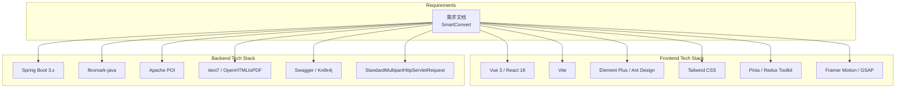
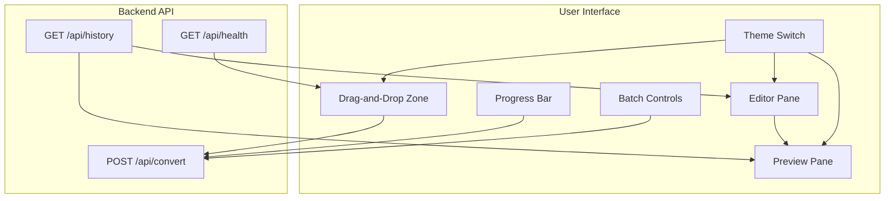
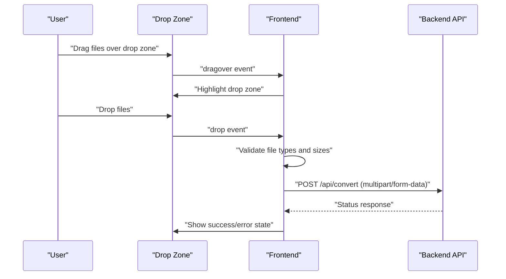
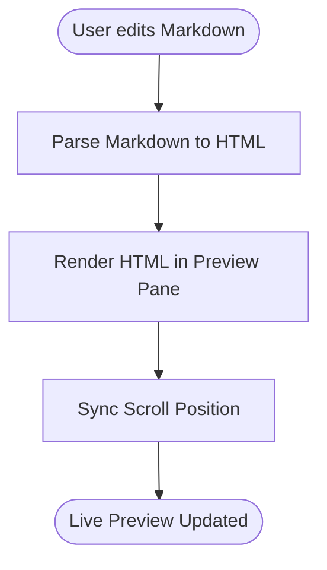
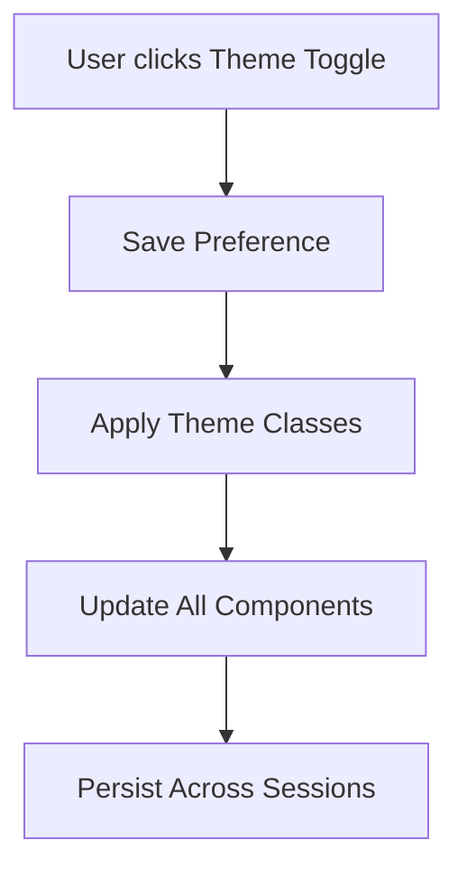
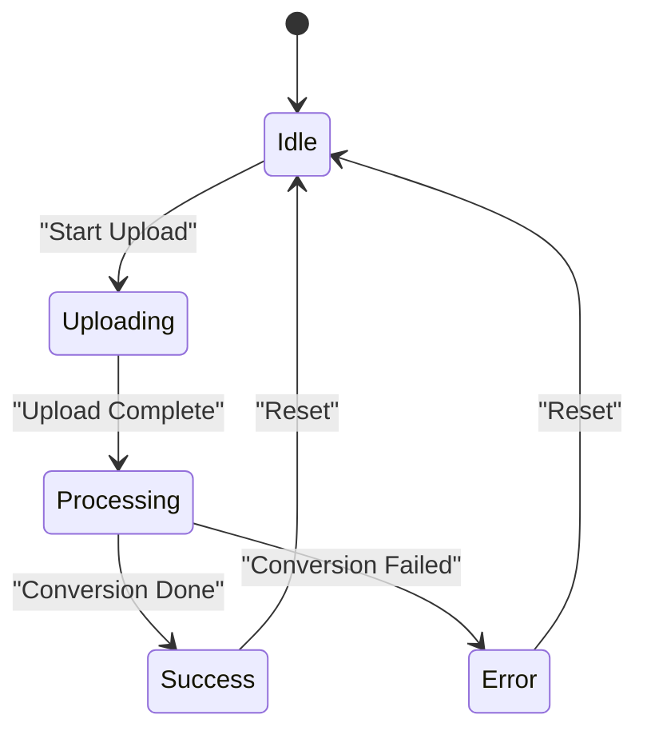
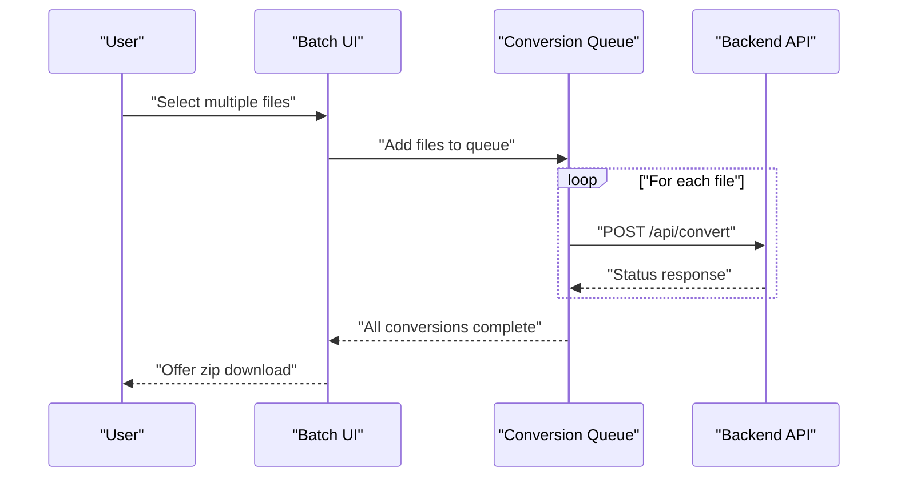
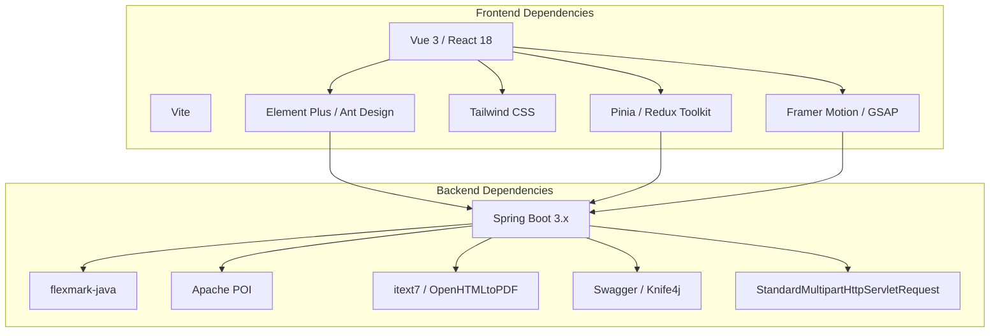

# User Interface Components

<cite>
**Referenced Files in This Document**
- [多格式文档互转工具 (SmartConvert) 需求文档.md](file://多格式文档互转工具 (SmartConvert) 需求文档.md)
</cite>

## Table of Contents
1. [Introduction](#introduction)
2. [Project Structure](#project-structure)
3. [Core Components](#core-components)
4. [Architecture Overview](#architecture-overview)
5. [Detailed Component Analysis](#detailed-component-analysis)
6. [Dependency Analysis](#dependency-analysis)
7. [Performance Considerations](#performance-considerations)
8. [Troubleshooting Guide](#troubleshooting-guide)
9. [Conclusion](#conclusion)
10. [Appendices](#appendices)

## Introduction
This document focuses on the user interface components for SmartConvert’s modern web-based interaction design. It covers the drag-and-drop upload system with Vercel/Apple-style interface, real-time preview functionality with a left-edit-right-preview layout, theme switching capabilities for dark/light mode, progress feedback mechanisms with animated loading states, and batch processing for multiple file operations. It also explains UI/UX design principles including color schemes (white/gray with Indigo/Emerald accents), card-based layout with backdrop blur effects, micro-interactions for user feedback, and responsive design considerations. Practical examples of component usage, accessibility features, and cross-browser compatibility requirements are included.

## Project Structure
The repository currently contains a single requirements document that outlines the frontend and backend technology stack, UI/UX expectations, and functional requirements for the conversion tool. The UI components are planned to be built with modern frameworks and libraries, leveraging Tailwind CSS for styling and animation libraries for micro-interactions.

**Section sources**
- [多格式文档互转工具 (SmartConvert) 需求文档.md:23-63](file://多格式文档互转工具 (SmartConvert) 需求文档.md#L23-L63)

## Core Components
This section documents the primary UI components and their intended behaviors as outlined in the requirements:

- Drag-and-Drop Upload Area (Vercel/Apple-style): A visually prominent drop zone that accepts multiple file types, provides visual feedback during drag and drop, and integrates with the backend conversion API.
- Real-Time Preview Panel (Left-Edit Right-Preview): A split-pane layout where the left pane displays the editor (e.g., Markdown editor) and the right pane renders the live preview of the converted content.
- Theme Switching (Dark/Light Mode): A toggle that switches the entire application theme, persisting the preference across sessions.
- Progress Feedback (Animated Loading States): Animated progress indicators and status messages during file processing to inform users of conversion progress.
- Batch Processing: Capability to select multiple files, queue them for conversion, and download a zip archive upon completion.

Practical usage examples:
- Drag-and-drop upload: Users drag files onto the drop zone; the system validates file types and initiates conversion.
- Real-time preview: As users edit Markdown, the preview updates instantly to reflect changes.
- Theme switch: A top-level toggle switches between light and dark themes; the preference persists.
- Progress feedback: During conversion, a progress bar and status message indicate processing state.
- Batch processing: Users select multiple files; the system converts them and offers a single download link for a zip archive.

Accessibility and cross-browser compatibility:
- Accessibility: Ensure keyboard navigation, ARIA attributes, focus management, and screen reader support for interactive elements.
- Cross-browser compatibility: Test drag-and-drop, file input, and preview rendering across major browsers; polyfills may be needed for older environments.

**Section sources**
- [多格式文档互转工具 (SmartConvert) 需求文档.md:81-111](file://多格式文档互转工具 (SmartConvert) 需求文档.md#L81-L111)

## Architecture Overview
The UI components integrate with the backend conversion service through REST endpoints. The frontend handles user interactions, manages state, and renders previews while the backend performs file parsing and transformation.

**Section sources**
- [多格式文档互转工具 (SmartConvert) 需求文档.md:93-101](file://多格式文档互转工具 (SmartConvert) 需求文档.md#L93-L101)

## Detailed Component Analysis

### Drag-and-Drop Upload Area (Vercel/Apple-style)
Design goals:
- Minimalist, centered drop zone with clear instructions.
- Visual feedback during hover/drag-over states.
- File type validation and size constraints.
- Submission to the conversion endpoint.

Implementation considerations:
- Use HTML5 File API for drag-and-drop events.
- Validate file extensions and sizes client-side before upload.
- Provide immediate feedback (e.g., icons, tooltips) for accepted/rejected files.
- Integrate with the conversion endpoint to trigger processing.

**Section sources**
- [多格式文档互转工具 (SmartConvert) 需求文档.md:85](file://多格式文档互转工具 (SmartConvert) 需求文档.md#L85)
- [多格式文档互转工具 (SmartConvert) 需求文档.md:95](file://多格式文档互转工具 (SmartConvert) 需求文档.md#L95)

### Real-Time Preview (Left-Edit Right-Preview)
Design goals:
- Split-pane layout with an editor on the left and a live preview on the right.
- Instant rendering of Markdown to HTML for visual feedback.
- Responsive layout that adapts to screen size.

Implementation considerations:
- Use a Markdown parser library to render HTML from Markdown input.
- Debounce or throttle preview updates to balance responsiveness and performance.
- Ensure scroll synchronization between editor and preview panes.

**Section sources**
- [多格式文档互转工具 (SmartConvert) 需求文档.md:87](file://多格式文档互转工具 (SmartConvert) 需求文档.md#L87)

### Theme Switching (Dark/Light Mode)
Design goals:
- One-click toggle to switch between themes.
- Persistent theme preference across sessions.
- Consistent color scheme using white/gray with Indigo/Emerald accents.

Implementation considerations:
- Store theme preference in local storage or session storage.
- Apply CSS custom properties or Tailwind variants to switch styles.
- Ensure all components adapt to the selected theme.

**Section sources**
- [多格式文档互转工具 (SmartConvert) 需求文档.md:83](file://多格式文档互转工具 (SmartConvert) 需求文档.md#L83)
- [多格式文档互转工具 (SmartConvert) 需求文档.md:105](file://多格式文档互转工具 (SmartConvert) 需求文档.md#L105)

### Progress Feedback (Animated Loading States)
Design goals:
- Clear progress indication during conversion.
- Animated loading states to improve perceived performance.
- Status messages indicating current operation.

Implementation considerations:
- Show a progress bar and status text during upload and conversion.
- Use micro-interactions (e.g., subtle animations) to signal activity.
- Provide cancellation or retry options if applicable.

**Section sources**
- [多格式文档互转工具 (SmartConvert) 需求文档.md:89](file://多格式文档互转工具 (SmartConvert) 需求文档.md#L89)

### Batch Processing (Multiple File Operations)
Design goals:
- Allow users to select multiple files for conversion.
- Queue and process files concurrently or sequentially.
- Offer a single download link for a zip archive.

Implementation considerations:
- Enable multi-select file input and drag-and-drop.
- Maintain a queue of files and track individual statuses.
- Combine results into a downloadable archive.

**Section sources**
- [多格式文档互转工具 (SmartConvert) 需求文档.md:91](file://多格式文档互转工具 (SmartConvert) 需求文档.md#L91)

### UI/UX Design Principles
- Color Scheme: White/gray base with Indigo (600) or Emerald (500) accents for highlights and actions.
- Card-Based Layout: Floating cards with backdrop blur effects to create depth and focus.
- Micro-Interactions: Subtle animations for button presses, hover states, and transitions.
- Responsive Design: Flexible layouts that adapt to mobile, tablet, and desktop screens.

Accessibility and cross-browser compatibility:
- Accessibility: Ensure keyboard navigation, ARIA roles, focus outlines, and screen reader support.
- Cross-browser compatibility: Test drag-and-drop, file input, and preview rendering across Chrome, Firefox, Safari, and Edge.

**Section sources**
- [多格式文档互转工具 (SmartConvert) 需求文档.md:105-111](file://多格式文档互转工具 (SmartConvert) 需求文档.md#L105-L111)

## Dependency Analysis
The UI components depend on the frontend framework and libraries, and integrate with backend APIs for file conversion and history.

**Section sources**
- [多格式文档互转工具 (SmartConvert) 需求文档.md:23-63](file://多格式文档互转工具 (SmartConvert) 需求文档.md#L23-L63)

## Performance Considerations
- Debounce preview updates to reduce re-renders during rapid editing.
- Use virtualized lists for long conversion histories.
- Optimize image handling in previews to prevent layout thrashing.
- Minimize bundle size by tree-shaking animations and UI components.

## Troubleshooting Guide
Common issues and resolutions:
- Drag-and-drop not working: Verify browser support and enable JavaScript. Check for conflicting event handlers.
- Preview not updating: Confirm the Markdown parser is initialized and debounced appropriately.
- Theme not persisting: Ensure local storage is enabled and the theme toggle saves preferences correctly.
- Batch conversion errors: Validate file types and sizes before queuing. Handle network failures gracefully with retry logic.

**Section sources**
- [多格式文档互转工具 (SmartConvert) 需求文档.md:165-177](file://多格式文档互转工具 (SmartConvert) 需求文档.md#L165-L177)

## Conclusion
The UI components for SmartConvert are designed around a modern, responsive, and accessible interface. By implementing a Vercel/Apple-style drag-and-drop upload area, real-time preview with a left-edit/right-preview layout, theme switching, animated progress feedback, and batch processing, the application delivers a seamless user experience. Adhering to the outlined design principles and addressing accessibility and cross-browser compatibility ensures broad usability and maintainability.

## Appendices
- API Endpoints:
  - POST /api/convert: Initiates conversion with multipart/form-data.
  - GET /api/history: Retrieves recent conversion records.
  - GET /api/health: Health check endpoint.

**Section sources**
- [多格式文档互转工具 (SmartConvert) 需求文档.md:95-99](file://多格式文档互转工具 (SmartConvert) 需求文档.md#L95-L99)