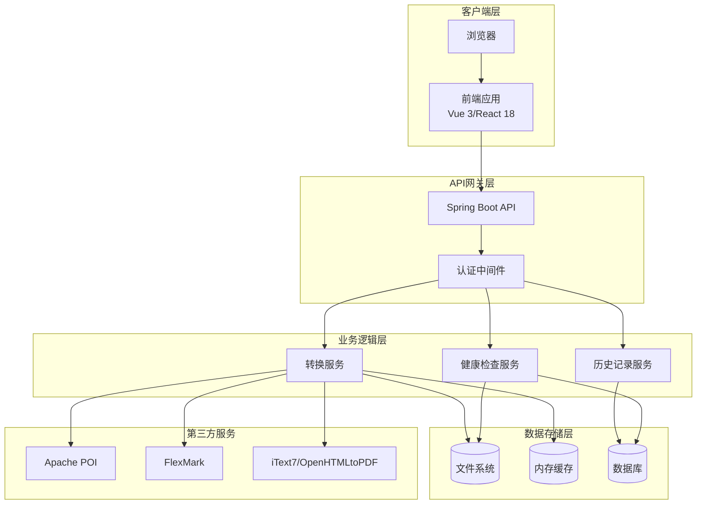
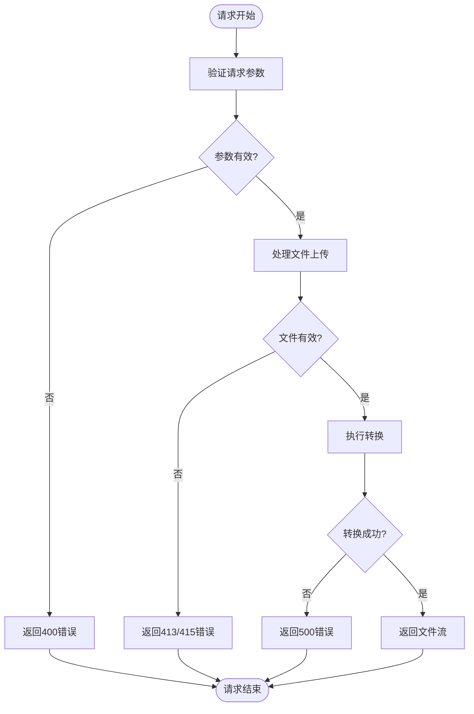
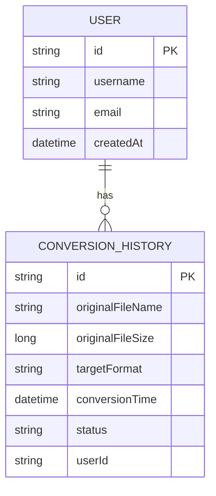
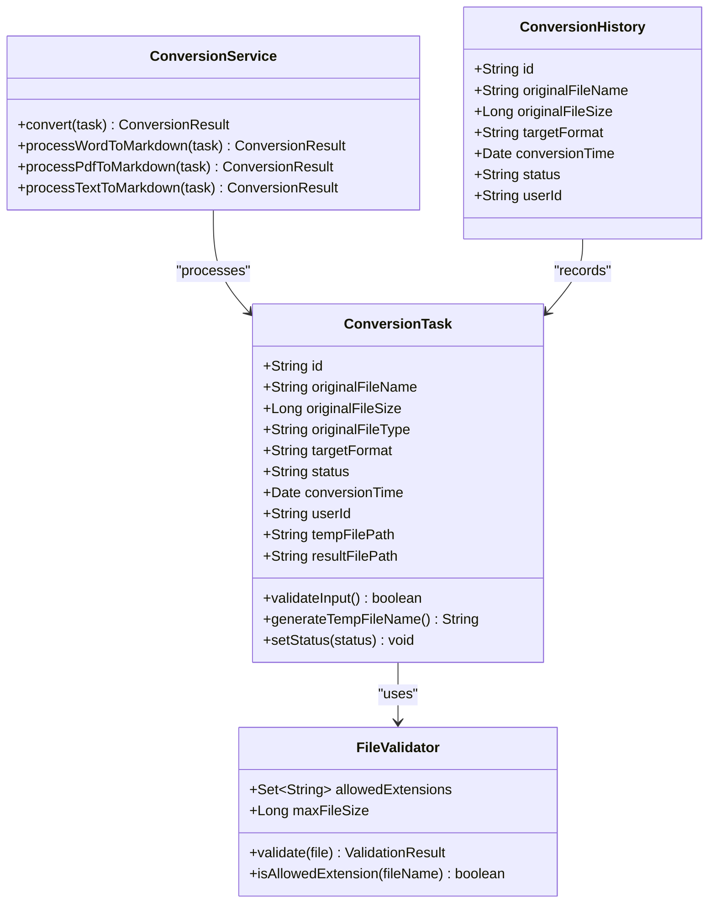
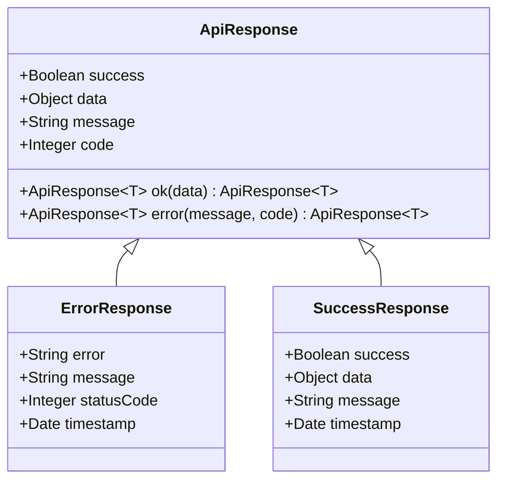
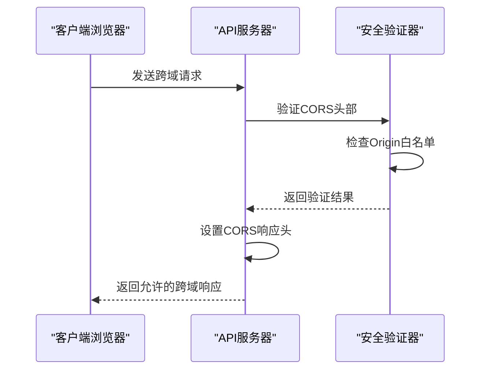
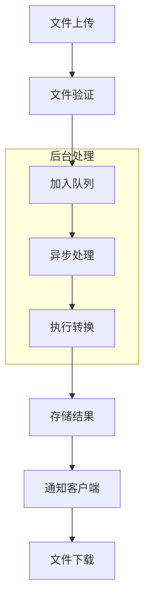
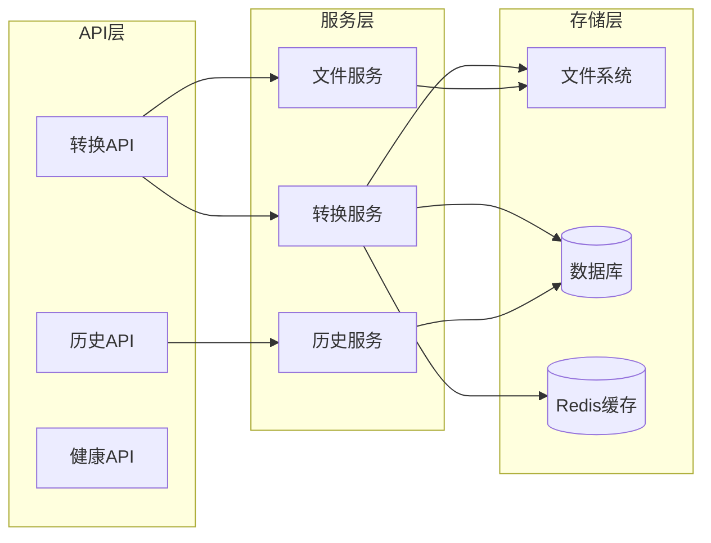

# 后端API设计

<cite>
**本文档引用的文件**
- [多格式文档互转工具 (SmartConvert) 需求文档.md](file://多格式文档互转工具 (SmartConvert) 需求文档.md)
</cite>

## 目录
1. [项目概述](#项目概述)
2. [技术架构](#技术架构)
3. [核心API接口](#核心api接口)
4. [API详细规范](#api详细规范)
5. [数据模型设计](#数据模型设计)
6. [安全与认证](#安全与认证)
7. [性能优化策略](#性能优化策略)
8. [扩展性考虑](#扩展性考虑)
9. [部署与监控](#部署与监控)
10. [最佳实践指南](#最佳实践指南)

## 项目概述

SmartConvert是一款基于Web的文档格式转换工具，支持Word、PDF、Text与Markdown之间的双向互转。该项目采用现代化的技术栈，旨在为开发者、撰稿人和学生提供一个极简、高效且视觉精美的文档处理平台。

### 核心特性
- **高保真度格式转换**：实现Word、PDF、Text与Markdown之间的高质量转换
- **响应式前端界面**：提供现代化的用户交互体验
- **高性能后端处理**：基于Spring Boot构建的处理引擎
- **无注册使用**：无需用户注册即可享受基础转换功能

## 技术架构

### 后端技术栈
- **核心框架**：Spring Boot 3.x
- **文件处理库**：
  - Markdown解析：flexmark-java
  - Word处理：Apache POI
  - PDF处理：itext7或OpenHTMLtoPDF
- **接口文档**：Swagger/Knife4j
- **文件上传**：Spring StandardMultipartHttpServletRequest

### 系统架构图



**图表来源**
- [多格式文档互转工具 (SmartConvert) 需求文档.md: 39-56](file://多格式文档互转工具 (SmartConvert) 需求文档.md#L39-L56)

## 核心API接口

SmartConvert后端提供三个核心API接口，分别负责文件转换、历史记录查询和系统健康检查。

### 接口概览

| 接口名称 | 方法 | 路径 | 描述 |
|---------|------|------|------|
| 文件转换 | POST | `/api/convert` | 核心转换接口，支持多种格式间的双向转换 |
| 转换历史 | GET | `/api/history` | 查询最近的转换记录 |
| 系统健康 | GET | `/api/health` | 系统健康状态检查 |

## API详细规范

### POST /api/convert - 文件转换接口

#### 请求参数

**表单参数**
| 参数名 | 类型 | 必填 | 描述 | 示例值 |
|--------|------|------|------|--------|
| file | File | 是 | 待转换的文件 | docx/pdf/txt文件 |
| targetFormat | String | 是 | 目标格式类型 | `markdown`、`pdf`、`docx`、`text` |

**支持的转换格式**
- **输入格式**：`.docx`、`.pdf`、`.txt`
- **输出格式**：`.md`、`.pdf`、`.docx`、`.txt`

#### 请求示例

**cURL示例**
```bash
curl -X POST "http://localhost:8080/api/convert" \
  -H "Content-Type: multipart/form-data" \
  -F "file=@document.docx" \
  -F "targetFormat=markdown" \
  -o converted_document.md
```

**JavaScript示例**
```javascript
const formData = new FormData();
formData.append('file', fileInput.files[0]);
formData.append('targetFormat', 'markdown');

fetch('/api/convert', {
  method: 'POST',
  body: formData
})
.then(response => response.blob())
.then(blob => {
  const url = window.URL.createObjectURL(blob);
  const a = document.createElement('a');
  a.href = url;
  a.download = 'converted.md';
  document.body.appendChild(a);
  a.click();
});
```

#### 响应格式

**成功响应**
- **状态码**：200 OK
- **Content-Type**：application/octet-stream
- **Content-Disposition**：attachment; filename="converted.md"
- **响应体**：转换后的文件二进制流

**错误响应**
- **状态码**：400 Bad Request
- **状态码**：413 Payload Too Large
- **状态码**：415 Unsupported Media Type
- **状态码**：500 Internal Server Error

#### 错误处理



**图表来源**
- [多格式文档互转工具 (SmartConvert) 需求文档.md: 145-161](file://多格式文档互转工具 (SmartConvert) 需求文档.md#L145-L161)

### GET /api/history - 转换历史查询

#### 请求参数

**查询参数**
| 参数名 | 类型 | 必填 | 描述 | 默认值 |
|--------|------|------|------|--------|
| limit | Integer | 否 | 返回记录数量限制 | 50 |
| offset | Integer | 否 | 分页偏移量 | 0 |

#### 响应格式

**成功响应**
```json
{
  "success": true,
  "data": [
    {
      "id": "123456789",
      "originalFileName": "document.docx",
      "originalFileSize": 1024000,
      "targetFormat": "markdown",
      "conversionTime": "2024-01-15T10:30:00Z",
      "status": "success"
    }
  ],
  "total": 10
}
```

**错误响应**
- **状态码**：500 Internal Server Error

#### 历史记录数据模型



**图表来源**
- [多格式文档互转工具 (SmartConvert) 需求文档.md: 97](file://多格式文档互转工具 (SmartConvert) 需求文档.md#L97)

### GET /api/health - 系统健康检查

#### 请求参数
无

#### 响应格式

**健康状态**
```json
{
  "status": "healthy",
  "timestamp": "2024-01-15T10:30:00Z",
  "version": "1.0.0",
  "services": {
    "fileSystem": "healthy",
    "database": "healthy",
    "conversionEngine": "healthy"
  }
}
```

**不健康状态**
```json
{
  "status": "unhealthy",
  "timestamp": "2024-01-15T10:30:00Z",
  "version": "1.0.0",
  "services": {
    "fileSystem": "unhealthy",
    "database": "healthy",
    "conversionEngine": "healthy"
  },
  "details": {
    "fileSystem": "Disk space low"
  }
}
```

## 数据模型设计

### 转换任务模型



**图表来源**
- [多格式文档互转工具 (SmartConvert) 需求文档.md: 145-161](file://多格式文档互转工具 (SmartConvert) 需求文档.md#L145-L161)

### API响应模型



## 安全与认证

### 安全策略

#### 文件上传安全
- **文件类型验证**：严格校验允许的文件扩展名
- **文件大小限制**：单文件最大10MB
- **恶意文件检测**：扫描潜在的恶意脚本
- **临时文件管理**：自动清理转换后的临时文件

#### 认证机制
- **匿名访问**：无需注册即可使用基础功能
- **会话管理**：基于Cookie的会话跟踪
- **速率限制**：防止滥用和DDoS攻击

#### CORS配置


**图表来源**
- [多格式文档互转工具 (SmartConvert) 需求文档.md: 169-176](file://多格式文档互转工具 (SmartConvert) 需求文档.md#L169-L176)

## 性能优化策略

### 性能指标
- **响应时间**：单个10MB以内文档转换时间应在3秒内完成
- **并发处理**：支持多文件同时转换
- **内存管理**：及时释放转换过程中的内存占用

### 优化技术

#### 缓存策略
- **文件内容缓存**：热门文件内容缓存
- **转换结果缓存**：相同输入的转换结果复用
- **模板缓存**：转换模板和样式缓存

#### 异步处理


**图表来源**
- [多格式文档互转工具 (SmartConvert) 需求文档.md: 167](file://多格式文档互转工具 (SmartConvert) 需求文档.md#L167)

#### 资源池管理
- **线程池**：固定大小的转换线程池
- **连接池**：数据库和文件系统的连接池
- **内存池**：大对象的内存池管理

## 扩展性考虑

### 模块化设计
- **插件架构**：支持新的文件格式转换插件
- **服务抽象**：统一的转换服务接口
- **配置驱动**：通过配置文件控制转换行为

### 可扩展功能
- **批量转换**：支持多文件同时转换
- **格式扩展**：易于添加新的文件格式支持
- **质量控制**：可配置的转换质量参数

### 微服务架构


## 部署与监控

### 部署架构
- **容器化**：Docker容器部署
- **负载均衡**：Nginx反向代理
- **自动扩缩容**：基于CPU和内存使用率的自动调整

### 监控指标
- **系统指标**：CPU、内存、磁盘使用率
- **应用指标**：请求响应时间、错误率
- **业务指标**：转换成功率、用户活跃度

### 日志管理
- **结构化日志**：统一的日志格式
- **分布式追踪**：请求链路追踪
- **告警机制**：异常情况自动告警

## 最佳实践指南

### API使用建议
1. **参数验证**：始终验证请求参数的有效性
2. **错误处理**：优雅地处理各种异常情况
3. **资源清理**：及时清理临时文件和内存资源
4. **超时控制**：设置合理的请求超时时间

### 性能优化建议
1. **缓存策略**：合理使用缓存减少重复计算
2. **异步处理**：长耗时操作使用异步处理
3. **连接复用**：复用数据库和文件系统连接
4. **内存管理**：避免内存泄漏和过度占用

### 安全最佳实践
1. **输入验证**：严格验证所有用户输入
2. **权限控制**：实施适当的访问控制
3. **数据加密**：敏感数据进行加密存储
4. **审计日志**：记录重要的操作日志

### 开发规范
1. **代码注释**：详细的函数和类注释
2. **单元测试**：充分的单元测试覆盖
3. **文档维护**：及时更新API文档
4. **版本管理**：严格的版本控制和发布流程

---

**文档版本**：1.0.0  
**最后更新**：2024年1月  
**作者**：SmartConvert团队