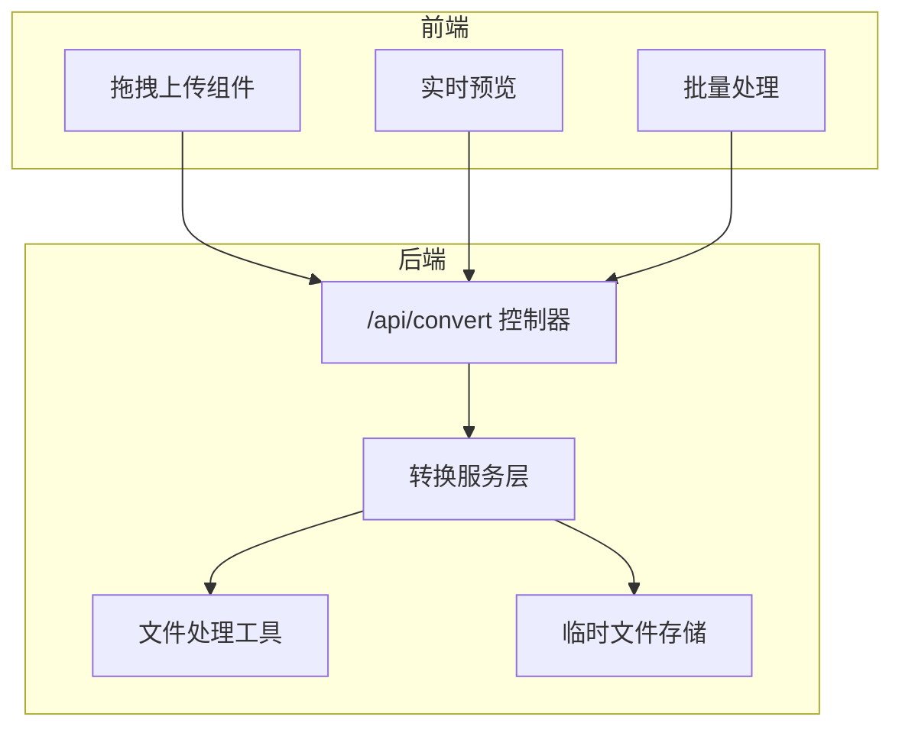
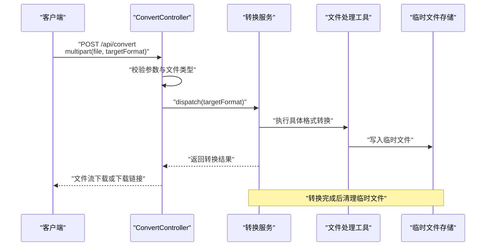
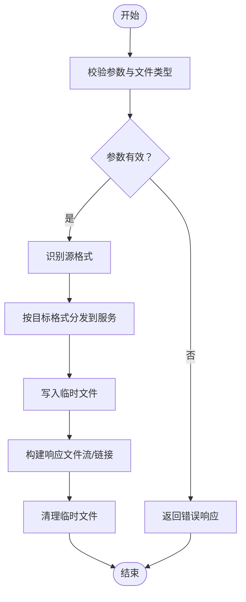
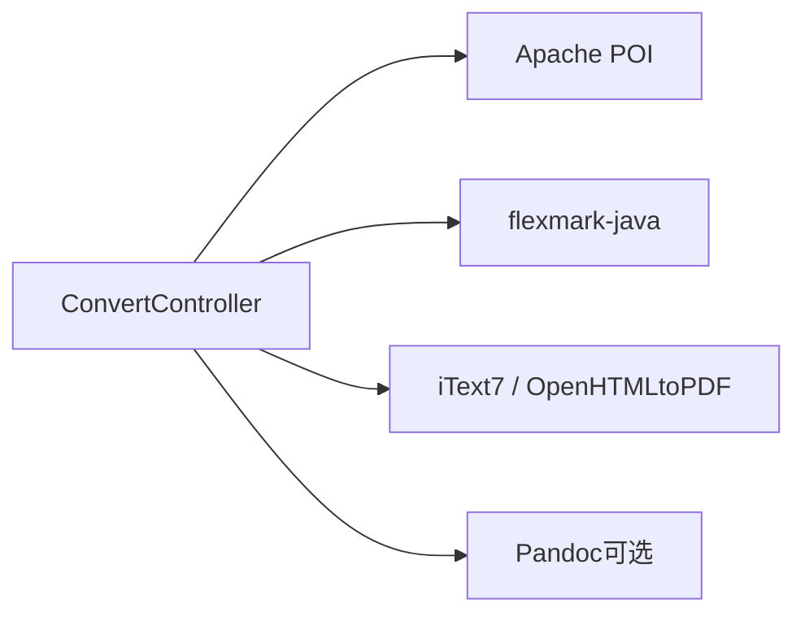

# 文件转换接口

<cite>
**本文引用的文件**
- [多格式文档互转工具 (SmartConvert) 需求文档.md](file://多格式文档互转工具 (SmartConvert) 需求文档.md)
</cite>

## 目录
1. [简介](#简介)
2. [项目结构](#项目结构)
3. [核心组件](#核心组件)
4. [架构总览](#架构总览)
5. [详细组件分析](#详细组件分析)
6. [依赖关系分析](#依赖关系分析)
7. [性能考量](#性能考量)
8. [故障排查指南](#故障排查指南)
9. [结论](#结论)
10. [附录](#附录)

## 简介
本文档围绕 POST /api/convert 文件转换核心接口进行系统化说明，覆盖请求参数、响应格式、错误处理机制、支持的文件格式、转换流程、临时文件管理与性能优化策略，并提供前后端集成示例与最佳实践建议。该接口是 SmartConvert 多格式文档互转工具的核心入口，负责接收用户上传的源文件与目标格式，执行转换并返回结果（文件流或下载链接）。

## 项目结构
本仓库当前仅包含一份需求文档，描述了系统的整体目标、技术栈、功能需求与后端接口规划。核心接口 POST /api/convert 在后端控制器中定义，配合多种文件处理库（如 Apache POI、flexmark-java、itext7/OpenHTMLtoPDF）实现 Word、PDF、Text 与 Markdown 之间的双向互转。

图表来源
- [多格式文档互转工具 (SmartConvert) 需求文档.md: 93-101](file://多格式文档互转工具 (SmartConvert) 需求文档.md#L93-L101)
- [多格式文档互转工具 (SmartConvert) 需求文档.md: 145-161](file://多格式文档互转工具 (SmartConvert) 需求文档.md#L145-L161)

章节来源
- [多格式文档互转工具 (SmartConvert) 需求文档.md: 93-101](file://多格式文档互转工具 (SmartConvert) 需求文档.md#L93-L101)
- [多格式文档互转工具 (SmartConvert) 需求文档.md: 145-161](file://多格式文档互转工具 (SmartConvert) 需求文档.md#L145-L161)

## 核心组件
- 接口定义：POST /api/convert
- 请求参数：
  - file：multipart/form-data 中的二进制文件字段
  - targetFormat：目标格式字符串（如 md、pdf、docx、txt）
- 响应格式：
  - 文件流下载（Content-Disposition: attachment）
  - 或在特定场景下返回下载链接（由后端策略决定）
- 错误处理：
  - 参数缺失、格式不支持、文件过大、转换失败等统一错误码与消息
- 安全与合规：
  - 上传文件后缀严格校验
  - 临时文件定期清理
- 性能与可用性：
  - 单文件转换时间控制在 3 秒以内（10MB 以内）
  - 支持批量上传与打包下载

章节来源
- [多格式文档互转工具 (SmartConvert) 需求文档.md: 93-101](file://多格式文档互转工具 (SmartConvert) 需求文档.md#L93-L101)
- [多格式文档互转工具 (SmartConvert) 需求文档.md: 165-177](file://多格式文档互转工具 (SmartConvert) 需求文档.md#L165-L177)

## 架构总览
POST /api/convert 的典型调用链如下：前端通过拖拽或表单上传文件，后端控制器解析 multipart 请求，根据目标格式选择对应的服务实现，生成临时文件并返回文件流；同时，系统对上传文件类型进行校验，并在完成后清理临时文件。

图表来源
- [多格式文档互转工具 (SmartConvert) 需求文档.md: 145-161](file://多格式文档互转工具 (SmartConvert) 需求文档.md#L145-L161)
- [多格式文档互转工具 (SmartConvert) 需求文档.md: 169-174](file://多格式文档互转工具 (SmartConvert) 需求文档.md#L169-L174)

## 详细组件分析

### 接口定义与请求参数
- 接口路径：POST /api/convert
- 请求体类型：multipart/form-data
- 必填参数：
  - file：待转换的源文件（二进制）
  - targetFormat：目标格式字符串（例如 md、pdf、docx、txt）
- 可选参数：
  - 其他业务参数（如批量处理标识、会话上下文等，视实现而定）

章节来源
- [多格式文档互转工具 (SmartConvert) 需求文档.md: 95](file://多格式文档互转工具 (SmartConvert) 需求文档.md#L95)
- [多格式文档互转工具 (SmartConvert) 需求文档.md: 145-161](file://多格式文档互转工具 (SmartConvert) 需求文档.md#L145-L161)

### 响应格式与下载策略
- 文件流下载：当转换成功时，后端以 Content-Disposition: attachment 返回转换后的文件流，便于浏览器直接下载。
- 下载链接：在某些场景下，后端可能返回包含临时下载链接的 JSON，前端再发起下载请求。
- 批量处理：支持一次上传多个文件并打包下载，减少多次往返。

章节来源
- [多格式文档互转工具 (SmartConvert) 需求文档.md: 95](file://多格式文档互转工具 (SmartConvert) 需求文档.md#L95)
- [多格式文档互转工具 (SmartConvert) 需求文档.md: 91](file://多格式文档互转工具 (SmartConvert) 需求文档.md#L91)

### 支持的文件格式与转换路径
- Word (.docx) ↔ Markdown：保留标题、列表、表格和加粗等基本样式
- PDF (.pdf) ↔ Markdown：
  - PDF 转 Markdown：提取文本内容，尽量保持层级（复杂布局可能存在偏差）
  - Markdown 转 PDF：支持代码高亮渲染后的美化导出
- Text (.txt) ↔ Markdown：纯文本与 Markdown 格式的封装与去格式化

章节来源
- [多格式文档互转工具 (SmartConvert) 需求文档.md: 69-79](file://多格式文档互转工具 (SmartConvert) 需求文档.md#L69-L79)

### 转换流程与数据流
- 输入校验：校验 file 字段存在性与 targetFormat 合法性
- 格式识别：根据文件扩展名或 MIME 类型识别源格式
- 服务分发：依据 targetFormat 将请求路由到对应转换服务
- 临时文件生成：将中间产物写入临时目录，命名带唯一标识
- 输出生成：将临时文件包装为可下载的资源对象
- 清理策略：转换完成后异步清理临时文件，避免磁盘占用

图表来源
- [多格式文档互转工具 (SmartConvert) 需求文档.md: 145-161](file://多格式文档互转工具 (SmartConvert) 需求文档.md#L145-L161)
- [多格式文档互转工具 (SmartConvert) 需求文档.md: 169-174](file://多格式文档互转工具 (SmartConvert) 需求文档.md#L169-L174)

### 错误处理机制
- 参数错误：缺少 file 或 targetFormat，或 targetFormat 不在支持列表
- 文件类型错误：后缀不在允许列表或 MIME 类型不被接受
- 文件大小限制：超过阈值（如 10MB）拒绝转换
- 转换异常：底层库处理失败、内存不足、超时等
- 响应规范：统一返回状态码与错误信息，便于前端提示与重试

章节来源
- [多格式文档互转工具 (SmartConvert) 需求文档.md: 165-177](file://多格式文档互转工具 (SmartConvert) 需求文档.md#L165-L177)

### 临时文件管理
- 存储位置：独立的临时目录，命名包含会话/任务标识
- 生命周期：转换完成后立即删除，或通过定时任务定期清理
- 并发安全：确保并发转换不会互相覆盖或冲突
- 磁盘空间：监控临时目录容量，必要时触发清理策略

章节来源
- [多格式文档互转工具 (SmartConvert) 需求文档.md: 173](file://多格式文档互转工具 (SmartConvert) 需求文档.md#L173)

### 前端集成示例与最佳实践
- 拖拽上传：参考拖拽区域组件，支持多文件拖拽与预览
- 表单提交：使用 FormData 传递 file 与 targetFormat
- 进度反馈：显示 Processing... 与进度条，提升用户体验
- 批量处理：一次上传多个文件并打包下载
- 最佳实践：
  - 限制文件大小与类型，提前校验
  - 使用防抖与幂等策略，避免重复提交
  - 对于大文件，考虑分片上传与断点续传（视实现而定）
  - 统一错误提示与重试机制

章节来源
- [多格式文档互转工具 (SmartConvert) 需求文档.md: 81-92](file://多格式文档互转工具 (SmartConvert) 需求文档.md#L81-L92)

## 依赖关系分析
后端实现依赖多种第三方库，分别负责不同格式的处理能力：
- Apache POI：处理 Word 文档（doc/docx）
- flexmark-java：解析与生成 Markdown
- iText7 或 OpenHTMLtoPDF：处理 PDF 文档
- Pandoc（可选桥接）：在需要极致转换效果时使用系统调用

图表来源
- [多格式文档互转工具 (SmartConvert) 需求文档.md: 43-51](file://多格式文档互转工具 (SmartConvert) 需求文档.md#L43-L51)

章节来源
- [多格式文档互转工具 (SmartConvert) 需求文档.md: 43-51](file://多格式文档互转工具 (SmartConvert) 需求文档.md#L43-L51)

## 性能考量
- 单文件转换时间：控制在 3 秒以内（10MB 以内）
- 内存与 CPU：合理设置线程池与缓冲区大小，避免 OOM
- I/O 优化：优先使用流式处理，减少内存拷贝
- 临时文件：使用内存映射或零拷贝策略（视平台与库支持）
- 并发控制：限制同时转换的任务数量，避免资源争用
- 缓存与复用：对常用模板与样式进行缓存

章节来源
- [多格式文档互转工具 (SmartConvert) 需求文档.md: 167](file://多格式文档互转工具 (SmartConvert) 需求文档.md#L167)

## 故障排查指南
- 常见问题
  - 400 参数错误：缺少 file 或 targetFormat，或 targetFormat 非法
  - 413 文件过大：超过后端限制
  - 415 不支持的媒体类型：文件类型不在允许列表
  - 500 转换失败：底层库异常或资源不足
- 排查步骤
  - 检查请求头 Content-Type 是否为 multipart/form-data
  - 校验文件扩展名与 MIME 类型是否匹配
  - 查看后端日志与临时目录状态
  - 确认目标格式是否在支持列表
- 临时文件清理
  - 立即清理失败任务产生的临时文件
  - 定时任务扫描并删除过期临时文件

章节来源
- [多格式文档互转工具 (SmartConvert) 需求文档.md: 169-174](file://多格式文档互转工具 (SmartConvert) 需求文档.md#L169-L174)

## 结论
POST /api/convert 接口是 SmartConvert 的核心枢纽，连接前端交互与后端转换引擎。通过严格的参数校验、清晰的转换流程与完善的临时文件管理，系统能够在保证质量的前提下提供高效的转换体验。结合性能优化与错误处理策略，可进一步提升稳定性与用户体验。

## 附录
- 相关接口
  - GET /api/history：查看最近转换记录
  - GET /api/health：系统健康检查
- 依赖库版本与配置（示例）
  - Apache POI、flexmark-java、iText7/OpenHTMLtoPDF、Pandoc（可选）

章节来源
- [多格式文档互转工具 (SmartConvert) 需求文档.md: 97-99](file://多格式文档互转工具 (SmartConvert) 需求文档.md#L97-L99)
- [多格式文档互转工具 (SmartConvert) 需求文档.md: 119-139](file://多格式文档互转工具 (SmartConvert) 需求文档.md#L119-L139)