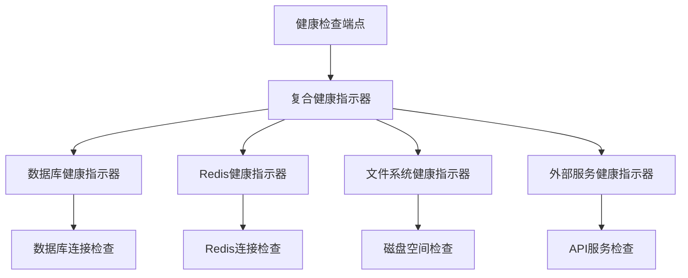
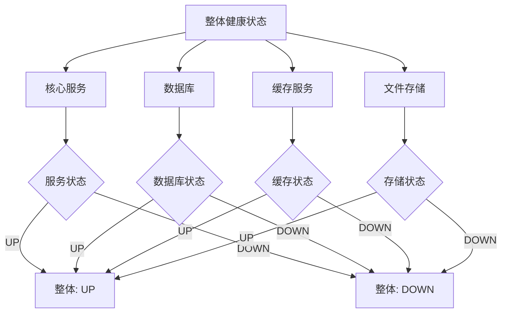
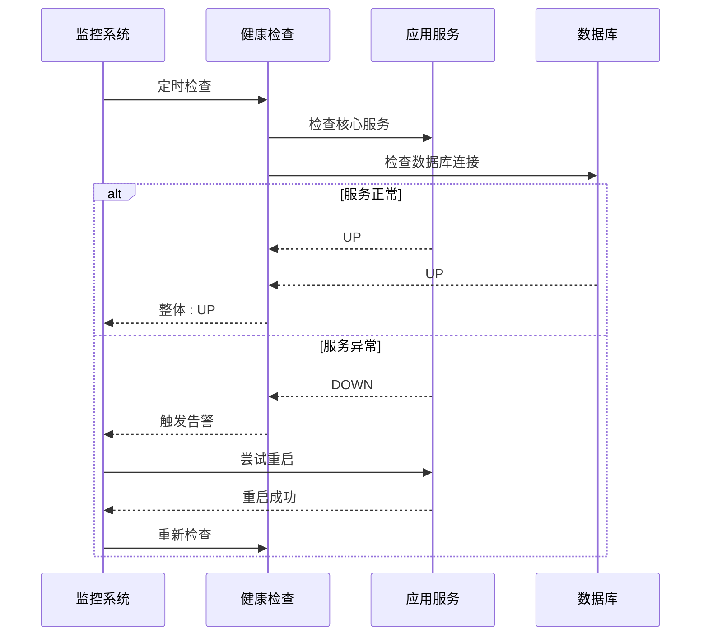

# 系统健康检查接口

<cite>
**本文档引用的文件**
- [多格式文档互转工具 (SmartConvert) 需求文档.md](file://多格式文档互转工具 (SmartConvert) 需求文档.md)
</cite>

## 目录
1. [简介](#简介)
2. [接口规范](#接口规范)
3. [响应格式](#响应格式)
4. [检查指标](#检查指标)
5. [实现原理](#实现原理)
6. [故障检测机制](#故障检测机制)
7. [监控集成](#监控集成)
8. [运维使用指南](#运维使用指南)
9. [自动化监控示例](#自动化监控示例)
10. [故障排查](#故障排查)
11. [最佳实践](#最佳实践)

## 简介

GET /api/health 接口是 SmartConvert 文档转换工具的核心健康检查接口，用于监控系统的运行状态和服务可用性。该接口遵循 Spring Boot Actuator 标准，提供统一的健康检查机制，确保系统在生产环境中的稳定运行。

## 接口规范

### 基本信息
- **接口地址**: `/api/health`
- **请求方法**: `GET`
- **认证要求**: 无需认证
- **内容类型**: `application/json`
- **响应编码**: `UTF-8`

### 请求参数
无请求参数

### 响应状态码
- `200`: 服务正常
- `503`: 服务不可用
- `500`: 内部错误

## 响应格式

### 基础响应结构
```json
{
  "status": "UP",
  "timestamp": "2024-01-01T12:00:00.000Z",
  "version": "1.0.0",
  "service": "SmartConvert",
  "checks": [
    {
      "name": "database",
      "status": "UP",
      "details": {
        "host": "localhost",
        "port": 5432,
        "database": "smartconvert"
      }
    },
    {
      "name": "redis",
      "status": "UP",
      "details": {
        "host": "localhost",
        "port": 6379
      }
    }
  ]
}
```

### 字段说明

| 字段名 | 类型 | 必填 | 描述 |
|--------|------|------|------|
| status | string | 是 | 整体服务状态，UP/DOWN/OUT_OF_SERVICE |
| timestamp | string | 是 | ISO 8601 时间戳 |
| version | string | 否 | 服务版本号 |
| service | string | 否 | 服务名称 |
| checks | array | 是 | 具体检查项数组 |

### 检查项结构

| 字段名 | 类型 | 必填 | 描述 |
|--------|------|------|------|
| name | string | 是 | 检查项名称 |
| status | string | 是 | 检查状态，UP/DOWN/UNKNOWN |
| details | object | 否 | 检查详情信息 |

## 检查指标

### 1. 服务可用性检查
- **应用状态**: 核心业务逻辑是否正常运行
- **内存使用率**: 当前内存占用情况
- **CPU 使用率**: 进程 CPU 占用率
- **线程池状态**: 线程池活跃线程数和队列长度

### 2. 依赖服务状态检查
- **数据库连接**: PostgreSQL/MySQL 连接状态
- **缓存服务**: Redis/Memcached 连接状态
- **文件存储**: 文件系统可用性和磁盘空间
- **外部服务**: 第三方 API 服务可达性

### 3. 资源使用情况
- **内存指标**: 已用内存、最大内存、可用内存
- **磁盘空间**: 可用空间、已用空间、使用率
- **网络连接**: 活跃连接数、连接超时设置
- **文件句柄**: 打开文件数量、限制情况

## 实现原理

### Spring Boot Actuator 集成
健康检查接口基于 Spring Boot Actuator 框架实现，通过自动配置提供标准的健康检查能力。

### 自定义健康指示器
系统实现了多个自定义健康指示器：



**图表来源**
- [多格式文档互转工具 (SmartConvert) 需求文档.md: 99](file://多格式文档互转工具 (SmartConvert) 需求文档.md#L99)

### 健康状态层次结构


**图表来源**
- [多格式文档互转工具 (SmartConvert) 需求文档.md: 99](file://多格式文档互转工具 (SmartConvert) 需求文档.md#L99)

## 故障检测机制

### 实时监控
- **连接池监控**: 数据库连接池活跃连接数和空闲连接数
- **内存泄漏检测**: 垃圾回收前后内存变化趋势
- **线程死锁检测**: 线程阻塞和死锁监控
- **文件句柄泄漏**: 打开文件数量异常增长检测

### 告警触发条件
- **服务不可用**: 任何关键服务 DOWN 状态
- **性能降级**: 响应时间超过阈值
- **资源耗尽**: 内存使用率超过 90%
- **依赖中断**: 外部服务连接失败

### 故障恢复策略


**图表来源**
- [多格式文档互转工具 (SmartConvert) 需求文档.md: 99](file://多格式文档互转工具 (SmartConvert) 需求文档.md#L99)

## 监控集成

### Prometheus 集成
```yaml
# prometheus.yml 配置示例
scrape_configs:
  - job_name: 'smartconvert'
    static_configs:
      - targets: ['localhost:8080']
    metrics_path: '/actuator/prometheus'
```

### Grafana 仪表板
- **服务状态面板**: 显示整体健康状态趋势
- **资源使用面板**: 内存、CPU、磁盘使用情况
- **错误率面板**: 4xx/5xx 错误统计
- **响应时间面板**: P50/P95/P99 响应时间

### 日志集成
- **健康检查日志**: 记录每次检查结果和时间
- **异常告警日志**: 服务异常和恢复事件
- **性能监控日志**: 关键指标的采样数据

## 运维使用指南

### 基本使用
```bash
# 健康检查
curl -X GET http://localhost:8080/api/health

# 获取详细信息
curl -X GET http://localhost:8080/api/health/detail

# 指定检查范围
curl -X GET "http://localhost:8080/api/health?include=database,redis"
```

### 常用命令
- **快速诊断**: `GET /api/health` - 获取整体状态
- **详细诊断**: `GET /api/health/detail` - 获取详细检查结果
- **部分检查**: `GET /api/health?include=database` - 仅检查数据库
- **排除检查**: `GET /api/health?exclude=redis` - 排除Redis检查

### 响应解读
- **UP**: 服务完全正常
- **DOWN**: 服务不可用，需要立即处理
- **OUT_OF_SERVICE**: 服务暂时不可用，但预期会恢复

## 自动化监控示例

### Kubernetes 配置
```yaml
apiVersion: v1
kind: Pod
metadata:
  name: smartconvert-app
spec:
  containers:
  - name: app
    image: smartconvert:latest
    livenessProbe:
      httpGet:
        path: /api/health
        port: 8080
      initialDelaySeconds: 30
      periodSeconds: 10
    readinessProbe:
      httpGet:
        path: /api/health
        port: 8080
      initialDelaySeconds: 5
      periodSeconds: 5
```

### Docker Compose 配置
```yaml
version: '3.8'
services:
  smartconvert:
    image: smartconvert:latest
    healthcheck:
      test: ["CMD", "curl", "-f", "http://localhost:8080/api/health"]
      interval: 30s
      timeout: 10s
      retries: 3
```

### Ansible Playbook
```yaml
- name: 检查 SmartConvert 健康状态
  hosts: smartconvert_servers
  tasks:
    - name: 发送健康检查请求
      uri:
        url: "http://{{ inventory_hostname }}:8080/api/health"
        method: GET
        status_code: 200
      register: health_result
      
    - name: 记录检查结果
      debug:
        msg: "服务状态: {{ health_result.json.status }}"
```

## 故障排查

### 常见问题及解决方案

#### 1. 健康检查返回 DOWN
**症状**: 健康检查返回 DOWN 状态
**排查步骤**:
1. 检查数据库连接是否正常
2. 验证缓存服务可用性
3. 确认文件存储空间充足
4. 查看应用日志中的异常信息

#### 2. 响应时间过长
**症状**: 健康检查响应时间超过 5 秒
**排查步骤**:
1. 检查数据库查询性能
2. 分析线程池使用情况
3. 监控磁盘 I/O 性能
4. 查看 GC 日志

#### 3. 间歇性故障
**症状**: 健康检查状态不稳定
**排查步骤**:
1. 检查网络连接稳定性
2. 验证外部服务可用性
3. 分析内存泄漏情况
4. 监控系统负载

### 调试工具
```bash
# 详细日志输出
curl -v http://localhost:8080/api/health

# JSON 格式化输出
curl http://localhost:8080/api/health | jq .

# 持续监控
watch -n 5 curl http://localhost:8080/api/health
```

## 最佳实践

### 1. 健康检查配置
- **检查间隔**: 生产环境建议 30-60 秒
- **超时设置**: 5-10 秒，避免阻塞监控系统
- **重试次数**: 2-3 次，避免误报
- **并发控制**: 限制同时进行的健康检查数量

### 2. 监控告警
- **级别划分**: 严重、警告、信息三个级别
- **告警渠道**: 邮件、短信、IM 等多渠道通知
- **恢复通知**: 服务恢复时发送通知
- **告警抑制**: 同一故障的重复告警抑制

### 3. 性能优化
- **异步检查**: 对耗时检查使用异步执行
- **缓存结果**: 短时间内复用检查结果
- **分层检查**: 先快速检查，再进行深度检查
- **限流保护**: 防止健康检查影响正常业务

### 4. 安全考虑
- **访问控制**: 限制健康检查接口的访问权限
- **敏感信息**: 避免在健康检查中暴露敏感信息
- **DDoS防护**: 防止恶意扫描和攻击
- **审计日志**: 记录健康检查的访问历史

---

**章节来源**
- [多格式文档互转工具 (SmartConvert) 需求文档.md: 99](file://多格式文档互转工具 (SmartConvert) 需求文档.md#L99)