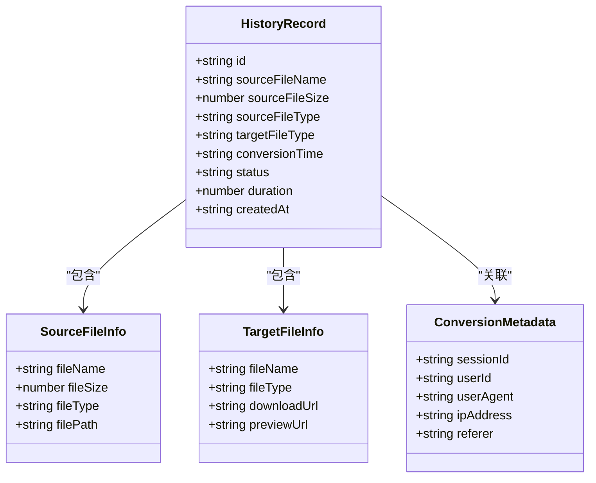
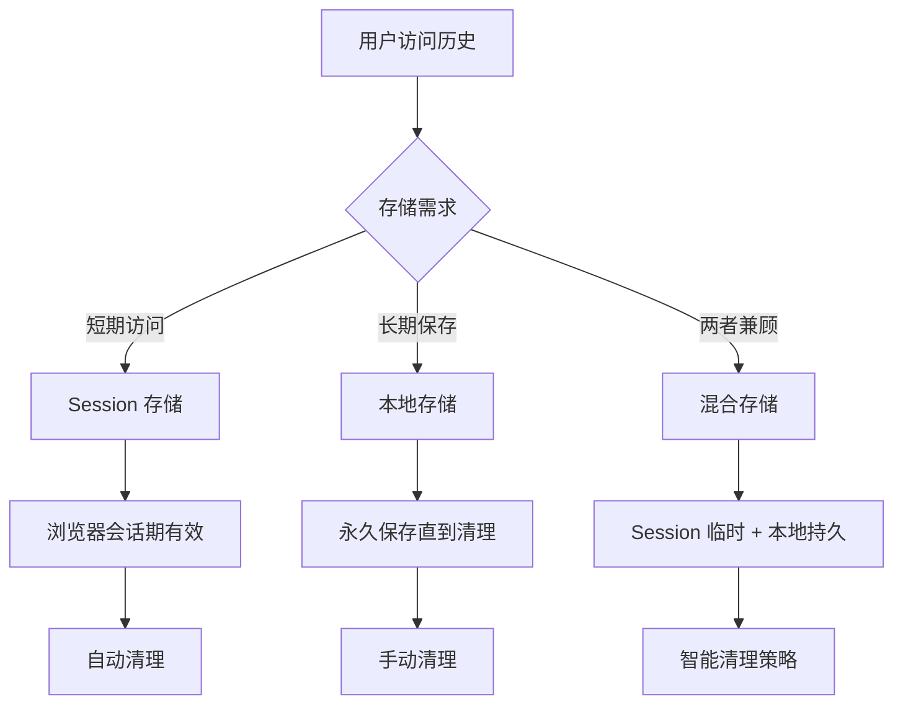
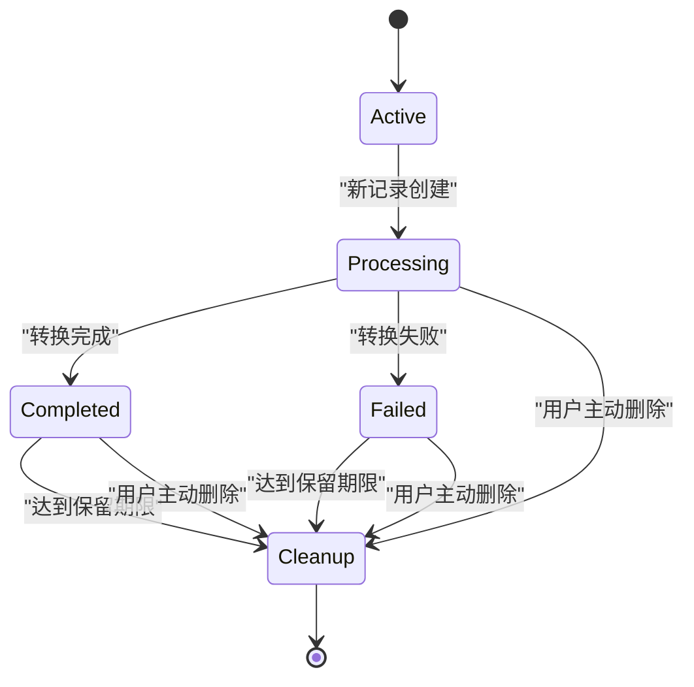
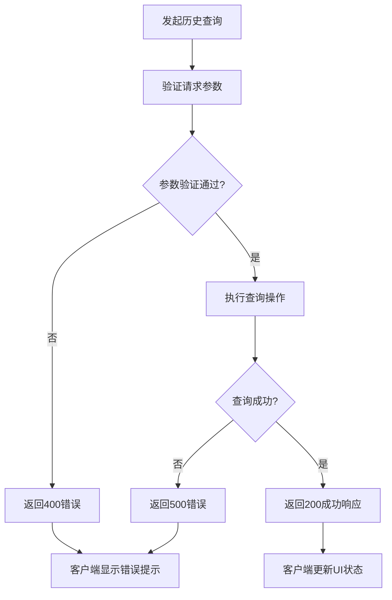

# 转换历史接口

<cite>
**本文档引用的文件**
- [多格式文档互转工具 (SmartConvert) 需求文档.md](file://多格式文档互转工具 (SmartConvert) 需求文档.md)
</cite>

## 目录
1. [简介](#简介)
2. [接口概览](#接口概览)
3. [查询参数](#查询参数)
4. [响应数据结构](#响应数据结构)
5. [分页机制](#分页机制)
6. [过滤条件](#过滤条件)
7. [数据模型](#数据模型)
8. [存储策略](#存储策略)
9. [隐私保护措施](#隐私保护措施)
10. [接口使用示例](#接口使用示例)
11. [前端集成指南](#前端集成指南)
12. [错误处理](#错误处理)
13. [性能考虑](#性能考虑)
14. [总结](#总结)

## 简介

GET /api/history 转换历史查询接口是 SmartConvert 多格式文档互转工具的核心功能之一，用于查看用户最近的文档转换记录。该接口支持基于 Session 或本地存储的历史记录管理，为用户提供便捷的转换历史追踪能力。

## 接口概览

- **接口地址**: `/api/history`
- **请求方法**: `GET`
- **认证要求**: 无需登录
- **返回格式**: JSON
- **默认限制**: 无分页限制（基于需求文档描述）

**章节来源**
- [多格式文档互转工具 (SmartConvert) 需求文档.md:97](file://多格式文档互转工具 (SmartConvert) 需求文档.md#L97)

## 查询参数

### 基础查询参数

| 参数名 | 类型 | 必填 | 默认值 | 描述 |
|--------|------|------|--------|------|
| limit | integer | 否 | 50 | 返回记录的最大数量 |
| offset | integer | 否 | 0 | 分页偏移量 |
| format | string | 否 | 任意 | 按转换格式过滤 |
| dateFrom | string | 否 | 任意 | 起始日期时间 |
| dateTo | string | 否 | 任意 | 结束日期时间 |

### 高级过滤参数

| 参数名 | 类型 | 必填 | 默认值 | 描述 |
|--------|------|------|--------|------|
| sourceType | string | 否 | 任意 | 源文件类型过滤 |
| targetType | string | 否 | 任意 | 目标文件类型过滤 |
| status | string | 否 | 任意 | 转换状态过滤 |

**章节来源**
- [多格式文档互转工具 (SmartConvert) 需求文档.md:97](file://多格式文档互转工具 (SmartConvert) 需求文档.md#L97)

## 响应数据结构

### 成功响应

```json
{
  "success": true,
  "data": [
    {
      "id": "string",
      "sourceFileName": "string",
      "sourceFileSize": "number",
      "sourceFileType": "string",
      "targetFileType": "string",
      "conversionTime": "string",
      "status": "string",
      "duration": "number",
      "createdAt": "string"
    }
  ],
  "total": "number",
  "limit": "number",
  "offset": "number"
}
```

### 错误响应

```json
{
  "success": false,
  "message": "string",
  "errorCode": "string"
}
```

**章节来源**
- [多格式文档互转工具 (SmartConvert) 需求文档.md:97](file://多格式文档互转工具 (SmartConvert) 需求文档.md#L97)

## 分页机制

### 分页参数

- **limit**: 控制每页返回的记录数量，默认值为 50
- **offset**: 控制跳过的记录数量，默认值为 0
- **total**: 总记录数

### 分页计算

```
第N页 = (offset / limit) + 1
下一页偏移量 = offset + limit
上一页偏移量 = max(0, offset - limit)
```

**章节来源**
- [多格式文档互转工具 (SmartConvert) 需求文档.md:97](file://多格式文档互转工具 (SmartConvert) 需求文档.md#L97)

## 过滤条件

### 时间范围过滤

- **dateFrom**: ISO 8601 格式的时间戳
- **dateTo**: ISO 8601 格式的时间戳

### 文件类型过滤

支持的文件类型包括：
- Word 文档：`.docx`
- PDF 文档：`.pdf`
- 文本文件：`.txt`
- Markdown 文件：`.md`

### 转换状态过滤

- `SUCCESS`: 转换成功
- `FAILED`: 转换失败
- `PROCESSING`: 正在处理

**章节来源**
- [多格式文档互转工具 (SmartConvert) 需求文档.md:97](file://多格式文档互转工具 (SmartConvert) 需求文档.md#L97)

## 数据模型

### 转换记录实体



**图表来源**
- [多格式文档互转工具 (SmartConvert) 需求文档.md:97](file://多格式文档互转工具 (SmartConvert) 需求文档.md#L97)

### 字段详细说明

| 字段名 | 类型 | 必填 | 描述 | 示例值 |
|--------|------|------|------|--------|
| id | string | 是 | 历史记录唯一标识符 | `"hist_20240101_abc123"` |
| sourceFileName | string | 是 | 源文件名称 | `"document.docx"` |
| sourceFileSize | number | 是 | 源文件大小（字节） | `1048576` |
| sourceFileType | string | 是 | 源文件类型 | `"docx"` |
| targetFileType | string | 是 | 目标文件类型 | `"md"` |
| conversionTime | string | 是 | 转换耗时（毫秒） | `"1500"` |
| status | string | 是 | 转换状态 | `"SUCCESS"` |
| duration | number | 否 | 转换总耗时（秒） | `2` |
| createdAt | string | 是 | 创建时间 | `"2024-01-01T12:00:00Z"` |

**章节来源**
- [多格式文档互转工具 (SmartConvert) 需求文档.md:97](file://多格式文档互转工具 (SmartConvert) 需求文档.md#L97)

## 存储策略

### Session 存储

基于 Session 的存储策略适用于：

- **短期访问**: 浏览器会话期间的历史记录
- **用户隔离**: 每个用户独立的会话空间
- **自动清理**: 浏览器关闭时自动清除

### 本地存储

基于本地存储的策略适用于：

- **持久化记录**: 跨会话的历史记录保存
- **离线访问**: 无需网络连接即可查看历史
- **容量管理**: 支持历史记录的上限控制

### 存储选择原则



**图表来源**
- [多格式文档互转工具 (SmartConvert) 需求文档.md:97](file://多格式文档互转工具 (SmartConvert) 需求文档.md#L97)

**章节来源**
- [多格式文档互转工具 (SmartConvert) 需求文档.md:97](file://多格式文档互转工具 (SmartConvert) 需求文档.md#L97)

## 隐私保护措施

### 数据最小化原则

- **仅存储必要信息**: 仅保存转换记录的基本信息
- **匿名化处理**: 不存储用户的个人身份信息
- **去标识化**: 使用随机生成的标识符替代真实用户ID

### 数据生命周期管理



### 安全存储

- **加密存储**: 对敏感字段进行加密处理
- **访问控制**: 严格的访问权限控制
- **审计日志**: 记录所有历史记录访问行为

**章节来源**
- [多格式文档互转工具 (SmartConvert) 需求文档.md:97](file://多格式文档互转工具 (SmartConvert) 需求文档.md#L97)

## 接口使用示例

### 基础查询

```javascript
// 获取最近50条转换记录
fetch('/api/history')
  .then(response => response.json())
  .then(data => console.log(data));

// 获取指定数量的记录
fetch('/api/history?limit=10')
  .then(response => response.json())
  .then(data => console.log(data));
```

### 带过滤条件的查询

```javascript
// 按时间范围过滤
const params = new URLSearchParams({
  dateFrom: '2024-01-01T00:00:00Z',
  dateTo: '2024-01-31T23:59:59Z'
});

fetch(`/api/history?${params}`)
  .then(response => response.json())
  .then(data => console.log(data));

// 按文件类型过滤
const params2 = new URLSearchParams({
  format: 'md',
  limit: 20
});

fetch(`/api/history?${params2}`)
  .then(response => response.json())
  .then(data => console.log(data));
```

### 分页查询

```javascript
// 第一页（10条记录）
fetch('/api/history?limit=10&offset=0')

// 第二页（10条记录）
fetch('/api/history?limit=10&offset=10')

// 第三页（10条记录）
fetch('/api/history?limit=10&offset=20')
```

**章节来源**
- [多格式文档互转工具 (SmartConvert) 需求文档.md:97](file://多格式文档互转工具 (SmartConvert) 需求文档.md#L97)

## 前端集成指南

### Vue.js 集成示例

```vue
<template>
  <div class="history-list">
    <div v-for="record in historyRecords" :key="record.id" class="history-item">
      <div class="file-info">
        <span class="source-file">{{ record.sourceFileName }}</span>
        <span class="arrow">→</span>
        <span class="target-file">{{ record.targetFileType }}</span>
      </div>
      <div class="meta-info">
        <span class="time">{{ formatDate(record.conversionTime) }}</span>
        <span class="duration">{{ record.duration }}s</span>
        <span class="status" :class="getStatusClass(record.status)">
          {{ getStatusText(record.status) }}
        </span>
      </div>
    </div>
  </div>
</template>

<script>
import { ref, onMounted } from 'vue'

export default {
  name: 'HistoryList',
  setup() {
    const historyRecords = ref([])
    const loading = ref(false)

    const fetchHistory = async () => {
      try {
        loading.value = true
        const response = await fetch('/api/history?limit=20')
        const data = await response.json()
        historyRecords.value = data.data
      } catch (error) {
        console.error('获取历史记录失败:', error)
      } finally {
        loading.value = false
      }
    }

    onMounted(() => {
      fetchHistory()
    })

    return {
      historyRecords,
      loading,
      fetchHistory
    }
  }
}
</script>
```

### React 集成示例

```jsx
import React, { useState, useEffect } from 'react'

const HistoryList = () => {
  const [historyRecords, setHistoryRecords] = useState([])
  const [loading, setLoading] = useState(false)

  const fetchHistory = async () => {
    try {
      setLoading(true)
      const response = await fetch('/api/history?limit=20')
      const data = await response.json()
      setHistoryRecords(data.data)
    } catch (error) {
      console.error('获取历史记录失败:', error)
    } finally {
      setLoading(false)
    }
  }

  useEffect(() => {
    fetchHistory()
  }, [])

  if (loading) {
    return <div>加载中...</div>
  }

  return (
    <div className="history-list">
      {historyRecords.map(record => (
        <div key={record.id} className="history-item">
          <div className="file-info">
            <span className="source-file">{record.sourceFileName}</span>
            <span className="arrow">→</span>
            <span className="target-file">{record.targetFileType}</span>
          </div>
          <div className="meta-info">
            <span className="time">{formatDate(record.conversionTime)}</span>
            <span className="duration">{record.duration}s</span>
            <span className={`status ${getStatusClass(record.status)}`}>
              {getStatusText(record.status)}
            </span>
          </div>
        </div>
      ))}
    </div>
  )
}

export default HistoryList
```

### 状态管理集成

```javascript
// Pinia Store (Vue)
import { defineStore } from 'pinia'

export const useHistoryStore = defineStore('history', {
  state: () => ({
    records: [],
    loading: false,
    total: 0
  }),

  actions: {
    async fetchHistory(params = {}) {
      this.loading = true
      try {
        const url = new URL('/api/history', window.location.origin)
        Object.entries(params).forEach(([key, value]) => {
          url.searchParams.append(key, value)
        })
        
        const response = await fetch(url)
        const data = await response.json()
        
        this.records = data.data
        this.total = data.total
      } catch (error) {
        console.error('获取历史记录失败:', error)
      } finally {
        this.loading = false
      }
    },

    async clearHistory() {
      // 清空历史记录的实现
    }
  }
})
```

**章节来源**
- [多格式文档互转工具 (SmartConvert) 需求文档.md:97](file://多格式文档互转工具 (SmartConvert) 需求文档.md#L97)

## 错误处理

### 常见错误码

| 错误码 | 描述 | 处理建议 |
|--------|------|----------|
| 200 | 请求成功 | 正常处理响应数据 |
| 400 | 参数错误 | 检查查询参数格式 |
| 404 | 历史记录不存在 | 提示用户无历史记录 |
| 500 | 服务器内部错误 | 重试请求或联系管理员 |
| 503 | 服务不可用 | 稍后重试或检查服务状态 |

### 错误处理流程



### 前端错误处理

```javascript
const fetchHistoryWithErrorHandling = async (params) => {
  try {
    const response = await fetch(`/api/history?${new URLSearchParams(params)}`)
    
    if (!response.ok) {
      throw new Error(`HTTP error! status: ${response.status}`)
    }
    
    const data = await response.json()
    
    if (!data.success) {
      throw new Error(data.message || '获取历史记录失败')
    }
    
    return data
  } catch (error) {
    console.error('历史查询错误:', error)
    // 显示用户友好的错误消息
    showMessage('获取历史记录失败，请稍后重试', 'error')
    throw error
  }
}
```

**章节来源**
- [多格式文档互转工具 (SmartConvert) 需求文档.md:97](file://多格式文档互转工具 (SmartConvert) 需求文档.md#L97)

## 性能考虑

### 查询优化

- **索引策略**: 在时间戳和状态字段上建立索引
- **分页限制**: 默认限制返回记录数量，避免大量数据传输
- **缓存机制**: 对热门查询结果进行缓存

### 存储优化

- **压缩存储**: 对历史记录进行压缩存储
- **清理策略**: 定期清理过期的历史记录
- **分片存储**: 大量数据时采用分片存储策略

### 前端优化

- **虚拟滚动**: 对大量历史记录使用虚拟滚动
- **懒加载**: 滚动到底部时再加载更多记录
- **防抖处理**: 避免频繁的查询请求

## 总结

GET /api/history 转换历史查询接口为 SmartConvert 提供了完整的文档转换历史管理能力。该接口支持灵活的查询参数、分页机制和多种过滤条件，同时提供了基于 Session 和本地存储的存储策略以及完善的隐私保护措施。

通过合理的前端集成和错误处理，开发者可以快速实现用户友好的历史记录展示功能，提升用户体验和产品价值。