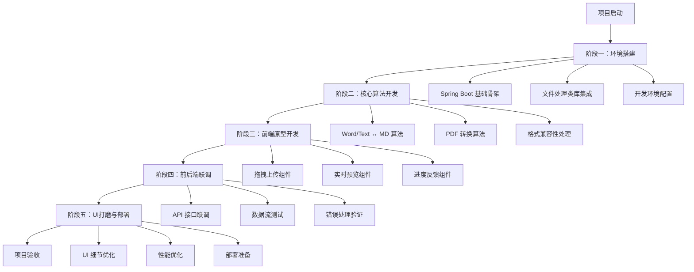
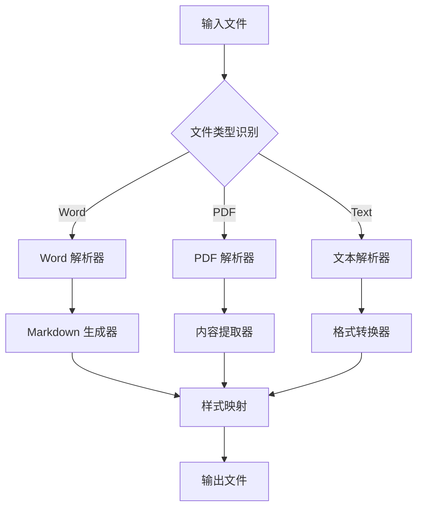
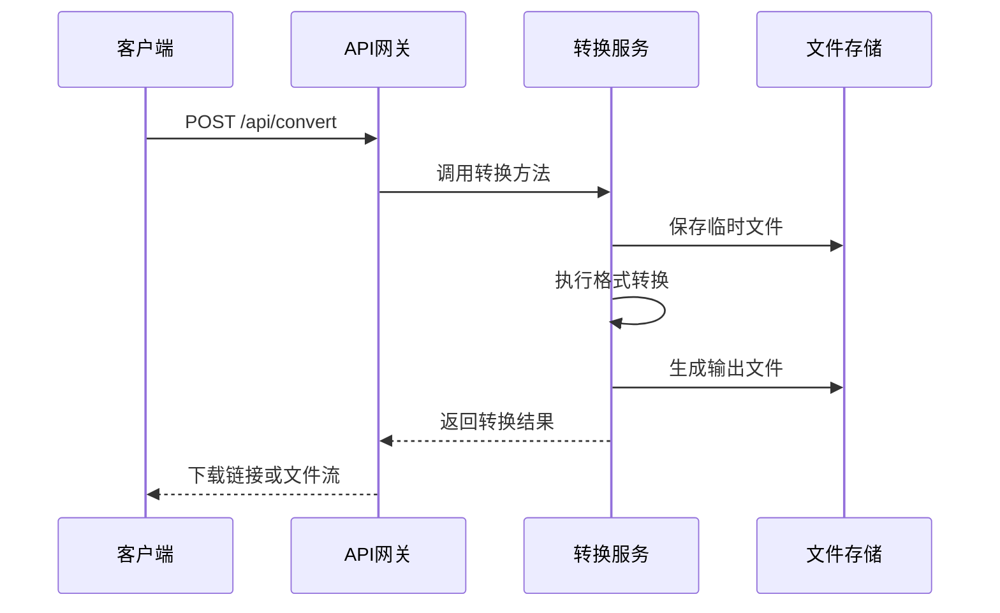
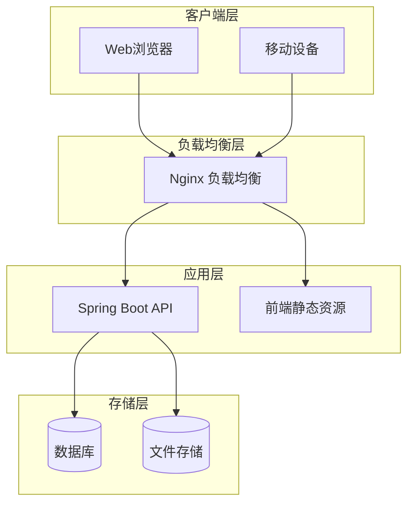
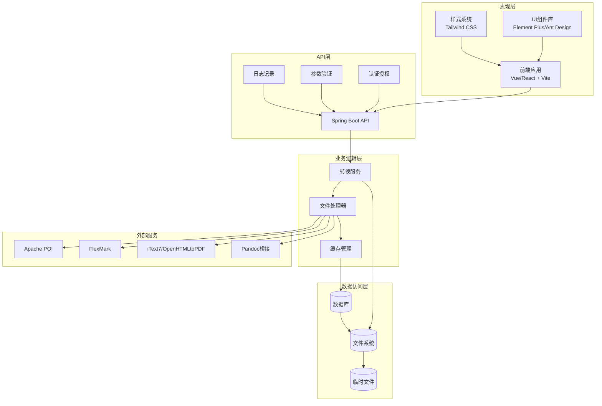
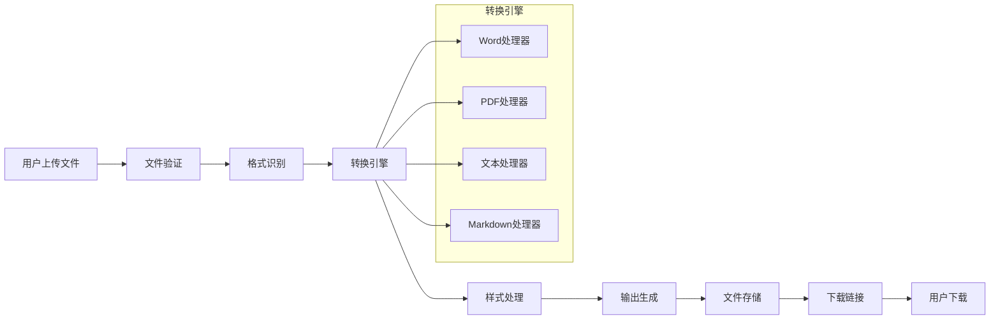

# 开发路线图

<cite>
**本文档引用的文件**
- [多格式文档互转工具 (SmartConvert) 需求文档.md](file://多格式文档互转工具 (SmartConvert) 需求文档.md)
</cite>

## 目录
1. [项目概述](#项目概述)
2. [开发阶段规划](#开发阶段规划)
3. [阶段一：环境搭建](#阶段一环境搭建)
4. [阶段二：核心算法开发](#阶段二核心算法开发)
5. [阶段三：前端原型开发](#阶段三前端原型开发)
6. [阶段四：前后端联调](#阶段四前后端联调)
7. [阶段五：UI打磨与部署](#阶段五ui打磨与部署)
8. [技术架构概览](#技术架构概览)
9. [风险管理与质量保证](#风险管理与质量保证)
10. [总结](#总结)

## 项目概述

SmartConvert 是一款基于 Web 的文档格式转换工具，支持 Word、PDF、Text 与 Markdown 之间的双向互转。该项目采用现代化技术栈，旨在为用户提供高保真度的格式转换体验和响应式、现代化的前端交互界面。

### 核心特性
- **多格式支持**：Word(.docx) ↔ Markdown、PDF(.pdf) ↔ Markdown、Text(.txt) ↔ Markdown
- **实时预览**：左编辑右预览的双栏视图
- **批量处理**：支持一次性上传多个文件并打包下载
- **拖拽上传**：仿制 Vercel 或 Apple 风格的拖拽上传区域
- **深色模式**：提供一键切换深浅色主题

## 开发阶段规划

根据需求文档中的任务分解，项目将分为五个主要开发阶段：

**章节来源**
- [多格式文档互转工具 (SmartConvert) 需求文档.md:179-189](file://多格式文档互转工具 (SmartConvert) 需求文档.md#L179-L189)

## 阶段一：环境搭建

### 阶段目标
- 搭建 Spring Boot 3.x 基础开发环境
- 集成核心文件处理类库
- 配置开发工具链和构建系统

### 关键交付物
- 可运行的 Spring Boot 应用骨架
- Maven 依赖配置文件
- 开发环境配置完成
- 基础 API 接口测试

### 技术挑战
- **Spring Boot 版本兼容性**：确保与 Java 版本的兼容性
- **依赖冲突解决**：处理不同文件处理库之间的版本冲突
- **开发工具配置**：IDE、调试器、热重载等开发工具设置

### 里程碑节点
- **第1周**：项目初始化和基础配置完成
- **第2周**：核心类库集成和基础 API 测试
- **第3周**：开发环境验证和文档完善

### 时间估算
- **总时长**：3-4 周
- **工作量**：约 60-80 人时
- **资源配置**：1 名后端开发工程师

### 关键技术栈
- **后端框架**：Spring Boot 3.x
- **构建工具**：Maven
- **文件处理库**：
  - Apache POI (Word 处理)
  - flexmark-java (Markdown 解析)
  - iText7 或 OpenHTMLtoPDF (PDF 处理)

**章节来源**
- [多格式文档互转工具 (SmartConvert) 需求文档.md:181](file://多格式文档互转工具 (SmartConvert) 需求文档.md#L181)
- [多格式文档互转工具 (SmartConvert) 需求文档.md:39-56](file://多格式文档互转工具 (SmartConvert) 需求文档.md#L39-L56)

## 阶段二：核心算法开发

### 阶段目标
- 实现 Word/Text 与 Markdown 的互转算法
- 开发 PDF 转换的核心逻辑
- 处理格式兼容性和样式保留

### 关键交付物
- 完整的转换算法实现
- 单元测试覆盖率达到 80%+
- 性能基准测试报告
- 错误处理机制

### 技术挑战
- **格式兼容性**：不同文档格式间的样式映射
- **性能优化**：大文件处理和内存管理
- **错误恢复**：转换过程中的异常处理和回滚机制

### 里程碑节点
- **第4周**：Word/Text ↔ MD 算法完成
- **第5周**：PDF 转换算法完成
- **第6周**：格式兼容性测试和优化

### 时间估算
- **总时长**：3-4 周
- **工作量**：约 60-80 人时
- **资源配置**：1-2 名后端开发工程师

### 核心算法实现要点

**图表来源**
- [多格式文档互转工具 (SmartConvert) 需求文档.md:67-79](file://多格式文档互转工具 (SmartConvert) 需求文档.md#L67-L79)

**章节来源**
- [多格式文档互转工具 (SmartConvert) 需求文档.md:182](file://多格式文档互转工具 (SmartConvert) 需求文档.md#L182)
- [多格式文档互转工具 (SmartConvert) 需求文档.md:67-79](file://多格式文档互转工具 (SmartConvert) 需求文档.md#L67-L79)

## 阶段三：前端原型开发

### 阶段目标
- 开发拖拽上传组件
- 实现实时预览功能
- 构建用户友好的界面交互

### 关键交付物
- 完整的前端原型界面
- 拖拽上传组件实现
- 实时预览组件开发
- 响应式布局适配

### 技术挑战
- **拖拽上传实现**：浏览器兼容性和用户体验优化
- **实时预览性能**：大量文本处理的性能优化
- **跨浏览器兼容**：不同浏览器的样式和行为差异

### 里程碑节点
- **第7周**：拖拽上传组件完成
- **第8周**：实时预览组件完成
- **第9周**：界面交互优化和测试

### 时间估算
- **总时长**：3 周
- **工作量**：约 40-60 人时
- **资源配置**：1 名前端开发工程师

### 前端技术栈
- **框架选择**：Vue 3 (Composition API) 或 React 18
- **构建工具**：Vite
- **UI 组件库**：Element Plus (Vue) 或 Ant Design (React)
- **样式库**：Tailwind CSS
- **状态管理**：Pinia (Vue) 或 Redux Toolkit (React)
- **动画库**：Framer Motion 或 GSAP

**章节来源**
- [多格式文档互转工具 (SmartConvert) 需求文档.md:183](file://多格式文档互转工具 (SmartConvert) 需求文档.md#L183)
- [多格式文档互转工具 (SmartConvert) 需求文档.md:25-38](file://多格式文档互转工具 (SmartConvert) 需求文档.md#L25-L38)

## 阶段四：前后端联调

### 阶段目标
- 实现完整的 API 接口对接
- 处理 PDF 转换的复杂样式兼容问题
- 验证系统的整体性能和稳定性

### 关键交付物
- 完整的前后端接口对接
- PDF 转换功能稳定运行
- 系统性能达到预期指标
- 全面的功能测试报告

### 技术挑战
- **API 接口设计**：RESTful API 的规范和一致性
- **文件传输优化**：大文件上传和下载的性能优化
- **错误处理机制**：统一的错误响应格式和处理流程

### 里程碑节点
- **第10周**：核心 API 接口联调完成
- **第11周**：PDF 转换功能优化
- **第12周**：系统集成测试和性能验证

### 时间估算
- **总时长**：3 周
- **工作量**：约 40-60 人时
- **资源配置**：1 名后端开发工程师 + 1 名前端开发工程师

### API 设计要点

**图表来源**
- [多格式文档互转工具 (SmartConvert) 需求文档.md:95](file://多格式文档互转工具 (SmartConvert) 需求文档.md#L95)

**章节来源**
- [多格式文档互转工具 (SmartConvert) 需求文档.md:184](file://多格式文档互转工具 (SmartConvert) 需求文档.md#L184)
- [多格式文档互转工具 (SmartConvert) 需求文档.md:93-99](file://多格式文档互转工具 (SmartConvert) 需求文档.md#L93-L99)

## 阶段五：UI打磨与部署

### 阶段目标
- 完善用户界面的细节和交互体验
- 进行系统性能优化和安全加固
- 准备生产环境部署和上线

### 关键交付物
- 完善的用户界面和交互体验
- 生产环境部署配置
- 性能优化报告和安全评估
- 项目文档和部署手册

### 技术挑战
- **性能优化**：前端和后端的性能瓶颈识别和优化
- **安全加固**：文件上传安全、XSS 防护、权限控制
- **监控告警**：系统运行状态监控和异常告警机制

### 里程碑节点
- **第13周**：UI 细节优化完成
- **第14周**：性能优化和安全测试
- **第15周**：部署准备和上线

### 时间估算
- **总时长**：3 周
- **工作量**：约 40-60 人时
- **资源配置**：1 名全栈开发工程师

### 部署架构

**图表来源**
- [多格式文档互转工具 (SmartConvert) 需求文档.md:57-62](file://多格式文档互转工具 (SmartConvert) 需求文档.md#L57-L62)

**章节来源**
- [多格式文档互转工具 (SmartConvert) 需求文档.md:185](file://多格式文档互转工具 (SmartConvert) 需求文档.md#L185)
- [多格式文档互转工具 (SmartConvert) 需求文档.md:57-62](file://多格式文档互转工具 (SmartConvert) 需求文档.md#L57-L62)

## 技术架构概览

### 系统架构设计

SmartConvert 采用前后端分离的架构设计，结合现代化的技术栈实现高性能的文档转换服务。

**图表来源**
- [多格式文档互转工具 (SmartConvert) 需求文档.md:23-62](file://多格式文档互转工具 (SmartConvert) 需求文档.md#L23-L62)

### 数据流设计

**图表来源**
- [多格式文档互转工具 (SmartConvert) 需求文档.md:67-79](file://多格式文档互转工具 (SmartConvert) 需求文档.md#L67-L79)

## 风险管理与质量保证

### 已知风险识别

| 风险类别 | 风险描述 | 影响程度 | 发生概率 | 缓解措施 |
|---------|---------|---------|---------|---------|
| 技术风险 | PDF 转换质量不达标 | 高 | 中等 | 采用多种转换策略，提供质量评估 |
| 性能风险 | 大文件处理超时 | 中 | 中等 | 实施分块处理和进度反馈机制 |
| 兼容性风险 | 不同浏览器兼容性问题 | 中 | 高 | 建立跨浏览器测试矩阵 |
| 安全风险 | 文件上传安全漏洞 | 高 | 低 | 实施严格的文件验证和沙箱隔离 |
| 进度风险 | 核心算法开发延期 | 中 | 中等 | 制定里程碑检查点和缓冲时间 |

### 质量保证措施

#### 测试策略
- **单元测试**：核心算法覆盖率 80%+
- **集成测试**：API 接口完整测试
- **性能测试**：单文件 3秒内完成，10MB 文件处理验证
- **兼容性测试**：主流浏览器和操作系统验证

#### 代码质量标准
- **编码规范**：统一的代码风格和命名约定
- **文档要求**：核心算法和 API 接口文档齐全
- **注释规范**：关键逻辑和复杂算法添加详细注释
- **版本控制**：Git 分支管理和代码审查流程

#### 性能监控指标
- **响应时间**：单次转换请求 < 3 秒
- **并发处理**：支持 100+ 并发用户
- **内存使用**：峰值内存 < 512MB
- **磁盘空间**：临时文件自动清理机制

**章节来源**
- [多格式文档互转工具 (SmartConvert) 需求文档.md:165-177](file://多格式文档互转工具 (SmartConvert) 需求文档.md#L165-L177)

## 总结

SmartConvert 项目是一个技术含量较高、用户体验要求严格的企业级应用。通过合理的阶段划分和风险管理，可以在保证质量的前提下按时完成项目交付。

### 项目优势
- **技术先进**：采用最新的 Spring Boot 和前端技术栈
- **功能完整**：支持多种文档格式的双向转换
- **用户体验**：现代化的界面设计和流畅的交互体验
- **扩展性强**：模块化的架构设计便于后续功能扩展

### 成功关键因素
- **团队协作**：前后端开发人员的有效配合
- **质量控制**：严格的测试和代码审查流程
- **风险管理**：及时识别和应对潜在的技术风险
- **持续改进**：根据用户反馈不断优化产品体验

### 最终交付成果
- 完整的 SmartConvert 应用系统
- 详细的项目文档和技术规范
- 生产环境部署配置和运维手册
- 用户使用指南和维护说明

通过遵循上述开发路线图和质量保证措施，SmartConvert 项目有望成为文档转换领域的优秀解决方案，为用户提供高效、可靠的文档处理服务。