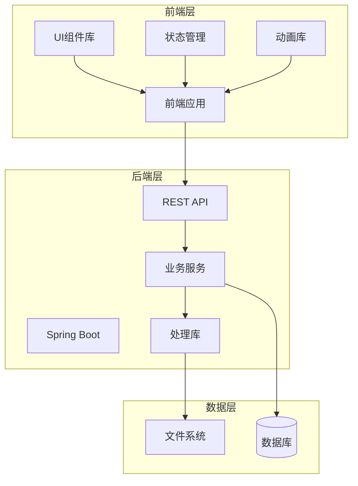
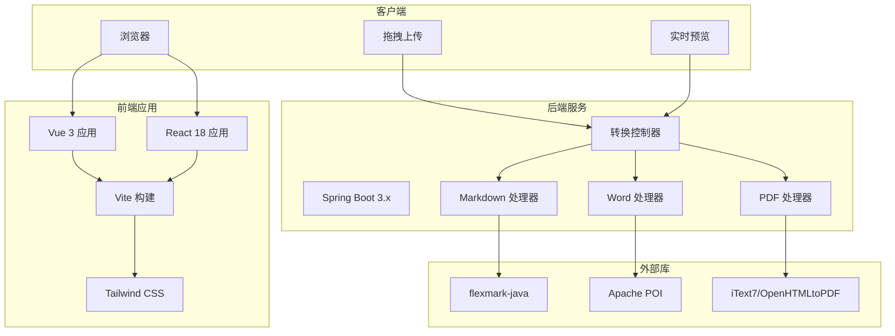
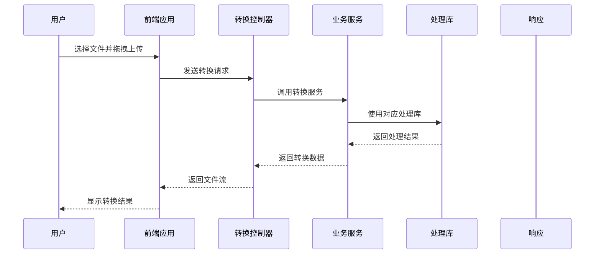

# 技术栈选型

<cite>
**本文档引用的文件**
- [多格式文档互转工具 (SmartConvert) 需求文档.md](file://多格式文档互转工具 (SmartConvert) 需求文档.md)
</cite>

## 目录
1. [引言](#引言)
2. [项目概述](#项目概述)
3. [前端技术栈选型](#前端技术栈选型)
4. [后端技术栈选型](#后端技术栈选型)
5. [技术选型原因分析](#技术选型原因分析)
6. [应用场景与集成方案](#应用场景与集成方案)
7. [架构设计与数据流](#架构设计与数据流)
8. [性能考虑与优化策略](#性能考虑与优化策略)
9. [部署与运维考虑](#部署与运维考虑)
10. [总结与建议](#总结与建议)

## 引言

SmartConvert 是一款基于 Web 的文档格式转换工具，支持 Word、PDF、Text 与 Markdown 之间的双向互转。本文档详细阐述了项目的技术栈选型决策，包括前端和后端技术栈的选择理由、优势分析以及在项目中的具体应用场景，为开发团队提供技术决策依据。

## 项目概述

SmartConvert 旨在为开发者、撰稿人和学生提供一个极简、高效且视觉精美的文档处理平台。项目采用现代化技术栈，结合 Spring Boot 的高性能后端处理引擎和现代化前端框架，实现高保真度的格式转换功能。

**章节来源**
- [多格式文档互转工具 (SmartConvert) 需求文档.md:7-21](file://多格式文档互转工具 (SmartConvert) 需求文档.md#L7-L21)

## 前端技术栈选型

### Vue 3/React 18 框架选择

**Vue 3 选项**：
- **Composition API**：提供更灵活的逻辑组织方式，适合复杂的文档转换状态管理
- **TypeScript 友好**：天然支持类型安全，便于大型项目的维护
- **渐进式框架**：易于集成现有项目，学习曲线相对平缓

**React 18 选项**：
- **并发特性**：支持 Suspense 和并发渲染，提升用户体验
- **生态丰富**：庞大的第三方库生态系统
- **函数式编程**：Hooks 提供更好的状态管理能力

### Vite 构建工具

- **极速开发体验**：基于 ES Modules 的快速热重载
- **原生 ESM 支持**：现代浏览器原生支持，减少打包开销
- **插件生态**：丰富的插件生态系统，支持各种构建需求

### UI 组件库选择

**Element Plus (Vue)**：
- **中文生态完善**：针对中文用户优化的组件库
- **设计规范统一**：与 Vue 生态完美融合
- **文档质量高**：详细的使用文档和示例

**Ant Design (React)**：
- **企业级设计**：阿里巴巴开源的设计体系
- **组件丰富**：涵盖各种业务场景的组件
- **国际化支持**：完善的多语言支持

### 样式库 Tailwind CSS

- **原子化 CSS**：提高开发效率，减少样式冲突
- **响应式设计**：内置响应式工具类
- **主题定制**：支持深度定制和扩展

### 状态管理选择

**Pinia (Vue)**：
- **轻量级**：相比 Vuex 更简洁的 API
- **TypeScript 支持**：原生 TypeScript 类型推断
- **组合式 API**：与 Vue 3 Composition API 完美配合

**Redux Toolkit (React)**：
- **官方推荐**：Redux 官方推荐的状态管理解决方案
- **简化配置**：减少样板代码，提高开发效率
- **不可变更新**：内置 Immer 支持不可变更新

### 动画库选择

**Framer Motion**：
- **流畅动画**：基于 Web Animations API，性能优异
- **手势支持**：内置触摸手势支持
- **简单易用**：直观的 API 设计

**GSAP**：
- **专业级动画**：业界标准的动画库
- **强大功能**：支持复杂的动画序列和控制
- **性能优化**：高度优化的渲染性能

**章节来源**
- [多格式文档互转工具 (SmartConvert) 需求文档.md:25-38](file://多格式文档互转工具 (SmartConvert) 需求文档.md#L25-L38)

## 后端技术栈选型

### Spring Boot 3.x 核心框架

**技术优势**：
- **现代化特性**：支持 Java 17+，充分利用最新语言特性
- **自动配置**：大幅减少配置工作量
- **生产就绪**：内置监控、健康检查等功能
- **微服务友好**：天然支持微服务架构

### 核心处理库

#### flexmark-java (Markdown 解析)

**选择理由**：
- **高性能解析**：专门针对 Markdown 的高性能解析器
- **标准兼容**：完全兼容 CommonMark 规范
- **扩展性强**：支持自定义扩展和处理器
- **内存效率**：优化的内存使用模式

#### Apache POI (Word 处理)

**技术优势**：
- **成熟稳定**：Apache 顶级项目，经过长期验证
- **功能全面**：支持 doc/docx/xlsx 等多种 Office 格式
- **社区活跃**：持续更新和维护
- **文档丰富**：详细的使用指南和示例

#### iText7/OpenHTMLtoPDF (PDF 处理)

**iText7 优势**：
- **企业级功能**：完整的 PDF 处理能力
- **高度定制**：支持复杂的 PDF 操作
- **性能优异**：优化的处理性能

**OpenHTMLtoPDF 替代方案**：
- **开源免费**：完全开源的 HTML 到 PDF 转换
- **轻量级**：相比 iText7 更加轻量
- **易集成**：简单的 API 接口

### 接口文档工具

**Swagger/Knife4j**：
- **Knife4j 增强**：基于 Swagger 的增强版界面
- **实时测试**：内置 API 测试功能
- **文档生成**：自动生成 API 文档
- **多语言支持**：支持中英文界面

### 文件上传处理

**Spring StandardMultipartHttpServletRequest**：
- **标准实现**：遵循 Servlet 标准的文件上传处理
- **安全性**：内置文件类型和大小限制
- **性能优化**：支持大文件分块上传
- **错误处理**：完善的异常处理机制

**章节来源**
- [多格式文档互转工具 (SmartConvert) 需求文档.md:39-56](file://多格式文档互转工具 (SmartConvert) 需求文档.md#L39-L56)

## 技术选型原因分析

### 前端技术栈选型原因

1. **开发效率优先**：Vue 3 和 React 18 都提供了优秀的开发体验，能够显著提升开发效率
2. **性能考虑**：Vite 的快速构建和热重载功能，配合现代浏览器的原生支持
3. **用户体验**：Framer Motion/GSAP 提供流畅的动画体验，提升用户满意度
4. **维护性**：TypeScript 的类型安全确保代码质量和长期维护

### 后端技术栈选型原因

1. **稳定性**：Spring Boot 3.x 结合成熟的第三方库，确保系统稳定性
2. **性能**：各处理库都经过优化，能够满足高并发场景需求
3. **可扩展性**：模块化的架构设计便于功能扩展
4. **开发便利性**：自动配置和丰富的生态减少开发成本

**章节来源**
- [多格式文档互转工具 (SmartConvert) 需求文档.md:23-56](file://多格式文档互转工具 (SmartConvert) 需求文档.md#L23-L56)

## 应用场景与集成方案

### 前端应用场景

1. **拖拽上传组件**：实现仿制 Vercel 或 Apple 风格的拖拽上传区域
2. **实时预览**：左编辑右预览的 Markdown 实时预览窗口
3. **进度反馈**：带有动效的转换进度条显示
4. **批量处理**：支持一次性上传多个文件并打包下载

### 后端应用场景

1. **核心转换接口**：POST /api/convert 实现文件格式转换
2. **历史记录管理**：GET /api/history 查看最近转换记录
3. **系统监控**：GET /api/health 进行系统健康检查
4. **文件处理流程**：从接收文件到返回结果的完整处理链路

### 技术集成方案

**图表来源**
- [多格式文档互转工具 (SmartConvert) 需求文档.md:93-100](file://多格式文档互转工具 (SmartConvert) 需求文档.md#L93-L100)

**章节来源**
- [多格式文档互转工具 (SmartConvert) 需求文档.md:65-100](file://多格式文档互转工具 (SmartConvert) 需求文档.md#L65-L100)

## 架构设计与数据流

### 系统架构图

**图表来源**
- [多格式文档互转工具 (SmartConvert) 需求文档.md:23-56](file://多格式文档互转工具 (SmartConvert) 需求文档.md#L23-L56)

### 数据处理流程

**图表来源**
- [多格式文档互转工具 (SmartConvert) 需求文档.md:145-161](file://多格式文档互转工具 (SmartConvert) 需求文档.md#L145-L161)

**章节来源**
- [多格式文档互转工具 (SmartConvert) 需求文档.md:113-161](file://多格式文档互转工具 (SmartConvert) 需求文档.md#L113-L161)

## 性能考虑与优化策略

### 前端性能优化

1. **代码分割**：利用 Vite 的动态导入实现按需加载
2. **懒加载组件**：对不常用的组件进行懒加载
3. **动画优化**：使用 transform 和 opacity 属性避免重排
4. **缓存策略**：合理使用浏览器缓存和 CDN

### 后端性能优化

1. **连接池配置**：合理配置数据库和文件系统的连接池
2. **异步处理**：对耗时操作使用异步处理机制
3. **内存管理**：及时释放大文件处理过程中的内存
4. **并发控制**：通过线程池控制并发数量

### 存储优化

1. **临时文件清理**：使用定时任务定期清理临时文件
2. **文件压缩**：对大文件进行压缩处理
3. **缓存策略**：对常用转换结果进行缓存

**章节来源**
- [多格式文档互转工具 (SmartConvert) 需求文档.md:165-177](file://多格式文档互转工具 (SmartConvert) 需求文档.md#L165-L177)

## 部署与运维考虑

### 容器化部署

1. **Docker 镜像**：分别构建前端和后端的 Docker 镜像
2. **Docker Compose**：使用 Compose 编排前后端服务
3. **Nginx 反向代理**：前端静态资源由 Nginx 提供服务

### 监控与日志

1. **健康检查**：通过 /api/health 接口进行系统监控
2. **日志聚合**：集中收集和分析应用日志
3. **性能监控**：监控关键指标如响应时间和吞吐量

### 安全考虑

1. **文件类型验证**：严格限制允许的文件类型
2. **大小限制**：设置合理的文件大小限制
3. **临时文件清理**：防止磁盘空间被占满

**章节来源**
- [多格式文档互转工具 (SmartConvert) 需求文档.md:57-63](file://多格式文档互转工具 (SmartConvert) 需求文档.md#L57-L63)

## 总结与建议

SmartConvert 项目的技术栈选型充分考虑了开发效率、性能表现、用户体验和长期维护性。前端采用现代化框架和构建工具，后端基于 Spring Boot 和成熟的处理库，形成了高效稳定的全栈解决方案。

### 关键优势

1. **技术先进性**：选用了当前主流的现代化技术栈
2. **生态完善**：各技术都有活跃的社区和丰富的文档
3. **性能优异**：从框架到处理库都注重性能优化
4. **易于维护**：清晰的架构设计便于长期维护

### 实施建议

1. **分阶段实施**：按照 Roadmap 分阶段推进开发
2. **单元测试**：建立完善的测试体系确保代码质量
3. **文档同步**：保持技术文档与代码同步更新
4. **性能监控**：建立性能监控体系持续优化

这个技术栈选型为 SmartConvert 项目奠定了坚实的技术基础，能够有效支撑项目的开发和后续演进。