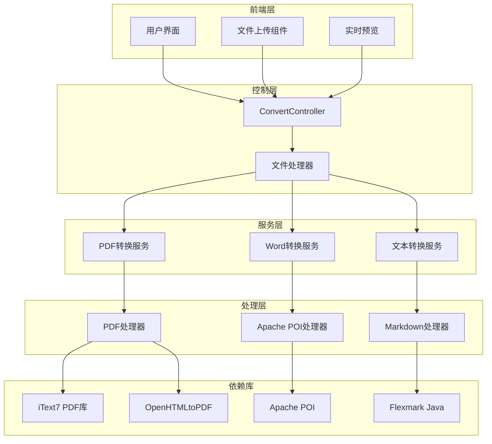
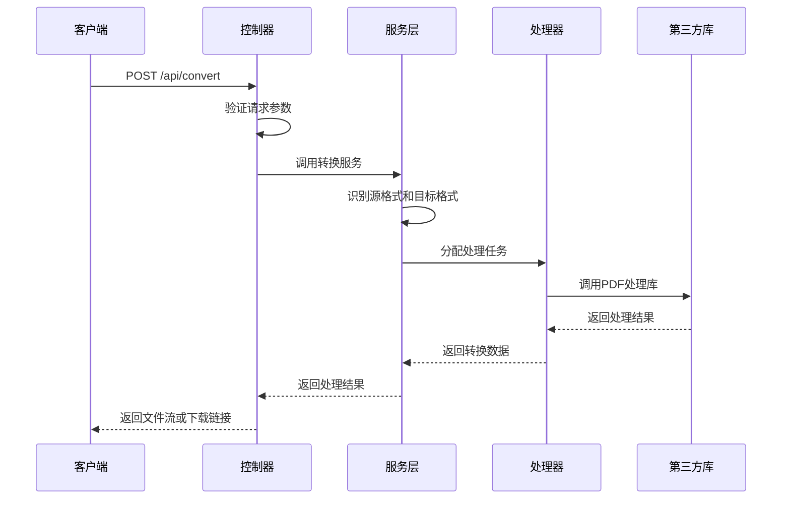
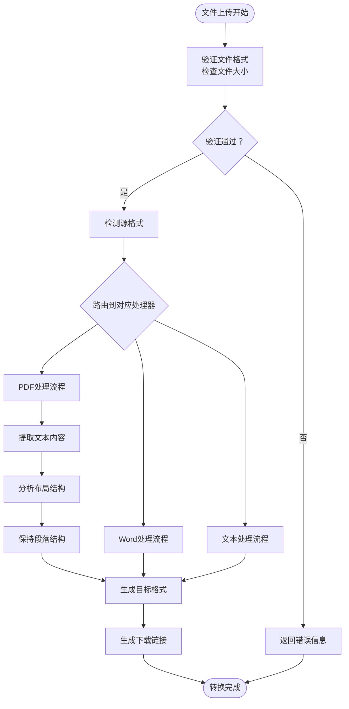
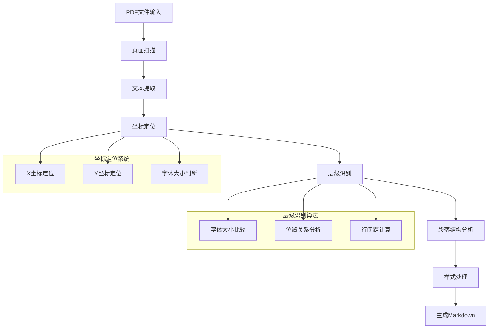
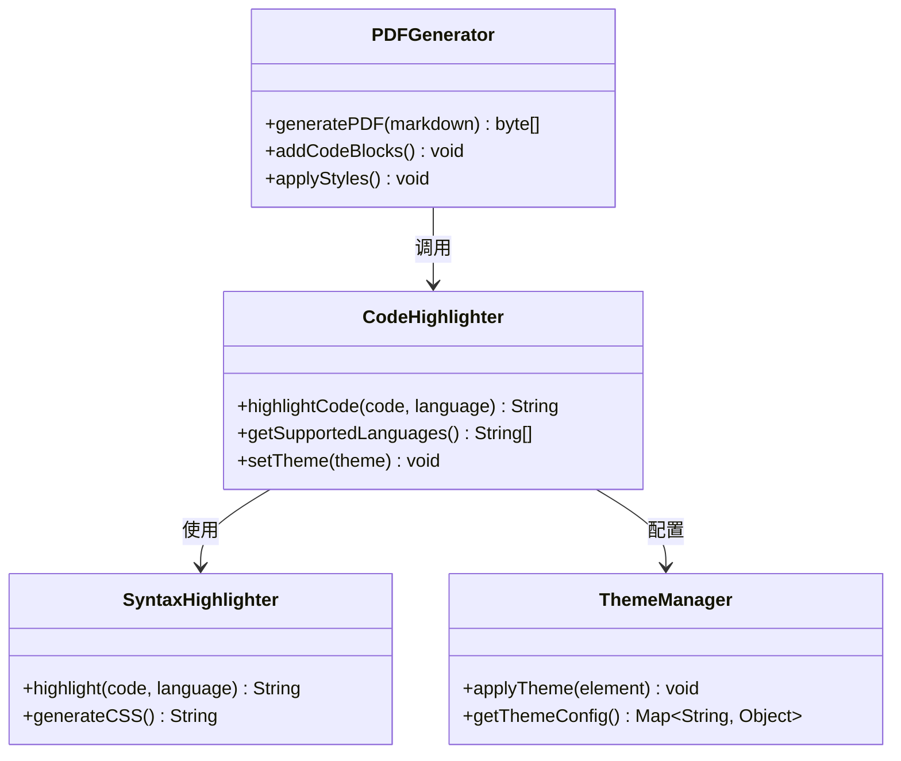
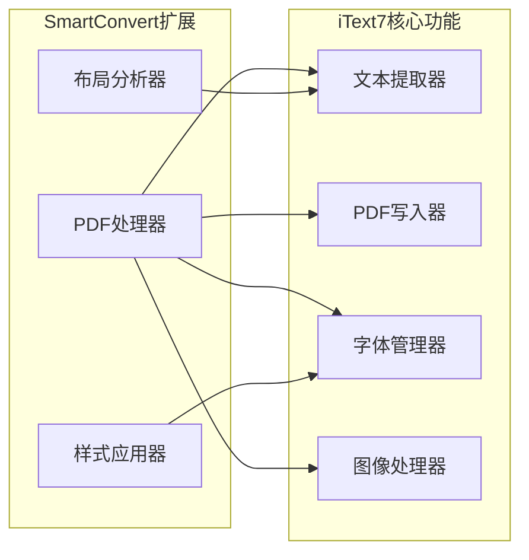
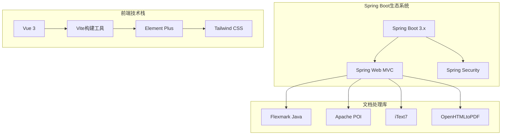
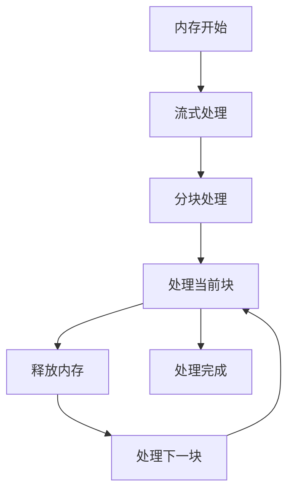

# PDF 文档转换模块

<cite>
**本文档中引用的文件**
- [多格式文档互转工具 (SmartConvert) 需求文档.md](file://多格式文档互转工具 (SmartConvert) 需求文档.md)
</cite>

## 目录
1. [引言](#引言)
2. [项目结构](#项目结构)
3. [核心组件](#核心组件)
4. [架构概览](#架构概览)
5. [详细组件分析](#详细组件分析)
6. [依赖关系分析](#依赖关系分析)
7. [性能考虑](#性能考虑)
8. [故障排除指南](#故障排除指南)
9. [结论](#结论)

## 引言

PDF文档转换模块是SmartConvert多格式文档互转工具的核心功能之一，负责实现PDF与Markdown之间的双向转换。该模块采用现代化的技术栈，结合iText7和OpenHTMLtoPDF库的强大功能，为用户提供高质量的文档格式转换服务。

本模块的主要目标是：
- 实现PDF到Markdown的高保真度文本提取
- 保持文档的层次结构和段落结构
- 处理复杂的PDF布局和表格数据
- 提供从Markdown到PDF的美化导出功能
- 确保转换过程的性能和稳定性

## 项目结构

基于需求文档分析，SmartConvert项目采用分层架构设计，PDF转换模块位于后端服务层中。

**图表来源**
- [多格式文档互转工具 (SmartConvert) 需求文档.md: 23-63](file://多格式文档互转工具 (SmartConvert) 需求文档.md#L23-L63)

**章节来源**
- [多格式文档互转工具 (SmartConvert) 需求文档.md: 65-101](file://多格式文档互转工具 (SmartConvert) 需求文档.md#L65-L101)

## 核心组件

### PDF转换服务 (PDF Conversion Service)

PDF转换服务是模块的核心组件，负责处理PDF文件的各种转换需求。该服务集成了多种处理策略，以应对不同类型的PDF文档。

#### 主要功能特性

1. **双向转换支持**
   - PDF到Markdown转换
   - Markdown到PDF转换
   - 自动格式检测和转换

2. **智能文本提取**
   - 文本层级识别
   - 段落结构保持
   - 字体样式处理
   - 坐标定位系统

3. **布局处理能力**
   - 复杂布局识别
   - 表格数据提取
   - 图片和图形处理
   - 注释和批注处理

#### 技术实现要点

- **多库集成策略**：同时支持iText7和OpenHTMLtoPDF，根据文档类型选择最优处理方案
- **内存优化**：针对大文件进行流式处理，避免内存溢出
- **错误恢复**：提供完善的异常处理和错误恢复机制

**章节来源**
- [多格式文档互转工具 (SmartConvert) 需求文档.md: 73-77](file://多格式文档互转工具 (SmartConvert) 需求文档.md#L73-L77)

### Markdown处理器 (Markdown Processor)

Markdown处理器负责处理Markdown格式的解析、生成和美化工作。

#### 核心功能

1. **Flexmark集成**
   - 完整的Markdown语法支持
   - 扩展语法处理
   - 渲染引擎优化

2. **代码高亮支持**
   - 多语言语法高亮
   - 主题定制
   - 性能优化的渲染

3. **结构保持**
   - 标题层级保持
   - 列表结构维护
   - 表格数据处理

**章节来源**
- [多格式文档互转工具 (SmartConvert) 需求文档.md: 45](file://多格式文档互转工具 (SmartConvert) 需求文档.md#L45)

### 文件处理器 (File Handler)

文件处理器负责处理各种文件格式的上传、验证和转换流程。

#### 主要职责

1. **文件验证**
   - 文件类型检查
   - 大小限制验证
   - 安全性扫描

2. **格式转换协调**
   - 源格式识别
   - 目标格式确定
   - 转换流程调度

3. **结果输出**
   - 文件流生成
   - 下载链接创建
   - 错误信息返回

**章节来源**
- [多格式文档互转工具 (SmartConvert) 需求文档.md: 95](file://多格式文档互转工具 (SmartConvert) 需求文档.md#L95)

## 架构概览

PDF转换模块采用分层架构设计，确保各组件间的松耦合和高内聚。

**图表来源**
- [多格式文档互转工具 (SmartConvert) 需求文档.md: 145-161](file://多格式文档互转工具 (SmartConvert) 需求文档.md#L145-L161)

### 数据流架构

**图表来源**
- [多格式文档互转工具 (SmartConvert) 需求文档.md: 145-161](file://多格式文档互转工具 (SmartConvert) 需求文档.md#L145-L161)

## 详细组件分析

### PDF到Markdown转换算法

#### 文本提取算法

PDF到Markdown转换的核心在于准确提取文本内容并保持其原有的结构特征。

**图表来源**
- [多格式文档互转工具 (SmartConvert) 需求文档.md: 75](file://多格式文档互转工具 (SmartConvert) 需求文档.md#L75)

#### 文本层级识别机制

层级识别是PDF到Markdown转换的关键技术，主要通过以下几种方式实现：

1. **字体大小分析**
   - 通过比较不同文本的字体大小来判断标题层级
   - 建立字体大小与Markdown标题级别的映射关系

2. **位置关系分析**
   - 分析文本在页面中的垂直位置
   - 结合行间距和段落间距判断内容层次

3. **内容特征识别**
   - 标题文本的特殊格式特征
   - 段落开头的缩进和格式

#### 段落结构保持策略

为了保持原文档的段落结构，系统采用以下策略：

1. **段落边界检测**
   - 通过行间距和段落间距判断段落边界
   - 识别列表项和引用块的特殊格式

2. **空白行处理**
   - 正确处理段落间的空行
   - 保持列表项的缩进格式

3. **连续性维护**
   - 确保同一段落内容的连续性
   - 避免不必要的换行和空格

#### 复杂布局处理

对于包含复杂布局的PDF文档，系统采用以下处理策略：

1. **表格数据提取**
   - 识别表格边框和行列结构
   - 提取表格单元格内容并转换为Markdown表格

2. **多栏布局处理**
   - 识别多栏文本布局
   - 按顺序重新排列文本内容

3. **图片和图形处理**
   - 提取图片和图形的位置信息
   - 生成相应的Markdown占位符

**章节来源**
- [多格式文档互转工具 (SmartConvert) 需求文档.md: 73-77](file://多格式文档互转工具 (SmartConvert) 需求文档.md#L73-L77)

### Markdown到PDF转换实现

#### 代码高亮渲染

Markdown到PDF转换过程中，代码高亮是一个重要的功能特性。

**图表来源**
- [多格式文档互转工具 (SmartConvert) 需求文档.md: 77](file://多格式文档互转工具 (SmartConvert) 需求文档.md#L77)

#### 字体样式处理

字体样式处理确保转换后的PDF文档具有良好的可读性和美观性。

1. **字体嵌入**
   - 支持常用字体的嵌入
   - 处理字体版权和许可证问题

2. **样式继承**
   - 保持Markdown原始样式
   - 自定义CSS样式的应用

3. **响应式设计**
   - 适配不同页面尺寸
   - 优化打印效果

#### 页面布局优化

页面布局优化确保转换后的PDF文档具有专业的外观。

1. **页边距设置**
   - 标准化的页边距配置
   - 适应不同纸张尺寸

2. **分页控制**
   - 避免代码块被截断
   - 表格的跨页处理

3. **目录生成**
   - 自动生成文档目录
   - 书签的创建和管理

**章节来源**
- [多格式文档互转工具 (SmartConvert) 需求文档.md: 77](file://多格式文档互转工具 (SmartConvert) 需求文档.md#L77)

### 第三方库集成

#### iText7库使用

iText7是PDF处理领域的领先库，在SmartConvert中发挥重要作用。

**图表来源**
- [多格式文档互转工具 (SmartConvert) 需求文档.md: 49](file://多格式文档互转工具 (SmartConvert) 需求文档.md#L49)

#### OpenHTMLtoPDF库集成

OpenHTMLtoPDF提供了将HTML转换为PDF的强大功能。

1. **HTML渲染**
   - 完整的CSS支持
   - JavaScript执行能力

2. **PDF生成**
   - 高质量的PDF输出
   - 支持现代Web标准

3. **性能优化**
   - 流式处理
   - 内存使用优化

**章节来源**
- [多格式文档互转工具 (SmartConvert) 需求文档.md: 49](file://多格式文档互转工具 (SmartConvert) 需求文档.md#L49)

## 依赖关系分析

### 核心依赖库

SmartConvert项目的核心依赖库及其作用：

**图表来源**
- [多格式文档互转工具 (SmartConvert) 需求文档.md: 23-56](file://多格式文档互转工具 (SmartConvert) 需求文档.md#L23-L56)

### 依赖版本管理

项目采用Maven进行依赖管理，确保版本兼容性和安全性。

#### 关键依赖版本

| 依赖库 | 版本 | 用途 |
|--------|------|------|
| Spring Boot | 3.x | 核心框架 |
| flexmark-java | 0.64.0 | Markdown解析 |
| Apache POI | 5.2.3 | Word文档处理 |
| iText7 | 7.2.5 | PDF处理 |

**章节来源**
- [多格式文档互转工具 (SmartConvert) 需求文档.md: 115-139](file://多格式文档互转工具 (SmartConvert) 需求文档.md#L115-L139)

## 性能考虑

### 转换性能优化

为了满足性能要求（单个10MB以内文档转换时间应在3秒内完成），系统采用多种优化策略：

1. **流式处理**
   - 避免将整个文件加载到内存
   - 分块处理大文件

2. **并发处理**
   - 多线程并行处理
   - 异步任务队列

3. **缓存策略**
   - 常用字体和样式缓存
   - 中间结果缓存

### 内存管理

### 性能监控

系统提供性能监控功能，包括：
- 转换时间统计
- 内存使用监控
- 错误率跟踪

## 故障排除指南

### 常见问题及解决方案

#### PDF转换失败

**问题症状**：PDF转换过程中出现异常或转换结果不完整

**可能原因**：
1. PDF文件损坏或加密
2. 字体嵌入问题
3. 内存不足

**解决步骤**：
1. 验证PDF文件完整性
2. 检查字体嵌入状态
3. 增加系统内存

#### 转换质量不佳

**问题症状**：转换后的Markdown格式不正确或丢失样式

**可能原因**：
1. 复杂布局识别失败
2. 字体大小计算错误
3. 坐标定位不准确

**解决步骤**：
1. 调整层级识别算法参数
2. 优化坐标定位精度
3. 增强布局分析能力

#### 性能问题

**问题症状**：转换速度慢或内存使用过高

**解决步骤**：
1. 实施流式处理优化
2. 增加并发处理能力
3. 实现智能缓存策略

### 错误处理机制

系统采用多层次的错误处理机制：

1. **输入验证**
   - 文件格式检查
   - 文件大小限制
   - 安全性扫描

2. **转换过程监控**
   - 实时进度跟踪
   - 异常捕获和处理
   - 自动重试机制

3. **结果验证**
   - 转换质量检查
   - 文件完整性验证
   - 用户反馈收集

**章节来源**
- [多格式文档互转工具 (SmartConvert) 需求文档.md: 165-176](file://多格式文档互转工具 (SmartConvert) 需求文档.md#L165-L176)

## 结论

PDF文档转换模块是SmartConvert项目的核心功能之一，通过集成先进的PDF处理技术和优化的转换算法，为用户提供了高质量的文档格式转换服务。

### 主要成就

1. **技术先进性**：采用iText7和OpenHTMLtoPDF等业界领先的PDF处理库
2. **功能完整性**：实现了PDF与Markdown之间的双向转换
3. **性能优化**：通过流式处理和并发优化确保快速转换
4. **质量保证**：建立了完善的错误处理和质量监控机制

### 未来发展方向

1. **AI增强**：集成机器学习算法提高布局识别准确性
2. **云端集成**：支持云存储和协作功能
3. **移动端支持**：开发移动应用版本
4. **插件生态**：建立第三方插件支持系统

该模块为SmartConvert项目奠定了坚实的技术基础，为后续功能扩展和性能优化提供了清晰的发展方向。