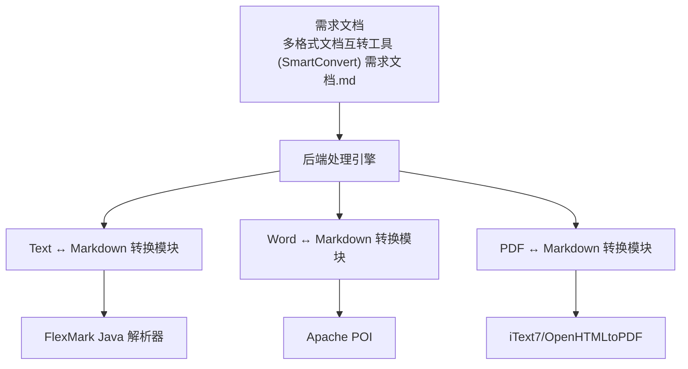
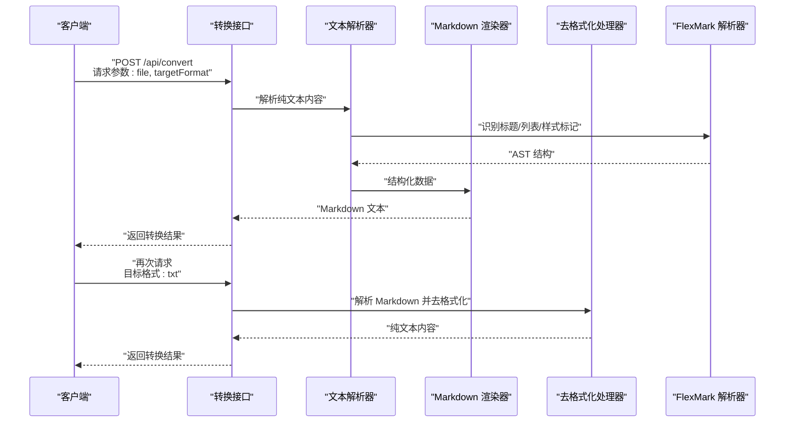
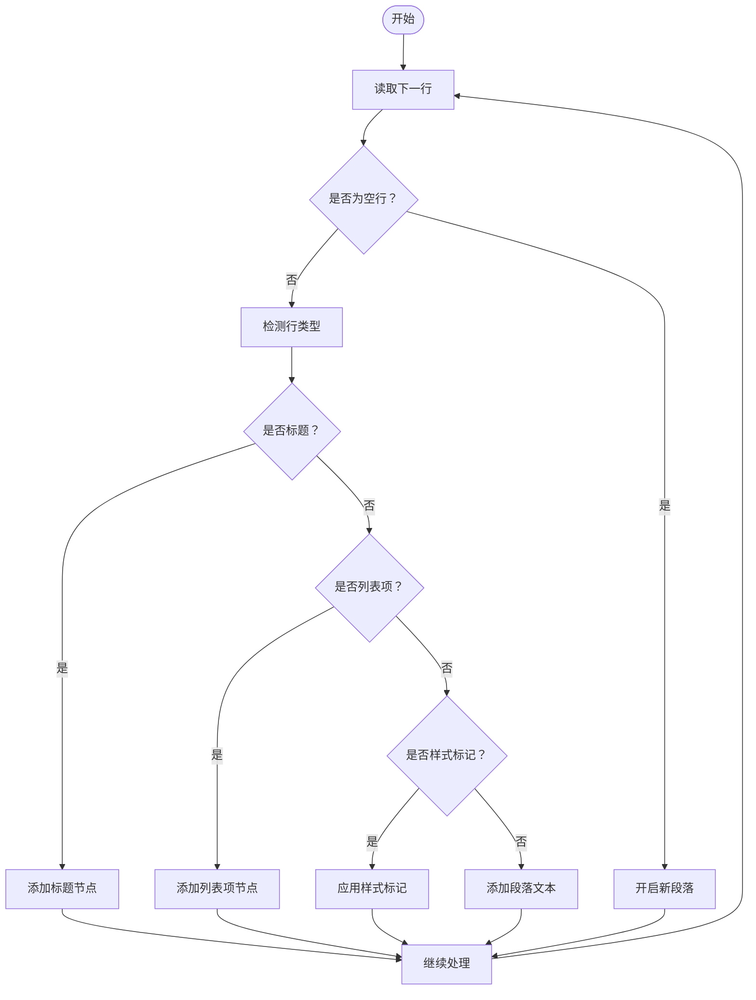
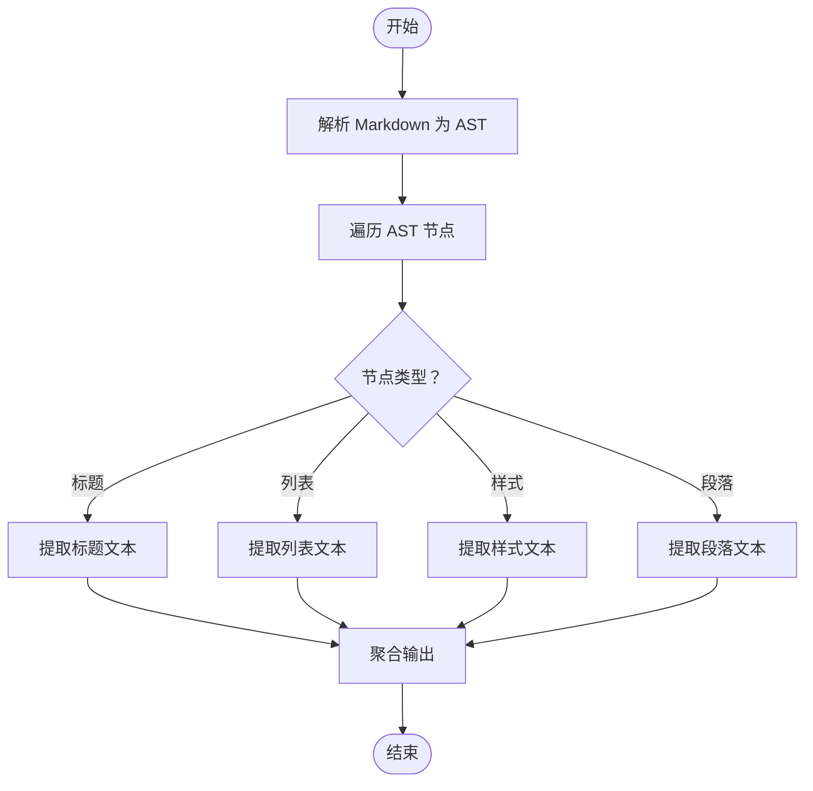
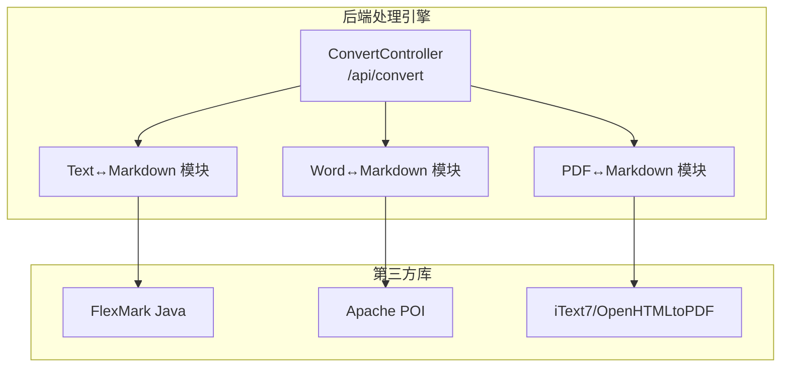

# Text 文档转换模块

<cite>
**本文引用的文件**
- [多格式文档互转工具 (SmartConvert) 需求文档.md](file://多格式文档互转工具 (SmartConvert) 需求文档.md)
</cite>

## 目录
1. [引言](#引言)
2. [项目结构](#项目结构)
3. [核心组件](#核心组件)
4. [架构总览](#架构总览)
5. [详细组件分析](#详细组件分析)
6. [依赖关系分析](#依赖关系分析)
7. [性能考虑](#性能考虑)
8. [故障排除指南](#故障排除指南)
9. [结论](#结论)
10. [附录](#附录)

## 引言
本文件面向 Text (.txt) ↔ Markdown 转换模块，提供从概念到实现的完整技术文档。该模块负责将纯文本内容封装为 Markdown 格式，或将 Markdown 内容去格式化为纯文本，确保在双向转换过程中尽可能保留内容的语义结构与可读性。文档覆盖段落识别、标题标记、列表格式化、基础样式标记、标签移除、样式剥离、内容净化、编码处理与字符集兼容性，并给出对 CSV、JSON、XML 等结构化数据的扩展方案与质量控制方法。

## 项目结构
当前仓库包含一份需求文档，描述了 SmartConvert 工具的整体架构与技术选型。Text ↔ Markdown 转换模块属于后端处理引擎的一部分，与 Word、PDF 转换模块共同构成核心转换能力。

图表来源
- [多格式文档互转工具 (SmartConvert) 需求文档.md](file://多格式文档互转工具 (SmartConvert) 需求文档.md#L45-L51)

章节来源
- [多格式文档互转工具 (SmartConvert) 需求文档.md](file://多格式文档互转工具 (SmartConvert) 需求文档.md#L67-L79)

## 核心组件
- 文本解析器：负责识别段落、标题、列表、基础样式标记等结构化元素。
- Markdown 渲染器：将解析后的结构化数据渲染为 Markdown 文本。
- 去格式化处理器：将 Markdown 文本还原为纯文本，移除标签与样式。
- 编码与字符集适配器：统一输入输出编码，保证跨平台兼容性。
- 扩展转换器：为 CSV、JSON、XML 等结构化数据提供转换策略与质量控制。

章节来源
- [多格式文档互转工具 (SmartConvert) 需求文档.md](file://多格式文档互转工具 (SmartConvert) 需求文档.md#L79-L79)

## 架构总览
Text ↔ Markdown 转换模块在后端处理引擎中承担“格式桥接”的角色，通过统一的转换接口对外提供服务。其核心流程如下：

图表来源
- [多格式文档互转工具 (SmartConvert) 需求文档.md](file://多格式文档互转工具 (SmartConvert) 需求文档.md#L95-L95)
- [多格式文档互转工具 (SmartConvert) 需求文档.md](file://多格式文档互转工具 (SmartConvert) 需求文档.md#L45-L45)

## 详细组件分析

### 文本解析器（纯文本到 Markdown）
职责
- 识别段落边界与空行分隔。
- 识别潜在标题行（如以特定前缀或格式开头的行）。
- 识别列表项（如以连字符、数字、符号等开头的行）。
- 识别基础样式标记（如加粗、斜体、删除线等 Markdown 语法）。
- 将识别到的结构映射为内部 AST 结构，便于后续渲染。

解析算法要点
- 行级扫描：逐行读取，维护上下文状态（是否处于列表、标题、段落等）。
- 上下文感知：根据上一行的类型决定当前行的归属类别。
- 样式标记识别：对常见 Markdown 语法进行正则匹配与标记。
- 列表规范化：统一列表缩进与标记符号，确保渲染一致性。

图表来源
- [多格式文档互转工具 (SmartConvert) 需求文档.md](file://多格式文档互转工具 (SmartConvert) 需求文档.md#L79-L79)

章节来源
- [多格式文档互转工具 (SmartConvert) 需求文档.md](file://多格式文档互转工具 (SmartConvert) 需求文档.md#L79-L79)

### Markdown 渲染器（Markdown 到纯文本）
职责
- 解析 Markdown 文本，构建 AST。
- 移除所有标签与样式标记，仅保留纯文本内容。
- 对列表、标题等结构进行净化处理，保留必要的层级信息但去除格式。

渲染算法要点
- AST 解析：利用 FlexMark 解析 Markdown，获取结构化 AST。
- 节点遍历：递归遍历 AST，按需提取文本节点。
- 标签剥离：遇到标题、列表、样式等节点时，按规则剥离标签，保留纯文本。
- 内容净化：对特殊字符进行转义或替换，确保输出文本的可读性与兼容性。

图表来源
- [多格式文档互转工具 (SmartConvert) 需求文档.md](file://多格式文档互转工具 (SmartConvert) 需求文档.md#L45-L45)

章节来源
- [多格式文档互转工具 (SmartConvert) 需求文档.md](file://多格式文档互转工具 (SmartConvert) 需求文档.md#L45-L45)

### 编码与字符集适配器
职责
- 统一输入编码（UTF-8、GBK、GB2312 等），避免乱码。
- 输出文本采用 UTF-8 编码，确保跨平台兼容。
- 处理 BOM、换行符差异（CRLF/LF）与不可见字符。

适配策略
- 自动检测编码：优先使用 BOM 与字节序特征判断编码。
- 回退策略：若自动检测失败，回退到默认编码并提示用户。
- 规范化换行：统一为 LF，避免跨平台差异。
- 安全过滤：剔除控制字符与不可见字符，保留可见文本。

章节来源
- [多格式文档互转工具 (SmartConvert) 需求文档.md](file://多格式文档互转工具 (SmartConvert) 需求文档.md#L167-L173)

### 扩展转换器（CSV/JSON/XML）
职责
- 为结构化数据提供专用转换策略，提升转换质量与可读性。
- 在 Text ↔ Markdown 之间建立桥梁，使结构化数据也能被正确呈现。

策略与规则
- CSV：将首行作为表头，其余行作为数据行；以表格形式渲染为 Markdown，或以纯文本逗号分隔。
- JSON：将键值对以列表或表格形式呈现；支持嵌套对象的层级展示。
- XML：将标签名作为标题或列表项，属性与文本内容分别处理；必要时转换为表格或纯文本。

质量控制
- 结构验证：确保结构化数据格式正确，避免转换异常。
- 字段清洗：剔除无效字段与多余空白，保留关键信息。
- 格式优化：统一缩进与对齐，提升可读性。

章节来源
- [多格式文档互转工具 (SmartConvert) 需求文档.md](file://多格式文档互转工具 (SmartConvert) 需求文档.md#L79-L79)

## 依赖关系分析
- FlexMark Java：用于解析 Markdown 文本并生成 AST，支撑去格式化与渲染。
- Apache POI：用于 Word 文档处理，与 Text ↔ Markdown 模块协同工作。
- iText7/OpenHTMLtoPDF：用于 PDF 文档处理，与 Text ↔ Markdown 模块协同工作。
- Spring Boot：提供统一的后端处理框架与转换接口。

图表来源
- [多格式文档互转工具 (SmartConvert) 需求文档.md](file://多格式文档互转工具 (SmartConvert) 需求文档.md#L45-L51)
- [多格式文档互转工具 (SmartConvert) 需求文档.md](file://多格式文档互转工具 (SmartConvert) 需求文档.md#L95-L95)

章节来源
- [多格式文档互转工具 (SmartConvert) 需求文档.md](file://多格式文档互转工具 (SmartConvert) 需求文档.md#L45-L51)

## 性能考虑
- 流式处理：对大文件采用流式读取与写入，降低内存占用。
- 并行化：在多核环境下对独立文件转换进行并行处理。
- 缓存策略：对常用格式的解析规则进行缓存，减少重复计算。
- 超时控制：设置合理的超时阈值，避免长时间阻塞。
- 压缩输出：对转换结果进行压缩，减少网络传输开销。

## 故障排除指南
- 编码问题：若出现乱码，检查输入编码并启用自动检测与回退策略。
- 格式不一致：若转换结果与预期不符，检查解析规则与样式标记识别逻辑。
- 性能瓶颈：监控内存与 CPU 使用情况，优化流式处理与并行化策略。
- 文件过大：对超过阈值的文件进行拆分或提示用户调整文件大小。
- 安全风险：严格校验上传文件类型与内容，防止恶意脚本注入。

章节来源
- [多格式文档互转工具 (SmartConvert) 需求文档.md](file://多格式文档互转工具 (SmartConvert) 需求文档.md#L167-L173)

## 结论
Text ↔ Markdown 转换模块通过结构化的解析与渲染流程，在保证内容语义完整性的同时，实现了高效的双向转换。结合编码适配、扩展转换与质量控制机制，能够满足多样化的文本处理需求。随着 Word、PDF 模块的完善，整体转换引擎将形成统一、稳定、可扩展的解决方案。

## 附录
- 接口规范：POST /api/convert，支持 file 与 targetFormat 参数。
- 兼容性：UTF-8 编码，跨平台换行符统一为 LF。
- 扩展性：预留 CSV/JSON/XML 转换策略，支持未来格式扩展。

章节来源
- [多格式文档互转工具 (SmartConvert) 需求文档.md](file://多格式文档互转工具 (SmartConvert) 需求文档.md#L95-L95)
- [多格式文档互转工具 (SmartConvert) 需求文档.md](file://多格式文档互转工具 (SmartConvert) 需求文档.md#L167-L173)