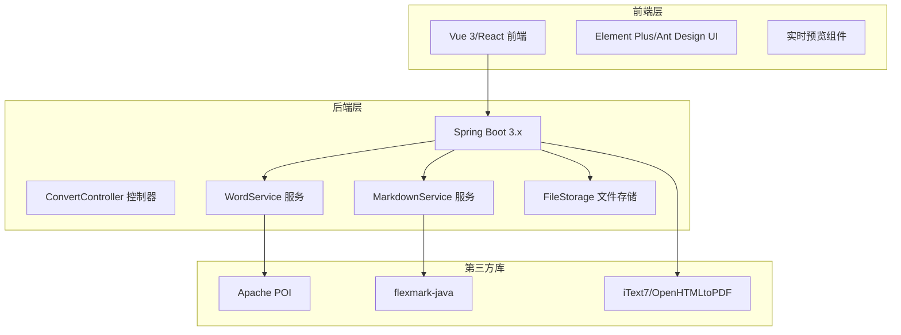
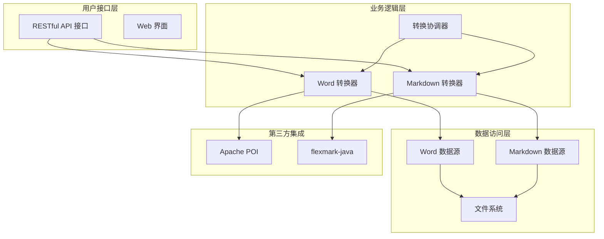
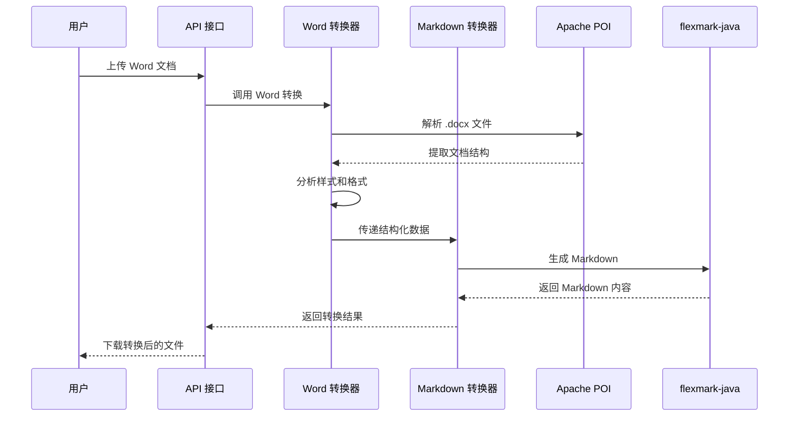
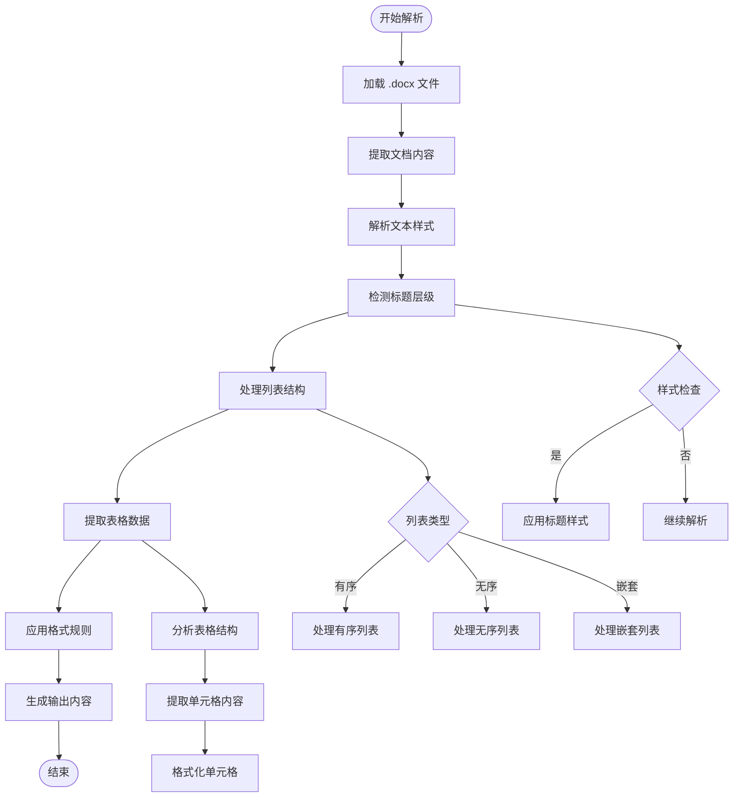
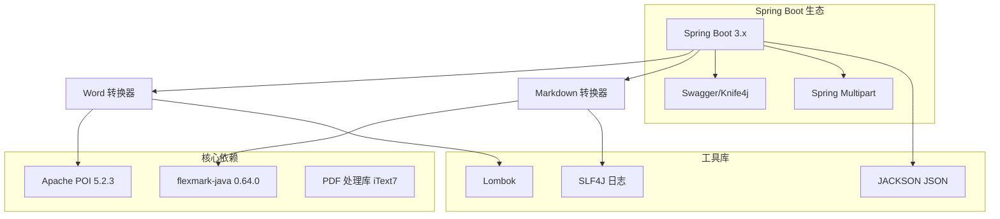
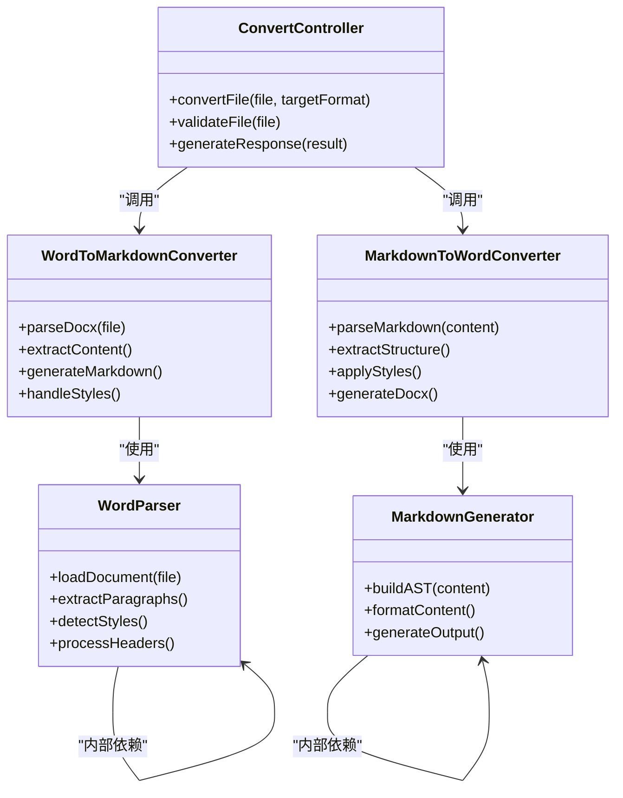
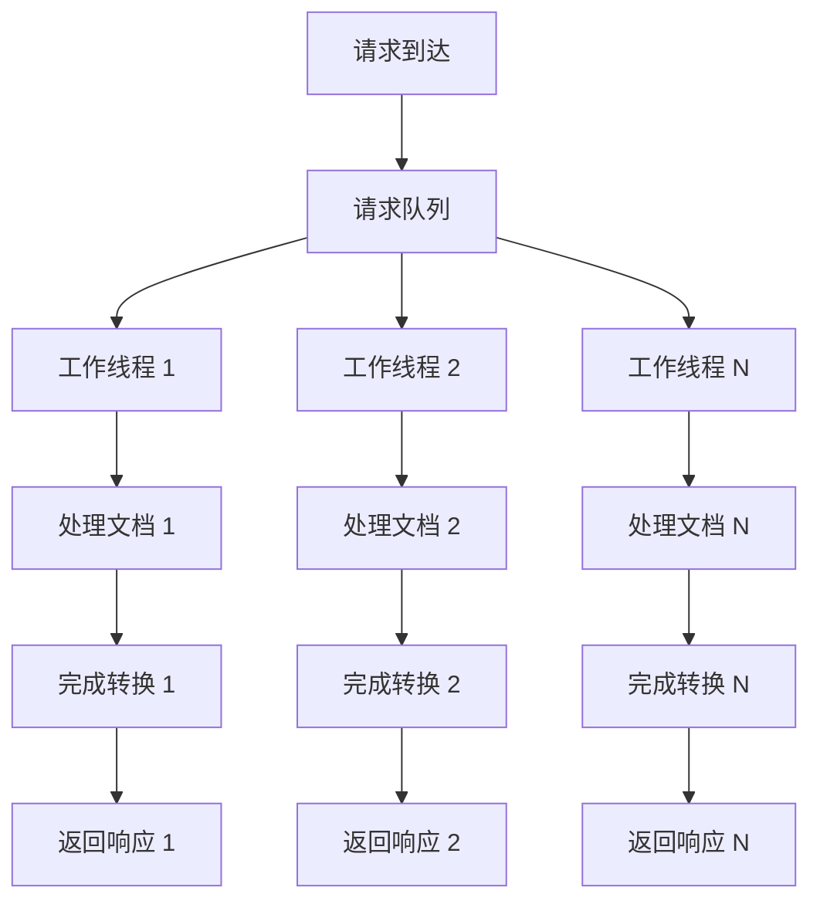
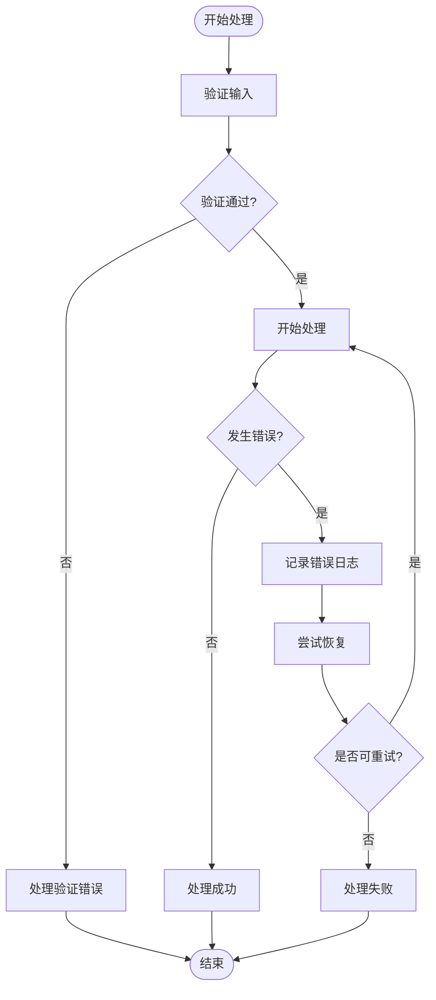

# Word 文档转换模块

<cite>
**本文档引用的文件**
- [多格式文档互转工具 (SmartConvert) 需求文档.md](file://多格式文档互转工具 (SmartConvert) 需求文档.md)
</cite>

## 目录
1. [引言](#引言)
2. [项目结构](#项目结构)
3. [核心组件](#核心组件)
4. [架构概览](#架构概览)
5. [详细组件分析](#详细组件分析)
6. [依赖关系分析](#依赖关系分析)
7. [性能考虑](#性能考虑)
8. [故障排除指南](#故障排除指南)
9. [结论](#结论)
10. [附录](#附录)

## 引言

Word 文档转换模块是 SmartConvert 多格式文档互转工具的核心功能之一，专门负责 Word (.docx) 文档与 Markdown 格式之间的双向转换。该模块基于 Apache POI 库实现 Word 文档的解析和处理，通过 flexmark-java 库实现 Markdown 的解析和生成，确保在转换过程中能够准确保留文档的重要格式信息。

本模块的主要目标是实现高保真度的格式转换，包括标题层级识别、列表结构处理、表格数据提取、以及加粗、斜体等文本样式的保留策略。同时，还需要处理 Markdown 到 Word 的反向转换逻辑，包括格式回填、样式映射和结构完整性保证。

## 项目结构

基于需求文档分析，SmartConvert 项目采用前后端分离的架构设计：

**图表来源**
- [多格式文档互转工具 (SmartConvert) 需求文档.md: 23-63](file://多格式文档互转工具 (SmartConvert) 需求文档.md#L23-L63)

**章节来源**
- [多格式文档互转工具 (SmartConvert) 需求文档.md: 65-101](file://多格式文档互转工具 (SmartConvert) 需求文档.md#L65-L101)

## 核心组件

### Word 文档处理组件

Word 文档处理组件是转换模块的核心，主要负责使用 Apache POI 库解析 .docx 文件并提取结构化数据。

#### 主要职责
- 解析 Word 文档结构和内容
- 提取段落、标题、列表、表格等元素
- 识别和处理文本样式（加粗、斜体、下划线等）
- 保存文档元数据和格式信息

#### 关键技术特性
- 支持复杂的文档结构解析
- 实时样式检测和映射
- 内存优化的数据处理策略
- 错误恢复和容错机制

### Markdown 处理组件

Markdown 处理组件负责使用 flexmark-java 库进行 Markdown 文档的解析和生成。

#### 主要职责
- 解析 Markdown 语法结构
- 生成标准的 Markdown 输出
- 处理特殊字符和编码问题
- 维护文档的语义完整性

#### 关键技术特性
- 完整的 Markdown 语法支持
- 扩展性良好的解析器配置
- 高效的内存使用策略
- 兼容多种 Markdown 变体

### 转换协调器

转换协调器负责协调 Word 和 Markdown 两个方向的转换过程，确保数据流的正确传递和格式的一致性。

#### 主要职责
- 管理转换流程的状态
- 处理跨格式的数据映射
- 实施错误处理和恢复策略
- 优化转换性能和资源使用

**章节来源**
- [多格式文档互转工具 (SmartConvert) 需求文档.md: 113-163](file://多格式文档互转工具 (SmartConvert) 需求文档.md#L113-L163)

## 架构概览

Word 文档转换模块采用分层架构设计，确保各组件之间的松耦合和高内聚：

**图表来源**
- [多格式文档互转工具 (SmartConvert) 需求文档.md: 141-161](file://多格式文档互转工具 (SmartConvert) 需求文档.md#L141-L161)

### 数据流处理

转换过程涉及复杂的数据流处理，需要确保数据在不同格式之间正确转换：

**图表来源**
- [多格式文档互转工具 (SmartConvert) 需求文档.md: 145-160](file://多格式文档互转工具 (SmartConvert) 需求文档.md#L145-L160)

## 详细组件分析

### Word 文档解析器

Word 文档解析器是转换模块的基础组件，负责将 .docx 文件解析为内部表示的数据结构。

#### 核心功能模块

##### 标题层级识别
- 自动检测文档中的标题级别（H1-H6）
- 识别基于样式和格式的标题标记
- 维护标题的层次结构关系
- 处理嵌套标题和标题组合

##### 列表结构处理
- 区分有序列表和无序列表
- 识别嵌套列表和子列表
- 提取列表项的文本内容
- 保持列表的缩进和层次关系

##### 表格数据提取
- 解析表格的行列结构
- 提取单元格内容和格式
- 处理合并单元格和复杂表格
- 生成标准的 Markdown 表格格式

##### 文本样式处理
- 识别和提取文本样式（加粗、斜体、下划线）
- 处理字体大小、颜色等样式属性
- 保持内联代码和特殊字符
- 处理文本装饰和效果

#### 实现策略

**图表来源**
- [多格式文档互转工具 (SmartConvert) 需求文档.md: 71](file://多格式文档互转工具 (SmartConvert) 需求文档.md#L71)

### Markdown 生成器

Markdown 生成器负责将解析得到的结构化数据转换为标准的 Markdown 格式。

#### 生成策略

##### 标题层级映射
- 将 Word 样式映射到相应的 Markdown 标题级别
- 保持标题的层次结构和语义
- 处理标题的特殊字符和格式

##### 列表格式化
- 生成标准的 Markdown 列表语法
- 维护列表的嵌套层次
- 处理复杂列表结构的转换

##### 表格格式化
- 生成标准的 Markdown 表格语法
- 处理对齐和格式化
- 保持表格的结构完整性

##### 样式保留策略
- 使用 Markdown 标准语法保留文本样式
- 处理嵌入式样式和装饰
- 优化输出格式的可读性

### 反向转换处理器

反向转换处理器负责将 Markdown 文档转换回 Word 格式，确保格式的完整性和准确性。

#### 转换策略

##### 结构映射
- 将 Markdown 结构映射到 Word 段落和样式
- 维护文档的层次结构
- 处理复杂文档结构的转换

##### 样式回填
- 将 Markdown 样式转换为 Word 样式
- 保持文本格式的一致性
- 处理样式冲突和优先级

##### 格式完整性保证
- 确保转换后的文档结构完整
- 验证格式的有效性和一致性
- 处理转换过程中的数据丢失

**章节来源**
- [多格式文档互转工具 (SmartConvert) 需求文档.md: 67-78](file://多格式文档互转工具 (SmartConvert) 需求文档.md#L67-L78)

## 依赖关系分析

### 外部库依赖

Word 文档转换模块依赖于多个第三方库来实现核心功能：

**图表来源**
- [多格式文档互转工具 (SmartConvert) 需求文档.md: 119-139](file://多格式文档互转工具 (SmartConvert) 需求文档.md#L119-L139)

### 内部组件依赖

模块内部组件之间的依赖关系确保了清晰的职责分离和良好的可维护性：

**图表来源**
- [多格式文档互转工具 (SmartConvert) 需求文档.md: 145-160](file://多格式文档互转工具 (SmartConvert) 需求文档.md#L145-L160)

**章节来源**
- [多格式文档互转工具 (SmartConvert) 需求文档.md: 23-56](file://多格式文档互转工具 (SmartConvert) 需求文档.md#L23-L56)

## 性能考虑

### 内存优化策略

为了处理大型文档而不影响系统性能，转换模块采用了多种内存优化策略：

#### 流式处理
- 使用流式 API 处理大型文档
- 避免一次性加载整个文档到内存
- 实现渐进式数据处理和输出

#### 对象池管理
- 复用 Apache POI 对象实例
- 减少垃圾回收压力
- 优化内存分配和释放

#### 缓存策略
- 缓存常用的样式和格式信息
- 避免重复计算和解析
- 实现智能的缓存失效机制

### 并发处理能力

模块设计支持并发处理多个转换请求：

**图表来源**
- [多格式文档互转工具 (SmartConvert) 需求文档.md: 167](file://多格式文档互转工具 (SmartConvert) 需求文档.md#L167)

### 性能监控指标

为了确保系统性能稳定，建议监控以下关键指标：
- 转换时间分布
- 内存使用峰值
- 并发处理能力
- 错误率和重试次数

**章节来源**
- [多格式文档互转工具 (SmartConvert) 需求文档.md: 165-177](file://多格式文档互转工具 (SmartConvert) 需求文档.md#L165-L177)

## 故障排除指南

### 常见问题及解决方案

#### 文档解析失败
- **症状**: 转换过程中出现解析异常
- **原因**: 文档格式损坏或不支持的格式
- **解决方案**: 
  - 验证文档的完整性和格式有效性
  - 提供降级处理和错误恢复机制
  - 记录详细的错误日志便于诊断

#### 样式丢失问题
- **症状**: 转换后的文档样式不完整
- **原因**: 样式映射不准确或格式不兼容
- **解决方案**:
  - 实现更精确的样式检测和映射
  - 提供样式配置选项
  - 建立样式对照表和测试用例

#### 内存溢出问题
- **症状**: 处理大型文档时出现内存不足
- **原因**: 大量对象未及时释放或内存泄漏
- **解决方案**:
  - 实施流式处理和对象池管理
  - 优化数据结构和算法
  - 添加内存使用监控

### 错误处理机制

**图表来源**
- [多格式文档互转工具 (SmartConvert) 需求文档.md: 171](file://多格式文档互转工具 (SmartConvert) 需求文档.md#L171)

### 调试和诊断

为了有效调试转换问题，建议实施以下诊断措施：
- 详细的日志记录和追踪
- 中间结果的可视化展示
- 性能瓶颈的识别和分析
- 错误恢复和重试机制

**章节来源**
- [多格式文档互转工具 (SmartConvert) 需求文档.md: 169-174](file://多格式文档互转工具 (SmartConvert) 需求文档.md#L169-L174)

## 结论

Word 文档转换模块作为 SmartConvert 工具的核心功能，通过精心设计的架构和实现策略，实现了高保真的 Word 与 Markdown 之间的双向转换。该模块不仅满足了基本的格式转换需求，还通过多种优化策略确保了系统的性能和稳定性。

模块的关键优势包括：
- 基于 Apache POI 和 flexmark-java 的成熟技术栈
- 完善的错误处理和恢复机制
- 高效的内存管理和并发处理能力
- 灵活的样式映射和格式保持策略

未来的发展方向包括进一步优化转换精度、扩展更多格式支持、以及提升用户体验等方面。

## 附录

### 最佳实践指导

#### 代码组织最佳实践
- 采用分层架构设计，明确各层职责
- 实现接口抽象，提高代码可测试性
- 使用工厂模式创建复杂对象
- 实施依赖注入，降低耦合度

#### 性能优化最佳实践
- 实施缓存策略，减少重复计算
- 使用流式处理，避免内存溢出
- 实现异步处理，提升响应速度
- 优化数据库查询，减少等待时间

#### 安全性最佳实践
- 实施输入验证和过滤
- 使用安全的文件处理方式
- 实施权限控制和访问限制
- 定期更新依赖库，修复安全漏洞

### 参考资料

- Apache POI 官方文档和示例
- flexmark-java 语法参考和配置指南
- Spring Boot 官方教程和最佳实践
- Markdown 语法规范和标准