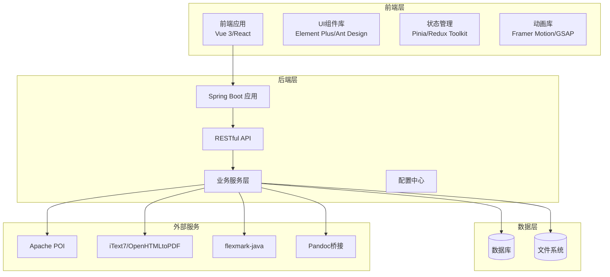
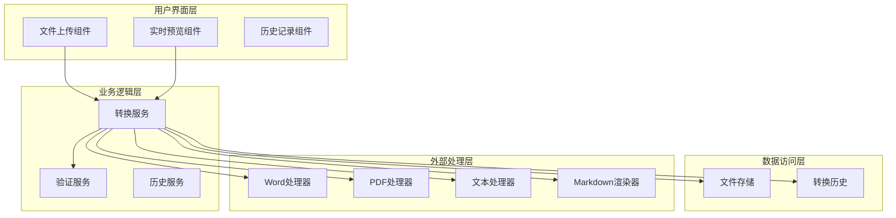
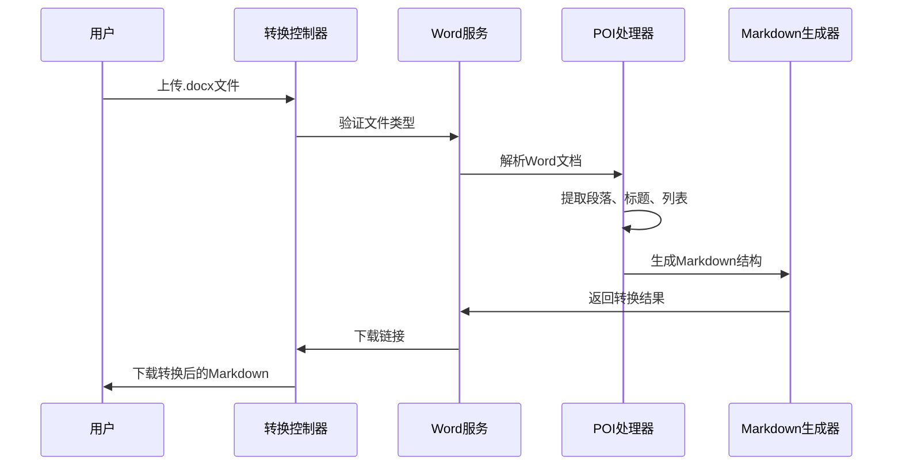
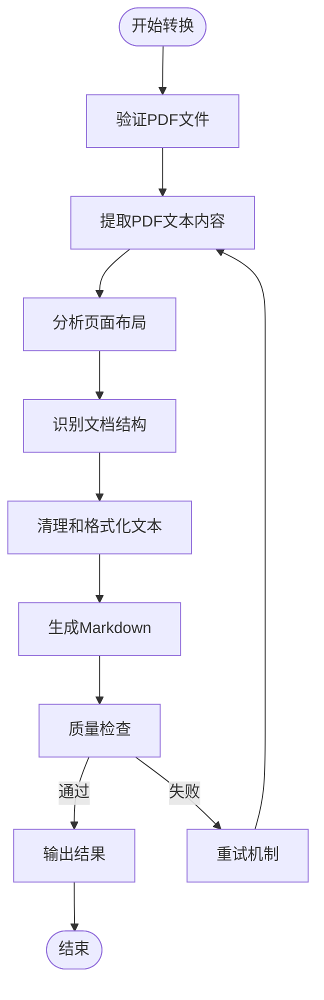
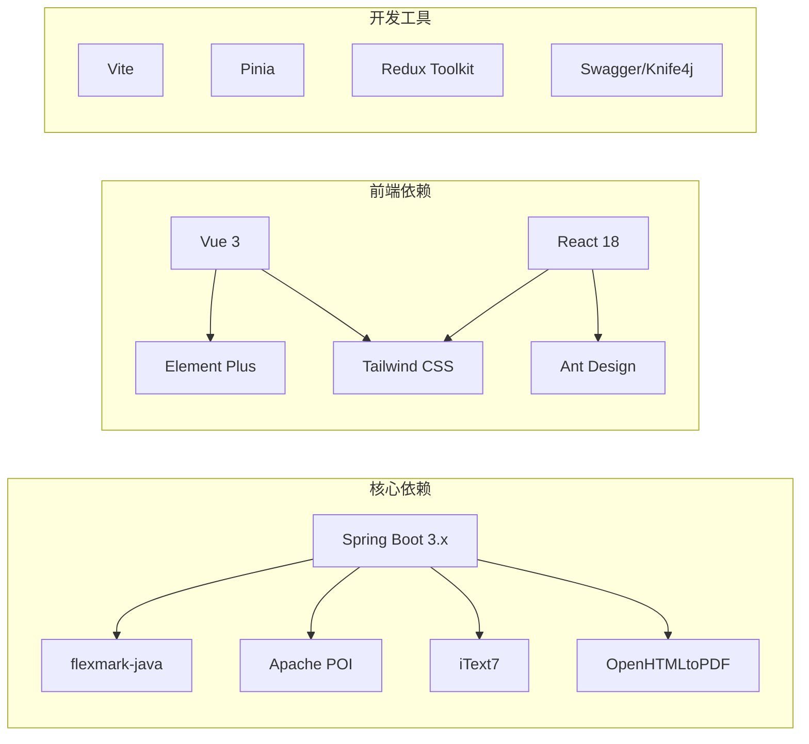

# 核心功能需求

<cite>
**本文引用的文件**
- [多格式文档互转工具 (SmartConvert) 需求文档.md](file://多格式文档互转工具 (SmartConvert) 需求文档.md)
</cite>

## 目录
1. [引言](#引言)
2. [项目结构](#项目结构)
3. [核心组件](#核心组件)
4. [架构概览](#架构概览)
5. [详细组件分析](#详细组件分析)
6. [依赖分析](#依赖分析)
7. [性能考虑](#性能考虑)
8. [故障排除指南](#故障排除指南)
9. [结论](#结论)
10. [附录](#附录)

## 引言
SmartConvert 是一款基于 Web 的文档格式转换工具，支持 Word、PDF、Text 与 Markdown 之间的双向互转。该项目旨在为开发者、撰稿人和学生提供一个极简、高效且视觉精美的文档处理平台。项目采用现代化技术栈，包括 Vue 3/React 前端框架、Spring Boot 后端处理引擎，以及多种专业的文档处理库。

## 项目结构
根据需求文档，项目采用前后端分离的架构设计：

**图表来源**
- [多格式文档互转工具 (SmartConvert) 需求文档.md: 23-63](file://多格式文档互转工具 (SmartConvert) 需求文档.md#L23-L63)

**章节来源**
- [多格式文档互转工具 (SmartConvert) 需求文档.md: 1-63](file://多格式文档互转工具 (SmartConvert) 需求文档.md#L1-L63)

## 核心组件
项目的核心组件围绕三大转换模块构建：

### Word 文档转换模块
- **输入格式**: .docx 文件
- **输出格式**: Markdown 文档
- **核心功能**: 保留标题、列表、表格和加粗等基本样式
- **技术实现**: 基于 Apache POI 库进行文档解析

### PDF 文档转换模块
- **输入格式**: .pdf 文件
- **输出格式**: Markdown 文档
- **核心功能**: 提取文本内容，尽量保持层级结构
- **技术实现**: 基于 iText7 或 OpenHTMLtoPDF 进行内容提取

### Text 文本转换模块
- **输入格式**: .txt 纯文本文件
- **输出格式**: Markdown 文档
- **核心功能**: 纯文本与 Markdown 格式的封装与去格式化

**章节来源**
- [多格式文档互转工具 (SmartConvert) 需求文档.md: 67-79](file://多格式文档互转工具 (SmartConvert) 需求文档.md#L67-L79)

## 架构概览
系统采用分层架构设计，确保各组件间的松耦合和高内聚：

**图表来源**
- [多格式文档互转工具 (SmartConvert) 需求文档.md: 93-101](file://多格式文档互转工具 (SmartConvert) 需求文档.md#L93-L101)

**章节来源**
- [多格式文档互转工具 (SmartConvert) 需求文档.md: 93-101](file://多格式文档互转工具 (SmartConvert) 需求文档.md#L93-L101)

## 详细组件分析

### Word 转换模块 (DOCX → Markdown)
该模块负责处理 Microsoft Word 文档到 Markdown 的转换，重点关注格式保持和结构完整性。

#### 输入输出规范
- **输入**: .docx 格式文档
- **输出**: 结构化的 Markdown 文档
- **格式保留**: 标题层级、列表结构、表格、加粗、斜体等基本样式

#### 处理流程

**图表来源**
- [多格式文档互转工具 (SmartConvert) 需求文档.md: 145-161](file://多格式文档互转工具 (SmartConvert) 需求文档.md#L145-L161)

#### 特殊处理逻辑
- **标题层级映射**: 将 Word 标题样式映射到相应的 Markdown 标题级别
- **列表处理**: 区分有序和无序列表，保持嵌套结构
- **表格转换**: 将表格转换为 Markdown 表格格式
- **样式保留**: 保持基本文本格式（加粗、斜体、删除线）

**章节来源**
- [多格式文档互转工具 (SmartConvert) 需求文档.md: 71](file://多格式文档互转工具 (SmartConvert) 需求文档.md#L71)

### PDF 转换模块 (PDF → Markdown)
该模块专注于 PDF 文档到 Markdown 的转换，主要关注文本内容提取和结构保持。

#### 输入输出规范
- **输入**: .pdf 格式文档
- **输出**: Markdown 文档
- **核心特性**: 提取文本内容，尽量保持文档层级结构

#### 处理流程

**图表来源**
- [多格式文档互转工具 (SmartConvert) 需求文档.md: 73-77](file://多格式文档互转工具 (SmartConvert) 需求文档.md#L73-L77)

#### 特殊处理逻辑
- **复杂布局处理**: 注意复杂页面布局可能存在的结构偏差
- **文本提取优化**: 使用 iText7 或 OpenHTMLtoPDF 进行精确的文本提取
- **结构识别**: 自动识别标题、段落、列表等文档元素
- **编码处理**: 正确处理各种字符编码和语言支持

**章节来源**
- [多格式文档互转工具 (SmartConvert) 需求文档.md: 73-77](file://多格式文档互转工具 (SmartConvert) 需求文档.md#L73-L77)

### Text 转换模块 (TXT → Markdown)
该模块处理纯文本到 Markdown 的转换，提供简单的格式封装功能。

#### 输入输出规范
- **输入**: .txt 纯文本文件
- **输出**: Markdown 文档
- **处理方式**: 将纯文本内容封装为 Markdown 格式

#### 质量保证措施
- **格式封装**: 自动添加适当的 Markdown 格式标记
- **内容清理**: 移除不必要的空白字符和特殊字符
- **编码兼容**: 支持多种文本编码格式
- **大小写处理**: 保持原文本的大小写和格式

**章节来源**
- [多格式文档互转工具 (SmartConvert) 需求文档.md: 79](file://多格式文档互转工具 (SmartConvert) 需求文档.md#L79)

## 依赖分析
项目采用模块化的依赖管理策略，确保各组件的专业性和稳定性。

**图表来源**
- [多格式文档互转工具 (SmartConvert) 需求文档.md: 43-51](file://多格式文档互转工具 (SmartConvert) 需求文档.md#L43-L51)

**章节来源**
- [多格式文档互转工具 (SmartConvert) 需求文档.md: 43-51](file://多格式文档互转工具 (SmartConvert) 需求文档.md#L43-L51)

## 性能考虑
项目对性能有明确的要求和优化策略：

### 性能基准
- **处理速度**: 单个 10MB 以内文档转换时间应在 3 秒内完成
- **并发处理**: 支持多文件批量处理和并发转换
- **内存管理**: 优化大文件处理的内存使用

### 优化策略
- **异步处理**: 采用异步转换机制避免阻塞
- **缓存机制**: 对常用转换结果进行缓存
- **流式处理**: 大文件采用流式处理减少内存占用
- **压缩优化**: 转换后的文件进行适当的压缩

**章节来源**
- [多格式文档互转工具 (SmartConvert) 需求文档.md: 167](file://多格式文档互转工具 (SmartConvert) 需求文档.md#L167)

## 故障排除指南
针对不同类型的转换问题提供相应的解决方案：

### 常见问题及解决方法

#### Word 转换问题
- **格式丢失**: 检查文档中的复杂格式是否被正确识别
- **图片处理**: Word 中的图片可能无法直接转换为 Markdown
- **表格格式**: 复杂表格可能需要手动调整

#### PDF 转换问题
- **文字识别错误**: OCR 处理可能产生识别错误
- **布局偏差**: 复杂布局可能导致结构识别不准确
- **字体编码**: 特殊字体可能导致显示问题

#### Text 转换问题
- **编码问题**: 不同编码格式的文本可能需要重新编码
- **格式不一致**: 纯文本缺乏格式信息，需要人工调整

### 错误处理机制
- **异常捕获**: 所有转换过程都有完善的异常处理
- **回滚机制**: 转换失败时自动回滚到原始状态
- **日志记录**: 详细的转换日志便于问题诊断
- **重试机制**: 关键步骤具备自动重试能力

**章节来源**
- [多格式文档互转工具 (SmartConvert) 需求文档.md: 169-173](file://多格式文档互转工具 (SmartConvert) 需求文档.md#L169-L173)

## 结论
SmartConvert 项目通过精心设计的架构和专业的技术选型，为用户提供了一个功能强大、性能优异的文档转换平台。三大核心转换模块各有特色，既保持了各自的专长，又通过统一的接口实现了无缝集成。

项目的关键优势包括：
- **高保真度转换**: 通过专业库确保转换质量
- **现代化用户体验**: 响应式界面和流畅的交互体验
- **高性能处理**: 优化的算法和架构确保快速响应
- **安全可靠**: 完善的安全机制和错误处理

## 附录

### API 接口规范
- **POST /api/convert**: 核心转换接口，支持文件上传和格式转换
- **GET /api/history**: 获取转换历史记录
- **GET /api/health**: 系统健康检查接口

### 支持的文件格式
- **输入格式**: .docx, .pdf, .txt
- **输出格式**: .md (Markdown)
- **扩展支持**: 可根据需求扩展更多格式支持

### 部署要求
- **容器化**: 支持 Docker 和 Docker Compose 部署
- **服务器**: Nginx 用于前端静态资源路由
- **数据库**: 可选的数据库用于存储转换历史

**章节来源**
- [多格式文档互转工具 (SmartConvert) 需求文档.md: 95-99](file://多格式文档互转工具 (SmartConvert) 需求文档.md#L95-L99)