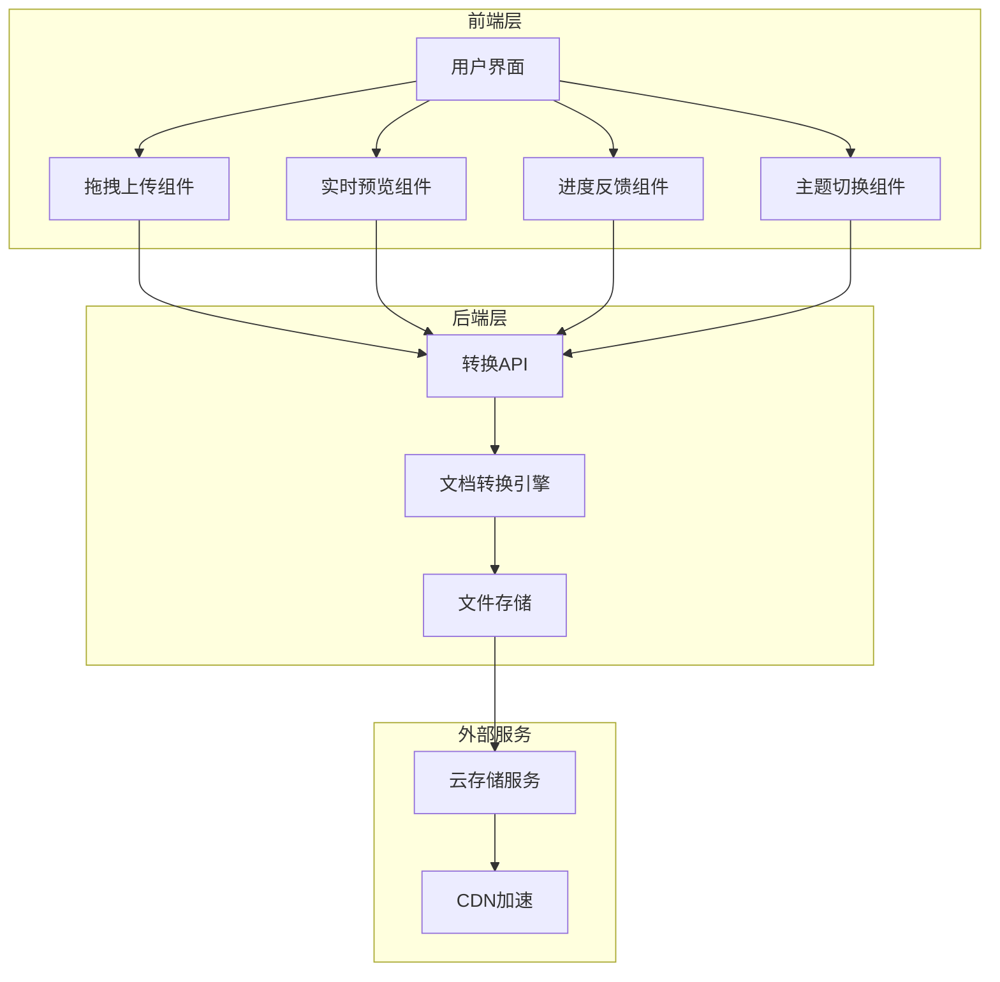
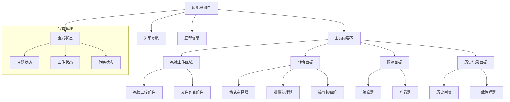
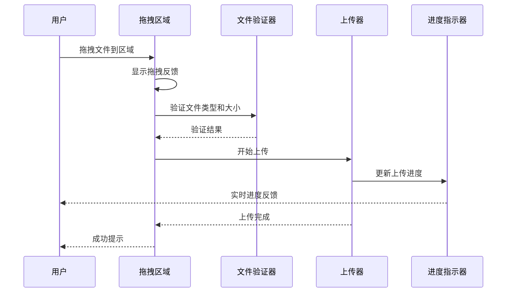
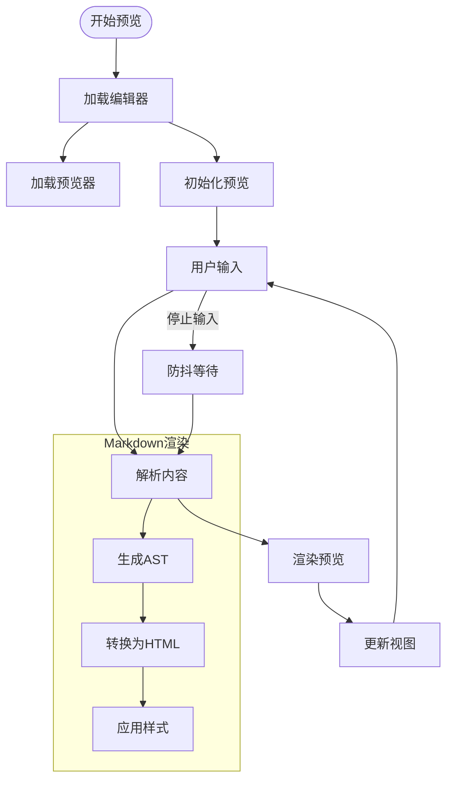
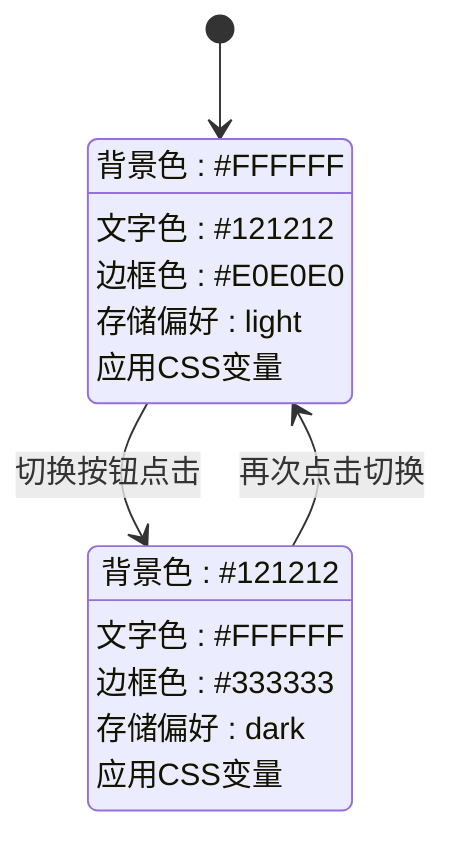
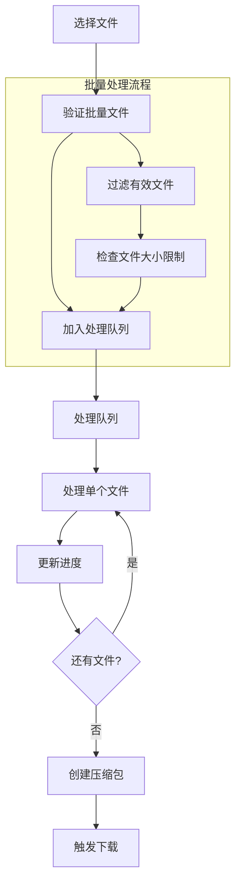
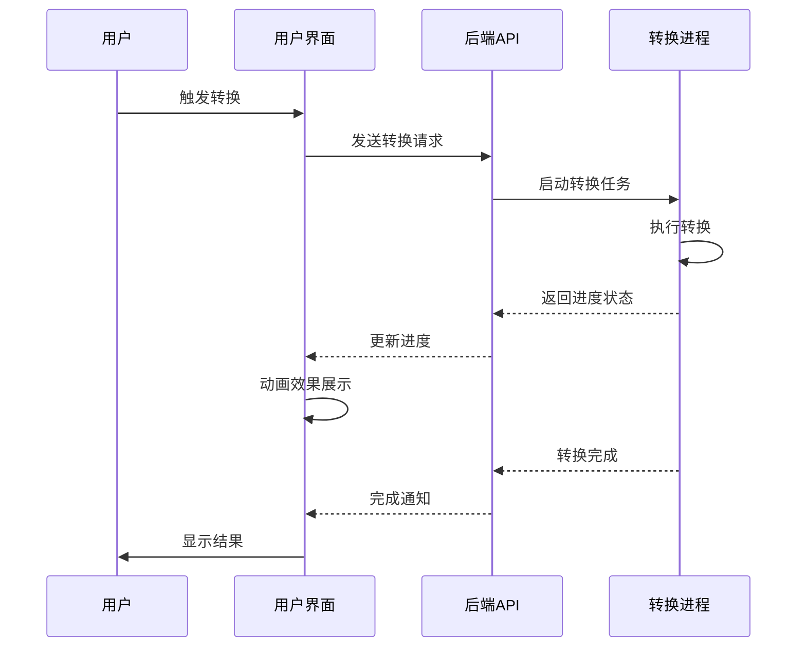
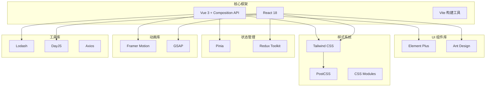

# 用户界面设计

<cite>
**本文档引用的文件**
- [多格式文档互转工具 (SmartConvert) 需求文档.md](file://多格式文档互转工具 (SmartConvert) 需求文档.md)
</cite>

## 目录
1. [引言](#引言)
2. [项目结构](#项目结构)
3. [核心组件](#核心组件)
4. [架构总览](#架构总览)
5. [详细组件分析](#详细组件分析)
6. [依赖关系分析](#依赖关系分析)
7. [性能考虑](#性能考虑)
8. [故障排除指南](#故障排除指南)
9. [结论](#结论)
10. [附录](#附录)

## 引言
SmartConvert 是一款基于 Web 的文档格式转换工具，支持 Word、PDF、Text 与 Markdown 之间的双向互转。本项目旨在为开发者、撰稿人和学生提供一个极简、高效且视觉精美的文档处理平台。本文档专注于用户界面设计，涵盖设计原则、配色方案、布局风格、交互体验以及视觉一致性保障措施。

## 项目结构
SmartConvert 采用前后端分离的架构设计，前端负责用户交互和数据展示，后端提供文档转换服务。

**图表来源**
- [多格式文档互转工具 (SmartConvert) 需求文档.md: 23-63](file://多格式文档互转工具 (SmartConvert) 需求文档.md#L23-L63)

**章节来源**
- [多格式文档互转工具 (SmartConvert) 需求文档.md: 23-63](file://多格式文档互转工具 (SmartConvert) 需求文档.md#L23-L63)

## 核心组件
基于需求文档，SmartConvert 的用户界面由以下核心组件构成：

### 设计原则
- **极简主义**: 采用极简白/石墨黑配色方案，减少视觉干扰
- **一致性**: 统一的交互模式和视觉语言
- **可用性**: 直观的操作流程和清晰的反馈机制
- **响应性**: 适配各种设备和屏幕尺寸

### 配色方案
系统采用双主色调设计：
- **主色调**: 极简白 (#FFFFFF) 和石墨黑 (#121212)
- **点缀色**: Indigo (600) 或 Emerald (500)，用于重要交互元素
- **辅助色**: 浅灰 (#F5F5F5) 和深灰 (#2A2A2A)，用于背景和边框

### 布局风格
- **卡片式布局**: 转换工具箱采用悬浮卡片感
- **backdrop-blur 毛玻璃效果**: 增强层次感和现代感
- **网格系统**: 基于 Tailwind CSS 的响应式网格
- **留白设计**: 合理的间距和留白，提升可读性

**章节来源**
- [多格式文档互转工具 (SmartConvert) 需求文档.md: 103-111](file://多格式文档互转工具 (SmartConvert) 需求文档.md#L103-L111)

## 架构总览
SmartConvert 的 UI 架构采用组件化设计，确保高度的模块化和可维护性。

**图表来源**
- [多格式文档互转工具 (SmartConvert) 需求文档.md: 81-92](file://多格式文档互转工具 (SmartConvert) 需求文档.md#L81-L92)

## 详细组件分析

### 拖拽上传组件
拖拽上传是 SmartConvert 的核心交互入口，设计灵感来源于 Vercel 和 Apple 的优秀实践。

**图表来源**
- [多格式文档互转工具 (SmartConvert) 需求文档.md: 85](file://多格式文档互转工具 (SmartConvert) 需求文档.md#L85)

#### 设计特点
- **视觉反馈**: 拖拽时的高亮效果和图标变化
- **文件验证**: 自动识别支持的文件格式
- **批量支持**: 同时处理多个文件
- **错误处理**: 清晰的错误提示和解决方案

### 实时预览组件
实时预览功能提供左右分屏的编辑和预览体验，提升用户的创作效率。

**图表来源**
- [多格式文档互转工具 (SmartConvert) 需求文档.md: 87](file://多格式文档互转工具 (SmartConvert) 需求文档.md#L87)

#### 技术实现要点
- **双向同步**: 编辑器和预览器的实时同步
- **性能优化**: 防抖机制避免频繁重渲染
- **语法高亮**: 支持代码块的语法高亮显示
- **滚动同步**: 编辑器和预览器的滚动位置同步

### 主题切换组件
深色模式支持提供舒适的视觉体验，适应不同的使用环境。

**图表来源**
- [多格式文档互转工具 (SmartConvert) 需求文档.md: 83](file://多格式文档互转工具 (SmartConvert) 需求文档.md#L83)

#### 实现策略
- **CSS 变量**: 使用 CSS 变量实现主题切换
- **持久化存储**: 将用户偏好保存在 localStorage
- **系统检测**: 自动检测系统的深色模式偏好
- **平滑过渡**: 使用 CSS 过渡动画实现无缝切换

### 批量处理组件
批量处理功能允许用户同时处理多个文件，提高工作效率。

**图表来源**
- [多格式文档互转工具 (SmartConvert) 需求文档.md: 91](file://多格式文档互转工具 (SmartConvert) 需求文档.md#L91)

#### 功能特性
- **并发控制**: 限制同时处理的文件数量
- **进度聚合**: 显示整体处理进度
- **错误隔离**: 单个文件失败不影响其他文件
- **批量下载**: 自动打包并提供下载链接

### 进度反馈组件
带动效的转换进度条提供清晰的状态反馈，增强用户体验。

**图表来源**
- [多格式文档互转工具 (SmartConvert) 需求文档.md: 89](file://多格式文档互转工具 (SmartConvert) 需求文档.md#L89)

#### 交互设计
- **实时更新**: 进度条的连续动画效果
- **状态指示**: 不同阶段的视觉标识
- **剩余时间**: 估算的完成时间
- **取消操作**: 允许用户中断长时间任务

**章节来源**
- [多格式文档互转工具 (SmartConvert) 需求文档.md: 81-111](file://多格式文档互转工具 (SmartConvert) 需求文档.md#L81-L111)

## 依赖关系分析
SmartConvert 的 UI 层依赖于多种技术和库，形成完整的前端生态系统。

**图表来源**
- [多格式文档互转工具 (SmartConvert) 需求文档.md: 25-37](file://多格式文档互转工具 (SmartConvert) 需求文档.md#L25-L37)

**章节来源**
- [多格式文档互转工具 (SmartConvert) 需求文档.md: 25-37](file://多格式文档互转工具 (SmartConvert) 需求文档.md#L25-L37)

## 性能考虑
为了确保优秀的用户体验，SmartConvert 在 UI 性能方面采取了多项优化措施：

### 渲染性能优化
- **虚拟滚动**: 大文件列表的虚拟化渲染
- **懒加载**: 图片和组件的按需加载
- **防抖节流**: 输入事件的合理节流处理
- **内存管理**: 及时释放不再使用的资源

### 网络性能优化
- **CDN 加速**: 静态资源的 CDN 分发
- **缓存策略**: 智能的缓存和失效机制
- **压缩传输**: Gzip/Brotli 压缩
- **连接复用**: HTTP/2 多路复用

### 交互性能优化
- **Web Workers**: 大计算任务的异步处理
- **增量更新**: 局部状态更新而非整页刷新
- **骨架屏**: 加载时的占位符显示
- **预加载**: 关键资源的提前加载

## 故障排除指南
针对常见的 UI 问题提供解决方案：

### 主题切换问题
**症状**: 深色模式切换不生效
**解决方案**: 
- 检查 CSS 变量的正确应用
- 验证 localStorage 的存储状态
- 确认媒体查询的优先级设置

### 拖拽上传问题
**症状**: 文件无法拖拽或上传失败
**解决方案**:
- 检查浏览器的拖拽 API 支持
- 验证文件大小和格式限制
- 确认网络连接和 CORS 配置

### 实时预览问题
**症状**: 预览内容不同步或渲染异常
**解决方案**:
- 检查防抖机制的配置
- 验证 Markdown 解析器的版本
- 确认 CSS 样式的正确加载

### 批量处理问题
**症状**: 批量文件处理失败或进度异常
**解决方案**:
- 检查并发数量的限制设置
- 验证单个文件的处理逻辑
- 确认压缩包创建的权限

**章节来源**
- [多格式文档互转工具 (SmartConvert) 需求文档.md: 165-176](file://多格式文档互转工具 (SmartConvert) 需求文档.md#L165-L176)

## 结论
SmartConvert 的用户界面设计体现了现代 Web 应用的最佳实践，通过极简的设计语言、丰富的交互体验和完善的性能优化，为用户提供了卓越的文档转换体验。设计原则、配色方案、布局风格和交互体验的有机结合，确保了应用在视觉美感和功能性方面的平衡。

未来的发展方向包括进一步优化移动端体验、增强无障碍访问能力，以及探索更多创新的交互模式，持续提升用户满意度和使用效率。

## 附录

### 设计规范对照表
| 设计元素 | 规范值 | 用途 |
|---------|--------|------|
| 主色调 | 白色 (#FFFFFF) | 页面背景 |
| 主色调 | 石墨黑 (#121212) | 文字和边框 |
| 点缀色 | Indigo (600) | 重要按钮和链接 |
| 点缀色 | Emerald (500) | 成功状态和图标 |
| 字体大小 | 16px | 正文标准 |
| 行高 | 1.6 | 文本可读性 |
| 圆角半径 | 8px | 通用组件圆角 |
| 阴影 | 0 2px 8px rgba(0,0,0,0.1) | 卡片阴影 |

### 响应式断点
- **移动设备**: < 768px
- **平板设备**: 768px - 1024px  
- **桌面设备**: > 1024px

### 最佳实践清单
- 始终提供清晰的视觉反馈
- 保持一致的交互模式
- 优化首屏加载速度
- 确保键盘可访问性
- 测试多浏览器兼容性
- 考虑网络条件差异