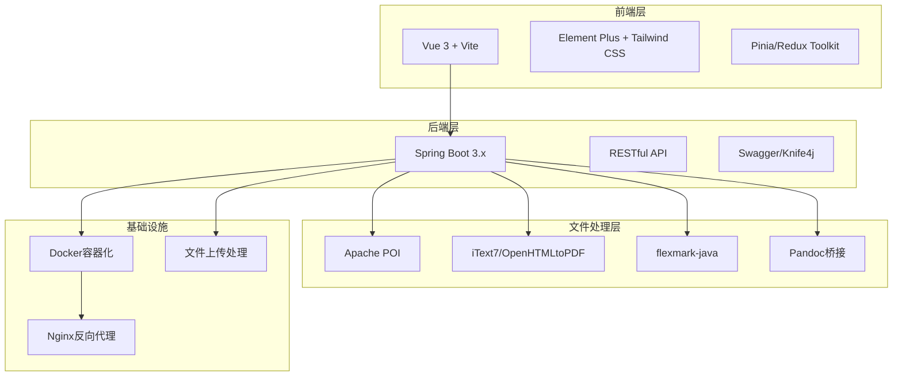
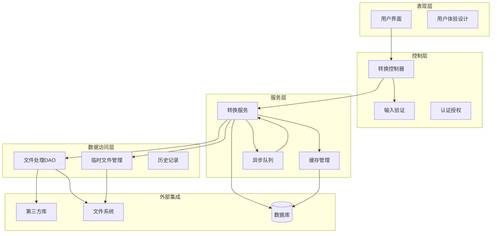
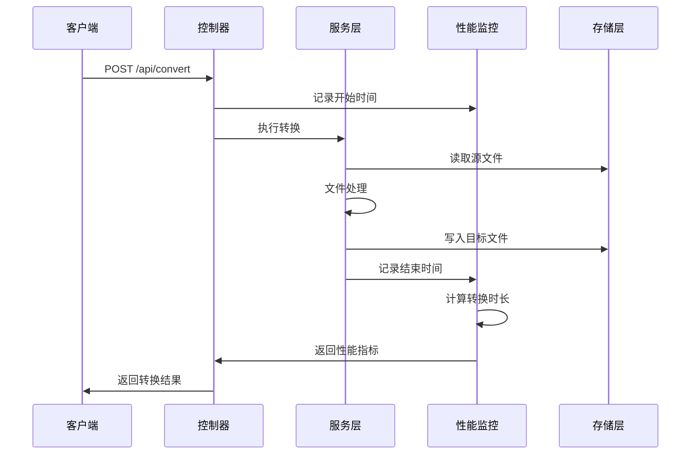
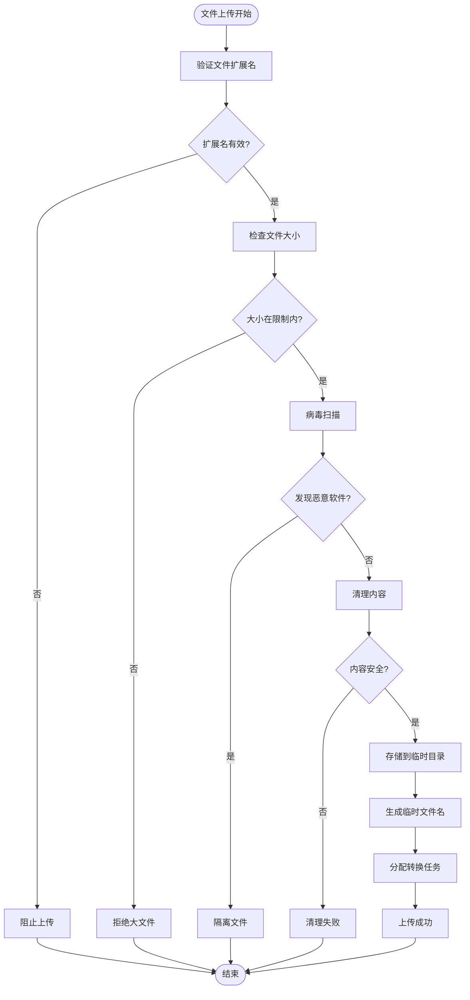
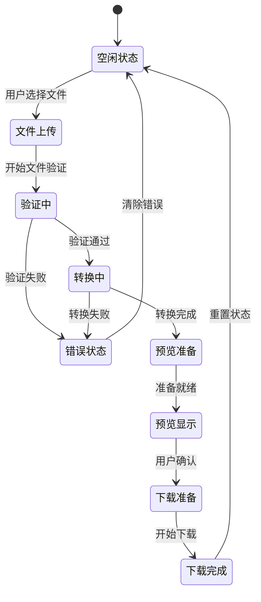
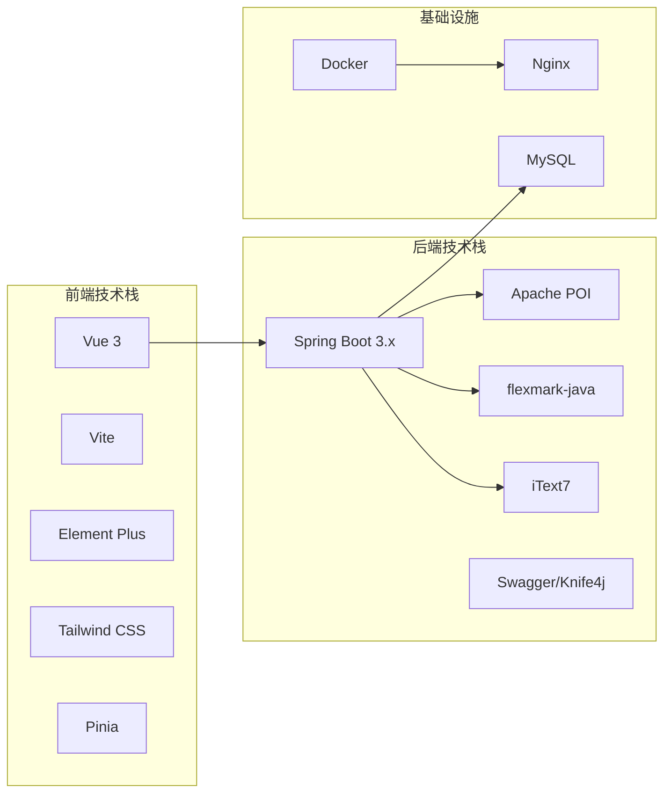
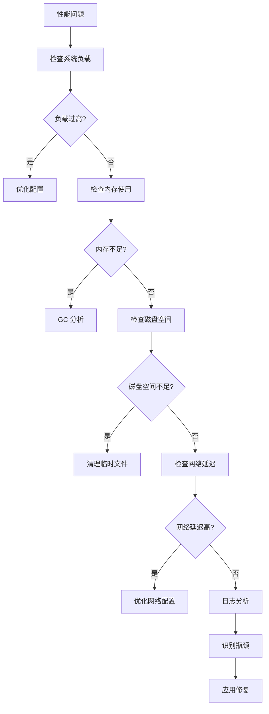

# 非功能性需求

<cite>
**本文档引用的文件**
- [多格式文档互转工具 (SmartConvert) 需求文档.md](file://多格式文档互转工具 (SmartConvert) 需求文档.md)
</cite>

## 目录
1. [引言](#引言)
2. [项目结构](#项目结构)
3. [核心组件](#核心组件)
4. [架构概览](#架构概览)
5. [详细组件分析](#详细组件分析)
6. [依赖关系分析](#依赖关系分析)
7. [性能考虑](#性能考虑)
8. [故障排除指南](#故障排除指南)
9. [结论](#结论)

## 引言

SmartConvert 是一款基于 Web 的文档格式转换工具，支持 Word、PDF、Text 与 Markdown 之间的双向互转。本文档专注于项目的非功能性需求，涵盖性能要求、安全性措施、易用性设计以及系统可靠性、可扩展性、可维护性的设计考虑。

## 项目结构

SmartConvert 采用前后端分离的架构设计，结合现代化的技术栈：

**图表来源**
- [多格式文档互转工具 (SmartConvert) 需求文档.md: 23-63](file://多格式文档互转工具 (SmartConvert) 需求文档.md#L23-L63)

**章节来源**
- [多格式文档互转工具 (SmartConvert) 需求文档.md: 23-63](file://多格式文档互转工具 (SmartConvert) 需求文档.md#L23-L63)

## 核心组件

### 性能要求

项目对性能有明确的量化指标：
- **单文件转换时间**: ≤ 3 秒
- **文件大小限制**: 10MB 以内文档
- **响应式界面**: 实时预览和进度反馈

### 安全性措施

系统实施多层次的安全防护机制：
- **文件后缀严格校验**: 防止恶意脚本注入
- **临时文件定期清理**: 使用 @Scheduled 定时任务
- **无状态认证**: 无需注册即可使用基础功能

### 易用性设计

用户友好的交互体验：
- **零门槛使用**: 无需注册即可转换文档
- **拖拽上传**: 仿制 Vercel 或 Apple 风格
- **实时预览**: 左编辑右预览布局
- **进度反馈**: Processing... 动效提示

**章节来源**
- [多格式文档互转工具 (SmartConvert) 需求文档.md: 165-176](file://多格式文档互转工具 (SmartConvert) 需求文档.md#L165-L176)

## 架构概览

SmartConvert 采用分层架构设计，确保各层职责清晰、耦合度低：

**图表来源**
- [多格式文档互转工具 (SmartConvert) 需求文档.md: 93-100](file://多格式文档互转工具 (SmartConvert) 需求文档.md#L93-L100)

## 详细组件分析

### 性能监控组件

#### 转换时间监控

**图表来源**
- [多格式文档互转工具 (SmartConvert) 需求文档.md: 167](file://多格式文档互转工具 (SmartConvert) 需求文档.md#L167)

#### 性能基准测试

系统应实现以下性能监控指标：
- **响应时间**: 接口请求到响应的总时间
- **吞吐量**: 每秒处理的请求数
- **并发处理**: 同时处理的用户数量
- **内存使用**: JVM 堆内存和非堆内存使用情况
- **CPU 利用率**: 处理转换任务的 CPU 占用

### 安全审计组件

#### 文件上传安全流程

**图表来源**
- [多格式文档互转工具 (SmartConvert) 需求文档.md: 169-173](file://多格式文档互转工具 (SmartConvert) 需求文档.md#L169-L173)

#### 安全审计日志

系统应记录以下安全事件：
- **登录尝试**: 成功/失败的认证尝试
- **文件操作**: 上传、删除、访问记录
- **异常行为**: 超时、重试过多、异常请求
- **权限变更**: 用户角色、访问权限变化
- **系统事件**: 服务启动、停止、错误

### 用户体验评估组件

#### 实时反馈机制

**图表来源**
- [多格式文档互转工具 (SmartConvert) 需求文档.md: 81-92](file://多格式文档互转工具 (SmartConvert) 需求文档.md#L81-L92)

#### 用户满意度指标

用户体验评估应包含：
- **任务完成率**: 成功转换的比例
- **平均等待时间**: 从上传到完成的平均时长
- **错误率**: 转换失败的频率
- **重试率**: 用户重新尝试的次数
- **用户留存**: 重复使用的用户比例

**章节来源**
- [多格式文档互转工具 (SmartConvert) 需求文档.md: 165-176](file://多格式文档互转工具 (SmartConvert) 需求文档.md#L165-L176)

## 依赖关系分析

### 技术栈依赖

**图表来源**
- [多格式文档互转工具 (SmartConvert) 需求文档.md: 23-56](file://多格式文档互转工具 (SmartConvert) 需求文档.md#L23-L56)

### 第三方库依赖

系统依赖的关键第三方库：
- **Apache POI**: Word 文档处理
- **flexmark-java**: Markdown 解析
- **iText7**: PDF 处理
- **Vite**: 前端构建工具
- **Element Plus**: UI 组件库

**章节来源**
- [多格式文档互转工具 (SmartConvert) 需求文档.md: 43-51](file://多格式文档互转工具 (SmartConvert) 需求文档.md#L43-L51)

## 性能考虑

### 性能优化策略

#### 前端性能优化

1. **懒加载**: 按需加载组件和资源
2. **代码分割**: 将大文件拆分为小块
3. **缓存策略**: 利用浏览器缓存和 CDN
4. **压缩优化**: Gzip 压缩和图片优化

#### 后端性能优化

1. **连接池管理**: 数据库连接池和线程池
2. **异步处理**: 使用消息队列处理耗时任务
3. **缓存机制**: Redis 缓存常用数据
4. **资源复用**: 对象池和资源复用

### 性能监控标准

#### 关键性能指标(KPI)

| 指标类型 | 目标值 | 监控方法 |
|---------|--------|----------|
| 页面加载时间 | ≤ 3秒 | Navigation Timing API |
| 转换响应时间 | ≤ 3秒 | 自定义计时器 |
| 并发用户数 | ≥ 100 | JMeter 压力测试 |
| 内存使用率 | ≤ 80% | JVM 监控 |
| CPU 利用率 | ≤ 70% | 系统监控 |

### 性能测试方法

1. **负载测试**: 模拟多用户同时使用
2. **压力测试**: 超过正常负载的测试
3. **稳定性测试**: 长时间运行测试
4. **容量测试**: 测试系统最大承载能力

## 故障排除指南

### 常见问题诊断

#### 性能问题排查

#### 安全问题排查

1. **文件上传失败**: 检查文件类型和大小限制
2. **转换错误**: 验证源文件格式和内容完整性
3. **权限问题**: 检查文件系统权限设置
4. **内存泄漏**: 监控 JVM 内存使用情况

### 临时文件管理

系统应实现自动清理机制：
- **定时清理**: 使用 @Scheduled 注释的任务
- **大小限制**: 临时文件夹大小上限
- **时间限制**: 超过时限的文件自动删除
- **异常处理**: 清理过程中的错误处理

**章节来源**
- [多格式文档互转工具 (SmartConvert) 需求文档.md: 173](file://多格式文档互转工具 (SmartConvert) 需求文档.md#L173)

## 结论

SmartConvert 项目在非功能性需求方面制定了明确的目标和实现策略。通过合理的架构设计、严格的性能监控、完善的安全防护和优秀的用户体验设计，项目能够为用户提供稳定可靠的文档转换服务。

关键成功因素包括：
- **性能优先**: 确保转换速度满足用户期望
- **安全第一**: 多层次的安全防护机制
- **用户体验**: 简洁直观的操作界面
- **可扩展性**: 模块化的架构设计
- **可维护性**: 清晰的代码结构和文档

通过持续的监控、测试和优化，SmartConvert 将能够满足现代 Web 应用对性能、安全和可用性的高标准要求。